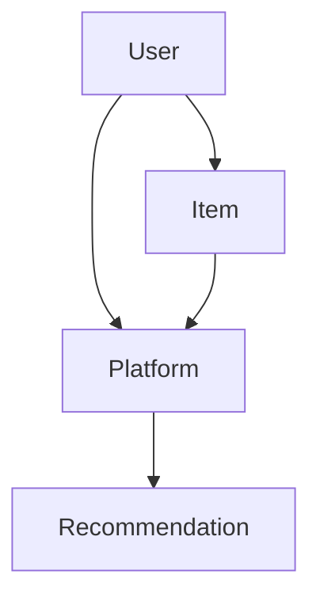
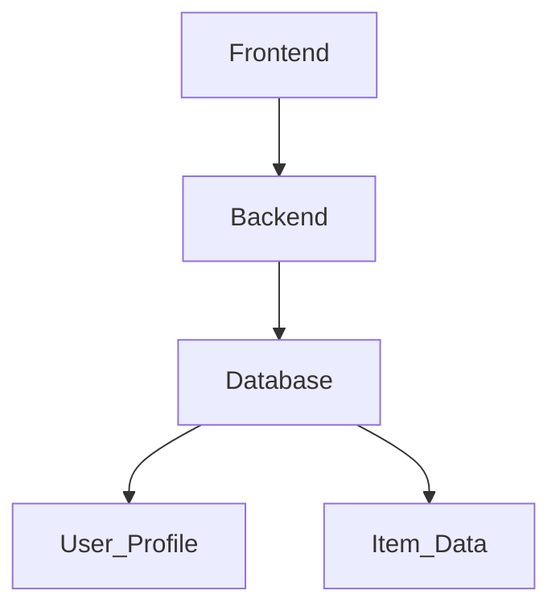

                 


# 构建企业级推荐引擎：跨平台个性化用户体验

---

## 关键词  
推荐引擎，个性化推荐，企业级应用，跨平台，用户体验，机器学习，深度学习  

---

## 摘要  
推荐引擎是现代企业级系统中实现个性化用户体验的核心技术之一。随着跨平台应用的普及，如何在不同平台间统一推荐策略并提供个性化的用户体验成为技术挑战。本文将从推荐引擎的背景、核心算法、系统架构到实战案例，全面解析企业级推荐引擎的构建过程，帮助读者掌握跨平台推荐的核心技术与实践方法。

---

## 第一部分: 背景与核心概念

---

### 第1章: 推荐引擎概述  

#### 1.1 问题背景与需求分析  
推荐引擎的目标是通过分析用户行为和偏好，向用户推荐相关的内容或产品，从而提升用户体验和业务转化率。在企业级应用中，推荐引擎需要支持跨平台的统一推荐策略，以满足不同平台用户的需求差异。  

##### 1.1.1 个性化推荐的核心问题  
个性化推荐的核心问题在于如何从海量数据中提取用户偏好，并生成符合用户需求的推荐结果。这涉及到数据的采集、处理、建模和实时计算等多个环节。  

##### 1.1.2 企业级推荐引擎的挑战  
企业级推荐引擎需要应对以下挑战：  
1. **数据规模**：处理海量用户行为数据和物品数据。  
2. **实时性**：需要在用户请求时实时返回推荐结果。  
3. **跨平台一致性**：在不同平台上保持推荐策略的一致性。  
4. **模型复杂性**：需要结合多种算法（如协同过滤、深度学习）来提升推荐精度。  

##### 1.1.3 跨平台推荐的需求与复杂性  
跨平台推荐需要在不同平台上（如Web、移动端、桌面端）提供一致的推荐体验。不同平台的用户行为差异可能导致推荐策略的调整需求，这增加了推荐引擎的复杂性。  

---

#### 1.2 推荐引擎的核心概念  
推荐引擎的核心概念包括推荐算法、推荐系统架构和推荐策略。  

##### 1.2.1 推荐引擎的定义与分类  
推荐引擎是一种基于用户行为和偏好，利用算法生成推荐结果的系统。根据推荐策略的不同，可以将推荐引擎分为以下几类：  
1. **基于协同过滤的推荐**：通过用户行为相似性进行推荐。  
2. **基于内容的推荐**：通过分析物品属性进行推荐。  
3. **混合推荐模型**：结合协同过滤和内容推荐的双策略。  
4. **深度学习推荐模型**：利用神经网络进行推荐。  

##### 1.2.2 跨平台推荐的特性  
跨平台推荐的特性包括：  
1. **统一用户画像**：在多个平台上保持用户画像的一致性。  
2. **平台适配性**：根据不同平台的特点调整推荐策略。  
3. **实时性与响应速度**：需要在不同平台上实现快速响应。  

##### 1.2.3 个性化推荐的关键要素  
个性化推荐的关键要素包括：  
1. **用户特征**：用户的兴趣、行为、偏好等。  
2. **物品特征**：物品的属性、标签、热度等。  
3. **推荐算法**：协同过滤、矩阵分解、深度学习模型等。  
4. **推荐策略**：基于规则的推荐、基于模型的推荐等。  

---

### 第2章: 推荐引擎的技术背景与演进  

#### 2.1 推荐引擎的历史发展  
推荐引擎的技术经历了从简单到复杂的演变过程。  

##### 2.1.1 基于规则的推荐  
基于规则的推荐是最早的推荐方式，通过预定义的规则（如“购买过商品A的用户也购买商品B”）生成推荐结果。这种方式简单但灵活性较差。  

##### 2.1.2 协同过滤的兴起  
协同过滤是一种基于用户相似性的推荐方法。通过分析用户行为数据，找到与目标用户行为相似的用户，推荐这些用户喜欢的内容。  

##### 2.1.3 基于机器学习的推荐  
基于机器学习的推荐通过训练模型来预测用户的偏好。这种方法能够处理海量数据，并具有较高的推荐精度。  

##### 2.1.4 深度学习在推荐中的应用  
深度学习模型（如神经网络）在推荐中的应用，使得推荐系统能够捕捉更复杂的用户行为模式，进一步提升推荐的准确性。  

#### 2.2 跨平台推荐的演变  
随着移动互联网的发展，跨平台推荐逐渐成为推荐引擎的重要趋势。  

##### 2.2.1 跨平台推荐的定义  
跨平台推荐是指在多个平台上（如Web、移动端、桌面端）为用户提供一致的推荐服务。  

##### 2.2.2 跨平台推荐的技术挑战  
跨平台推荐面临以下技术挑战：  
1. **数据一致性**：不同平台上的用户行为数据可能不一致。  
2. **推荐策略适配**：不同平台上的推荐策略可能需要调整。  
3. **实时性与性能**：跨平台推荐需要在多个平台上实时响应，这对系统的性能提出了更高的要求。  

##### 2.2.3 跨平台推荐的未来趋势  
跨平台推荐的未来趋势包括：  
1. **统一推荐模型**：开发适用于多个平台的统一推荐模型。  
2. **动态适配推荐策略**：根据平台特点动态调整推荐策略。  
3. **多模态推荐**：结合文本、图像等多种数据形式进行推荐。  

---

## 第二部分: 核心概念与联系  

---

### 第3章: 推荐引擎的核心原理  

#### 3.1 推荐算法的分类与对比  
推荐算法可以根据不同的标准进行分类，以下是几种主要的分类方式：  

##### 3.1.1 基于协同过滤的推荐  
协同过滤是一种基于用户行为相似性的推荐方法，分为基于用户的协同过滤和基于物品的协同过滤。  

##### 3.1.2 基于内容的推荐  
基于内容的推荐是通过分析物品的属性（如文本、图像）来生成推荐结果。  

##### 3.1.3 混合推荐模型  
混合推荐模型结合了协同过滤和基于内容的推荐方法，通过融合两种方法的优势来提升推荐精度。  

##### 3.1.4 深度学习推荐模型  
深度学习推荐模型通过神经网络来捕捉用户行为的复杂模式，从而生成推荐结果。  

---

#### 3.2 跨平台推荐的实现原理  
跨平台推荐的实现需要考虑不同平台的特点，以下是其实现原理：  

##### 3.2.1 跨平台数据的统一处理  
跨平台推荐需要将不同平台上的数据进行统一处理，以便生成一致的推荐结果。  

##### 3.2.2 跨平台推荐的特征提取  
跨平台推荐需要提取用户在不同平台上的行为特征，并将其作为推荐模型的输入。  

##### 3.2.3 跨平台推荐的模型融合  
跨平台推荐可以通过融合多个平台的推荐结果，生成最终的推荐列表。  

---

### 第4章: 推荐引擎的核心概念与联系  

#### 4.1 实体关系图  
推荐引擎涉及多个实体，如用户、物品、平台和推荐结果。以下是一个简单的实体关系图：  



#### 4.2 系统架构图  
推荐引擎的系统架构通常包括数据采集、处理、存储和推荐服务四个模块。以下是一个推荐引擎的系统架构图：  

```mermaid
graph TD
    Client --> API Gateway
    API Gateway --> Recommender Engine
    Recommender Engine --> Database
    Database --> User_Profile
    Database --> Item_Data
```

---

## 第三部分: 算法原理  

---

### 第4章: 推荐算法的实现与优化  

#### 4.1 协同过滤算法的实现  
协同过滤算法是基于用户相似性的推荐方法。以下是协同过滤算法的实现步骤：  

##### 4.1.1 数据预处理  
对用户行为数据进行清洗和预处理，提取有效的用户行为特征。  

##### 4.1.2 用户相似性计算  
通过计算用户之间的相似性，选择与目标用户相似的用户群体。  

##### 4.1.3 推荐结果生成  
根据相似用户的偏好，生成推荐结果。  

#### 4.2 矩阵分解算法的实现  
矩阵分解是一种常用的推荐算法，通过对用户-物品矩阵进行分解，生成推荐结果。  

##### 4.2.1 矩阵分解的数学模型  
矩阵分解的数学模型如下：  
$$ X = U \cdot V^T $$  
其中，$X$ 是用户-物品评分矩阵，$U$ 和 $V$ 分别是用户和物品的隐向量矩阵。  

##### 4.2.2 矩阵分解的优化算法  
矩阵分解的优化算法通常使用梯度下降或交替最小二乘法。  

#### 4.3 深度学习推荐模型的实现  
深度学习推荐模型通过神经网络来捕捉用户行为的复杂模式。  

##### 4.3.1 深度学习模型的结构  
深度学习推荐模型的结构通常包括输入层、隐藏层和输出层。  

##### 4.3.2 深度学习模型的训练  
深度学习模型的训练需要使用大量的用户行为数据，通过反向传播算法优化模型参数。  

---

## 第四部分: 系统分析与架构设计  

---

### 第5章: 推荐引擎的系统架构  

#### 5.1 系统功能设计  
推荐引擎的系统功能设计包括数据采集、处理、存储和推荐服务四个模块。  

##### 5.1.1 数据采集  
数据采集模块负责采集用户行为数据和物品数据。  

##### 5.1.2 数据处理  
数据处理模块负责对采集的数据进行清洗和预处理。  

##### 5.1.3 数据存储  
数据存储模块负责存储用户行为数据和物品数据。  

##### 5.1.4 推荐服务  
推荐服务模块负责根据用户请求生成推荐结果。  

#### 5.2 系统架构设计  
推荐引擎的系统架构通常包括前端、后端和数据库三个部分。  

##### 5.2.1 系统架构图  
以下是一个推荐引擎的系统架构图：  



---

## 第五部分: 项目实战  

---

### 第6章: 项目实战  

#### 6.1 环境安装  
推荐引擎的开发需要以下环境：  
1. Python 3.8+  
2. PyTorch 1.9+  
3. Scikit-learn 0.24+  
4. Flask 2.0+  

#### 6.2 核心实现  
以下是基于协同过滤的推荐系统的核心实现代码：  

```python
import numpy as np
from sklearn.metrics.pairwise import cosine_similarity

# 数据预处理
def preprocess(data):
    # 提取用户和物品的特征
    users = data['user_id'].unique()
    items = data['item_id'].unique()
    # 构建用户-物品评分矩阵
    user_item_matrix = np.zeros((len(users), len(items)))
    for idx, row in data.iterrows():
        user_idx = np.where(users == row['user_id'])[0][0]
        item_idx = np.where(items == row['item_id'])[0][0]
        user_item_matrix[user_idx, item_idx] = row['rating']
    return user_item_matrix

# 协同过滤算法实现
def collaborative_filtering(matrix, k=5):
    # 计算余弦相似度
    similarity = cosine_similarity(matrix)
    # 选择相似性最高的k个用户
    top_k_indices = np.argsort(similarity, axis=1)[:, -k:][:, ::-1]
    # 生成推荐结果
   推荐结果 = np.mean(similarity[:, top_k_indices], axis=1)
    return 推荐结果

# 示例数据
data = {
    'user_id': ['u1', 'u1', 'u2', 'u2', 'u3', 'u3'],
    'item_id': ['i1', 'i2', 'i1', 'i3', 'i2', 'i3'],
    'rating': [5, 4, 3, 5, 4, 3]
}

# 数据预处理
matrix = preprocess(data)

# 协同过滤算法实现
recommendations = collaborative_filtering(matrix)

# 输出推荐结果
print(recommendations)
```

#### 6.3 算法优化  
优化协同过滤算法的关键在于选择合适的相似性度量方法和优化计算效率。  

#### 6.4 实际案例分析  
以下是基于协同过滤的电影推荐系统的案例分析：  
假设我们有以下用户行为数据：  

| 用户 | 电影 | 评分 |
|------|------|-----|
| u1  | i1   | 5   |
| u1  | i2   | 4   |
| u2  | i1   | 3   |
| u2  | i3   | 5   |
| u3  | i2   | 4   |
| u3  | i3   | 3   |  

通过协同过滤算法，我们可以为用户u1推荐电影i3，因为u1和u3的相似性较高，而u3对i3的评分较高。  

#### 6.5 项目小结  
通过本项目，我们掌握了协同过滤算法的实现方法，并了解了如何在实际场景中应用推荐算法。  

---

## 第六部分: 最佳实践  

---

### 第7章: 最佳实践  

#### 7.1 数据质量的重要性  
数据质量是推荐引擎的核心，数据的准确性和完整性直接影响推荐结果。  

#### 7.2 模型选择与优化  
在选择推荐算法时，需要根据实际场景和数据特点进行选择，并通过实验验证算法的性能。  

#### 7.3 系统性能优化  
系统性能优化包括数据预处理、算法优化和系统架构优化三个方面。  

#### 7.4 可扩展性设计  
推荐引擎需要具备良好的可扩展性，以应对数据规模和用户数量的增长。  

---

## 结语  

通过本文的分析与实践，我们深入了解了企业级推荐引擎的构建过程，并掌握了跨平台个性化推荐的核心技术。未来，随着技术的发展，推荐引擎将在更多领域发挥重要作用。

---

## 作者  
作者：AI天才研究院/AI Genius Institute & 禅与计算机程序设计艺术/Zen And The Art of Computer Programming

