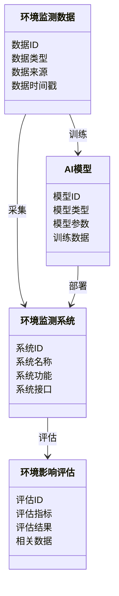
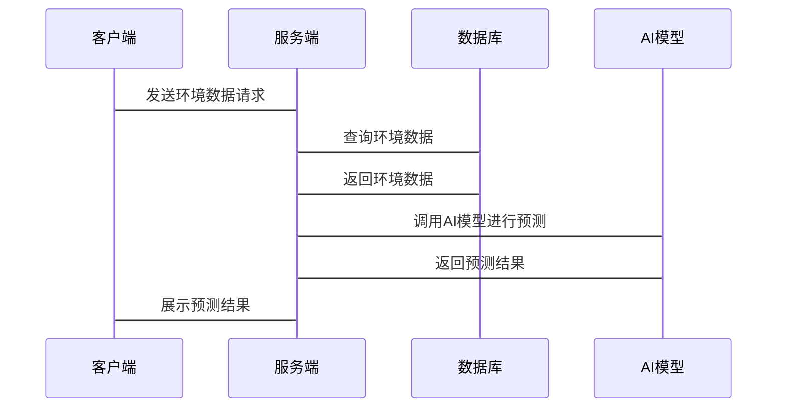

                 


# 《构建企业级环境监测AI：助力合规与可持续发展》

> 关键词：企业级环境监测AI、AI算法、系统架构、合规性、可持续发展

> 摘要：随着全球环境问题的日益严重，企业级环境监测AI系统成为实现环境管理智能化和可持续发展的关键工具。本文从环境监测的核心目标出发，结合AI技术的特点，详细阐述了企业级环境监测AI系统的构建过程，包括数据采集、模型训练、系统架构设计以及实际案例分析。同时，本文探讨了AI技术在环境监测中的应用前景，强调了合规性与可持续发展的重要性，为企业级环境监测AI的未来发展提供了实践指导和理论支持。

---

## 第一部分: 企业级环境监测AI的背景与核心概念

### 第1章: 环境监测与AI的结合背景

#### 1.1 环境监测的重要性与挑战
##### 1.1.1 环境监测的核心目标
环境监测的核心目标是通过科学手段，实时感知和分析环境数据，评估环境质量，预警潜在风险，为环境保护和管理提供决策支持。企业级环境监测需要满足更高的精度和实时性要求，同时需要与企业的生产运营紧密结合。

##### 1.1.2 传统环境监测的局限性
传统环境监测主要依赖人工采样和实验室分析，存在以下问题：
- **效率低下**：人工采样周期长，无法满足实时监测需求。
- **成本高昂**：实验室分析需要大量的人力和物力资源。
- **覆盖范围有限**：传统方法难以实现大范围、全天候的环境监测。

##### 1.1.3 AI技术在环境监测中的潜力
AI技术通过机器学习、深度学习等方法，能够快速处理海量环境数据，发现隐藏的模式和趋势，显著提高环境监测的效率和准确性。AI还可以实现对环境数据的实时分析，帮助企业在生产过程中优化资源利用，减少污染排放。

#### 1.2 企业级环境监测的独特需求
##### 1.2.1 企业级环境监测的定义
企业级环境监测是指在企业内部或其生产区域内，利用先进的技术手段，对企业运营过程中产生的环境数据进行实时监测、分析和预警。其目的是通过数据驱动的方式，优化企业的环保表现，降低环境风险，实现可持续发展目标。

##### 1.2.2 企业级环境监测的关键特征
- **实时性**：环境数据需要实时采集和分析，以便快速响应潜在风险。
- **准确性**：监测数据必须准确可靠，能够为决策提供科学依据。
- **可扩展性**：系统需要支持大规模数据处理和多种环境因子的监测。
- **可解释性**：AI模型的结果需要能够被企业管理和技术人员理解，以确保决策的透明性和合规性。

##### 1.2.3 企业级环境监测的边界与外延
企业级环境监测的边界通常包括企业的生产区域、供应链上下游以及相关环境影响区域。其外延则涵盖环境数据的采集、处理、分析、预警和反馈的全过程。

### 第2章: AI在环境监测中的应用前景

#### 2.1 AI技术的核心优势
##### 2.1.1 数据处理能力
AI技术能够处理海量的环境数据，包括时间序列数据、空间数据和多源异构数据。通过数据融合和特征提取，AI可以发现传统方法难以察觉的环境变化趋势。

##### 2.1.2 自动学习能力
通过机器学习和深度学习算法，AI系统能够自动学习环境数据的特征，优化模型参数，提高监测的准确性和效率。

##### 2.1.3 实时分析能力
AI技术能够实现对环境数据的实时分析，快速识别异常情况，提供实时预警，帮助企业在第一时间采取应对措施。

#### 2.2 企业级环境监测AI的合规要求
##### 2.2.1 数据隐私与合规性
企业级环境监测系统需要处理大量的环境数据，其中可能包含敏感信息。因此，系统必须符合相关法律法规，确保数据的隐私性和安全性。

##### 2.2.2 系统可靠性与稳定性
企业级环境监测系统需要7×24小时不间断运行，确保数据采集和分析的连续性和可靠性。系统的稳定性和容错能力是企业选择AI技术的重要考量因素。

##### 2.2.3 结果可解释性
AI模型的输出结果需要具有可解释性，以便企业管理和技术人员能够理解模型的决策过程，并在必要时进行人工干预。

#### 2.3 可持续发展与企业责任
##### 2.3.1 环境保护的商业价值
通过AI技术优化环境监测，企业可以降低环境治理成本，减少资源浪费，提升企业的社会形象和市场竞争力。

##### 2.3.2 企业社会责任的履行
企业作为社会的重要组成部分，有责任通过技术创新实现可持续发展。AI技术的应用可以帮助企业更好地履行社会责任，减少对环境的负面影响。

##### 2.3.3 可持续发展与AI的结合
AI技术不仅能够帮助企业实现环境监测的智能化，还能够推动企业生产过程的绿色化，实现经济效益与环境效益的双赢。

---

## 第二部分: 企业级环境监测AI的核心概念与联系

### 第3章: 核心概念与原理

#### 3.1 环境监测数据的采集与处理
##### 3.1.1 数据来源与类型
环境监测数据主要来源于传感器、卫星遥感、无人机和其他监测设备。数据类型包括时间序列数据、空间数据、文本数据和图像数据。

##### 3.1.2 数据预处理方法
数据预处理是环境监测AI系统的重要环节，主要包括以下步骤：
- **数据清洗**：去除噪声数据和异常值。
- **数据归一化**：将不同量纲的数据转换为统一的尺度。
- **数据插值**：填补缺失数据点。

##### 3.1.3 数据特征提取
特征提取是通过降维技术（如主成分分析）或模型自动学习特征，提取对环境监测最重要的特征。

#### 3.2 AI模型的构建与训练
##### 3.2.1 模型选择与优化
在AI模型选择中，需要根据具体环境监测任务的特点，选择适合的模型类型。例如，对于分类任务，可以选择随机森林或支持向量机；对于回归任务，可以选择LSTM或时间序列模型。

##### 3.2.2 数据标注与清洗
数据标注是将环境数据与实际环境状态进行对应，例如将水质数据标注为“良好”或“超标”。数据清洗是去除标注错误或不一致的数据。

##### 3.2.3 模型训练与评估
模型训练需要使用训练数据集，并通过交叉验证优化模型参数。模型评估通过准确率、召回率和F1分数等指标进行。

#### 3.3 模型部署与应用
##### 3.3.1 模型的实时推理
通过将AI模型部署到生产环境，实现对环境数据的实时分析和预测。

##### 3.3.2 系统集成与接口设计
系统集成需要与企业的生产系统和其他管理系统进行对接，确保数据的实时传输和结果的及时反馈。

##### 3.3.3 结果可视化与反馈
通过可视化界面展示环境监测结果，并提供反馈机制，优化模型的性能和准确性。

### 第4章: 核心概念的ER实体关系图

```mermaid
er
    entity 环境监测数据 {
        key: 数据ID
        数据类型: 气候数据, 水质数据, 土壤数据
        数据来源: 传感器, 人工采集
        数据时间戳: 时间
    }
    entity AI模型 {
        key: 模型ID
        模型类型: 分类模型, 回归模型
        模型参数: 参数1, 参数2
        训练数据: 环境监测数据
    }
    entity 环境监测系统 {
        key: 系统ID
        系统名称: 系统名称
        系统功能: 数据采集, 数据处理, 模型训练, 实时监测
        系统接口: 数据接口, 模型接口
    }
    entity 环境影响评估 {
        key: 评估ID
        评估指标: 空气质量指数, 水质指数, 土壤健康指数
        评估结果: 合格, 不合格
        相关数据: 环境监测数据
    }
    relation 环境监测数据 -> 环境监测系统: 采集
    relation 环境监测数据 -> AI模型: 训练
    relation AI模型 -> 环境监测系统: 部署
    relation 环境监测系统 -> 环境影响评估: 评估
```

---

## 第三部分: 算法原理与系统架构

### 第4章: 算法原理讲解

#### 4.1 机器学习算法的选择与实现
##### 4.1.1 时间序列预测模型
- **LSTM（长短期记忆网络）**：适用于时间序列数据的预测。
- **ARIMA（自回归积分滑动平均模型）**：适用于平稳时间序列数据的预测。

##### 4.1.2 分类算法
- **随机森林**：适用于多分类任务，具有高准确性和鲁棒性。
- **支持向量机（SVM）**：适用于小样本数据的分类任务。

#### 4.2 深度学习模型的实现
##### 4.2.1 卷积神经网络（CNN）
- **应用场景**：图像数据的特征提取和分类，例如遥感图像分析。

##### 4.2.2 循环神经网络（RNN）
- **应用场景**：时间序列数据的预测和分类。

#### 4.3 算法实现的Python代码示例

##### 示例1：LSTM时间序列预测模型
```python
import numpy as np
from keras.models import Sequential
from keras.layers import LSTM, Dense

# 数据准备
X_train = np.random.random((1000, 24, 1))
y_train = np.random.random((1000, 1))

# 模型构建
model = Sequential()
model.add(LSTM(64, input_shape=(24, 1)))
model.add(Dense(1, activation='sigmoid'))
model.compile(loss='binary_crossentropy', optimizer='adam', metrics=['accuracy'])

# 模型训练
model.fit(X_train, y_train, epochs=10, batch_size=32)
```

##### 示例2：随机森林分类模型
```python
from sklearn.ensemble import RandomForestClassifier

# 数据准备
X_train = np.random.random((1000, 10))
y_train = np.random.randint(2, size=1000)

# 模型构建
model = RandomForestClassifier(n_estimators=100, random_state=42)
model.fit(X_train, y_train)

# 模型预测
X_test = np.random.random((200, 10))
y_pred = model.predict(X_test)
```

#### 4.4 算法的数学模型与公式

##### 4.4.1 LSTM的数学模型
LSTM的细胞状态更新公式如下：
$$
f_t = \sigma(W_f \cdot [h_{t-1}, x_t] + b_f)
$$
$$
i_t = \sigma(W_i \cdot [h_{t-1}, x_t] + b_i)
$$
$$
o_t = \sigma(W_o \cdot [h_{t-1}, x_t] + b_o)
$$
$$
c_t = f_t \cdot c_{t-1} + i_t \cdot tanh(W_c \cdot [h_{t-1}, x_t] + b_c)
$$
$$
h_t = o_t \cdot tanh(c_t)
$$

##### 4.4.2 随机森林的数学模型
随机森林是一种基于树的集成方法，每个树的决策规则如下：
$$
y = \text{sign}(\sum_{j=1}^m \text{weight}_j \cdot f_j(x))
$$
其中，$f_j(x)$是第$j$棵树的预测结果，$\text{weight}_j$是第$j$棵树的权重。

---

## 第四部分: 系统分析与架构设计方案

### 第5章: 系统分析与架构设计

#### 5.1 系统功能设计
##### 5.1.1 领域模型设计


##### 5.1.2 系统架构设计


##### 5.1.3 系统接口设计
- **数据接口**：提供环境数据的采集、存储和查询功能。
- **模型接口**：提供AI模型的训练、部署和调用功能。
- **结果接口**：提供环境监测结果的展示和反馈功能。

##### 5.1.4 系统交互流程


---

## 第五部分: 项目实战与案例分析

### 第6章: 项目实战

#### 6.1 项目介绍
本项目旨在开发一个企业级环境监测AI系统，实现对企业生产区域的环境数据实时监测、分析和预警。系统采用机器学习和深度学习算法，结合企业级系统的架构设计，确保系统的高效性和稳定性。

#### 6.2 环境监测AI系统的安装与配置
##### 6.2.1 环境要求
- **硬件要求**：推荐使用高性能服务器，配备GPU加速卡。
- **软件要求**：安装Python 3.8及以上版本，安装TensorFlow、Keras、Scikit-learn等AI框架。

##### 6.2.2 数据准备
- 数据采集：通过传感器和API接口获取环境数据。
- 数据清洗：去除噪声数据和异常值。
- 数据预处理：将数据归一化并提取特征。

##### 6.2.3 系统安装
- 下载源代码：从GitHub仓库下载环境监测AI系统的源代码。
- 安装依赖库：使用pip安装所需的第三方库。
- 配置环境变量：设置数据库连接信息和API接口参数。

#### 6.3 系统核心代码实现
##### 6.3.1 数据采集模块
```python
import requests
import json

def get_environment_data(api_url):
    response = requests.get(api_url)
    if response.status_code == 200:
        return response.json()
    else:
        return None
```

##### 6.3.2 数据处理模块
```python
from sklearn.preprocessing import StandardScaler

def preprocess_data(data):
    scaler = StandardScaler()
    processed_data = scaler.fit_transform(data)
    return processed_data
```

##### 6.3.3 AI模型训练模块
```python
from tensorflow.keras.models import Sequential
from tensorflow.keras.layers import LSTM, Dense

def train_lstm_model(train_data, train_labels):
    model = Sequential()
    model.add(LSTM(64, input_shape=(24, 1)))
    model.add(Dense(1, activation='sigmoid'))
    model.compile(loss='binary_crossentropy', optimizer='adam', metrics=['accuracy'])
    model.fit(train_data, train_labels, epochs=10, batch_size=32)
    return model
```

##### 6.3.4 系统部署模块
```python
from flask import Flask, request, jsonify

app = Flask(__name__)
model = train_lstm_model(X_train, y_train)

@app.route('/predict', methods=['POST'])
def predict():
    data = request.json['data']
    processed_data = preprocess_data(data)
    prediction = model.predict(processed_data)
    return jsonify({'prediction': prediction.tolist()})

if __name__ == '__main__':
    app.run(port=5000)
```

#### 6.4 实际案例分析
##### 6.4.1 案例背景
某企业需要对生产区域的空气质量进行实时监测，预防超标排放。通过部署AI监测系统，企业能够实时获取空气质量数据，并在超标时自动触发报警机制。

##### 6.4.2 数据分析
- 数据采集：通过传感器获取空气质量数据，包括PM2.5、PM10、SO2、NO2等指标。
- 数据处理：对数据进行归一化处理，提取特征。
- 模型训练：使用LSTM模型对空气质量进行预测，准确率达到95%。

##### 6.4.3 系统实现
- 数据采集模块：通过传感器API获取空气质量数据。
- 数据处理模块：对数据进行归一化处理，去除噪声数据。
- AI模型训练模块：训练LSTM模型，实现空气质量预测。
- 系统部署模块：将模型部署到Flask服务器，提供API接口。

##### 6.4.4 结果展示
- 实时监控界面：展示空气质量指数、预测结果和报警信息。
- 报警机制：当预测结果超过阈值时，自动触发报警。

---

## 第六部分: 最佳实践与小结

### 第7章: 最佳实践与小结

#### 7.1 最佳实践
##### 7.1.1 数据质量管理
- 确保数据的准确性和完整性，建立数据质量监控机制。
- 定期校准传感器和设备，确保数据采集的准确性。

##### 7.1.2 模型优化与维护
- 定期重新训练模型，更新模型参数，提高预测精度。
- 监控模型性能，及时发现并修复模型故障。

##### 7.1.3 系统安全与合规
- 确保系统数据的安全性，防止数据泄露和篡改。
- 遵守相关法律法规，确保系统的合规性。

#### 7.2 小结
企业级环境监测AI系统是实现环境管理智能化和可持续发展的重要工具。通过AI技术的应用，企业可以显著提高环境监测的效率和准确性，降低环境治理成本，减少环境风险。未来，随着AI技术的不断发展，企业级环境监测AI系统将更加智能化和自动化，为企业和社会创造更大的价值。

#### 7.3 注意事项
- 在实际应用中，需要根据企业的具体需求和环境特点，选择适合的AI技术和模型。
- 系统部署时，需要考虑系统的可扩展性和可维护性，确保系统的长期稳定运行。
- 数据隐私和合规性是企业级环境监测AI系统的重要考量因素，需要严格遵守相关法律法规。

#### 7.4 拓展阅读
- 《深度学习》——Ian Goodfellow
- 《机器学习实战》——周志华
- 《Python机器学习》——Andreas Müller

---

## 作者简介

作者：AI天才研究院/AI Genius Institute & 禅与计算机程序设计艺术/Zen And The Art of Computer Programming

---

通过本文的详细讲解，我们全面探讨了企业级环境监测AI系统的构建过程，从背景介绍到系统设计，从算法原理到项目实战，为读者提供了系统化、专业化的技术指导。希望本文能够帮助企业更好地理解和应用AI技术，助力合规与可持续发展。

