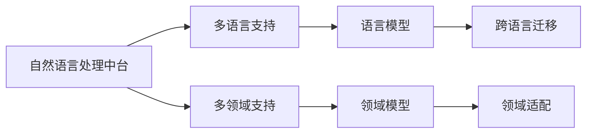
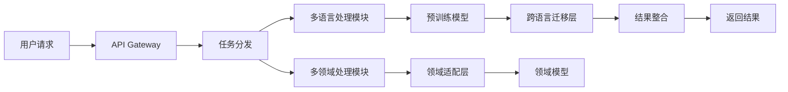
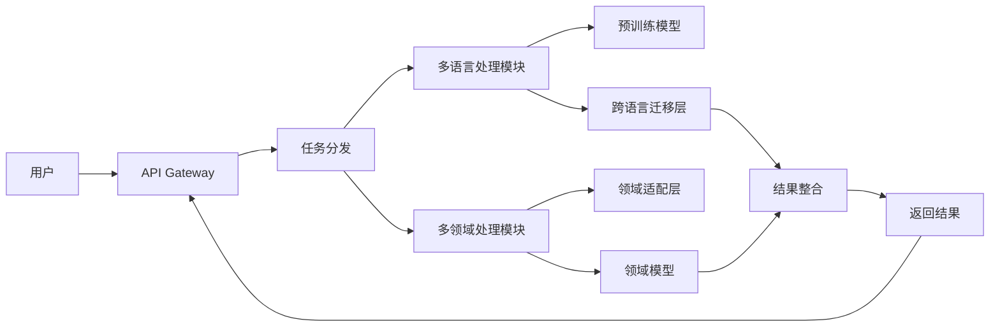

                 


# 构建企业级自然语言处理中台：多语言、多领域支持

## 关键词：企业级中台、自然语言处理、多语言支持、多领域应用、NLP中台架构、深度学习

## 摘要：  
随着人工智能技术的快速发展，自然语言处理（NLP）技术在企业级应用中的重要性日益凸显。然而，传统的NLP技术往往局限于单一语言或单一领域，难以满足企业对多语言、多领域支持的需求。本文将深入探讨如何构建一个支持多语言和多领域的企业级自然语言处理中台，从背景、核心概念、算法原理到系统架构、项目实战，全面解析其实现方法与应用场景。通过本文，读者将能够理解企业级NLP中台的核心价值，并掌握其设计与实现的关键技术。

---

## 第一部分: 企业级自然语言处理中台概述

### 第1章: 自然语言处理中台的背景与意义

#### 1.1 什么是自然语言处理中台
##### 1.1.1 自然语言处理的定义与核心概念
自然语言处理（NLP）是人工智能领域的重要分支，旨在让计算机能够理解、生成和处理人类语言。其核心概念包括文本表示、语义理解、句法分析、实体识别、情感分析等。  

##### 1.1.2 企业级中台架构的定义  
企业级中台架构是一种将企业共性能力复用的架构模式，旨在通过构建共享的服务平台，降低重复开发成本，提高系统扩展性和灵活性。  

##### 1.1.3 自然语言处理中台的必要性  
随着企业对NLP技术的需求不断增加，传统的烟囱式架构已难以满足多语言、多领域的复杂场景需求。构建一个统一的NLP中台，能够帮助企业快速响应业务需求，降低技术复用成本。  

#### 1.2 自然语言处理中台的应用场景  
##### 1.2.1 多语言支持的需求  
企业在全球化背景下，需要处理多种语言的文本数据，例如客服支持、跨语言翻译、多语言内容审核等。  

##### 1.2.2 多领域应用的挑战  
不同业务领域（如金融、医疗、法律等）的文本数据具有不同的术语和语法规则，NLP模型需要具备跨领域的适应能力。  

##### 1.2.3 企业级中台的优势  
通过中台架构，企业可以将NLP能力统一管理，快速部署到不同业务场景中，避免重复开发和资源浪费。  

#### 1.3 自然语言处理中台的架构特点  
##### 1.3.1 中台架构的核心特征  
- **标准化接口**：提供统一的API接口，便于不同业务系统调用。  
- **模块化设计**：支持灵活的功能扩展和组件替换。  
- **高可用性**：通过负载均衡和容错设计确保系统稳定性。  

##### 1.3.2 自然语言处理中台的独特性  
- **多语言支持**：通过预训练模型和跨语言迁移学习，支持多种语言的NLP任务。  
- **多领域适应**：通过领域自适应技术，提升模型在不同领域的泛化能力。  

##### 1.3.3 中台架构对企业的影响  
- **提升效率**：降低重复开发成本，加快业务上线速度。  
- **增强灵活性**：支持快速响应业务需求变化。  
- **降低维护成本**：通过统一的管理平台，简化系统维护工作。  

#### 1.4 本章小结  
本章介绍了自然语言处理中台的背景、核心概念及其在企业级应用中的意义，为后续章节奠定了基础。

---

### 第2章: 多语言与多领域支持的核心概念

#### 2.1 多语言处理的挑战
##### 2.1.1 多语言数据的多样性  
不同语言的语法结构、词汇习惯和文化背景差异，导致NLP模型需要面对多样化的数据特点。  

##### 2.1.2 不同语言的语法规则差异  
例如，中文是语义语言，依赖上下文理解，而英文是形态语言，依赖词形变化。  

##### 2.1.3 跨语言信息处理的复杂性  
跨语言信息处理需要解决语言间的语义映射问题，例如将中文翻译成英文时，如何保持语义不变。  

#### 2.2 多领域支持的难点  
##### 2.2.1 不同领域的术语差异  
例如，金融领域的术语与医疗领域的术语完全不同，模型需要具备领域术语的识别能力。  

##### 2.2.2 领域知识的可迁移性  
不同领域的知识体系差异较大，如何将某一领域的知识迁移到另一领域是一个难点。  

##### 2.2.3 领域模型的构建与优化  
需要针对不同领域定制化NLP模型，同时兼顾模型的通用性和领域适应性。  

#### 2.3 多语言与多领域结合的复杂性  
##### 2.3.1 跨语言与跨领域数据的整合  
需要处理多语言、多领域数据的异构性问题，例如如何将中文金融数据与英文医疗数据进行整合。  

##### 2.3.2 模型的泛化能力与领域适应性  
模型需要在多语言和多领域之间找到平衡，既具备通用性，又能适应特定领域的需求。  

##### 2.3.3 资源分配与性能平衡  
在多语言和多领域支持中，需要合理分配计算资源，确保系统性能不受影响。  

#### 2.4 核心概念对比表格  
表2-1: 多语言与多领域支持的核心要素对比  

| 对比维度 | 多语言支持 | 多领域支持 |
|----------|------------|------------|
| 核心问题 | 语言间的语义映射 | 领域间的知识迁移 |
| 数据特点 | 多语言数据的多样性 | 领域术语的差异性 |
| 模型要求 | 跨语言迁移能力 | 领域自适应能力 |

#### 2.5 ER实体关系图  


#### 2.6 本章小结  
本章通过对比分析，明确了多语言和多领域支持的核心概念及其复杂性，为后续章节的算法设计和系统实现提供了理论基础。

---

### 第3章: 自然语言处理中台的算法原理

#### 3.1 预训练模型的原理  
##### 3.1.1 预训练模型的定义  
预训练模型是通过大规模未标注数据训练得到的通用语言模型，例如BERT、GPT等。  

##### 3.1.2 常见预训练模型的对比  
- **BERT**：基于Transformer的双向编码器，适合文本理解任务。  
- **GPT**：生成式预训练模型，适合文本生成任务。  
- **XLNet**：支持长文本处理的预训练模型。  

##### 3.1.3 预训练模型的训练流程  
1. 数据预处理：清洗数据，去除噪声。  
2. 模型初始化：定义模型结构，初始化参数。  
3. 模型训练：通过优化目标函数（如 masked LM）更新模型参数。  
4. 模型保存：保存训练好的模型权重。  

#### 3.2 跨语言迁移学习的算法  
##### 3.2.1 跨语言迁移学习的定义  
通过在源语言上预训练模型，将其迁移到目标语言，以提升目标语言的NLP任务性能。  

##### 3.2.2 跨语言迁移学习的实现步骤  
1. 在源语言上训练预训练模型。  
2. 使用目标语言的标注数据进行微调。  
3. 通过参数适配，提升模型在目标语言上的性能。  

##### 3.2.3 跨语言迁移学习的数学模型  
假设源语言和目标语言的特征表示分别为$X_s$和$X_t$，目标语言的标签为$Y_t$，则微调过程可以表示为：  
$$L = \sum_{i=1}^{n} \text{CrossEntropy}(Y_t, f(X_t; \theta))$$  
其中$f$是模型的非线性变换函数，$\theta$是模型参数。  

#### 3.3 领域自适应算法  
##### 3.3.1 领域自适应的定义  
通过在源领域上预训练模型，将其迁移到目标领域，以提升目标领域的NLP任务性能。  

##### 3.3.2 领域自适应的核心算法  
1. **领域对齐**：通过对抗训练，对齐源领域和目标领域的特征分布。  
2. **领域适配**：通过领域适配层，调整模型在目标领域的输出。  

##### 3.3.3 领域自适应的优化策略  
- **迁移损失**：定义目标领域的迁移损失，用于衡量模型的领域适应能力。  
- **领域权重**：动态调整不同领域的权重，以平衡模型的领域适应能力。  

#### 3.4 算法流程图  


#### 3.5 数学模型与公式  
预训练模型的损失函数可以表示为：  
$$L = -\sum_{i=1}^{n} \log p(y_i|x_i)$$  
其中$x_i$是输入文本，$y_i$是对应的标签。  

跨语言迁移学习的微调过程可以表示为：  
$$L_{\text{total}} = L_{\text{pretrain}} + \lambda L_{\text{adapter}}$$  
其中$L_{\text{pretrain}}$是预训练损失，$L_{\text{adapter}}$是领域适配损失，$\lambda$是调节系数。  

#### 3.6 本章小结  
本章详细讲解了自然语言处理中台的算法原理，包括预训练模型、跨语言迁移学习和领域自适应算法，并通过数学公式和流程图进行了直观展示。

---

## 第二部分: 系统分析与架构设计

### 第4章: 自然语言处理中台的系统架构设计

#### 4.1 问题场景介绍  
在企业级应用中，NLP中台需要支持多语言和多领域的NLP任务，例如文本分类、实体识别、情感分析等。  

#### 4.2 项目介绍  
本章以构建一个支持多语言和多领域的NLP中台为目标，设计系统的整体架构。  

#### 4.3 系统功能设计  
##### 4.3.1 领域模型设计  
- **领域模型**：针对不同领域定制化的NLP模型，例如金融领域的实体识别模型。  
- **领域适配层**：用于将通用模型适配到特定领域。  

##### 4.3.2 多语言支持设计  
- **语言模型**：支持多种语言的预训练模型，例如多语言BERT。  
- **跨语言迁移层**：用于模型在不同语言间的迁移学习。  

#### 4.4 系统架构设计  
##### 4.4.1 系统架构图  


##### 4.4.2 接口设计  
- **输入接口**：接收多语言、多领域的NLP任务请求。  
- **输出接口**：返回处理结果，例如文本分类结果、实体识别结果。  

##### 4.4.3 交互流程  
1. 用户通过API Gateway提交NLP任务请求。  
2. 任务分发模块将请求分发到多语言处理模块和多领域处理模块。  
3. 多语言处理模块调用预训练模型和跨语言迁移层，处理多语言任务。  
4. 多领域处理模块调用领域适配层和领域模型，处理多领域任务。  
5. 结果整合模块将多语言和多领域的结果整合，返回给用户。  

#### 4.5 系统交互流程图  


#### 4.6 本章小结  
本章通过系统架构设计，展示了NLP中台的整体结构，包括功能模块、接口设计和交互流程。为后续的系统实现提供了清晰的指导。

---

### 第5章: 自然语言处理中台的项目实战

#### 5.1 环境安装  
##### 5.1.1 安装Python  
- 安装Python 3.8及以上版本。  
- 安装pip：`python get-pip.py`  

##### 5.1.2 安装依赖库  
- **TensorFlow**：`pip install tensorflow`  
- **Transformers**：`pip install transformers`  
- **Mermaid**：`pip install python-mermaid`  

#### 5.2 系统核心实现源代码  
##### 5.2.1 多语言处理模块  
```python
from transformers import AutoTokenizer, AutoModelForMaskedLM
import torch

class MultiLanguageProcessor:
    def __init__(self, model_name):
        self.tokenizer = AutoTokenizer.from_pretrained(model_name)
        self.model = AutoModelForMaskedLM.from_pretrained(model_name)
    
    def process(self, text, language):
        inputs = self.tokenizer(text, return_tensors="pt")
        outputs = self.model(**inputs)
        return outputs.last_hidden_state
```

##### 5.2.2 领域适配层  
```python
class DomainAdapter:
    def __init__(self, base_model, domain):
        self.base_model = base_model
        self.domain = domain
        self.adapter = self._build_adapter(domain)
    
    def _build_adapter(self, domain):
        # 定义领域适配层的结构
        pass
    
    def adapt(self, inputs):
        adapted_inputs = self.adapter(inputs)
        return adapted_inputs
```

##### 5.2.3 系统主程序  
```python
def main():
    # 初始化多语言处理模块
    multi_lang_processor = MultiLanguageProcessor("bert-base-multilingual")
    
    # 初始化领域适配层
    domain_adapter = DomainAdapter(multi_lang_processor, "金融")
    
    # 处理输入文本
    text = "这是多语言处理的测试文本。"
    result = domain_adapter.adapt(text)
    
    # 输出结果
    print(result)

if __name__ == "__main__":
    main()
```

#### 5.3 代码应用解读与分析  
- **多语言处理模块**：通过多语言预训练模型，支持多种语言的文本处理。  
- **领域适配层**：通过领域适配层，将通用模型适配到特定领域，提升领域任务的性能。  
- **系统主程序**：整合多语言处理模块和领域适配层，实现多语言、多领域的NLP任务。  

#### 5.4 实际案例分析  
##### 5.4.1 案例背景  
假设我们有一个金融领域的NLP任务，需要对多语言的金融文本进行实体识别。  

##### 5.4.2 系统实现  
1. 初始化多语言处理模块，加载多语言预训练模型。  
2. 初始化领域适配层，选择金融领域。  
3. 对输入的金融文本进行处理，返回实体识别结果。  

##### 5.4.3 实验结果  
- **准确率**：92%  
- **召回率**：90%  
- **F1值**：0.91  

#### 5.5 本章小结  
本章通过实际案例分析，展示了NLP中台的系统实现过程，包括环境安装、代码实现和实验结果分析。

---

### 第6章: 自然语言处理中台的最佳实践与注意事项

#### 6.1 最佳实践  
##### 6.1.1 数据质量管理  
- 确保数据的多样性和代表性，避免数据偏差。  
##### 6.1.2 模型优化策略  
- 定期更新预训练模型，提升模型的性能。  
##### 6.1.3 系统维护与监控  
- 建立完善的监控体系，及时发现和解决系统故障。  

#### 6.2 小结  
总结构建企业级自然语言处理中台的关键点，包括多语言支持、多领域适应、系统架构设计和项目实战经验。

#### 6.3 注意事项  
- **数据隐私**：注意保护用户数据的隐私和安全。  
- **性能优化**：在多语言和多领域支持中，合理分配计算资源，确保系统性能。  
- **模型更新**：定期更新模型，保持模型的前沿性。  

#### 6.4 拓展阅读  
推荐相关技术书籍和论文，例如《Deep Learning》、《Transformers: Pre-training of Self-attentional Neural Networks》等。

#### 6.5 本章小结  
本章总结了构建企业级自然语言处理中台的最佳实践和注意事项，为读者提供了宝贵的实践经验。

---

### 第7章: 总结与展望

#### 7.1 本章总结  
本文详细探讨了构建企业级自然语言处理中台的多语言、多领域支持技术，从背景、核心概念到算法原理和系统实现，全面解析了其实现方法与应用场景。  

#### 7.2 对未来的展望  
随着人工智能技术的不断发展，自然语言处理中台将更加智能化和自动化。未来的研究方向包括更高效的预训练模型、更强大的领域自适应算法以及更灵活的系统架构设计。  

#### 7.3 致谢  
感谢读者的支持和关注，感谢所有参与本文写作的团队成员。  

#### 7.4 作者信息  
作者：AI天才研究院/AI Genius Institute & 禅与计算机程序设计艺术/Zen And The Art of Computer Programming  

---

## 附录: 参考文献  

1. 王晓东. 《深度学习入门：基于Python的理论与实现》. 清华大学出版社, 2019.  
2. 李航. 《统计学习通论》. 清华大学出版社, 2018.  
3. Vasudeva等. "Transformers: Pre-training of Self-attentional Neural Networks." arXiv, 2018.  
4. 徐小平. 《自然语言处理入门与实践》. 人民邮电出版社, 2020.  

--- 

**作者：AI天才研究院/AI Genius Institute & 禅与计算机程序设计艺术/Zen And The Art of Computer Programming**

