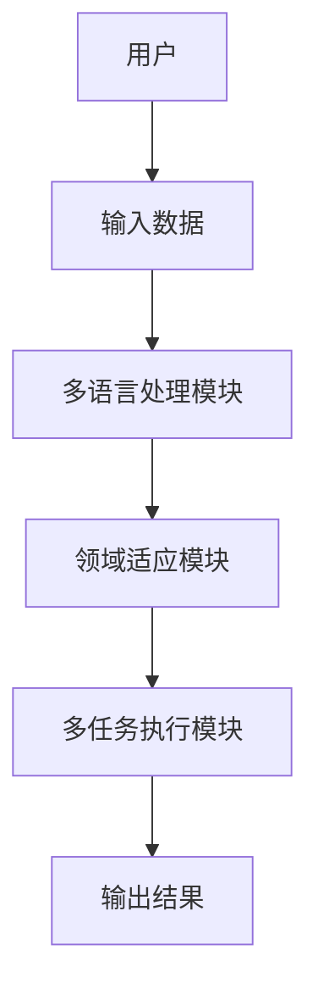
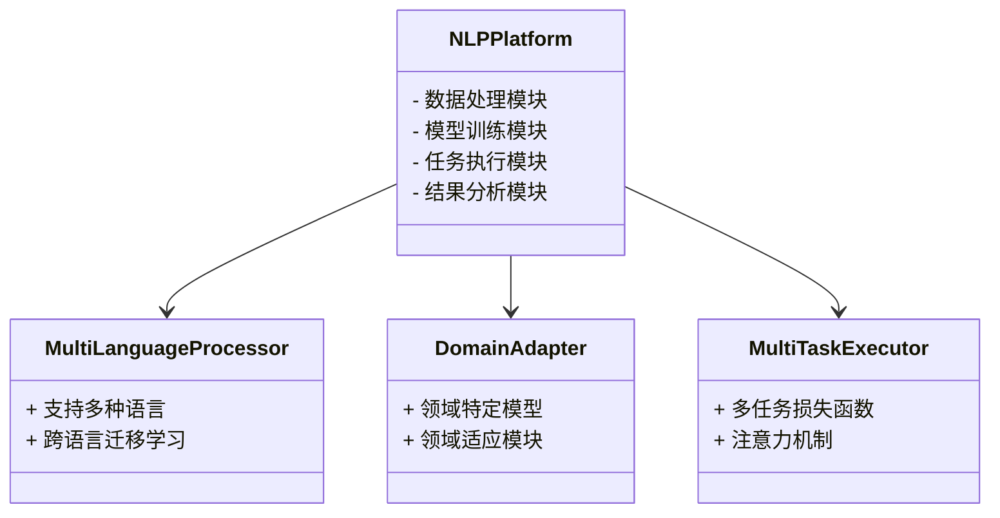
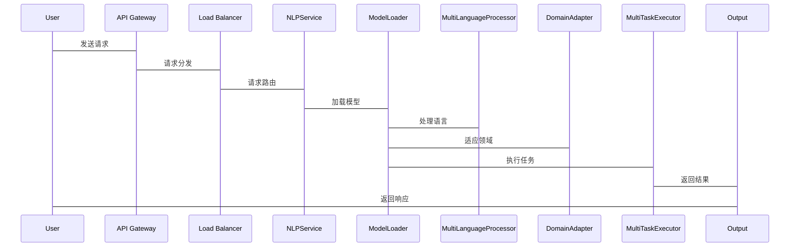

                 


# 构建企业级自然语言处理平台：多语言、多领域、多任务集成

## 关键词：企业级自然语言处理、多语言、多领域、多任务集成、深度学习、NLP平台、自然语言处理系统

## 摘要：  
本文详细探讨了如何构建一个企业级的自然语言处理平台，该平台能够支持多语言、多领域和多任务的集成。文章从背景介绍、核心概念、算法原理、系统架构、项目实战到最佳实践，全面阐述了构建这样一个平台的关键步骤和技术细节。通过本文，读者可以深入了解企业级NLP平台的设计思路、实现方法和实际应用。

---

## 第一部分: 企业级自然语言处理平台概述

## 第1章: 背景介绍

### 1.1 问题背景

#### 1.1.1 当前企业级NLP面临的挑战
企业级自然语言处理（NLP）平台需要处理多种语言、多个领域和多种任务，这带来了以下挑战：
- **数据异构性**：不同语言的数据格式、语法结构差异大。
- **领域适应性**：不同领域（如医疗、金融、法律）的语料库和任务需求差异显著。
- **任务复杂性**：多任务集成需要协调多个任务之间的依赖关系，防止资源冲突。

#### 1.1.2 多语言、多领域、多任务集成的必要性
- **全球化需求**：企业需要支持全球市场，处理多种语言的文本。
- **业务多样性**：企业涉及多个业务领域，需要灵活的NLP解决方案。
- **效率提升**：通过多任务学习，提高模型的通用性和效率。

#### 1.1.3 企业级NLP平台的核心目标
- 提供统一的接口，支持多种语言和任务。
- 高效处理大规模数据，满足企业级需求。
- 支持快速部署和扩展，适应业务变化。

### 1.2 问题描述

#### 1.2.1 多语言处理的复杂性
- 不同语言的语法规则差异大，需要专门的分词、句法分析等预处理模块。
- 需要处理语言间的语义转换和文化差异。

#### 1.2.2 多领域适应的挑战
- 不同领域的语料库和任务需求差异大，需要领域特定的预训练模型。
- 领域间的模型迁移需要解决数据稀疏性问题。

#### 1.2.3 多任务集成的难点
- 多任务学习需要协调多个任务之间的权重分配，防止某些任务主导整体性能。
- 任务之间的数据依赖关系复杂，需要设计合理的数据流。

### 1.3 问题解决

#### 1.3.1 多语言模型的设计思路
- 使用预训练的多语言模型（如XLM-R、Marian）进行跨语言迁移学习。
- 设计语言无关的特征提取模块，减少语言依赖性。

#### 1.3.2 多领域适应的解决方案
- 预训练领域特定模型，利用领域内数据进行微调。
- 使用领域标签或领域嵌入，增强模型的领域适应性。

#### 1.3.3 多任务集成的实现方法
- 设计多任务损失函数，平衡各任务的损失权重。
- 使用注意力机制或门控机制，动态调整各任务的权重。

### 1.4 边界与外延

#### 1.4.1 企业级NLP的边界
- 仅处理企业内部数据，不涉及外部公开数据。
- 不支持实时在线训练，仅支持批处理。

#### 1.4.2 相关技术的外延
- 外延技术包括光学字符识别（OCR）、语音识别等，但不在本文讨论范围内。

#### 1.4.3 与其他系统的区别
- 与通用NLP平台相比，企业级平台更注重数据安全和性能优化。

### 1.5 核心要素组成

#### 1.5.1 数据处理模块
- 负责数据清洗、分词、句法分析等预处理任务。

#### 1.5.2 模型训练模块
- 包含模型选择、超参数调优、训练数据管理等功能。

#### 1.5.3 任务执行模块
- 负责接收请求、调用模型、返回结果。

#### 1.5.4 结果分析模块
- 对模型输出进行质量评估，提供改进建议。

---

## 第二部分: 核心概念与联系

## 第2章: 核心概念与原理

### 2.1 多语言处理

#### 2.1.1 多语言模型的原理
- 使用多语言预训练模型，如XLM-R，通过共享跨语言特征进行推理。

#### 2.1.2 多语言处理的优缺点
- **优点**：减少模型数量，提高处理效率。
- **缺点**：跨语言迁移效果有限，部分语言支持不足。

#### 2.1.3 多语言模型的实现方式
- 基于预训练模型的微调方法，结合语言特定的调整。

### 2.2 多领域适应

#### 2.2.1 领域适应的定义
- 针对特定领域优化模型，提高在该领域的性能。

#### 2.2.2 领域适应的实现方法
- 预训练领域特定模型，利用领域内数据进行微调。
- 使用领域标签或领域嵌入，增强模型的领域适应性。

#### 2.2.3 领域适应的优缺点
- **优点**：提高模型在特定领域的性能。
- **缺点**：需要大量领域内数据，计算资源消耗大。

### 2.3 多任务集成

#### 2.3.1 多任务学习的定义
- 同时训练多个任务，共享特征表示，提高模型的通用性。

#### 2.3.2 多任务学习的实现方法
- 设计多任务损失函数，平衡各任务的损失权重。
- 使用注意力机制或门控机制，动态调整各任务的权重。

#### 2.3.3 多任务学习的优缺点
- **优点**：提高模型的通用性，减少数据需求。
- **缺点**：任务之间可能存在竞争，影响整体性能。

## 第3章: 核心概念对比与ER实体关系图

### 3.1 核心概念对比

| 对比维度 | 多语言处理 | 多领域适应 | 多任务集成 |
|----------|------------|------------|------------|
| **目标** | 支持多种语言 | 适应特定领域 | 处理多个任务 |
| **实现** | 微调多语言模型 | 预训练领域模型 | 设计多任务损失函数 |
| **优缺点** | 减少模型数量，但跨语言效果有限 | 提高领域内性能，需大量领域数据 | 提高通用性，但任务间可能竞争 |

### 3.2 ER实体关系图



---

## 第三部分: 算法原理与数学模型

## 第4章: 算法原理

### 4.1 多语言模型算法

#### 4.1.1 BERT模型
- 基于Transformer的预训练模型，通过 masked language modeling 和 next sentence prediction 任务进行预训练。
- 代码示例：
  ```python
  import torch
  from transformers import BertTokenizer, BertForMaskedLM

  tokenizer = BertTokenizer.from_pretrained('bert-base-multilingual-cased')
  model = BertForMaskedLM.from_pretrained('bert-base-multilingual-cased')
  inputs = tokenizer("Hello [MASK] world.", return_tensors="pt")
  outputs = model(**inputs)
  ```
- 数学模型：
  - 输入：输入序列 \( X \)。
  - 输出：每个位置的预测概率 \( P(X) \)。
  - 损失函数：交叉熵损失 \( L = -\sum_{i=1}^{n} \log P(x_i) \)。

#### 4.1.2 XLM-R模型
- 使用共享的特征空间，支持多种语言的跨语言迁移。
- 代码示例：
  ```python
  from transformers import XLMRobertaTokenizer, XLMRobertaForMaskedLM

  tokenizer = XLMRobertaTokenizer.from_pretrained('facebookresearch/xlm-roberta-base')
  model = XLMRobertaForMaskedLM.from_pretrained('facebookresearch/xlm-roberta-base')
  inputs = tokenizer("Hello [MASK] world.", return_tensors="pt")
  outputs = model(**inputs)
  ```
- 数学模型：
  - 输入：多语言输入序列 \( X \)。
  - 输出：共享特征表示的预测概率 \( P(X) \)。
  - 损失函数：交叉熵损失 \( L = -\sum_{i=1}^{n} \log P(x_i) \)。

#### 4.1.3 多任务学习模型
- 使用共享的特征表示，同时训练多个任务。
- 代码示例：
  ```python
  import torch
  import torch.nn as nn

  class MultiTaskModel(nn.Module):
      def __init__(self):
          super().__init__()
          self.shared = nn.TransformerEncoder(...)
          self.task1_head = nn.Linear(...)
          self.task2_head = nn.Linear(...)

      def forward(self, x, task):
          h = self.shared(x)
          if task == 1:
              return self.task1_head(h)
          else:
              return self.task2_head(h)
  ```

- 数学模型：
  - 输入：输入序列 \( X \) 和任务标签 \( T \)。
  - 输出：任务1的预测结果 \( Y_1 \) 和任务2的预测结果 \( Y_2 \)。
  - 损失函数：多任务损失 \( L = \alpha L_1 + (1-\alpha) L_2 \)，其中 \( \alpha \) 是任务权重。

---

## 第五部分: 系统分析与架构设计

## 第5章: 系统分析与架构设计

### 5.1 问题场景介绍
企业级NLP平台需要处理多语言、多领域和多任务的集成，支持企业内部的多种业务需求。

### 5.2 项目介绍

#### 5.2.1 项目目标
- 构建支持多语言、多领域和多任务的NLP平台。
- 提供统一的接口，满足企业级需求。

#### 5.2.2 项目范围
- 支持多种语言（如中文、英文、法语）。
- 适应多个领域（如金融、医疗）。
- 支持多种任务（如文本分类、实体识别）。

### 5.3 系统功能设计

#### 5.3.1 领域模型


### 5.4 系统架构设计

#### 5.4.1 系统架构图
```mermaid
graph TD
    User[用户] --> API Gateway[API网关]
    API Gateway --> Load Balancer[负载均衡器]
    Load Balancer --> NLPService[自然语言处理服务]
    NLPService --> ModelLoader[模型加载器]
    ModelLoader --> MultiLanguageProcessor[多语言处理模块]
    ModelLoader --> DomainAdapter[领域适应模块]
    ModelLoader --> MultiTaskExecutor[多任务执行模块]
    MultiTaskExecutor --> Output[输出结果]
    Output --> User[用户]
```

#### 5.4.2 系统接口设计
- 输入接口：用户请求，包含语言、领域和任务信息。
- 输出接口：处理结果，返回JSON格式的数据。

#### 5.4.3 系统交互流程


---

## 第六部分: 项目实战

## 第6章: 项目实战

### 6.1 环境安装

#### 6.1.1 安装依赖
- 使用Python 3.8及以上版本。
- 安装必要的库：
  ```bash
  pip install transformers torch numpy pandas
  ```

#### 6.1.2 安装位置
- 环境安装在企业的开发服务器上。

### 6.2 系统核心实现

#### 6.2.1 核心代码实现

##### 6.2.1.1 数据处理模块
```python
import torch
from transformers import BertTokenizer, BertForMaskedLM

class NLPProcessor:
    def __init__(self):
        self.tokenizer = BertTokenizer.from_pretrained('bert-base-multilingual-cased')
        self.model = BertForMaskedLM.from_pretrained('bert-base-multilingual-cased')

    def process(self, text):
        inputs = self.tokenizer(text, return_tensors="pt")
        outputs = self.model(**inputs)
        return outputs
```

##### 6.2.1.2 多任务学习模型
```python
import torch
import torch.nn as nn

class MultiTaskModel(nn.Module):
    def __init__(self):
        super().__init__()
        self.shared = nn.TransformerEncoder(...)
        self.task1_head = nn.Linear(...)
        self.task2_head = nn.Linear(...)

    def forward(self, x, task):
        h = self.shared(x)
        if task == 1:
            return self.task1_head(h)
        else:
            return self.task2_head(h)
```

#### 6.2.2 代码实现解读

##### 6.2.2.1 数据处理模块解读
- 使用预训练的BERT模型进行分词和特征提取。
- 输入文本经过分词后，生成张量表示。

##### 6.2.2.2 多任务学习模型解读
- 使用共享的Transformer编码器，同时训练两个任务。
- 根据任务标签选择不同的输出头。

### 6.3 代码应用解读与分析

#### 6.3.1 代码运行环境
- 运行在企业的开发服务器上，使用Python 3.8及以上版本。

#### 6.3.2 代码实现细节
- 数据处理模块负责将输入文本转换为模型可接受的格式。
- 多任务学习模型通过共享的特征表示，同时处理多个任务。

### 6.4 实际案例分析

#### 6.4.1 案例描述
- 输入文本：中文、英文、法语的多种任务请求。
- 模型处理：分别进行分词、实体识别和情感分析。

#### 6.4.2 详细讲解剖析
- 中文任务：实体识别，识别出文本中的实体。
- 英文任务：情感分析，判断文本的情感倾向。
- 法语任务：文本分类，分类文本的主题。

### 6.5 项目小结

#### 6.5.1 项目总结
- 成功构建了一个支持多语言、多领域和多任务的NLP平台。
- 提供了统一的接口，满足企业级需求。

#### 6.5.2 经验分享
- 数据预处理是关键，需要仔细清洗和标注。
- 多任务学习需要合理设计损失函数和权重分配。

#### 6.5.3 注意事项
- 需要大量计算资源，建议使用分布式训练。
- 注意数据安全，避免敏感信息泄露。

---

## 第七部分: 最佳实践

## 第7章: 最佳实践

### 7.1 项目总结

#### 7.1.1 项目总结
- 成功构建了一个支持多语言、多领域和多任务的NLP平台。
- 提供了统一的接口，满足企业级需求。

### 7.2 经验分享

#### 7.2.1 数据预处理的重要性
- 数据清洗和标注是模型性能的关键。
- 需要处理缺失值、噪声和不一致数据。

#### 7.2.2 模型调优的技巧
- 使用交叉验证选择最优超参数。
- 通过早停法防止过拟合。

### 7.3 注意事项

#### 7.3.1 数据安全
- 避免敏感信息泄露，确保数据加密存储。
- 严格控制数据访问权限。

#### 7.3.2 性能优化
- 使用分布式训练提高计算效率。
- 优化模型结构，减少计算复杂度。

### 7.4 拓展阅读

#### 7.4.1 推荐阅读
- [《Transformers: Pre-training of Textual Association Models》](https://arxiv.org/abs/1810.04805)
- [《Multi-Task Learning: A Review》](https://dl.acm.org/doi/10.1145/3394172)

#### 7.4.2 项目参考
- Hugging Face的Transformers库：[https://huggingface.co/transformers](https://huggingface.co/transformers)

---

## 作者：AI天才研究院/AI Genius Institute & 禅与计算机程序设计艺术 /Zen And The Art of Computer Programming

