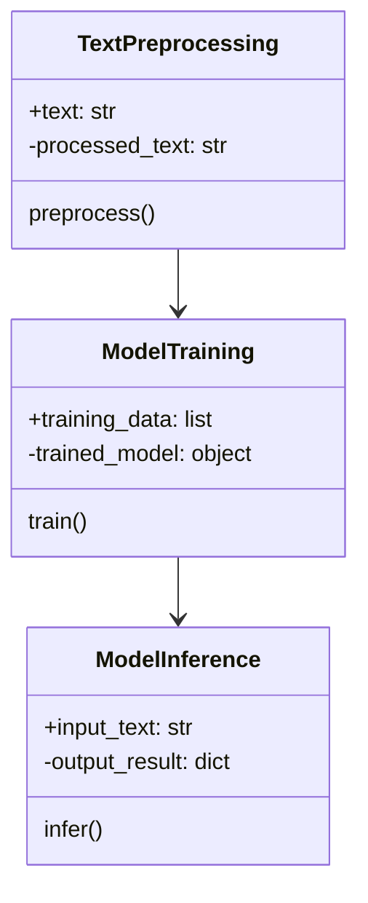
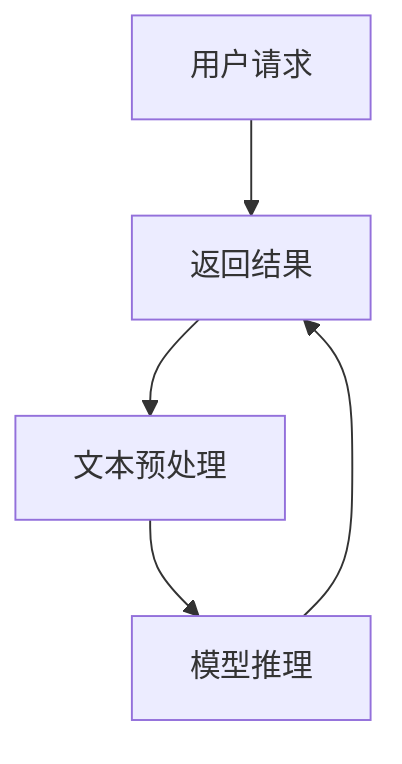
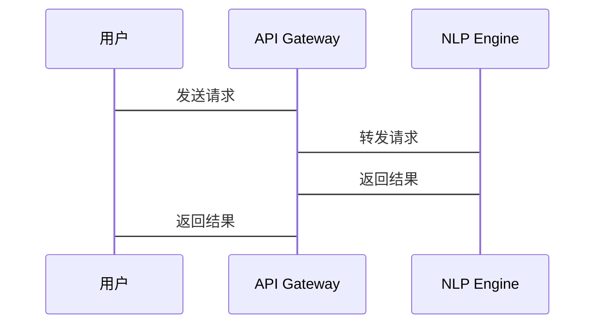

                 


# 《构建企业级自然语言处理引擎：多语言支持与领域适应》

> 关键词：企业级NLP，多语言支持，领域适应，预训练模型，NLP引擎架构

> 摘要：随着自然语言处理技术的快速发展，构建企业级自然语言处理引擎的需求日益增长。本文深入探讨了构建企业级NLP引擎的核心技术，重点关注多语言支持与领域适应两大方面。通过分析多语言NLP的技术挑战、领域适应的实现方法，结合预训练模型的微调策略，本文为读者提供了构建高效、可扩展的自然语言处理引擎的详细指导。从系统架构设计到实际项目实战，本文旨在帮助读者掌握企业级NLP引擎的核心技术与实践方法。

---

# 第一部分: 企业级自然语言处理引擎概述

# 第1章: 自然语言处理引擎的背景与挑战

## 1.1 自然语言处理的概述

### 1.1.1 自然语言处理的核心概念

自然语言处理（Natural Language Processing, NLP）是计算机科学与人工智能领域的重要分支，旨在实现人与计算机之间的自然语言交互。NLP的核心任务包括文本理解、文本生成、信息提取等。企业级NLP引擎的目标是将这些技术应用于实际业务场景，提供高效的文本处理能力。

### 1.1.2 企业级NLP的特殊需求

企业级NLP引擎需要满足以下特殊需求：

1. **高性能**：支持大规模数据处理，满足实时或准实时的响应需求。
2. **多语言支持**：企业可能需要处理多种语言的文本，如英文、中文、法语等。
3. **领域适应**：针对特定行业（如医疗、金融、法律等），模型需要具备领域知识的适应能力。
4. **可扩展性**：支持动态扩展，适应业务增长的需求。

### 1.1.3 多语言支持与领域适应的重要性

在企业级应用场景中，多语言支持能够帮助企业处理全球化的业务需求，而领域适应则能够提升模型在特定领域的准确性和实用性。两者结合，使得NLP引擎能够更好地服务于企业的多样化需求。

---

## 1.2 企业级NLP引擎的挑战

### 1.2.1 多语言处理的技术难点

多语言NLP的核心挑战在于不同语言之间的语义差异和数据稀缺性。例如，某些语言的数据量较少，导致模型难以有效训练。

### 1.2.2 领域适应的复杂性

领域适应需要模型具备领域知识的迁移能力。例如，在医疗领域，模型需要理解专业术语和特定的上下文关系，这增加了模型训练和优化的难度。

### 1.2.3 高性能与可扩展性的要求

企业级NLP引擎需要处理海量数据，同时支持高并发请求。这要求模型和系统架构必须具备高效的计算能力和良好的扩展性。

---

## 1.3 本章小结

本章介绍了自然语言处理的核心概念，分析了企业级NLP引擎的特殊需求，并详细探讨了多语言支持与领域适应的技术挑战。这些内容为后续章节的深入分析奠定了基础。

---

# 第二部分: 自然语言处理引擎的核心技术

# 第2章: 多语言支持的技术原理

## 2.1 多语言NLP的核心概念

### 2.1.1 多语言NLP的定义与特点

多语言NLP是指在单一模型中同时支持多种语言的自然语言处理任务。其特点包括跨语言一致性、语言无关性和可扩展性。

### 2.1.2 多语言模型的训练策略

多语言模型的训练策略主要包括以下几种：

1. **联合训练**：在多种语言数据上联合训练模型，共享语言间的特征。
2. **多任务学习**：在多种语言任务上进行联合优化，提升模型的通用性。
3. **层次化训练**：先在通用语言层面上进行训练，再针对特定语言进行微调。

### 2.1.3 多语言数据的处理方法

多语言数据的处理方法包括数据预处理、跨语言对齐和语言特征提取等。

---

## 2.2 多语言NLP的关键技术

### 2.2.1 跨语言迁移学习

跨语言迁移学习是指利用一种语言的模型知识，迁移到其他语言的任务中。例如，使用英语模型迁移到中文任务。

### 2.2.2 多语言词嵌入模型

多语言词嵌入模型（如MBERT）通过共享词嵌入层，实现跨语言的语义表示。

### 2.2.3 跨语言句法分析

跨语言句法分析旨在在多种语言中统一句法结构的分析方法。

---

## 2.3 多语言NLP的实现案例

### 2.3.1 使用预训练多语言模型

例如，使用预训练的多语言模型（如Marian、XLM）进行文本翻译或文本分类。

### 2.3.2 自定义多语言模型的训练

根据企业需求，定制训练数据和任务，训练专属的多语言模型。

### 2.3.3 多语言模型的实际应用

例如，在跨国企业中，使用多语言模型进行客户支持的多语言对话理解。

---

## 2.4 本章小结

本章详细探讨了多语言NLP的核心概念、关键技术及其实现案例。通过这些内容，读者可以理解如何在企业级场景中实现高效的多语言支持。

---

# 第3章: 领域适应的核心原理

## 3.1 领域适应的定义与目标

### 3.1.1 领域适应的定义

领域适应是指将自然语言处理模型从通用任务迁移到特定领域任务的过程。

### 3.1.2 领域适应的目标

领域适应的目标是提升模型在特定领域的性能，降低领域数据稀缺性带来的影响。

### 3.1.3 领域适应的分类

领域适应可以分为跨领域适应和领域内微调两种类型。

---

## 3.2 领域适应的关键技术

### 3.2.1 数据增强

通过生成领域相关的数据或对现有数据进行变换，增加训练数据的多样性。

### 3.2.2 领域特定模型

针对特定领域设计和训练专属模型，提升模型的领域适应能力。

### 3.2.3 知识蒸馏

通过教师模型（Teacher）指导学生模型（Student）进行领域知识的传递。

---

## 3.3 领域适应的实现案例

### 3.3.1 医疗领域的NLP应用

在医疗领域，模型需要理解专业术语和病历数据，进行疾病诊断或药物推荐。

### 3.3.2 金融领域的NLP应用

在金融领域，模型用于风险评估、欺诈检测或金融文本分析。

### 3.3.3 法律领域的NLP应用

在法律领域，模型用于合同审查、法律条文分析或案件管理。

---

## 3.4 本章小结

本章深入分析了领域适应的核心原理及其关键技术，并通过具体案例展示了领域适应的实际应用。这些内容为后续章节的系统架构设计提供了理论基础。

---

# 第三部分: 自然语言处理引擎的算法原理

# 第4章: 预训练模型与微调策略

## 4.1 预训练模型的概述

### 4.1.1 预训练模型的定义

预训练模型是指在大规模通用数据上预先训练好的模型，用于后续特定任务的微调。

### 4.1.2 预训练模型的训练目标

预训练模型的训练目标包括语言模型任务（如完形填空）和多种任务的联合优化。

### 4.1.3 预训练模型的优缺点

预训练模型的优点是性能强、可扩展性高，缺点是需要大量计算资源和数据支持。

---

## 4.2 微调策略的详细讲解

### 4.2.1 全参数微调

全参数微调是指对模型的所有参数进行重新训练，适用于任务差异较大的场景。

### 4.2.2 适应性微调

适应性微调是在特定层面上进行参数调整，适用于任务相似的场景。

### 4.2.3 参数初始化微调

参数初始化微调是指利用预训练模型的初始参数，仅对部分参数进行微调。

---

## 4.3 预训练模型的数学模型

### 4.3.1 BERT模型的预训练目标函数

BERT的预训练目标函数如下：

$$
\text{BERT的预训练目标函数包括 Masked Language Model（MLM）和 Next Sentence Prediction（NSP）两部分。}
$$

---

## 4.4 本章小结

本章详细讲解了预训练模型的原理及其微调策略，并通过数学公式展示了模型的核心思想。

---

# 第5章: 系统分析与架构设计方案

## 5.1 问题场景介绍

本章以构建企业级NLP引擎为背景，分析系统的功能需求和性能要求。

## 5.2 系统功能设计

### 5.2.1 领域模型设计

使用Mermaid绘制领域模型类图，展示模型之间的关系。



### 5.2.2 系统架构设计

使用Mermaid绘制系统架构图，展示各模块之间的交互。



## 5.3 系统接口设计

### 5.3.1 API接口定义

定义RESTful API接口，包括GET、POST等方法。

### 5.3.2 接口交互流程

使用Mermaid绘制序列图，展示接口交互流程。



---

## 5.4 本章小结

本章通过问题场景分析、功能设计和架构设计，展示了如何构建高效的企业级NLP引擎。

---

# 第六部分: 项目实战

# 第6章: 企业级NLP引擎的实现

## 6.1 环境安装

### 6.1.1 安装Python和相关库

安装Python和TensorFlow、PyTorch等NLP库。

## 6.2 核心代码实现

### 6.2.1 文本预处理代码

```python
def preprocess_text(text):
    # 分词
    tokens = tokenize(text)
    # 去停用词
    filtered_tokens = remove_stopwords(tokens)
    return ' '.join(filtered_tokens)
```

### 6.2.2 模型训练代码

```python
def train_model(train_data, val_data):
    model = build_model()
    model.compile(...)
    model.fit(train_data, val_data, epochs=...)
    return model
```

## 6.3 代码解读与分析

详细解读上述代码，说明每一部分的功能和实现细节。

## 6.4 实际案例分析

以医疗领域的文本分类为例，展示模型的实际应用。

## 6.5 项目小结

总结项目实现的关键点和经验教训。

---

# 第七部分: 最佳实践

## 7.1 小结

总结全文的核心内容和关键知识点。

## 7.2 注意事项

提醒读者在实际应用中需要注意的事项，如数据安全、模型调优等。

## 7.3 拓展阅读

推荐相关的技术书籍和论文，供读者进一步学习。

---

# 作者：AI天才研究院/AI Genius Institute & 禅与计算机程序设计艺术 /Zen And The Art of Computer Programming

