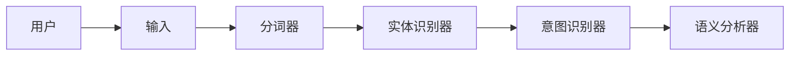
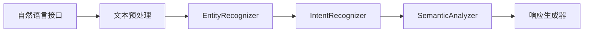
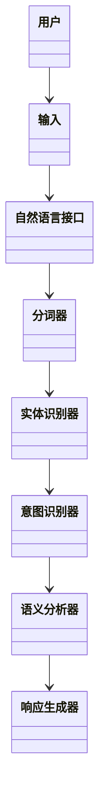
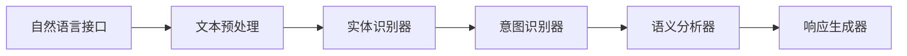
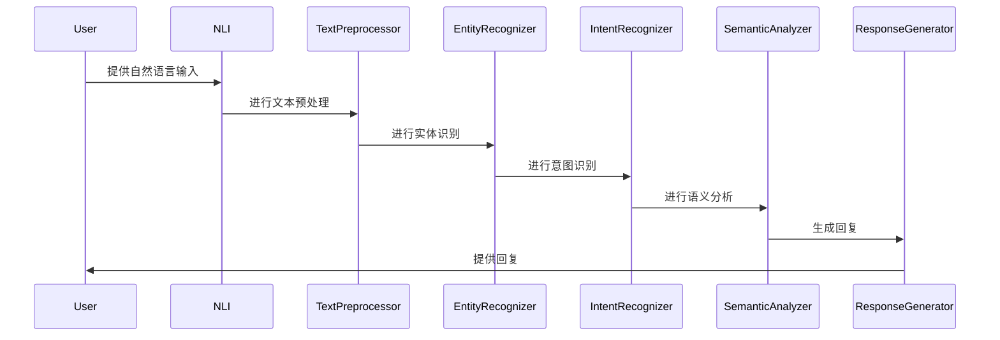

                 


# 构建企业级自然语言接口：复杂业务系统的智能交互层

## 关键词：自然语言处理，企业级应用，智能交互，自然语言接口，系统架构

## 摘要：  
在企业级应用中，自然语言处理（NLP）技术正在迅速改变人与计算机之间的交互方式。本文深入探讨了构建企业级自然语言接口的核心技术、系统架构和实际应用。从背景到实现，从算法到系统设计，全面解析了如何将自然语言处理技术应用于复杂业务系统，打造智能交互层，提升用户体验和系统效率。

---

# 第一部分：企业级自然语言接口的背景与核心概念

## 第1章：自然语言处理与企业级应用的背景

### 1.1 自然语言处理的背景与现状  
自然语言处理（NLP）是人工智能领域的重要分支，致力于让计算机能够理解和生成人类语言。随着深度学习技术的发展，NLP在企业级应用中的潜力逐渐释放，尤其是在客户服务、流程自动化和内部协作等领域，自然语言接口（NLI）成为企业数字化转型的关键技术。

#### 1.1.1 自然语言处理的定义与核心问题  
自然语言处理是指计算机对人类语言进行理解、分析和生成的过程。其核心问题包括：  
1. **语言理解**：如何准确理解用户输入的自然语言文本。  
2. **语言生成**：如何生成符合语法规则且符合上下文的自然语言文本。  
3. **语义分析**：如何从文本中提取语义信息，包括实体识别、意图识别等。  

#### 1.1.2 自然语言处理的发展历程  
NLP的发展经历了多个阶段：  
1. **基于规则的方法**：通过手动编写规则进行文本处理，适用于简单场景。  
2. **统计方法**：利用概率模型（如n-gram）分析文本，显著提高了准确率。  
3. **深度学习方法**：通过神经网络（如RNN、Transformer）处理文本，实现了更复杂的任务。  

#### 1.1.3 企业级应用中的自然语言处理需求  
企业级应用对NLP的需求主要集中在以下方面：  
- **客户服务**：通过聊天机器人提供24/7的客户支持。  
- **流程自动化**：利用NLP技术自动处理业务流程中的文本信息。  
- **内部协作**：通过智能助手提高员工的工作效率。  

---

### 1.2 企业级自然语言接口的定义与特点  

#### 1.2.1 自然语言接口的定义  
自然语言接口（NLI）是指用户通过自然语言与计算机系统进行交互的界面。它能够理解用户的意图，并将输入的自然语言转化为系统可执行的操作。  

#### 1.2.2 企业级自然语言接口的核心特点  
企业级NLI具有以下特点：  
1. **高可靠性**：在复杂业务场景下，必须保证准确性和稳定性。  
2. **可扩展性**：能够支持多种业务场景和大规模用户需求。  
3. **定制化**：根据企业需求进行定制化开发，适应特定业务流程。  
4. **安全性**：保护用户隐私和企业数据安全。  

#### 1.2.3 与传统自然语言处理的区别  
与传统NLP相比，企业级NLI更注重实际应用中的可靠性、可扩展性和安全性，同时需要与企业现有的系统无缝集成。  

---

### 1.3 企业级自然语言接口的应用场景  

#### 1.3.1 客户服务与支持  
通过NLI，企业可以提供智能客服解决方案，支持多轮对话，快速解决客户问题。  

#### 1.3.2 业务流程自动化  
NLI可以与企业现有的业务系统集成，自动处理订单、审批流程等任务，提升效率。  

#### 1.3.3 内部协作与信息检索  
NLI可以作为企业内部的智能助手，帮助员工快速检索信息、安排会议等。  

---

## 第2章：自然语言接口的核心概念与联系  

### 2.1 自然语言接口的核心概念  

#### 2.1.1 分词与词性标注  
分词是将连续的文本分割成有意义的词语，词性标注是对每个词语赋予其词性（如名词、动词）。  

#### 2.1.2 实体识别与意图识别  
- **实体识别**：从文本中提取出人名、地名、组织名等实体信息。  
- **意图识别**：分析用户输入的文本，识别用户的意图（如查询、预订等）。  

#### 2.1.3 语义理解与生成  
- **语义理解**：通过上下文理解文本的深层含义。  
- **语义生成**：根据上下文生成符合语义的文本。  

---

### 2.2 核心概念的对比与联系  

#### 2.2.1 分词与实体识别的对比  
| 对比维度 | 分词 | 实体识别 |  
|----------|------|----------|  
| 目标 | 将文本分割成词语 | 识别文本中的实体 |  
| 输入 | 连续文本 | 文本中可能包含实体的片段 |  
| 输出 | 分词结果（如“北京”、“天气”） | 实体及其类型（如“北京”是地名） |  

#### 2.2.2 意图识别与语义理解的联系  
意图识别是语义理解的基础，语义理解则是意图识别的扩展。意图识别关注用户的表面需求，而语义理解关注用户的深层需求。  

#### 2.2.3 生成与对话管理的结合  
对话管理是NLI的重要组成部分，负责协调多轮对话的流程。语义生成则为对话管理提供支持，确保生成的回复符合上下文。  

---

### 2.3 实体关系图与系统架构  

#### 2.3.1 实体关系图（ER图）展示  


#### 2.3.2 系统架构图  


---

## 第3章：自然语言接口的算法原理  

### 3.1 分词算法  

#### 3.1.1 基于规则的分词算法  
基于规则的分词算法通过预定义的规则进行分词，适用于特定领域。  

#### 3.1.2 基于统计的分词算法  
基于统计的分词算法通过计算词语的概率进行分词，常用算法包括n-gram模型。  

#### 3.1.3 基于深度学习的分词算法  
基于深度学习的分词算法使用神经网络进行分词，如LSTM和Transformer模型。  

---

### 3.2 实体识别算法  

#### 3.2.1 基于CRF的实体识别  
CRF（条件随机场）是一种常用的实体识别算法，通过条件概率模型进行识别。  

#### 3.2.2 基于RNN的实体识别  
RNN（循环神经网络）通过序列建模进行实体识别，适用于长文本处理。  

#### 3.2.3 基于Transformer的实体识别  
Transformer模型通过自注意力机制进行实体识别，性能优于RNN。  

---

### 3.3 意图识别算法  

#### 3.3.1 基于朴素贝叶斯的意图识别  
朴素贝叶斯是一种简单的分类算法，适用于小规模数据集。  

#### 3.3.2 基于SVM的意图识别  
SVM（支持向量机）是一种常用的分类算法，适用于中等规模数据集。  

#### 3.3.3 基于深度学习的意图识别  
深度学习模型（如LSTM和Transformer）通过端到端训练实现意图识别。  

---

### 3.4 语义理解算法  

#### 3.4.1 基于TF-IDF的语义理解  
TF-IDF（词频-逆文档频率）是一种常用的语义表示方法。  

#### 3.4.2 基于Word2Vec的语义理解  
Word2Vec通过词向量表示词语的语义信息。  

#### 3.4.3 基于BERT的语义理解  
BERT（双向Transformer）通过预训练模型实现深度语义理解。  

---

## 第4章：自然语言接口的系统架构与设计  

### 4.1 系统分析与设计  

#### 4.1.1 问题场景介绍  
企业级NLI需要处理复杂业务场景，如多轮对话、上下文理解等。  

#### 4.1.2 系统功能设计  
- **输入处理**：接收用户输入并进行预处理。  
- **意图识别**：识别用户的意图。  
- **语义理解**：理解文本的深层含义。  
- **响应生成**：生成符合语义的回复。  

#### 4.1.3 领域模型图  


---

### 4.2 系统架构设计  

#### 4.2.1 系统架构图  


#### 4.2.2 接口设计  
- **输入接口**：接收用户的自然语言输入。  
- **输出接口**：生成符合语义的回复。  

#### 4.2.3 交互流程图  


---

## 第5章：自然语言接口的项目实战  

### 5.1 环境安装  
安装必要的依赖库，如Python的`transformers`库和TensorFlow框架。  

### 5.2 核心代码实现  

#### 5.2.1 分词器实现  
```python
from transformers import pipeline

tokenizer = pipeline("text2text-generation", model="facebook/bart-large")
```

#### 5.2.2 实体识别器实现  
```python
from transformers import pipeline

ner = pipeline("ner", model="bert-base-cased")
```

#### 5.2.3 意图识别器实现  
```python
from sklearn.naive_bayes import MultinomialNB

model = MultinomialNB()
```

#### 5.2.4 语义分析器实现  
```python
from transformers import pipeline

semantic_analyzer = pipeline("sentiment-analysis", model="bert-base-cased")
```

---

### 5.3 代码解读与分析  
详细解读核心代码的功能和实现逻辑，分析其在系统中的作用。  

---

### 5.4 实际案例分析  
通过具体案例，展示自然语言接口在实际业务中的应用，分析其优缺点。  

---

## 第6章：最佳实践与注意事项  

### 6.1 小结  
总结企业级自然语言接口的核心技术、系统架构和实际应用。  

### 6.2 注意事项  
- 数据质量：确保训练数据的多样性和代表性。  
- 系统集成：保证与企业现有系统的无缝集成。  
- 安全性：保护用户隐私和企业数据安全。  

### 6.3 拓展阅读  
推荐进一步阅读的书籍和资源，帮助读者深入理解自然语言处理技术。  

---

## 作者：AI天才研究院/AI Genius Institute & 禅与计算机程序设计艺术 /Zen And The Art of Computer Programming

