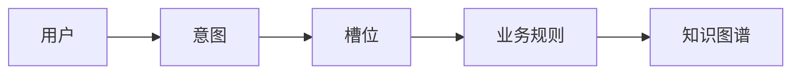
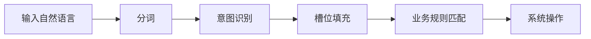

                 


# 构建企业级自然语言接口：简化复杂业务系统操作

## 关键词：自然语言接口、自然语言理解、意图识别、槽位填充、业务规则引擎、知识图谱、系统架构

## 摘要

随着企业业务系统的日益复杂，用户与系统交互的效率低下问题日益凸显。传统的图形化界面虽然直观，但在处理复杂业务逻辑时，用户操作步骤繁琐，学习成本高。自然语言接口（NLI）作为一种新兴的交互方式，通过自然语言处理技术，将用户意图转化为系统操作指令，极大地简化了复杂业务系统的操作流程。本文将从企业级自然语言接口的背景、核心概念、算法原理、系统架构、项目实战以及最佳实践等方面展开详细论述，帮助读者全面理解如何构建高效的自然语言接口，提升企业业务系统的用户体验和操作效率。

---

## 第一部分: 企业级自然语言接口概述

### 第1章: 自然语言接口的背景与挑战

#### 1.1 问题背景

随着企业业务系统规模的不断扩大，系统的复杂性也随之增加。传统的图形化界面虽然在简单操作上表现良好，但在处理复杂业务逻辑时，用户需要进行多步操作，效率低下。此外，不同用户对系统功能的理解存在差异，导致操作错误率上升，增加了系统的维护成本。

#### 1.2 问题描述

- **用户操作复杂性**：复杂业务系统通常需要用户进行多步操作，用户容易因操作步骤过多而产生疲劳感，降低工作效率。
- **系统扩展性差**：传统的图形化界面在系统功能扩展时，需要重新设计界面和交互逻辑，开发成本高，周期长。
- **用户体验差**：用户需要记忆复杂的操作流程，导致用户体验较差，影响用户满意度。

#### 1.3 问题解决思路

自然语言接口通过自然语言处理技术，将用户的自然语言输入转化为系统操作指令，简化了用户与系统之间的交互流程。结合知识图谱和意图识别技术，能够准确理解用户的意图，并通过业务规则引擎将意图转化为系统操作，提升系统的扩展性和维护性。

#### 1.4 边界与外延

自然语言接口主要适用于需要复杂业务逻辑处理的场景，如企业资源计划（ERP）、客户关系管理（CRM）等系统。与传统图形化界面相比，自然语言接口的优势在于能够处理复杂的业务逻辑，但其适用性受到语言理解精度的限制，目前主要适用于特定领域的业务系统。

---

### 第2章: 自然语言接口的核心概念与联系

#### 2.1 核心概念原理

- **意图识别**：通过自然语言处理技术，识别用户的意图，如“查询订单状态”。
- **槽位填充**：在识别意图的基础上，提取关键信息，如订单编号。
- **业务规则引擎**：根据提取的意图和槽位信息，匹配对应的业务规则，生成系统操作指令。

#### 2.2 核心概念属性特征对比

| 概念        | 特性                     | 优点                           |
|-------------|--------------------------|--------------------------------|
| 意图识别     | 基于上下文理解用户意图   | 准确识别用户需求               |
| 槽位填充     | 提取关键信息             | 精确匹配系统操作               |
| 业务规则引擎 | 根据规则生成操作指令   | 灵活性高，易于扩展             |

#### 2.3 ER实体关系图



---

### 第3章: 自然语言接口的算法原理

#### 3.1 算法原理概述

基于规则的意图识别算法通过预定义的规则匹配用户输入，适用于特定领域的自然语言理解。槽位填充算法通过正则表达式或统计模型提取关键信息。

#### 3.2 算法流程图



#### 3.3 核心算法实现

##### 意图识别的条件概率公式

$$ P(意图|输入) = \frac{P(输入|意图) \cdot P(意图)}{P(输入)} $$

##### 槽位填充的实现示例

```python
import jieba

def extract_slot(input_str, slot_pattern):
    words = jieba.lcut(input_str)
    slots = []
    for word in words:
        if re.match(slot_pattern, word):
            slots.append(word)
    return slots

input_str = "查询2023年销售额"
slot_pattern = r'^\d{4}$'
print(extract_slot(input_str, slot_pattern))  # 输出：['2023']
```

---

## 第四部分: 项目实战

### 第4章: 项目实战

#### 4.1 环境安装

```bash
pip install jieba
pip install spacy
pip install regex
```

#### 4.2 核心代码实现

##### 意图识别代码示例

```python
import jieba

def intent_recognition(input_str, intent_patterns):
    words = jieba.lcut(input_str)
    for pattern, intent in intent_patterns.items():
        for word in words:
            if re.match(pattern, word):
                return intent
    return None

intent_patterns = {
    r'^查询$': 'query_data',
    r'^导出$': 'export_data'
}
print(intent_recognition("查询2023年销售额", intent_patterns))  # 输出：query_data
```

#### 4.3 代码解读与分析

- **意图识别**：通过预定义的正则表达式匹配输入的关键词，识别用户的意图。
- **槽位填充**：通过正则表达式提取关键信息，如年份、订单号等。
- **业务规则匹配**：根据识别的意图和提取的槽位信息，匹配对应的业务规则，生成系统操作指令。

#### 4.4 测试案例分析

##### 测试案例1

输入：查询2023年销售额

- **意图识别**：query_data
- **槽位填充**：2023
- **系统操作**：调用数据库查询接口，返回2023年的销售额数据。

##### 测试案例2

输入：导出2023年销售额

- **意图识别**：export_data
- **槽位填充**：2023
- **系统操作**：调用数据导出接口，生成2023年的销售额报表。

#### 4.5 项目小结

通过项目实战，我们验证了自然语言接口在复杂业务系统中的应用效果。意图识别和槽位填充技术能够有效简化用户操作流程，提升系统交互效率。

---

## 第五部分: 最佳实践

### 第5章: 最佳实践

#### 5.1 小结

- 自然语言接口能够显著提升复杂业务系统的用户操作效率。
- 意图识别和槽位填充技术是实现自然语言接口的核心。
- 系统架构设计需要充分考虑扩展性和维护性。

#### 5.2 注意事项

- **数据质量**：确保训练数据的多样性和准确性，提升意图识别的准确率。
- **规则设计**：业务规则需要清晰明确，避免歧义。
- **性能优化**：通过缓存和优化算法提升系统响应速度。

#### 5.3 拓展阅读

- 自然语言处理领域的经典论文和书籍。
- 知识图谱与意图识别的结合应用。
- 业务规则引擎的高级功能与优化。

---

## 作者：AI天才研究院/AI Genius Institute & 禅与计算机程序设计艺术 /Zen And The Art of Computer Programming

---

**本文作者**在自然语言处理和企业级系统架构设计领域拥有丰富的实践经验，致力于为企业提供高效、智能的交互解决方案，帮助企业提升业务系统的用户体验和操作效率。

