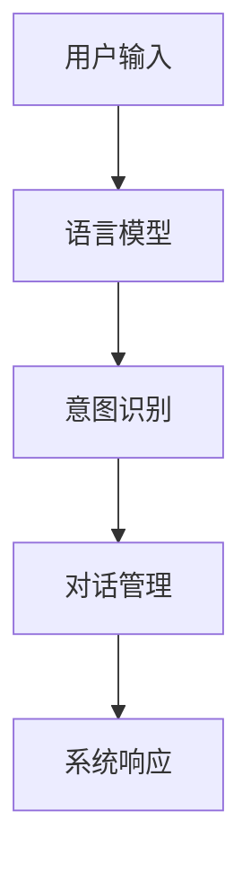
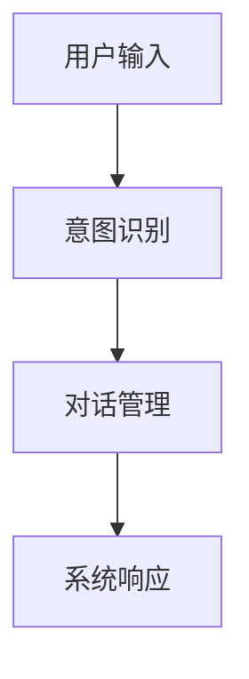

                 


# 构建企业级自然语言接口：简化复杂业务系统操作的智能层

## 关键词：自然语言处理，企业级应用，自然语言接口，意图识别，对话管理

## 摘要：  
本文详细探讨了如何构建企业级自然语言接口，以简化复杂业务系统操作。通过分析自然语言处理的核心概念、算法原理、系统架构设计及项目实战，本文为读者提供了从理论到实践的全面指导。结合实际案例和最佳实践，本文帮助技术从业者深入理解并成功实施自然语言接口技术，提升企业系统的智能化水平。

---

# 第一部分: 自然语言处理与企业级应用背景

## 第1章: 自然语言处理与企业级应用背景

### 1.1 自然语言处理的概述

#### 1.1.1 自然语言处理的定义与核心概念
自然语言处理（Natural Language Processing, NLP）是人工智能领域的重要分支，旨在让计算机能够理解、处理和生成人类语言。其核心概念包括：
- **语言模型**：用于理解和生成语言的数学模型，如词袋模型、TF-IDF、神经网络模型。
- **文本预处理**：包括分词、去停用词、词干提取等步骤。
- **特征提取**：将文本转化为可用于机器学习的特征向量，如词向量、TF-IDF向量。

#### 1.1.2 自然语言处理的发展历程
- **传统NLP**：基于规则的方法，如词性标注、句法分析。
- **统计NLP**：基于概率模型的方法，如朴素贝叶斯分类器。
- **深度学习NLP**：基于神经网络的方法，如RNN、LSTM、Transformer。

#### 1.1.3 自然语言接口在企业级应用中的重要性
- **提升用户体验**：通过自然语言输入简化操作，降低用户学习成本。
- **提高效率**：自动化处理复杂业务流程，减少人工干预。
- **扩展应用场景**：支持多种语言、多平台部署。

### 1.2 企业级应用的背景与挑战

#### 1.2.1 企业级应用的定义与特点
企业级应用是指为大型组织设计的软件系统，具有高可用性、高可靠性和可扩展性的特点。

#### 1.2.2 传统企业系统操作的复杂性
- **多步骤操作**：用户需要通过多个步骤完成任务，如登录、导航、输入数据。
- **复杂的用户界面**：传统系统通常依赖于图形用户界面（GUI），用户需要通过鼠标点击和菜单操作完成任务。

#### 1.2.3 自然语言接口在简化操作中的作用
- **降低操作复杂性**：用户可以通过自然语言输入完成任务，减少手动操作。
- **提高效率**：自然语言接口可以快速解析用户意图，减少用户操作步骤。

### 1.3 自然语言接口的重要性

#### 1.3.1 自然语言接口的定义与特点
自然语言接口（Natural Language Interface, NLI）是指允许用户通过自然语言与计算机系统交互的技术，具有以下特点：
- **易用性**：用户无需学习复杂的系统操作方法。
- **灵活性**：支持多种语言和表达方式。
- **智能化**：能够理解上下文和意图。

#### 1.3.2 自然语言接口在企业级系统中的应用场景
- **客服系统**：用户可以通过自然语言与客服系统交互，查询订单、解决问题。
- **企业管理系统**：用户可以通过自然语言查询销售数据、生成报告。
- **内部沟通工具**：员工可以通过自然语言与企业系统交互，提高沟通效率。

#### 1.3.3 自然语言接口的边界与外延
- **边界**：自然语言接口仅处理用户的语言输入，不涉及业务逻辑的执行。
- **外延**：自然语言接口可以与多种业务系统集成，支持复杂业务流程的自动化。

---

## 第2章: 自然语言处理的核心概念与联系

### 2.1 自然语言处理的核心概念

#### 2.1.1 语言模型
语言模型用于预测下一个词的概率，常用模型包括：
- **n-gram模型**：基于滑动窗口的统计模型。
- **循环神经网络（RNN）**：适合处理序列数据。
- **Transformer模型**：基于自注意力机制的模型。

#### 2.1.2 意图识别
意图识别是自然语言处理中的关键任务，用于确定用户的意图。常用算法包括：
- **基于规则的方法**：通过预定义的规则匹配用户输入。
- **基于机器学习的方法**：使用分类器（如SVM、随机森林）进行意图分类。
- **基于深度学习的方法**：使用神经网络（如CNN、RNN）进行意图分类。

#### 2.1.3 对话管理
对话管理用于维护对话状态，确保对话流畅。常用算法包括：
- **基于规则的对话管理**：通过预定义的规则控制对话流程。
- **基于模型的对话管理**：使用状态机或上下文表示法（如DFA）管理对话。

### 2.2 核心概念的联系与对比

#### 2.2.1 核心概念的联系
- **语言模型与意图识别**：语言模型为意图识别提供上下文信息。
- **意图识别与对话管理**：意图识别为对话管理提供用户意图信息。

#### 2.2.2 概念属性特征对比表格
| 概念       | 输入 | 输出 | 方法 |
|------------|------|------|------|
| 语言模型   | 文本 | 概率 | 统计/深度学习 |
| 意图识别   | 文本 | 意图 | 分类 |
| 对话管理   | 文本 | 状态 | 规则/模型 |

#### 2.2.3 实体关系图（ER图）



---

## 第3章: 自然语言处理算法原理

### 3.1 自然语言处理模型训练

#### 3.1.1 数据预处理
- **分词**：将文本分割成词语或短语。
- **去停用词**：去除常见的无意义词语（如“的”、“是”）。
- **词向量化**：将词语转化为向量表示（如Word2Vec、TF-IDF）。

#### 3.1.2 模型训练
- **监督学习**：使用标注数据训练模型。
- **无监督学习**：利用未标注数据进行自适应学习。
- **半监督学习**：结合标注和未标注数据进行训练。

#### 3.1.3 模型调优
- **超参数调整**：优化学习率、批次大小等参数。
- **正则化**：防止过拟合（如L1/L2正则化）。
- **集成学习**：结合多个模型的结果（如投票法、加权法）。

### 3.2 意图识别算法

#### 3.2.1 基于规则的意图识别
- **规则定义**：预定义关键词和短语。
- **匹配策略**：基于规则匹配用户输入，确定意图。

#### 3.2.2 基于机器学习的意图识别
- **特征提取**：提取文本特征（如TF-IDF、词袋模型）。
- **分类器训练**：使用SVM、随机森林等算法训练分类器。
- **分类器预测**：根据用户输入预测意图。

#### 3.2.3 基于深度学习的意图识别
- **模型选择**：使用RNN、LSTM、Transformer等模型。
- **训练数据**：使用标注数据训练模型。
- **预测结果**：根据模型输出预测意图。

### 3.3 对话管理算法

#### 3.3.1 基于规则的对话管理
- **规则定义**：预定义对话流程和状态转移。
- **状态管理**：根据用户输入和当前状态，决定下一步操作。

#### 3.3.2 基于模型的对话管理
- **模型选择**：使用有限状态机（DFA）或马尔可夫链模型。
- **状态转移**：根据用户意图和当前状态，自动管理对话流程。

#### 3.3.3 对话流程图



### 3.4 模型调优与优化

#### 3.4.1 超参数优化
- **网格搜索**：遍历所有可能的超参数组合，选择最优参数。
- **随机搜索**：随机选择超参数组合，减少计算量。

#### 3.4.2 正则化方法
- **L1正则化**：用于特征选择。
- **L2正则化**：用于防止过拟合。

#### 3.4.3 模型融合
- **投票法**：多数投票决定最终结果。
- **加权法**：根据模型性能分配权重。

---

## 第4章: 系统分析与架构设计

### 4.1 系统功能设计

#### 4.1.1 领域模型
- **领域模型定义**：定义系统的功能模块和数据模型。
- **领域模型示例**：


#### 4.1.2 系统架构设计
- **分层架构**：将系统分为表现层、业务逻辑层和数据访问层。
- **微服务架构**：将功能模块独立成服务，通过API进行通信。

#### 4.1.3 系统接口设计
- **输入接口**：接收用户输入的自然语言文本。
- **输出接口**：返回系统的自然语言响应。

#### 4.1.4 交互流程
- **用户输入**：用户通过自然语言输入请求。
- **语言模型处理**：语言模型解析用户输入。
- **意图识别**：识别用户的意图。
- **对话管理**：根据意图生成系统响应。
- **系统响应**：返回自然语言响应给用户。

### 4.2 系统架构设计

#### 4.2.1 系统架构图


#### 4.2.2 模块交互流程
- **用户输入**：用户输入自然语言文本。
- **语言模型处理**：语言模型解析文本，生成词向量。
- **意图识别**：意图识别模块根据词向量，分类用户的意图。
- **对话管理**：对话管理模块根据意图，生成系统响应。
- **系统响应**：系统返回自然语言响应给用户。

### 4.3 系统实现细节

#### 4.3.1 环境配置
- **操作系统**：建议使用Linux或macOS。
- **开发工具**：推荐使用PyCharm或VS Code。
- **依赖管理**：使用虚拟环境管理依赖包。

#### 4.3.2 代码实现

```python
import numpy as np
from sklearn.feature_extraction.text import TfidfVectorizer
from sklearn.svm import SVC

# 数据预处理
def preprocess(text):
    # 分词
    tokens = text.split()
    # 去停用词
    stop_words = set(['的', '是', '在'])
    filtered_tokens = [token for token in tokens if token not in stop_words]
    return ' '.join(filtered_tokens)

# 特征提取
vectorizer = TfidfVectorizer()
X = vectorizer.fit_transform(preprocessed_texts)

# 模型训练
model = SVC()
model.fit(X, labels)

# 模型预测
new_text = "查询订单状态"
preprocessed_new_text = preprocess(new_text)
new_X = vectorizer.transform([preprocessed_new_text])
predicted_label = model.predict(new_X)
```

---

## 第5章: 项目实战

### 5.1 项目介绍

#### 5.1.1 项目背景
- **项目目标**：构建一个企业级自然语言接口，简化业务系统操作。
- **项目范围**：支持多种语言，集成多个业务系统。

#### 5.1.2 项目团队
- **开发人员**：负责系统设计和实现。
- **测试人员**：负责测试和优化。
- **业务分析师**：负责需求分析和系统设计。

### 5.2 环境安装与配置

#### 5.2.1 安装Python
- **安装命令**：`python --version`
- **安装依赖**：`pip install numpy scikit-learn`

#### 5.2.2 安装开发工具
- **PyCharm**：从官网下载安装。
- **VS Code**：从官网下载安装，安装Python插件。

#### 5.2.3 安装NLP库
- **spaCy**：`pip install spacy`

### 5.3 系统核心实现

#### 5.3.1 预处理模块
- **代码实现**：

```python
import spacy

nlp = spacy.load("zh_core_web_sm")

def preprocess(text):
    doc = nlp(text)
    tokens = [token.text for token in doc]
    return ' '.join(tokens)
```

#### 5.3.2 意图识别模块
- **代码实现**：

```python
from sklearn.ensemble import RandomForestClassifier

vectorizer = TfidfVectorizer()
model = RandomForestClassifier()

# 训练数据
X = vectorizer.fit_transform(train_texts)
model.fit(X, train_labels)

# 预测意图
test_text = "查询订单状态"
test_X = vectorizer.transform([test_text])
predicted_label = model.predict(test_X)
```

#### 5.3.3 对话管理模块
- **代码实现**：

```python
from collections import defaultdict

# 状态机定义
state_machine = {
    'start': ['intent1', 'intent2'],
    'intent1': ['end'],
    'intent2': ['intent3', 'end']
}

def manage_dialogue(current_state, intent):
    next_states = state_machine[current_state]
    if intent in next_states:
        return intent
    else:
        return 'fallback'
```

### 5.4 案例分析与解读

#### 5.4.1 实际案例分析
- **案例背景**：构建一个客服系统的自然语言接口，支持用户查询订单状态。
- **案例实现**：用户输入“查询订单状态”，系统返回订单信息。

#### 5.4.2 案例解读
- **用户输入**：用户输入“查询订单状态”。
- **预处理**：分词、去停用词。
- **意图识别**：识别出用户意图是“查询订单状态”。
- **对话管理**：根据意图生成系统响应。
- **系统响应**：返回订单信息。

### 5.5 项目总结

#### 5.5.1 项目成果
- **成功实现了自然语言接口**。
- **提升了用户体验**。
- **简化了系统操作**。

#### 5.5.2 经验总结
- **数据质量**：高质量的数据是模型性能的关键。
- **模型调优**：需要不断优化模型参数。
- **系统集成**：需要与现有业务系统无缝集成。

---

## 第6章: 最佳实践与小结

### 6.1 核心概念回顾

#### 6.1.1 自然语言处理的核心概念
- **语言模型**：用于解析用户输入。
- **意图识别**：用于识别用户意图。
- **对话管理**：用于管理对话流程。

### 6.2 系统设计与实现要点

#### 6.2.1 系统设计
- **模块化设计**：将系统分为预处理、意图识别、对话管理模块。
- **可扩展性**：支持多种语言和业务系统。

#### 6.2.2 系统实现
- **代码规范**：遵循Python代码规范。
- **文档编写**：编写详细的系统文档。

### 6.3 项目实施中的注意事项

#### 6.3.1 数据质量
- **数据清洗**：确保数据干净、无噪声。
- **数据标注**：标注数据需要准确、一致。

#### 6.3.2 模型优化
- **超参数调整**：优化模型性能。
- **模型融合**：结合多个模型结果。

### 6.4 未来趋势与扩展阅读

#### 6.4.1 未来趋势
- **多模态NLP**：结合视觉和语言信息。
- **实时处理**：支持实时对话处理。

#### 6.4.2 扩展阅读
- **书籍推荐**：《自然语言处理实战：基于Python的机器学习和深度学习》。
- **技术博客**：关注前沿技术博客，了解最新动态。

---

## 作者：AI天才研究院 & 禅与计算机程序设计艺术

