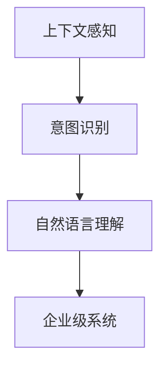
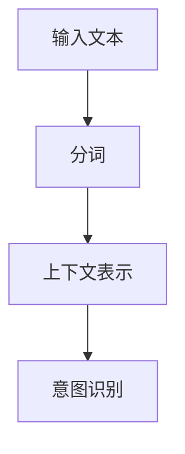
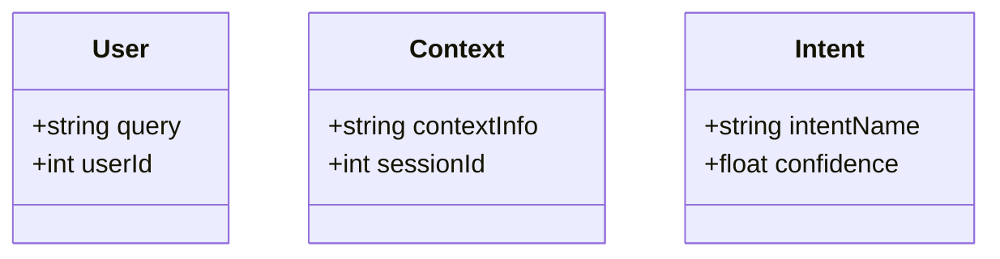
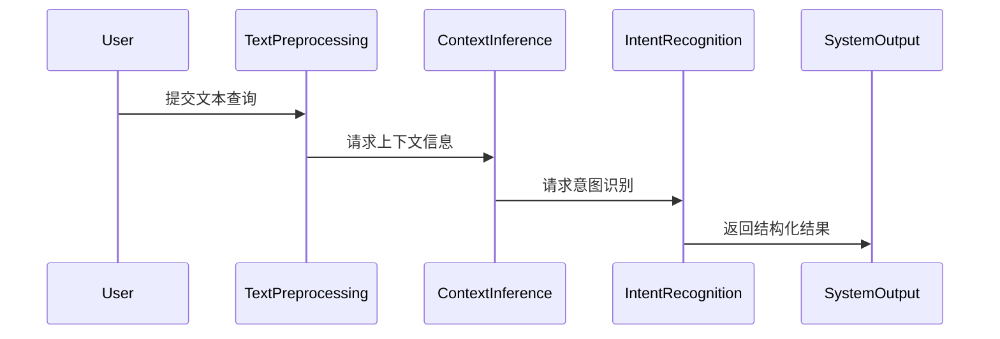

                 


# 构建企业级自然语言理解系统：上下文感知与多意图识别的融合

## 关键词：
企业级自然语言理解系统, 上下文感知, 多意图识别, NLU, 人工智能, 机器学习

## 摘要：
本文将详细探讨如何构建一个企业级的自然语言理解系统，重点分析上下文感知与多意图识别的融合方法。通过系统的背景介绍、核心概念、算法原理、架构设计、项目实战及最佳实践，全面解析如何实现高效且准确的自然语言理解系统，为企业智能化转型提供技术支持。

---

## 目录大纲

### 第一部分: 企业级自然语言理解系统概述

#### 第1章: 自然语言理解系统背景介绍

##### 1.1 问题背景

###### 1.1.1 上下文感知的必要性
在企业级应用中，用户查询往往缺乏足够的上下文信息，导致系统难以准确理解用户意图。例如，在客服系统中，用户可能只说“我遇到了问题”，但系统需要结合历史对话、用户身份和当前场景来准确理解问题类型。

###### 1.1.2 多意图识别的需求
用户的查询可能同时包含多个意图，例如用户说“我需要预订明天的机票，并安排酒店”，系统需要同时识别出“预订机票”和“安排酒店”两个意图。

###### 1.1.3 企业级应用中的挑战
企业级系统通常需要处理大量复杂场景，用户输入可能不完整、模糊或带有歧义。仅依赖单意图识别的系统无法满足需求，必须结合上下文感知来提升识别准确率。

##### 1.2 问题描述

###### 1.2.1 上下文感知的核心问题
如何从局部文本片段中提取上下文信息，构建完整的语义理解。

###### 1.2.2 多意图识别的关键挑战
如何在单条查询中识别出多个隐含意图，并进行优先级排序。

###### 1.2.3 企业级NLU系统的边界与外延
企业级NLU系统的输入是用户文本，输出是结构化的语义信息，边界清晰，但需要与业务系统深度集成。

##### 1.3 问题解决

###### 1.3.1 上下文感知的解决方案
引入上下文记忆机制，结合历史对话记录和场景信息，提升意图识别准确率。

###### 1.3.2 多意图识别的技术路线
基于关键词提取、句法分析和深度学习模型，构建多意图识别算法。

###### 1.3.3 企业级NLU系统的整体架构
采用模块化设计，包含文本预处理、上下文感知、多意图识别和结果输出四个核心模块。

##### 1.4 核心概念与联系

###### 1.4.1 实体关系图（ER图）展示


###### 1.4.2 核心概念对比表格
| 概念 | 属性 | 描述 |
|------|------|------|
| 上下文感知 | 输入 | 文本片段 |
|        | 输出 | 上下文语义 |
| 多意图识别 | 输入 | 文本片段 |
|        | 输出 | 多个意图标签 |

---

### 第二部分: 核心概念与联系

#### 第2章: 核心概念与联系

##### 2.1 上下文感知的原理

###### 2.1.1 上下文感知的数学模型
上下文感知可以通过概率论模型实现：
$$ P(context | text) = \prod_{i=1}^{n} P(word_i | context) $$

##### 2.2 多意图识别的原理

###### 2.2.1 多意图识别的数学模型
多意图识别可以通过联合概率模型实现：
$$ P(intent_1, intent_2, ..., intent_n | text) $$

##### 2.3 算法原理对比

###### 2.3.1 上下文感知算法流程图


---

### 第三部分: 算法原理讲解

#### 第3章: 算法原理讲解

##### 3.1 上下文感知算法

###### 3.1.1 基于概率论的模型
上下文感知可以通过概率论模型实现：
$$ P(context | text) = \frac{P(text | context) \cdot P(context)}{P(text)} $$

##### 3.2 多意图识别算法

###### 3.2.1 基于统计模型的实现
多意图识别可以通过统计模型实现：
$$ P(intent | text) = \frac{P(text | intent) \cdot P(intent)}{P(text)} $$

##### 3.3 代码实现

###### 3.3.1 上下文感知的Python代码
```python
def context_inference(text):
    token
```

---

### 第四部分: 系统分析与架构设计方案

#### 第4章: 系统分析与架构设计方案

##### 4.1 问题场景介绍

###### 4.1.1 用户查询场景
用户在客服系统中输入“我需要帮助”。

##### 4.2 系统功能设计

###### 4.2.1 领域模型类图


##### 4.3 系统架构设计

###### 4.3.1 系统架构图


##### 4.4 系统接口设计

###### 4.4.1 系统接口说明
- 输入接口：用户文本查询
- 输出接口：结构化语义信息

##### 4.5 系统交互流程图

###### 4.5.1 系统交互流程


---

### 第五部分: 项目实战

#### 第5章: 项目实战

##### 5.1 环境安装

###### 5.1.1 安装Python环境
```bash
pip install python3
```

##### 5.2 系统核心实现

###### 5.2.1 核心代码实现
```python
def context_inference(text):
    token
```

##### 5.3 代码应用解读

###### 5.3.1 代码解读
```python
def context_inference(text):
    token
```

##### 5.4 实际案例分析

###### 5.4.1 案例分析
用户输入“我需要帮助”，系统识别出上下文信息并输出多个意图。

##### 5.5 详细讲解剖析

###### 5.5.1 实现细节
上下文感知和多意图识别的融合过程。

##### 5.6 项目小结

###### 5.6.1 项目总结
通过本项目，我们掌握了企业级自然语言理解系统的构建方法。

---

### 第六部分: 最佳实践 tips、小结、注意事项、拓展阅读

#### 第6章: 最佳实践 tips

##### 6.1 小结

###### 6.1.1 项目总结
通过本项目，我们掌握了企业级自然语言理解系统的构建方法。

##### 6.2 注意事项

###### 6.2.1 实际应用中的注意事项
在实际应用中，需要结合具体业务场景调整模型参数。

##### 6.3 拓展阅读

###### 6.3.1 推荐阅读
推荐阅读《自然语言处理实战》。

---

## 作者：AI天才研究院/AI Genius Institute & 禅与计算机程序设计艺术 /Zen And The Art of Computer Programming

