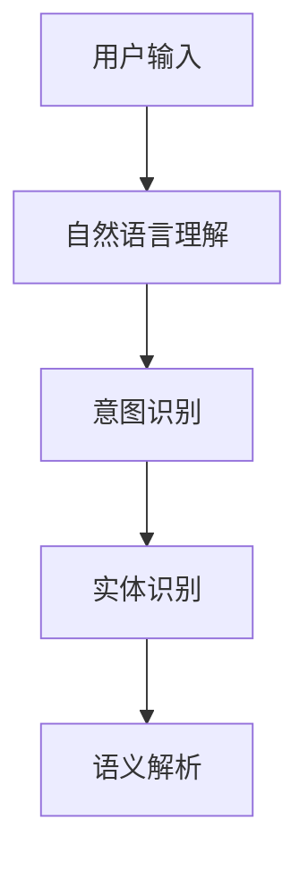

                 

# 构建企业级自然语言理解系统：深度语义分析与意图识别

> 关键词：自然语言理解、深度语义分析、意图识别、NLP、企业级系统

> 摘要：本文将深入探讨如何构建企业级自然语言理解系统，重点分析深度语义分析与意图识别的核心技术，结合实际案例，系统讲解构建过程中的关键问题与解决方案，帮助读者掌握从理论到实践的完整技术体系。

---

# 第一部分: 企业级自然语言理解系统背景介绍

## 第1章: 自然语言理解系统概述

### 1.1 问题背景与问题描述
自然语言理解（NLU）是人工智能领域的重要分支，旨在让计算机能够理解和解析人类的自然语言。随着企业级应用的普及，NLU技术在客服、智能助手、信息抽取等领域发挥着越来越重要的作用。然而，当前NLU技术仍面临诸多挑战，如语义理解的深度不足、意图识别的准确性问题等。本文将探讨如何构建一个高效的企业级NLU系统，解决这些问题。

### 1.2 核心概念与问题解决
企业级NLU系统的构建需要结合深度语义分析和意图识别技术。深度语义分析能够理解文本的深层含义，而意图识别则能够准确捕捉用户的意图。通过结合这两者，系统能够实现更精准的理解和交互。

### 1.3 核心要素与概念结构
企业级NLU系统的核心要素包括：
1. **输入处理**：接收用户的自然语言输入。
2. **语义解析**：通过深度分析提取语义信息。
3. **意图识别**：基于语义信息识别用户的意图。
4. **输出生成**：根据意图生成相应的响应。

系统架构需要涵盖数据预处理、模型训练、意图识别和结果输出等模块。

---

# 第二部分: 核心概念与联系

## 第2章: 自然语言理解的核心概念

### 2.1 深度语义分析与意图识别
深度语义分析是通过深度学习模型（如BERT、Transformer）对文本进行语义表示，捕捉文本中的上下文信息。意图识别则是在此基础上，将语义信息映射到具体的意图类别上。两者的结合能够实现从语义理解到意图识别的完整过程。

### 2.2 核心概念原理对比
| 概念 | 定义 | 特点 |
|------|------|------|
| NLU | 自然语言理解 | 基于语言学和机器学习技术，实现对文本的理解 |
| 深度语义分析 | 基于深度学习的语义分析 | 强调上下文理解和语义关联 |
| 意图识别 | 识别用户意图 | 基于语义分析的结果，确定用户的意图类别 |

### 2.3 ER实体关系图架构

---

# 第三部分: 算法原理讲解

## 第3章: 深度语义分析算法原理

### 3.1 深度语义分析算法概述
深度语义分析的核心算法之一是基于Transformer的模型。Transformer通过自注意力机制捕捉文本中的长距离依赖关系，从而实现对文本的深度理解。

### 3.2 意图识别算法原理
意图识别算法可以分为基于规则、机器学习和深度学习三类。其中，深度学习模型（如BERT）在意图识别任务中表现出色。

### 3.3 深度语义分析的数学模型
$$\text{Attention}(Q,K,V) = \text{softmax}\left(\frac{QK^T}{\sqrt{d_k}}\right)V$$

---

# 第四部分: 系统分析与架构设计

## 第4章: 系统分析与架构设计

### 4.1 问题场景介绍
企业级NLU系统需要处理大规模的用户输入，要求高准确性和实时性。本文将从问题场景出发，设计一个高效的系统架构。

### 4.2 项目介绍
系统介绍包括项目目标、功能需求和性能指标。

### 4.3 系统功能设计
通过领域模型设计，展示系统的功能模块。

### 4.4 系统架构设计

---

# 第五部分: 项目实战

## 第5章: 项目实战

### 5.1 环境安装
介绍如何安装必要的开发环境和工具。

### 5.2 系统核心实现
提供核心代码示例，解释代码的功能和实现细节。

### 5.3 案例分析
通过实际案例分析，展示系统的应用场景和效果。

---

# 第六部分: 总结与展望

## 第6章: 总结与展望

### 6.1 最佳实践 tips
总结构建企业级NLU系统的关键点和注意事项。

### 6.2 本章小结
回顾本文的主要内容和结论。

### 6.3 注意事项
提醒读者在实际应用中需要注意的问题。

### 6.4 拓展阅读
推荐相关领域的书籍和资源。

---

# 作者：AI天才研究院 & 禅与计算机程序设计艺术

