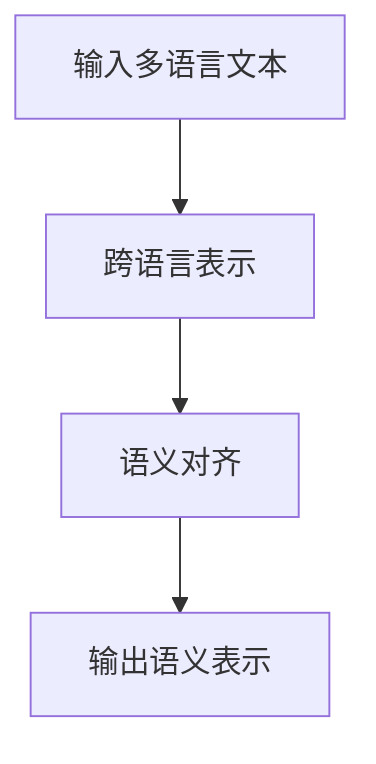
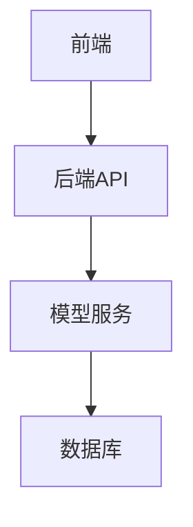
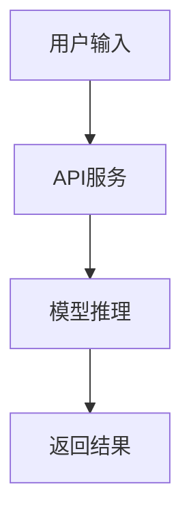

                 


# 构建企业级自然语言理解系统：跨语言语义理解与意图识别

## 关键词：自然语言理解，跨语言，意图识别，机器学习，企业级系统

## 摘要：本文详细探讨构建企业级自然语言理解系统的跨语言语义理解和意图识别技术。从核心概念到算法实现，从系统架构到项目实战，结合实际案例和最佳实践，深入剖析技术细节和应用方案。

---

## 第1章: 自然语言理解与企业应用

### 1.1 自然语言理解的核心概念

#### 1.1.1 自然语言理解的定义
自然语言理解（Natural Language Understanding, NLU）是人工智能领域的核心任务，旨在使计算机能够理解人类语言的语义和意图。NLU不仅涉及语法分析，还需捕捉上下文、情感和意图等信息。

#### 1.1.2 企业级NLU的应用场景
在企业环境中，NLU广泛应用于客服系统、智能助手、文档处理等领域。例如，银行通过NLU分析客户查询，提供个性化的服务；企业利用NLU处理多语言文档，提升跨文化沟通效率。

#### 1.1.3 跨语言语义理解的重要性
随着全球化进程，企业需要处理多语言数据。跨语言语义理解技术能够统一不同语言的语义表示，支持多语言场景下的意图识别，帮助企业实现全球化的业务覆盖。

### 1.2 问题背景与挑战

#### 1.2.1 传统NLU的局限性
传统NLU方法依赖于规则或浅层特征，难以处理复杂语义和上下文信息。此外，单语言模型难以扩展到多语言场景，限制了其应用范围。

#### 1.2.2 跨语言处理的难点
跨语言语义理解面临语言差异大、数据稀缺性等问题。不同语言的语法结构和语义表达差异使得跨语言对齐困难，需要复杂的特征提取和模型调优。

#### 1.2.3 意图识别在企业中的需求
企业需要准确识别用户意图，以提供高效服务。错误的意图识别可能导致用户体验下降或业务损失，因此在企业级系统中，意图识别的准确性和可靠性至关重要。

### 1.3 问题描述与解决方案

#### 1.3.1 问题背景分析
企业级NLU系统需支持多语言、多场景下的意图识别，同时具备高准确率和可扩展性。传统方法在性能和扩展性上存在不足，难以满足复杂需求。

#### 1.3.2 问题解决的思路
采用深度学习技术，构建跨语言预训练模型，通过模型微调和数据增强提升性能。结合领域知识，优化意图分类器，确保在企业场景中的准确性。

#### 1.3.3 边界与外延
企业级NLU系统的边界包括输入文本、模型服务和意图输出，外延则涉及数据预处理、模型部署和结果解释等环节。

### 1.4 核心概念与联系

#### 1.4.1 核心概念原理
NLU涉及文本处理、特征提取和语义理解。跨语言处理需要对齐不同语言的语义表示，意图识别则基于语义分析结果进行分类。

#### 1.4.2 概念属性特征对比
以下表格对比了NLU、跨语言处理和意图识别的关键特征：

| 特征维度 | NLU | 跨语言处理 | 意图识别 |
|----------|-----|------------|----------|
| 输入形式 | 文本 | 多语言文本 | 文本+语义 |
| 输出形式 | 语义表示 | 跨语言表示 | 意图标签 |
| 核心任务 | 语义分析 | 语义对齐 | 分类意图 |

#### 1.4.3 ER实体关系图
ER图展示核心实体及其关系：

```mermaid
entity User: id, name, language
entity Intent: id, name, description
entity Text: id, content, language
```

---

## 第2章: 跨语言语义理解的原理与技术

### 2.1 跨语言语义理解的原理

#### 2.1.1 跨语言表示学习
通过预训练模型，如多语言BERT，生成统一的语义表示。表示学习捕捉文本的语义信息，支持跨语言理解。

#### 2.1.2 跨语言句法分析
分析不同语言的句法结构，提取通用语法特征，为语义理解提供基础。

#### 2.1.3 跨语言语义对齐
基于跨语言表示，对齐不同语言的语义信息，构建统一的语义空间。

### 2.2 跨语言技术的核心算法

#### 2.2.1 使用Mermaid展示算法流程图
以下流程图展示跨语言语义理解的处理流程：



#### 2.2.2 跨语言表示学习的数学模型
跨语言表示学习采用多任务学习，目标函数包括跨语言对齐损失和语义分类损失：

$$L = \lambda_1 L_{align} + \lambda_2 L_{class}$$

其中，$\lambda_1$和$\lambda_2$是平衡系数，$L_{align}$是跨语言对齐损失，$L_{class}$是意图分类损失。

### 2.3 意图识别的数学模型

#### 2.3.1 概率论基础
意图识别基于条件概率模型，计算给定文本属于某一意图的概率：

$$P(y|x) = \frac{P(x|y)P(y)}{P(x)}$$

其中，$y$是意图标签，$x$是输入文本。

#### 2.3.2 优化算法
采用基于梯度的优化算法，如Adam优化器，最小化损失函数：

$$\text{损失函数} = -\sum_{i=1}^{n} \log P(y_i|x_i)$$

---

## 第3章: 企业级NLU系统的算法实现

### 3.1 算法原理

#### 3.1.1 基于预训练模型的NLU
使用预训练的多语言模型，如mBERT，进行微调，提升在特定领域的表现。

#### 3.1.2 模型微调与适配
根据企业需求，微调预训练模型，优化意图分类器，适应特定场景。

### 3.2 算法实现

#### 3.2.1 使用Python实现意图识别
以下代码示例展示意图识别的实现：

```python
def predict_intent(model, input_text):
    # 输入文本处理
    inputs = tokenizer(input_text, return_tensors='np')
    # 模型推理
    outputs = model(**inputs)
    # 获取预测结果
    intent = outputs.logits.argmax(dim=-1).item()
    return intent_labels[intent]
```

#### 3.2.2 模型优化与部署
使用模型压缩技术和容器化部署，确保模型在企业环境中的高效运行。

### 3.3 算法优化

#### 3.3.1 跨语言数据增强
通过数据增强技术，扩展训练数据，提升模型的泛化能力。

#### 3.3.2 模型压缩与部署
采用模型蒸馏和剪枝技术，压缩模型大小，降低计算成本。

---

## 第4章: 系统架构与设计

### 4.1 系统架构设计

#### 4.1.1 系统功能模块划分
系统主要模块包括文本预处理、跨语言表示、意图识别和结果解释。

#### 4.1.2 系统架构图
以下架构图展示企业级NLU系统的整体结构：



### 4.2 系统接口设计

#### 4.2.1 输入接口
接收多语言文本输入，支持JSON格式数据。

#### 4.2.2 输出接口
返回意图标签和置信度分数，便于系统调用和处理。

### 4.3 系统交互设计

#### 4.3.1 使用Mermaid展示交互流程图
以下流程图展示系统交互过程：



---

## 第5章: 项目实战

### 5.1 项目介绍

#### 5.1.1 项目背景
构建一个支持多语言的客服系统，提升客户体验和业务效率。

### 5.2 系统核心实现

#### 5.2.1 环境安装
安装必要的库和工具：

```bash
pip install transformers torch numpy
```

#### 5.2.2 核心代码实现
实现意图识别的主函数：

```python
def main():
    model = load_model()
    while True:
        input_text = input("请输入文本：")
        intent = predict_intent(model, input_text)
        print(f"识别的意图：{intent}")
```

#### 5.2.3 代码解读
详细解读代码结构和功能，确保读者能够理解和修改代码。

### 5.3 案例分析

#### 5.3.1 实际案例
分析一个跨语言意图识别的案例，展示系统的实际应用。

### 5.4 项目小结

#### 5.4.1 经验总结
分享项目中的经验教训，优化建议和未来改进方向。

---

## 第6章: 最佳实践与总结

### 6.1 最佳实践

#### 6.1.1 数据准备
确保数据多样性，涵盖多种语言和意图场景。

#### 6.1.2 模型选择
根据任务需求选择合适的模型，并进行充分的调优。

### 6.2 小结

#### 6.2.1 企业级NLU的核心要点
强调跨语言处理和意图识别的重要性，确保系统在复杂场景中的稳定性和准确性。

### 6.3 注意事项

#### 6.3.1 模型部署
关注模型的计算效率和资源占用，确保在企业环境中的稳定运行。

### 6.4 拓展阅读

#### 6.4.1 推荐学习资料
推荐相关书籍和技术博客，帮助读者深入学习。

---

## 作者：AI天才研究院/AI Genius Institute & 禅与计算机程序设计艺术 /Zen And The Art of Computer Programming

