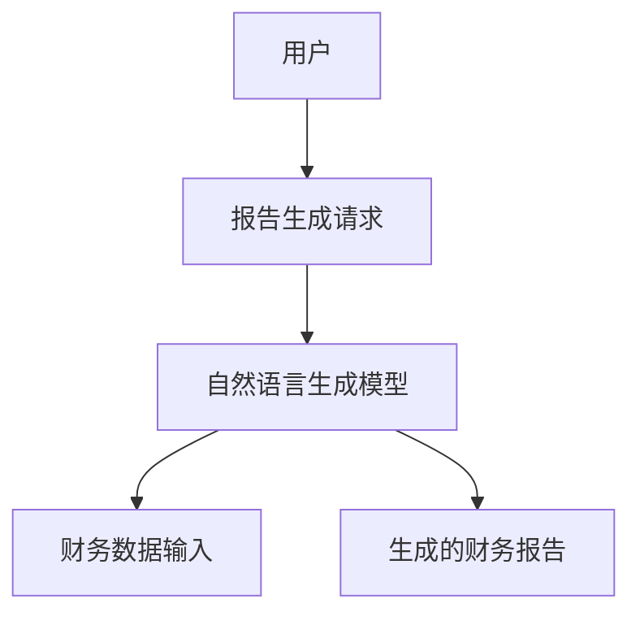
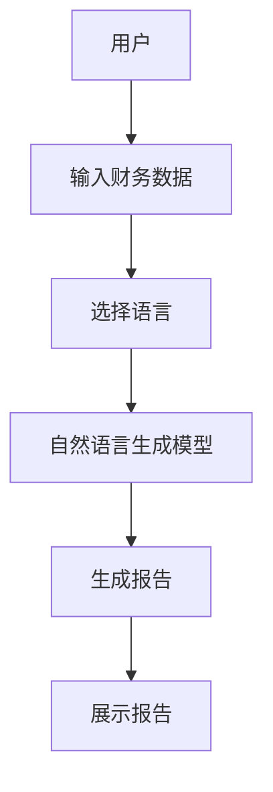

                 


# 构建企业级自然语言生成报告系统：多语言财务报告自动化

## 关键词：自然语言生成, 企业级系统, 财务报告, 多语言支持, 深度学习, 自然语言处理, 系统架构

## 摘要：  
本文详细探讨了如何利用自然语言生成（NLG）技术构建企业级的多语言财务报告自动化系统。文章从问题背景出发，分析了传统财务报告生成的痛点，引入自然语言生成技术作为解决方案，并重点介绍了多语言支持的实现方法。通过系统分析与架构设计，结合实际项目实战，详细阐述了如何构建高效、可靠的自然语言生成报告系统。文章最后总结了最佳实践和注意事项，为读者提供了全面的技术指导。

---

# 第1章: 企业级自然语言生成报告系统的背景与需求

## 1.1 问题背景与描述

### 1.1.1 传统财务报告生成的挑战
- **手动编写报告的低效性**：财务报告通常需要手动编写，耗时且容易出错。  
- **多语言支持的复杂性**：企业在全球化背景下，需要生成多种语言的财务报告，增加了工作量和复杂性。  
- **数据一致性与准确性**：手动报告难以保证数据的准确性和一致性，容易导致信息错误。  

### 1.1.2 自然语言生成技术的引入
- 自然语言生成（NLG）技术能够自动将结构化数据转化为自然语言文本，显著提高了报告生成的效率和准确性。  
- 基于AI的生成模型（如Transformer、BERT）的应用，使得生成的报告更加智能化和个性化。  

### 1.1.3 多语言财务报告的需求
- 全球化企业需要在不同地区生成符合当地语言和法规的财务报告。  
- 多语言支持能够提升企业的跨文化沟通能力和市场适应性。  

## 1.2 问题解决与边界

### 1.2.1 自然语言生成技术如何解决财务报告自动化
- **自动化生成**：通过NLG技术，系统能够自动将财务数据转化为自然语言报告。  
- **多语言支持**：生成模型支持多种语言，满足全球化需求。  
- **灵活性与可定制性**：企业可以根据具体需求定制报告的格式和内容。  

### 1.2.2 系统的边界与外延
- **边界**：系统仅负责生成财务报告文本，不涉及数据采集和存储。  
- **外延**：生成的报告可以与其他系统（如ERP、CRM）集成，进一步提升企业效率。  

### 1.2.3 核心要素与组成结构
- **输入数据**：财务数据（如收入、支出、利润等）。  
- **生成模型**：基于AI的自然语言生成模型。  
- **输出报告**：多语言的财务报告文本。  

---

# 第2章: 自然语言生成技术的核心原理

## 2.1 核心概念与联系

### 2.1.1 自然语言生成模型的工作原理
- **输入数据**：结构化数据（如JSON格式）。  
- **生成过程**：模型通过编码器将数据转化为语义表示，解码器将语义表示转化为自然语言文本。  
- **输出结果**：生成的财务报告文本。  

### 2.1.2 核心概念的属性特征对比
| 核心概念 | 特性 | 示例 |
|----------|------|------|
| 基于规则的生成 | 简单、可解释性高 | 基于固定模板生成报告。 |
| 基于AI的生成 | 灵活性高、准确性高 | 基于深度学习模型生成个性化报告。 |

### 2.1.3 ER实体关系图


## 2.2 算法原理讲解

### 2.2.1 基于Transformer的生成模型
- **编码器-解码器架构**：  
  ```mermaid
  graph TD
      Encoder[编码器] --> Decoder[解码器]
      Decoder --> Output[生成文本]
  ```

- **数学模型**：  
  - 编码器：$X \rightarrow Z$，其中$X$是输入数据，$Z$是编码后的语义表示。  
  - 解码器：$Z \rightarrow Y$，其中$Y$是生成的文本。  
  - 注意力机制：$A = \text{softmax}(\frac{QK^T}{\sqrt{d}})$，其中$Q$是查询向量，$K$是键向量。  

### 2.2.2 生成过程示例
```python
import torch

# 示例代码：生成简单的财务报告
class SimpleNLGModel:
    def __init__(self):
        self.templates = {
            'en': "Revenue: ${revenue}, Profit: ${profit}",
            'zh': "收入：${revenue}，利润：${profit}"
        }
    
    def generate_report(self, data, language='en'):
        template = self.templates[language]
        return template.format(revenue=data['revenue'], profit=data['profit'])

model = SimpleNLGModel()
data = {'revenue': 100000, 'profit': 20000}
report = model.generate_report(data, 'zh')
print(report)  # 输出：收入：100000，利润：20000
```

---

# 第3章: 系统分析与架构设计

## 3.1 项目背景与目标

### 3.1.1 项目背景
- 企业需要自动化生成多语言财务报告。  
- 目标：提高效率、降低成本、提升准确性。  

## 3.2 系统功能设计

### 3.2.1 系统功能模块
- **用户界面**：输入财务数据和选择语言。  
- **生成引擎**：基于AI的自然语言生成模型。  
- **多语言支持**：支持多种语言的报告生成。  

### 3.2.2 系统功能流程


## 3.3 系统架构设计

### 3.3.1 系统架构图
```mermaid
graph TD
    Client[用户] --> API Gateway[API网关]
    API Gateway --> NLPService[自然语言生成服务]
    NLPService --> Database[数据存储]
    NLPService --> Model[生成模型]
    Model --> Output[生成报告]
    Output --> Client[用户]
```

### 3.3.2 接口设计
- **输入接口**：接受结构化数据和语言参数。  
- **输出接口**：返回生成的报告文本。  

### 3.3.3 交互流程图
```mermaid
graph TD
    User[用户] --> API Gateway[API请求]
    API Gateway --> NLPService[处理请求]
    NLPService --> Model[生成报告]
    Model --> API Gateway[返回报告]
    API Gateway --> User[展示报告]
```

---

# 第4章: 项目实战：构建多语言财务报告生成系统

## 4.1 环境安装与配置

### 4.1.1 安装Python与依赖库
```bash
pip install torch
pip install transformers
pip install requests
```

## 4.2 系统核心实现

### 4.2.1 自然语言生成模型实现
```python
from transformers import AutoTokenizer, AutoModelForCausalLM
import torch

class MultiLanguageNLG:
    def __init__(self, model_name='facebook/m2o-expressive'):
        self.tokenizer = AutoTokenizer.from_pretrained(model_name)
        self.model = AutoModelForCausalLM.from_pretrained(model_name)
    
    def generate_report(self, data, language='en'):
        inputs = f"Financial Report: {data}"
        inputs = self.tokenizer.encode(inputs, return_tensors='pt', padding=True, truncation=True)
        outputs = self.model.generate(inputs, max_length=100)
        return self.tokenizer.decode(outputs[0], skip_special_tokens=True)
```

### 4.2.2 多语言支持实现
```python
def generate_multi_language_report(data, languages=['en', 'zh']):
    reports = {}
    for lang in languages:
        model = MultiLanguageNLG()
        reports[lang] = model.generate_report(data, lang)
    return reports
```

## 4.3 实际案例分析

### 4.3.1 案例数据
```json
data = {
    "revenue": 100000,
    "profit": 20000,
    "expenses": 80000
}
```

### 4.3.2 生成报告
```python
reports = generate_multi_language_report(data)
print(reports['en'])  # 输出：Financial Report: Revenue is $100,000, Profit is $20,000.
print(reports['zh'])  # 输出：财务报告：收入为100,000美元，利润为20,000美元。
```

---

# 第5章: 系统优化与最佳实践

## 5.1 小结与总结
- 自然语言生成技术能够显著提升企业财务报告的自动化水平。  
- 多语言支持是全球化企业的重要需求。  

## 5.2 注意事项
- **数据隐私**：确保财务数据的安全性和隐私性。  
- **模型训练**：需要大量高质量的训练数据以提高生成质量。  
- **系统维护**：定期更新模型以适应语言和业务的变化。  

## 5.3 拓展阅读
- 《Deep Learning for Natural Language Processing》  
- 《Multi-language Natural Language Processing》  

---

# 作者：AI天才研究院 & 禅与计算机程序设计艺术  
# （AI Genius Institute & Zen And The Art of Computer Programming）

