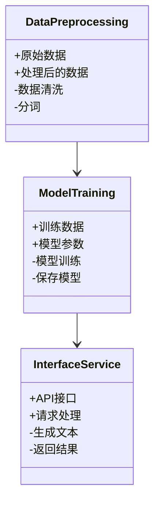

                 


# 构建企业级自然语言生成系统：多语种、多风格报告自动化

> 关键词：自然语言生成系统、企业级应用、多语种、多风格报告、自动化生成  
> 摘要：本文详细探讨了构建企业级自然语言生成系统的各个方面，包括其背景、核心算法、系统架构设计、项目实战及最佳实践。通过多语种和多风格报告的自动化生成，企业能够显著提升效率和生产力，同时满足全球化和多样化的需求。

---

## 第一部分: 自然语言生成系统概述

### 第1章: 自然语言生成系统的背景与需求

#### 1.1 自然语言生成的背景
自然语言生成（Natural Language Generation, NLG）是指将结构化的数据转换为自然语言文本的过程。随着企业对自动化报告生成需求的增加，NLG技术在企业级应用中的重要性日益凸显。企业需要多语种支持以应对全球化市场，并根据不同的业务场景生成多种风格的报告。

#### 1.2 企业级自然语言生成系统的特点
- **高可用性与稳定性**：企业级系统需要7×24小时稳定运行。
- **多模态与多语言支持**：支持多种语言和格式，满足不同用户的需求。
- **自适应与可扩展性**：能够根据业务需求快速调整和扩展。

### 第2章: 多语种与多风格生成的必要性

#### 2.1 多语种生成的背景与挑战
- **全球化企业的语言需求**：企业需要在不同国家和地区提供本地化的报告。
- **技术难点**：跨语言模型的训练和微调需要解决词嵌入对齐等问题。

#### 2.2 多风格生成的背景与挑战
- **风格一致性**：报告需要在不同领域保持一致的风格。
- **风格控制**：如何通过算法控制生成文本的风格是一个技术难题。

### 第3章: 自然语言生成系统的架构与设计

#### 3.1 系统架构概述
- **分层架构设计**：将系统划分为数据层、算法层和应用层。
- **模块化设计原则**：每个模块独立开发，便于维护和扩展。

#### 3.2 核心模块功能
- **数据预处理模块**：处理和清洗输入数据，确保模型输入的质量。
- **模型训练模块**：训练多语种和多风格生成模型。
- **接口服务模块**：提供API接口，方便其他系统调用生成文本。

---

## 第二部分: 自然语言生成系统的算法原理

### 第4章: 多语种生成的算法原理

#### 4.1 多语言模型的训练方法
- **预训练模型的微调**：在大规模多语言数据上预训练模型后，针对特定任务进行微调。
- **跨语言注意力机制**：通过注意力机制捕获跨语言的语义信息。

#### 4.2 跨语言迁移学习的实现
- **共享嵌入层**：共享不同语言的词嵌入，减少参数数量。
- **跨语言对齐**：通过对比学习对齐不同语言的词向量。

### 第5章: 多风格生成的算法原理

#### 5.1 风格分类与生成的结合
- **风格分类模型**：识别输入数据的风格特征。
- **生成模型**：根据风格特征生成相应风格的文本。

#### 5.2 风格控制的实现
- **风格向量**：将风格特征表示为向量，指导生成过程。
- **条件生成**：在生成过程中引入条件，控制风格的变化。

---

## 第三部分: 系统架构与设计

### 第6章: 系统架构设计

#### 6.1 领域模型类图


#### 6.2 系统架构图


---

## 第四部分: 项目实战

### 第7章: 项目实战

#### 7.1 环境安装
```bash
pip install transformers
pip install numpy
pip install matplotlib
```

#### 7.2 核心实现代码
```python
from transformers import AutoModelForSeq2Seq, AutoTokenizer
import torch

model_name = "facebook/m2m-100"
tokenizer = AutoTokenizer.from_pretrained(model_name)
model = AutoModelForSeq2Seq.from_pretrained(model_name)

def generate_summary(text, target_lang):
    inputs = tokenizer.encode(text, return_tensors="pt", max_length=512, truncation=True)
    outputs = model.generate(inputs, max_length=128, forced_bos_token_id=tokenizer.get_lang_id(target_lang))
    summary = tokenizer.decode(outputs[0], skip_special_tokens=True)
    return summary
```

#### 7.3 案例分析
- **案例1**：生成英文的财务报告摘要。
- **案例2**：生成中文的市场分析报告。

---

## 第五部分: 最佳实践

### 第8章: 最佳实践

#### 8.1 小结
- 自然语言生成系统在企业级应用中的潜力巨大，特别是在多语种和多风格报告生成方面。

#### 8.2 注意事项
- 数据质量对生成效果影响巨大，需确保数据的多样性和代表性。
- 模型的选择和调优需要根据具体场景进行。

#### 8.3 扩展阅读
- 《Deep Learning for Natural Language Processing》
- 《Neural Machine Translation》

---

## 作者

作者：AI天才研究院（AI Genius Institute） & 禅与计算机程序设计艺术（Zen And The Art of Computer Programming）

---

通过本文，读者可以系统地了解如何构建企业级自然语言生成系统，并掌握多语种和多风格报告自动化的关键技术。希望这些内容能够为企业在数字化转型中提供有价值的指导。

