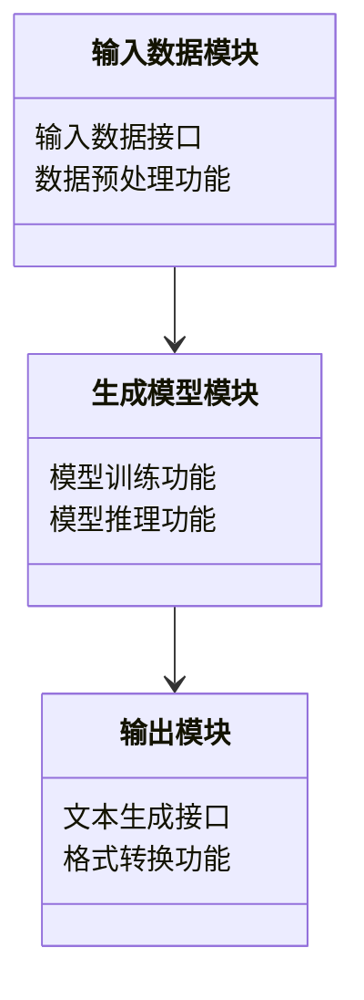
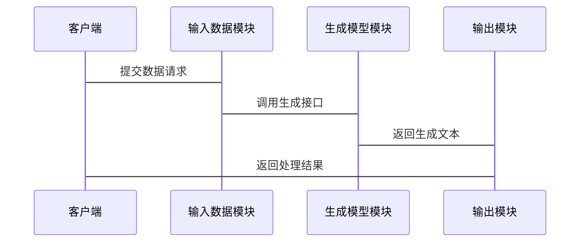

                 


# 5. 系统分析与架构设计

## 5.1 系统分析

### 5.1.1 问题场景介绍
在企业级自然语言生成系统中，我们需要处理多语言和多场景的复杂需求。每个场景可能有不同的数据格式、生成规则和输出要求。例如，财务报告需要精确的数据引用，而市场分析报告则需要动态的市场数据引用。

### 5.1.2 项目介绍
本项目旨在构建一个支持多语言、多场景的企业级自然语言生成系统，能够根据输入的数据生成符合业务需求的文本报告。系统需要具备灵活性和扩展性，以适应不同业务场景的变化。

## 5.2 功能设计

### 5.2.1 领域模型设计


### 5.2.2 系统架构设计


### 5.2.3 接口设计
系统需要提供以下接口：
- 数据输入接口：接收结构化数据
- 模型调用接口：供其他系统调用生成文本
- 输出格式转换接口：支持多种输出格式

### 5.2.4 交互流程


## 5.3 系统实现

### 5.3.1 环境安装
安装必要的库：
```bash
pip install transformers numpy pandas
```

### 5.3.2 核心代码实现
```python
from transformers import AutoTokenizer, AutoModelForSeq2SeqLM
import torch

class NLGSystem:
    def __init__(self, model_name, tokenizer_name):
        self.model = AutoModelForSeq2SeqLM.from_pretrained(model_name)
        self.tokenizer = AutoTokenizer.from_pretrained(tokenizer_name)
    
    def generate(self, inputs, max_length=50):
        inputs_tokenized = self.tokenizer.encode(inputs, return_tensors='pt')
        outputs = self.model.generate(inputs_tokenized, max_length=max_length)
        return self.tokenizer.decode(outputs[0], skip_special_tokens=True)
```

### 5.3.3 案例分析
生成财务报告的示例：
```python
nlg = NLGSystem("t5-base", "t5-base")
inputs = "生成财务报告：收入：1000，支出：500"
result = nlg.generate(inputs)
print(result)
```

## 5.4 项目总结
本项目通过模块化设计，实现了企业级自然语言生成系统的构建。系统具备多语言支持和多场景适应能力，能够满足企业的多样化需求。

---

# 6. 最佳实践与总结

## 6.1 最佳实践

### 6.1.1 数据质量
确保输入数据的准确性和完整性，可以显著提高生成文本的质量。

### 6.1.2 模型调优
定期对模型进行调优，可以提升生成效果和系统性能。

### 6.1.3 多语言支持
在支持多种语言时，需注意不同语言的语法和表达习惯，避免生成错误。

## 6.2 小结
企业级自然语言生成系统的构建需要综合考虑多语言支持和多场景适应性。通过模块化设计和合理的架构规划，可以高效地实现系统的功能需求。

## 6.3 注意事项
- 数据隐私保护
- 模型的可解释性
- 系统的可扩展性

## 6.4 拓展阅读
建议读者深入学习自然语言生成的前沿技术，如基于GPT-3的微调方法和多模态生成模型。

---

# 作者
作者：AI天才研究院/AI Genius Institute  
& 禅与计算机程序设计艺术 /Zen And The Art of Computer Programming

