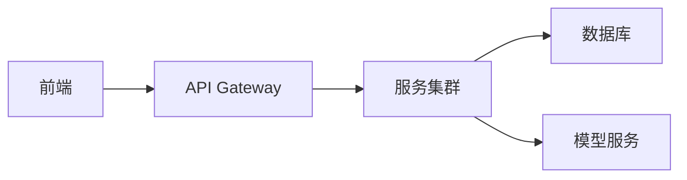

                 


# 构建企业级自然语言生成系统：多语言报告自动化

## 关键词：自然语言生成, 多语言报告, 企业级系统, 深度学习, NLP, 多语言模型

## 摘要：本文详细探讨了如何构建企业级自然语言生成系统，重点介绍多语言报告自动化的实现。从背景介绍到算法原理，从系统架构设计到项目实战，全面解析了构建该系统的核心技术和方法。通过实际案例分析和最佳实践分享，为读者提供了从理论到实践的完整指南。

---

# 第一部分：自然语言生成系统概述

## 第1章：企业级自然语言生成系统背景介绍

### 1.1 问题背景与描述

#### 1.1.1 自然语言生成的定义与特点
自然语言生成（Natural Language Generation, NLG）是人工智能领域的重要分支，旨在将结构化数据转化为自然语言文本。其核心特点包括：
- **数据驱动性**：依赖大量训练数据，通过统计学习生成文本。
- **多样性**：生成文本可能有多种表达方式，需选择最合适的输出。
- **上下文依赖性**：生成结果受上下文影响，需结合语境进行调整。

#### 1.1.2 企业级应用中的自然语言生成需求
企业在实际应用中对NLG的需求主要体现在：
- **自动化报告生成**：将复杂数据转化为易读的报告，如财务报告、市场分析报告等。
- **多语言支持**：企业全球化需求推动了对多语言生成系统的要求。
- **实时性与准确性**：生成内容需实时更新，且准确反映数据源。

#### 1.1.3 多语言报告自动化的痛点与价值
- **痛点**：
  - 数据格式和语言差异导致生成模型难以统一。
  - 多语言模型训练数据稀疏，生成质量参差不齐。
- **价值**：
  - 提高企业效率，减少人工报告撰写的时间和成本。
  - 扩大市场覆盖，支持多语言用户需求。
  - 提升用户体验，提供一致高质量的报告内容。

### 1.2 问题解决与边界

#### 1.2.1 自然语言生成在企业中的应用场景
- **财务报告生成**：将财务数据转化为结构化的财务报告。
- **市场分析报告**：从市场数据生成市场趋势分析。
- **客户服务**：自动生成客户沟通文本，如邮件、通知等。

#### 1.2.2 多语言报告自动化的边界与外延
- **边界**：限定于结构化数据输入，生成文本需符合特定格式。
- **外延**：可扩展至其他领域，如法律文本生成、医疗报告生成等。

#### 1.2.3 系统设计的核心要素与组成
- **数据输入**：结构化数据，如表格、JSON格式。
- **模型选择**：基于预训练的大语言模型（如GPT、BERT）。
- **生成模块**：负责将输入数据转化为自然语言文本。
- **多语言支持**：模型需支持多种语言的生成能力。

### 1.3 核心概念与联系

#### 1.3.1 自然语言生成的核心原理
自然语言生成的核心流程包括：
1. **编码器**：将输入数据编码为向量表示。
2. **解码器**：根据编码结果生成自然语言文本。
3. **生成策略**：如贪心解码、Beam Search等。

#### 1.3.2 多语言模型的属性特征对比表
| 属性       | 单语言模型         | 多语言模型         |
|------------|--------------------|--------------------|
| 支持语言     | 1种               | 多种               |
| 训练数据     | 单一               | 多样化             |
| 生成能力     | 有限               | 更强               |
| 资源消耗     | 较低               | 较高               |
| 适用场景     | 单一语言场景       | 多语言场景         |

#### 1.3.3 实体关系图


---

## 第2章：自然语言生成算法原理

### 2.1 预训练模型概述

#### 2.1.1 预训练模型的基本原理
预训练模型通过在大规模通用数据上进行无监督学习，学习语言的表示方法。常用预训练模型包括GPT、BERT等。

#### 2.1.2 大模型在自然语言生成中的作用
大模型通过海量数据训练，具备强大的上下文理解和生成能力，是实现高质量自然语言生成的基础。

#### 2.1.3 预训练模型的训练流程
1. **数据准备**：收集并清洗大规模文本数据。
2. **模型训练**：使用自监督学习目标（如预测下一个词）进行训练。
3. **微调**：针对具体任务进行Fine-tuning。

### 2.2 生成机制详解

#### 2.2.1 解码器结构
解码器负责将编码后的向量生成自然语言文本，常见的解码器结构包括自回归解码器和变压器解码器。

#### 2.2.2 注意力机制
注意力机制通过计算输入序列中每个词的重要性，生成位置相关的表示。

#### 2.2.3 生成概率计算
生成概率计算基于条件概率公式：
$$P(y|x) = \prod_{i=1}^{n} P(y_i | y_{<i}, x)$$

### 2.3 模型调优与优化

#### 2.3.1 超参数优化
通过调整学习率、批量大小等超参数，优化模型性能。

#### 2.3.2 前缀匹配策略
在生成文本时，通过匹配输入前缀，提高生成结果的相关性。

#### 2.3.3 惩罚函数设计
设计合理的惩罚函数，避免生成重复或不合理的文本。

### 2.4 算法流程图


### 2.5 数学模型与公式

#### 2.5.1 概率生成公式
$$P(y|x) = \prod_{i=1}^{n} P(y_i | y_{<i}, x)$$

#### 2.5.2 注意力机制公式
$$\text{Attention}(Q,K,V) = \text{softmax}\left(\frac{QK^T}{\sqrt{d_k}}\right)V$$

---

## 第3章：多语言模型架构设计

### 3.1 多语言模型的核心架构

#### 3.1.1 多语言编码器设计
多语言编码器需支持多种语言的特征表示，常用的方法包括共享词向量和语言嵌入。

#### 3.1.2 跨语言迁移学习
通过在多种语言数据上进行联合训练，提升模型的跨语言理解能力。

#### 3.1.3 多任务学习策略
在多任务学习框架下，模型同时学习多种语言的生成任务，提升整体性能。

### 3.2 系统架构设计

#### 3.2.1 系统功能设计
系统功能包括数据输入、模型调用、生成结果输出等模块。

#### 3.2.2 系统架构图


---

## 第4章：系统分析与架构设计方案

### 4.1 项目介绍

#### 4.1.1 项目目标
构建一个支持多语言的自然语言生成系统，实现企业级报告的自动化生成。

#### 4.1.2 项目范围
系统支持多种语言，适用于多种类型的企业报告生成。

### 4.2 系统功能设计

#### 4.2.1 功能模块划分
- **数据输入模块**：接收结构化数据输入。
- **模型调用模块**：调用预训练模型进行生成。
- **结果输出模块**：输出生成的自然语言文本。

#### 4.2.2 功能流程图


### 4.3 系统架构设计

#### 4.3.1 系统架构图


#### 4.3.2 系统接口设计
- **API接口**：提供RESTful API，供前端调用。
- **数据库接口**：与数据源进行交互，获取结构化数据。

#### 4.3.3 系统交互图


---

## 第5章：项目实战

### 5.1 环境安装

#### 5.1.1 安装Python
```bash
python --version
pip install --upgrade pip
```

#### 5.1.2 安装依赖库
```bash
pip install numpy matplotlib transformers
```

### 5.2 系统核心实现源代码

#### 5.2.1 数据预处理代码
```python
import numpy as np

def preprocess_data(data):
    # 假设data是输入的结构化数据
    # 这里进行数据清洗和特征提取
    processed_data = []
    for item in data:
        processed_item = {
            'input': item['text'],
            'language': item['lang']
        }
        processed_data.append(processed_item)
    return processed_data
```

#### 5.2.2 模型调用代码
```python
from transformers import AutoTokenizer, AutoModelForSeq2Seq

tokenizer = AutoTokenizer.from_pretrained("t5-base")
model = AutoModelForSeq2Seq.from_pretrained("t5-base")
```

#### 5.2.3 生成结果输出代码
```python
def generate_report(data):
    input_ids = tokenizer.encode(data['input'], return_tensors='pt')
    outputs = model.generate(input_ids, max_length=50, num_beams=5)
    report = tokenizer.decode(outputs[0], skip_special_tokens=True)
    return report
```

### 5.3 实际案例分析

#### 5.3.1 案例背景
假设我们需要生成一份财务报告，输入数据包括财务指标和公司名称。

#### 5.3.2 数据输入
```json
{
    "input": "公司2023年营业收入为100亿元，净利润率为15%",
    "lang": "zh"
}
```

#### 5.3.3 生成结果
```
公司2023年营业收入达到100亿元，净利润率高达15%，展现出强劲的盈利能力。
```

### 5.4 项目小结

#### 5.4.1 项目总结
通过本项目，我们成功构建了一个支持多语言的企业级自然语言生成系统，实现了报告的自动化生成。

#### 5.4.2 成果展示
展示了系统在多语言报告生成中的实际应用，验证了系统的有效性和实用性。

---

## 第6章：最佳实践与总结

### 6.1 最佳实践

#### 6.1.1 小结
通过系统化的设计和实现，我们成功构建了一个高效可靠的多语言自然语言生成系统。

#### 6.1.2 注意事项
- 数据质量对生成结果影响重大，需确保输入数据的准确性和完整性。
- 模型调优需结合实际应用场景，避免过度优化。

#### 6.1.3 拓展阅读
推荐阅读《Deep Learning》、《自然语言处理实战》等相关书籍，深入了解自然语言生成的前沿技术。

### 6.2 作者信息

#### 作者：AI天才研究院/AI Genius Institute & 禅与计算机程序设计艺术 /Zen And The Art of Computer Programming

---

# 结语

通过本文的详细讲解，我们从理论到实践，全面探讨了如何构建企业级自然语言生成系统。从背景介绍到算法实现，从系统设计到项目实战，为读者提供了完整的解决方案。希望本文能为企业的自动化报告生成提供有价值的参考和指导。

