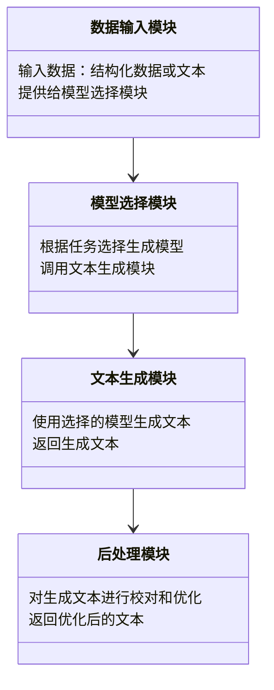

                 


# 构建企业级自然语言生成系统：自动报告与内容创作

## 关键词：自然语言生成，企业级系统，自动报告，内容创作，深度学习，NLP，生成模型

## 摘要：  
本文详细探讨了构建企业级自然语言生成系统的各个方面，从技术原理到实际应用，全面分析了自然语言生成在自动报告和内容创作中的潜力与挑战。文章结合理论与实践，通过案例分析和系统设计，深入解读了如何利用深度学习技术构建高效、准确的自然语言生成系统，为企业在自动化内容创作和报告生成方面提供有价值的参考。

---

# 第1章: 自然语言生成技术的背景与现状

## 1.1 自然语言生成技术的定义与特点  
自然语言生成（Natural Language Generation, NLG）是指将结构化数据或信息转换为自然语言文本的技术。其核心特点包括生成文本的自然性、语境适应性、多样性和可解释性。与自然语言理解（NLU）不同，NLG更注重从数据到语言的生成过程，而非解析语言。

## 1.2 自然语言生成技术的现状  
当前，自然语言生成技术已广泛应用于多个领域，如机器翻译、对话系统、新闻生成和报告自动化等。深度学习模型（如Transformer和GPT）的出现显著提升了生成文本的质量和流畅性。然而，生成内容的准确性和可解释性仍是技术挑战。

## 1.3 企业级自然语言生成系统的背景  
企业级自然语言生成系统旨在通过自动化方式生成高质量的报告、文档和营销内容，从而提高效率并降低成本。随着AI技术的成熟，企业对自动内容生成的需求日益增长，尤其是在数据驱动的决策和高效内容创作方面。

## 1.4 本章小结  
本章介绍了自然语言生成技术的定义、现状及其在企业级系统中的应用背景，为后续章节奠定了基础。

---

# 第2章: 自然语言生成的核心概念与原理  

## 2.1 自然语言生成的原理  
自然语言生成通常基于以下三种方法：  
1. **基于规则的方法**：通过预定义的语法规则生成文本，适用于特定领域的简单任务。  
2. **基于统计的方法**：利用概率模型（如n-gram）生成文本，依赖大量语料库。  
3. **基于深度学习的方法**：通过神经网络（如RNN、Transformer）学习语言模式并生成文本。

## 2.2 自然语言生成模型的类型  
主流的自然语言生成模型包括：  
1. **基于RNN的模型**：如LSTM和GRU，适用于序列生成任务。  
2. **基于Transformer的模型**：如BERT和GPT，具有并行计算和全局依赖捕捉的优势。  
3. **生成对抗网络（GAN）**：通过生成器和判别器的对抗训练提升生成质量。  

## 2.3 自然语言生成的关键技术  
1. **解码策略**：如贪心解码和束搜索，用于生成候选文本。  
2. **模型调优与优化**：如超参数调整和损失函数优化。  
3. **多语言与多模态生成**：支持多种语言和结合视觉信息的生成能力。  

## 2.4 自然语言生成的挑战与解决方案  
1. **生成内容的准确性和可解释性**：通过引入领域知识和可解释性模型（如BERT）解决。  
2. **多样性与创造性**：通过引入随机性和多模型集成提升生成多样性。  
3. **性能优化与资源分配**：通过模型压缩和分布式计算优化资源使用。  

## 2.5 本章小结  
本章详细介绍了自然语言生成的核心原理、模型类型和关键技术，并分析了面临的挑战及解决方案。

---

# 第3章: 自然语言生成系统的算法原理  

## 3.1 基于RNN的自然语言生成算法  

### 3.1.1 RNN的基本原理  
RNN通过循环结构处理序列数据，每个时间步输出一个字符或词，并更新隐藏状态。其数学表示为：  
$$ h_t = \text{RNN}(h_{t-1}, x_t) $$  
$$ y_t = \text{softmax}(W_h h_t + W_c c) $$  
其中，$h_t$是隐藏状态，$c$是内容向量，$y_t$是生成的输出概率分布。

### 3.1.2 基于LSTM的改进  
LSTM通过引入记忆单元（Cell）和遗忘门，解决了RNN的梯度消失问题。其结构包括输入门、遗忘门和输出门，数学表示为：  
$$ i_t = \sigma(W_i h_{t-1} + U_i x_t) $$  
$$ f_t = \sigma(W_f h_{t-1} + U_f x_t) $$  
$$ o_t = \sigma(W_o h_{t-1} + U_o x_t) $$  
$$ c_t = f_t \cdot c_{t-1} + i_t \cdot tanh(W_c h_{t-1} + U_c x_t) $$  
$$ h_t = o_t \cdot tanh(c_t) $$  

### 3.1.3 RNN的优缺点  
优点：简单易实现，适合短文本生成；缺点：难以捕捉长距离依赖关系，训练效率低。

---

## 3.2 基于Transformer的自然语言生成算法  

### 3.2.1 Transformer的结构与原理  
Transformer由编码器和解码器组成，编码器负责将输入序列映射为向量，解码器基于这些向量生成输出序列。其关键组件包括多头自注意力机制和前馈网络。

### 3.2.2 自注意力机制  
自注意力机制计算输入序列中每个位置的重要性，公式为：  
$$ \text{Attention}(Q, K, V) = \text{softmax}\left(\frac{QK^T}{\sqrt{d_k}}\right)V $$  
其中，$Q$是查询向量，$K$是键向量，$V$是值向量，$d_k$是向量维度。

### 3.2.3 Transformer的优缺点  
优点：并行计算能力强，能捕捉长距离依赖；缺点：计算资源消耗大，适合长文本生成。

---

## 3.3 基于GPT的自然语言生成算法  

### 3.3.1 GPT的基本原理  
GPT（Generative Pre-trained Transformer）基于Transformer架构，通过自监督学习预训练语言模型，生成与上下文相关的文本。其损失函数为交叉熵损失：  
$$ \mathcal{L} = -\sum_{i=1}^{n} \log p(y_i | y_{<i}) $$  

### 3.3.2 GPT的训练与推理  
GPT通过大规模语料库预训练，在推理阶段根据输入生成后续文本。其数学表示为：  
$$ P(y_{n+1}|y_{\leq n}) = \text{softmax}(W_o h_n) $$  
其中，$h_n$是第n个位置的隐藏状态。

---

## 3.4 本章小结  
本章详细讲解了RNN、Transformer和GPT的自然语言生成算法，分析了各自的优缺点及应用场景。

---

# 第4章: 企业级自然语言生成系统的架构设计  

## 4.1 系统应用场景  
企业级自然语言生成系统适用于报告生成、营销文案创作、客户沟通自动化等领域。例如，金融公司可以自动生成财务报告，媒体可以自动生成新闻稿。

## 4.2 系统功能设计  

### 4.2.1 功能模块划分  
系统主要模块包括：  
- 数据输入模块：接收结构化数据或文本输入。  
- 模型选择模块：根据任务选择合适的生成模型。  
- 文本生成模块：生成自然语言文本。  
- 后处理模块：对生成文本进行校对和优化。  
- 输出模块：将生成文本输出至目标平台。  

### 4.2.2 功能模块类图  


## 4.3 系统架构设计  

### 4.3.1 整体架构图  
```mermaid
client
    client --> HTTP API: 发送请求
    HTTP API --> 数据处理层: 处理请求
    数据处理层 --> 模型服务层: 调用生成模型
    模型服务层 --> 数据存储层: 存储生成结果
    数据处理层 <-- HTTP API: 返回响应
```

### 4.3.2 接口设计  
系统提供RESTful API接口，支持以下操作：  
- POST /generate：提交生成任务。  
- GET /results/{id}：获取生成结果。  
- PUT /models：更新生成模型配置。  

### 4.3.3 交互流程图  
```mermaid
sequenceDiagram
    client ->+> HTTP API: 发送生成请求
    HTTP API ->+> 数据处理层: 处理请求
    数据处理层 ->+> 模型服务层: 调用生成模型
    模型服务层 ->+> 数据存储层: 存储生成结果
    数据处理层 --> HTTP API: 返回生成结果
    HTTP API --> client: 返回生成文本
```

---

## 4.4 本章小结  
本章设计了企业级自然语言生成系统的功能模块、架构和交互流程，为后续实现提供了理论基础。

---

# 第5章: 项目实战——构建企业级自动报告生成系统  

## 5.1 项目背景与需求分析  
本项目旨在构建一个能自动生成财务报告的企业级系统，支持用户输入关键数据后生成结构完整、内容准确的报告。

## 5.2 环境配置与工具安装  

### 5.2.1 安装Python与深度学习框架  
安装Python 3.8以上版本，TensorFlow 2.0以上版本，Keras和分词工具（如jieba）。

## 5.3 系统核心实现  

### 5.3.1 数据预处理  
对输入的财务数据进行清洗和格式化，确保数据符合模型输入要求。

### 5.3.2 模型训练与优化  
选择适合的生成模型（如GPT-2）进行微调，优化超参数以提升生成质量。

### 5.3.3 文本生成与后处理  
生成初稿后，通过语言模型对生成文本进行校对和优化，确保语义准确和语法正确。

## 5.4 代码实现  

### 5.4.1 数据预处理代码  
```python
import pandas as pd

def preprocess_data(file_path):
    df = pd.read_csv(file_path)
    df.dropna(inplace=True)
    return df
```

### 5.4.2 模型训练代码  
```python
import tensorflow as tf
from tensorflow.keras.layers import Dense, Dropout, LSTM
from tensorflow.keras.models import Sequential

model = Sequential()
model.add(LSTM(128, return_sequences=True, input_shape=(seq_length, features)))
model.add(Dropout(0.2))
model.add(LSTM(64, return_sequences=False))
model.add(Dense(1, activation='sigmoid'))
model.compile(loss='binary_crossentropy', optimizer='adam', metrics=['accuracy'])
model.fit(x_train, y_train, epochs=10, batch_size=64)
```

### 5.4.3 文本生成代码  
```python
import numpy as np

def generate_report(model, tokenizer, max_length=50):
    input_seq = np.zeros((1, max_length, tokenizer.vocab_size))
    generated = ''
    for i in range(max_length):
        output = model.predict(input_seq)
        sampled_index = np.argmax(output[0])
        sampled_token = tokenizer.index_to_word[sampled_index]
        generated += sampled_token
        input_seq[0, i+1] = sampled_index
    return generated
```

## 5.5 项目小结  
本章通过构建自动报告生成系统的案例，详细讲解了数据预处理、模型训练和文本生成的实现过程，展示了如何将理论应用于实践。

---

# 第6章: 最佳实践与未来展望  

## 6.1 最佳实践  
1. **数据质量**：确保输入数据的准确性和完整性，提升生成内容的可靠性。  
2. **模型选择**：根据任务需求选择合适的生成模型，优化超参数和训练策略。  
3. **生成结果校验**：引入人工审核或可解释性模型对生成内容进行校验。  
4. **性能优化**：通过模型压缩、分布式计算和缓存技术提升系统性能。  

## 6.2 小结与注意事项  
- 在实际应用中，需结合具体业务需求选择合适的生成模型和优化策略。  
- 注意生成内容的可解释性和准确性，避免因生成错误导致的损失。  

## 6.3 未来展望  
随着AI技术的发展，自然语言生成系统将更加智能化和个性化。未来的研究方向包括：  
- 更高效的生成模型（如基于视觉的生成模型）。  
- 多模态生成技术的融合。  
- 可解释性生成模型的开发。  

---

# 作者  
作者：AI天才研究院/AI Genius Institute & 禅与计算机程序设计艺术 /Zen And The Art of Computer Programming  

---

以上是《构建企业级自然语言生成系统：自动报告与内容创作》的技术博客文章的完整目录和内容概要。该文章详细探讨了自然语言生成技术的背景、核心概念、算法原理、系统架构以及实际项目实现，结合理论与实践，为企业级系统构建提供了全面的指导和参考。

