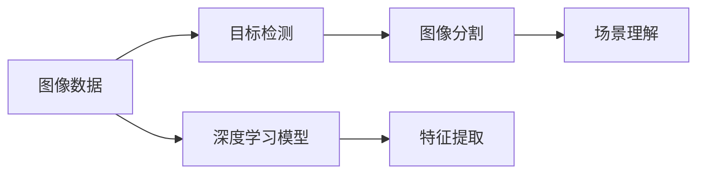
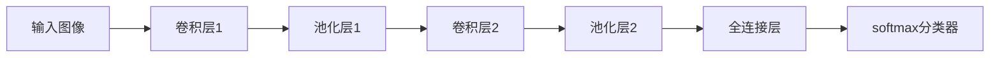
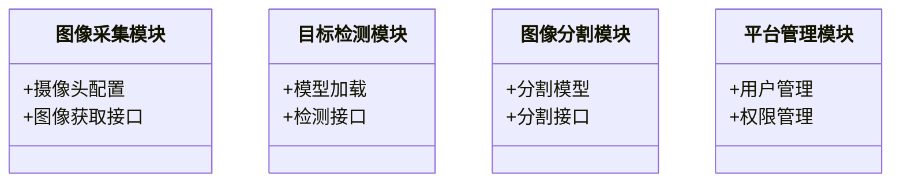
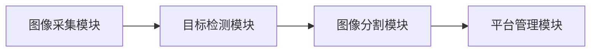
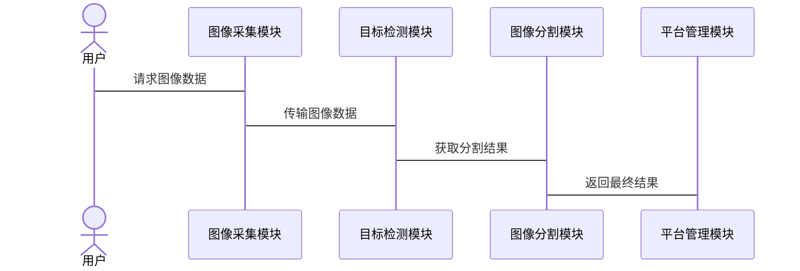

                 


# 构建企业级计算机视觉平台：从产品质检到员工安全监控

> 关键词：计算机视觉，企业级平台，产品质检，员工安全监控，深度学习，目标检测，图像分割

> 摘要：随着人工智能技术的飞速发展，计算机视觉技术在企业中的应用越来越广泛。本文将从企业级计算机视觉平台的构建背景出发，深入探讨其核心概念、算法原理、系统架构设计以及实际应用案例。通过详细的技术分析和代码实现，本文旨在为企业提供一套完整的解决方案，帮助企业在产品质检和员工安全监控等领域实现智能化、高效化的目标。

---

## 第1章: 企业级计算机视觉平台的背景与价值

### 1.1 计算机视觉的定义与核心概念

计算机视觉（Computer Vision，CV）是人工智能领域的重要分支，旨在通过计算机模拟人类的视觉系统，实现对图像或视频的分析和理解。其核心目标是让计算机能够“看懂”图像，并基于图像信息进行决策或反馈。

#### 1.1.1 计算机视觉的定义
计算机视觉是指通过计算机技术对图像或视频进行处理、分析和理解，以获取有用信息或实现特定任务的技术。它涉及图像处理、目标检测、图像分割、场景理解等多个环节。

#### 1.1.2 计算机视觉的核心概念与属性
- **图像处理**：对图像进行增强、滤波、边缘检测等预处理操作。
- **目标检测**：识别图像中感兴趣的目标（如缺陷、物体）并定位其位置。
- **图像分割**：将图像分成多个区域，每个区域对应不同的语义信息。
- **场景理解**：基于图像信息理解场景中的语义关系。

#### 1.1.3 计算机视觉在企业中的应用价值
在企业中，计算机视觉技术可以广泛应用于产品质量检测、员工安全监控、生产流程优化等领域，帮助企业提高效率、降低成本并提升安全性。

### 1.2 企业级计算机视觉平台的背景与需求

#### 1.2.1 企业质检与安全监控的痛点
- **质检效率低**：传统质检依赖人工，效率低且容易出错。
- **安全监控不足**：员工操作中的安全隐患难以及时发现。
- **数据量大**：企业每天产生的图像数据量巨大，人工处理成本高昂。

#### 1.2.2 计算机视觉技术如何解决企业问题
- **自动化质检**：通过计算机视觉技术实现缺陷自动检测，减少人工干预。
- **实时安全监控**：利用图像识别技术实时监测员工操作，预防安全事故。
- **数据处理效率**：通过自动化技术快速处理大量图像数据，降低企业成本。

#### 1.2.3 企业级平台的构建目标与边界
- **目标**：构建一个高效、可靠的计算机视觉平台，支持企业质检和安全监控。
- **边界**：聚焦于图像处理、目标检测和场景理解，不涉及其他业务系统。

---

## 第2章: 计算机视觉的核心概念与联系

### 2.1 计算机视觉的核心概念

#### 2.1.1 图像处理与计算机视觉的关系
图像处理是计算机视觉的基础，主要对图像进行预处理和增强。计算机视觉在此基础上进一步提取图像中的语义信息。

#### 2.1.2 目标检测、图像分割与场景理解
- **目标检测**：识别图像中目标的位置和类别。
- **图像分割**：将图像分割为多个区域，每个区域对应不同的语义信息。
- **场景理解**：综合目标检测和图像分割的结果，理解整个场景的语义关系。

#### 2.1.3 深度学习在计算机视觉中的作用
深度学习通过训练深层神经网络，自动提取图像特征，显著提升了计算机视觉技术的性能。

### 2.2 计算机视觉核心概念对比表

| 概念         | 描述                                                                 |
|--------------|----------------------------------------------------------------------|
| 图像处理     | 对图像进行预处理和增强，如滤波、边缘检测等。                           |
| 目标检测     | 识别图像中目标的位置和类别。                                           |
| 图像分割     | 将图像分割为多个区域，每个区域对应不同的语义信息。                     |
| 场景理解     | 综合目标检测和图像分割的结果，理解整个场景的语义关系。                 |

### 2.3 计算机视觉核心概念的ER实体关系图



---

## 第3章: 计算机视觉算法原理与实现

### 3.1 常用计算机视觉算法概述

#### 3.1.1 基于传统CV的目标检测算法
- **Haar级联检测器**：通过训练级联分类器实现目标检测。
- **HOG特征检测**：提取目标的HOG特征，结合SVM进行分类。

#### 3.1.2 基于深度学习的目标检测算法
- **CNN（卷积神经网络）**：通过卷积操作提取图像特征。
- **Faster R-CNN**：结合区域建议网络（RPN）和CNN实现目标检测。

#### 3.1.3 图像分割算法
- **FCN（全卷积网络）**：通过上采样实现像素级分割。
- **U-Net**：经典的医学图像分割算法，适用于多种图像分割任务。

### 3.2 基于CNN的目标检测算法原理

#### 3.2.1 CNN网络结构


#### 3.2.2 Faster R-CNN算法流程
1. **生成区域建议**：通过RPN生成目标候选框。
2. **特征提取**：将候选框输入CNN提取特征。
3. **分类与回归**：对候选框进行分类和位置回归。

#### 3.2.3 检测器实现代码示例
```python
import torch
import torchvision

# 定义Faster R-CNN模型
model = torchvision.models.detection.fasterrcnn_resnet50_fpn(weights=torchvision.models.detection.FasterRCNN_Weights.DEFAULT)
```

### 3.3 深度学习CV算法的数学模型

#### 3.3.1 卷积运算的数学表达
$$\text{输出特征图} = \sum_{i=1}^{k} w_i \cdot \text{输入区域} + b$$

#### 3.3.2 损失函数与优化算法
- **损失函数**：常用交叉熵损失函数。
- **优化算法**：常用随机梯度下降（SGD）或Adam优化器。

---

## 第4章: 企业级计算机视觉平台系统分析与架构设计

### 4.1 项目背景与目标

#### 4.1.1 项目背景
- 企业需要高效、可靠的计算机视觉平台支持质检和安全监控。

#### 4.1.2 项目目标
- 构建一个支持产品质检和员工安全监控的计算机视觉平台。

### 4.2 系统功能设计

#### 4.2.1 领域模型类图


### 4.3 系统架构设计

#### 4.3.1 系统架构图


#### 4.3.2 系统接口设计
- **图像采集接口**：摄像头获取图像数据。
- **检测接口**：目标检测模块提供检测结果。

#### 4.3.3 系统交互流程


---

## 第5章: 项目实战——企业级计算机视觉平台的实现

### 5.1 环境配置与安装

#### 5.1.1 安装Python与深度学习框架
```bash
pip install torch torchvision
```

### 5.2 系统核心实现

#### 5.2.1 目标检测模块实现
```python
import torch
import torchvision

# 定义Faster R-CNN模型
model = torchvision.models.detection.fasterrcnn_resnet50_fpn(weights=torchvision.models.detection.FasterRCNN_Weights.DEFAULT)

# 前向传播
def detect(image):
    output = model(image)
    return output
```

#### 5.2.2 图像分割模块实现
```python
import torch
import torchvision

# 定义U-Net模型
class UNet(torch.nn.Module):
    def __init__(self):
        super(UNet, self).__init__()
        self.encoder = torchvision.models.vgg16(weights='DEFAULT').features
        self.decoder = torch.nn.Sequential(
            torch.nn.Conv2d(512, 256, kernel_size=1, padding=0),
            torch.nn.ConvTranspose2d(256, 128, kernel_size=2, stride=2),
            torch.nn.Conv2d(128, 64, kernel_size=1, padding=0),
            torch.nn.ConvTranspose2d(64, 32, kernel_size=2, stride=2),
            torch.nn.Conv2d(32, 1, kernel_size=1, padding=0)
        )
    
    def forward(self, x):
        x = self.encoder(x)
        x = self.decoder(x)
        return x
```

### 5.3 案例分析与详细解读

#### 5.3.1 产品质检案例
- **输入**：产品表面图像。
- **输出**：检测到的缺陷位置和类别。

#### 5.3.2 员工安全监控案例
- **输入**：员工操作图像。
- **输出**：检测到的安全隐患位置和类型。

### 5.4 项目小结

---

## 第6章: 最佳实践与未来展望

### 6.1 最佳实践 tips

- **数据质量**：确保训练数据的多样性和代表性。
- **模型优化**：通过数据增强和模型剪枝优化模型性能。
- **系统部署**：采用容器化技术部署模型，确保系统的可扩展性。

### 6.2 小结

企业级计算机视觉平台的构建需要从理论到实践的全面考虑，通过深入理解核心概念、合理设计系统架构并结合实际案例，可以实现高效、可靠的计算机视觉应用。

### 6.3 未来展望

随着深度学习技术的不断进步，企业级计算机视觉平台将更加智能化、高效化，应用场景也将进一步扩展。

---

## 作者：AI天才研究院/AI Genius Institute & 禅与计算机程序设计艺术 /Zen And The Art of Computer Programming

感谢您的阅读！希望本文能为您提供有价值的技术见解和实践指导！

