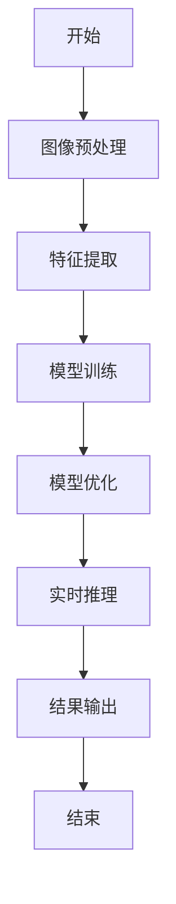
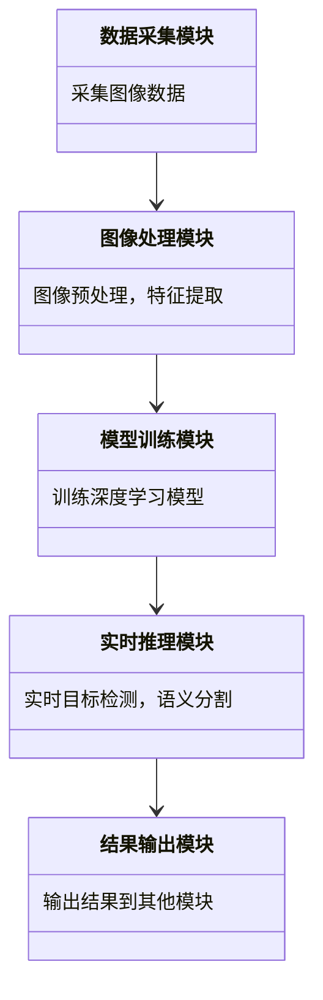
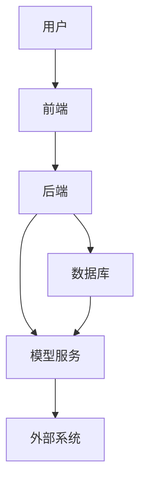
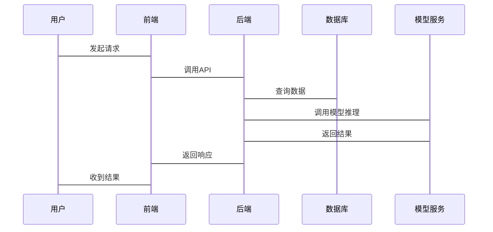

                 


```markdown
# 构建企业级计算机视觉平台：从质量控制到安全监管的全面应用

> 关键词：企业级计算机视觉，计算机视觉技术，深度学习，图像处理，目标检测，安全监管

> 摘要：本文详细探讨了构建企业级计算机视觉平台的核心概念、技术原理、系统架构设计及实际应用。通过分析质量控制与安全监管中的关键问题，结合深度学习与图像处理技术，提出了系统的解决方案，并通过实际案例展示了平台的构建与应用。

---

# 第一部分: 企业级计算机视觉平台概述

## 第1章: 问题背景与需求分析

### 1.1 问题背景
#### 1.1.1 企业级计算机视觉的定义与范围
企业级计算机视觉（Enterprise-level Computer Vision）是指在企业生产、管理、安全等场景中，利用计算机视觉技术对图像、视频等视觉数据进行分析、理解和处理，以实现自动化、智能化的目标检测、图像分割、语义分析等任务。其范围涵盖工业质量控制、智能安防、物流优化等多个领域。

#### 1.1.2 企业级计算机视觉的核心问题
在企业级应用中，计算机视觉面临以下核心问题：
- **数据多样性**：工业场景中存在光照变化、视角多样、物体遮挡等多种复杂情况。
- **算法实时性**：需要在实时场景中快速处理大量数据，对算法的计算效率要求高。
- **系统稳定性**：企业级系统需要高可用性，确保长时间稳定运行。

#### 1.1.3 从质量控制到安全监管的应用场景
- **质量控制**：通过图像处理技术检测工业产品中的缺陷。
- **安全监管**：利用目标检测技术识别危险物品或人员。

### 1.2 问题描述
#### 1.2.1 企业级计算机视觉的核心目标
- 提供高效的图像处理和分析能力。
- 实现实时目标检测与语义分割。
- 支持多场景、多任务的协同工作。

#### 1.2.2 企业级计算机视觉的挑战
- **数据量大**：企业级系统处理的数据量通常非常庞大。
- **算法复杂度高**：需要处理复杂的视觉问题，如遮挡、光照变化等。
- **系统集成难度大**：需要与企业现有的IT系统无缝集成。

### 1.3 问题解决的思路与方法
#### 1.3.1 技术选型与架构设计
- 选择适合的深度学习框架（如TensorFlow、PyTorch）。
- 设计高效的算法流程，优化计算效率。

#### 1.3.2 数据采集与处理流程
- 数据采集：通过摄像头、传感器等设备获取视觉数据。
- 数据预处理：包括图像增强、标准化等步骤。

#### 1.3.3 系统集成与部署策略
- 采用微服务架构，确保系统的可扩展性和灵活性。
- 使用容器化技术（如Docker）进行部署。

### 1.4 企业级计算机视觉的边界与外延
#### 1.4.1 系统边界与功能范围
- 系统边界：仅限于计算机视觉相关的功能模块。
- 功能范围：包括目标检测、图像分割、语义分析等。

#### 1.4.2 外延与扩展性分析
- 外延：与其他技术（如物联网、大数据）的协同工作。
- 扩展性：支持新功能的快速开发与部署。

#### 1.4.3 与其他技术的协同关系
- 与物联网技术的协同：通过物联网设备获取数据，结合计算机视觉进行分析。
- 与大数据技术的协同：利用大数据平台进行数据存储与分析。

---

## 第2章: 计算机视觉技术的核心原理

### 2.1 计算机视觉的基本原理
#### 2.1.1 图像处理基础
- **图像采集**：通过摄像头或传感器获取图像数据。
- **图像增强**：对图像进行去噪、锐化等处理，提高图像质量。
- **图像变换**：如傅里叶变换、小波变换等，用于特征提取。

#### 2.1.2 视觉特征提取
- **特征检测**：如SIFT、HOG等算法，用于提取图像中的关键特征。
- **特征描述**：通过描述符对特征进行编码，便于后续匹配。

#### 2.1.3 目标检测与识别
- **目标检测**：通过滑动窗口或区域建议网络（RPN）检测图像中的目标。
- **目标识别**：基于检测结果，利用分类器进行目标识别。

### 2.2 常用算法与技术
#### 2.2.1 基于CNN的目标检测
- **卷积神经网络（CNN）**：通过多层卷积操作提取图像特征。
- **Faster R-CNN**：结合RPN和RoI Pooling，实现高效的物体检测。

#### 2.2.2 基于分割的图像理解
- **图像分割**：将图像划分为不同的区域，识别每个区域的内容。
- **U-Net架构**：常用语医学图像分割，适用于小样本数据。

#### 2.2.3 图像语义分析与推理
- **语义分割**：为图像中的每个像素标注类别。
- **图像描述生成**：通过生成模型，将图像转化为自然语言描述。

### 2.3 计算机视觉的核心算法流程
#### 2.3.1 图像预处理与特征提取
- **图像预处理**：如归一化、标准化等。
- **特征提取**：通过CNN提取图像特征。

#### 2.3.2 模型训练与优化
- **模型训练**：使用标注数据训练深度学习模型。
- **模型优化**：通过剪枝、量化等技术优化模型性能。

#### 2.3.3 实时推理与结果输出
- **实时推理**：在实际场景中快速处理图像数据。
- **结果输出**：将检测结果输出到系统中，供其他模块使用。

### 2.4 计算机视觉技术的数学模型
#### 2.4.1 卷积神经网络的数学公式
$$ \text{CNN} = \{ \text{Conv}, \text{ReLU}, \text{Pool} \}^* $$

其中，Conv表示卷积操作，ReLU表示激活函数，Pool表示池化操作。

#### 2.4.2 检测算法的优化模型
$$ \text{损失函数} = \alpha \cdot \text{分类损失} + (1-\alpha) \cdot \text{定位损失} $$

其中，$\alpha$ 是平衡系数。

#### 2.4.3 语义分割的损失函数
$$ \text{损失函数} = \text{交叉熵损失} + \text{边缘损失} $$

### 2.5 算法流程图


---

## 第3章: 企业级计算机视觉系统架构设计

### 3.1 系统功能设计
#### 3.1.1 系统功能模块
- 数据采集模块：负责采集视觉数据。
- 图像处理模块：对图像进行预处理和特征提取。
- 模型训练模块：训练深度学习模型。
- 实时推理模块：在实际场景中进行目标检测和语义分割。
- 结果输出模块：将结果输出到其他系统模块。

#### 3.1.2 功能模块之间的关系


### 3.2 系统架构设计
#### 3.2.1 系统架构图


#### 3.2.2 系统分层架构
- **数据层**：负责数据的存储与管理。
- **服务层**：提供各种服务接口，供前端调用。
- **应用层**：实现具体的业务逻辑。

### 3.3 系统接口设计
#### 3.3.1 接口定义
- **输入接口**：接收图像数据和请求参数。
- **输出接口**：返回处理结果和状态信息。

#### 3.3.2 接口交互流程


---

## 第4章: 项目实战

### 4.1 项目概述
#### 4.1.1 项目介绍
- 项目名称：企业级计算机视觉平台。
- 项目目标：实现质量控制与安全监管的全面应用。

### 4.2 核心代码实现
#### 4.2.1 环境安装
- 安装Python、TensorFlow、OpenCV等依赖库。
- 使用Docker部署环境。

#### 4.2.2 核心代码
```python
import tensorflow as tf
from tensorflow.keras import layers

model = tf.keras.Sequential([
    layers.Conv2D(32, (3,3), activation='relu', input_shape=(224, 224, 3)),
    layers.MaxPooling2D((2,2)),
    layers.Conv2D(64, (3,3), activation='relu'),
    layers.MaxPooling2D((2,2)),
    layers.Flatten(),
    layers.Dense(128, activation='relu'),
    layers.Dense(10, activation='softmax')
])
```

#### 4.2.3 代码解读与分析
- **模型定义**：使用Keras构建卷积神经网络。
- **训练过程**：通过数据生成器加载数据，编译模型，进行训练。
- **推理过程**：使用训练好的模型进行实时目标检测。

### 4.3 实际案例分析
#### 4.3.1 工业缺陷检测
- **案例背景**：某汽车制造企业使用计算机视觉技术检测车身缺陷。
- **解决方案**：部署一个基于YOLO的目标检测模型，实时检测车身上的瑕疵。

#### 4.3.2 智能安防监控
- **案例背景**：某机场使用计算机视觉技术进行人脸识别和行为分析。
- **解决方案**：部署一个基于Faster R-CNN的目标检测模型，结合人脸识别技术，实现人员身份验证和异常行为检测。

### 4.4 项目小结
- **项目总结**：通过实际案例，展示了企业级计算机视觉平台在质量控制和安全监管中的广泛应用。
- **经验总结**：在实际项目中，需要充分考虑数据的质量和多样性，优化算法的效率，确保系统的稳定性和可靠性。

---

## 第5章: 最佳实践与总结

### 5.1 最佳实践
#### 5.1.1 系统设计
- **模块化设计**：确保系统的可扩展性和可维护性。
- **高可用性设计**：通过冗余和负载均衡确保系统的稳定性。

#### 5.1.2 算法优化
- **模型压缩**：通过剪枝、量化等技术优化模型的大小和计算效率。
- **模型并行**：利用多GPU并行加速模型推理。

### 5.2 小结
- **核心概念**：企业级计算机视觉平台的核心概念包括图像处理、目标检测、语义分割等。
- **技术要点**：深度学习、图像处理、系统架构设计等是构建平台的关键技术。
- **未来趋势**：随着AI技术的不断发展，企业级计算机视觉平台将更加智能化、自动化。

### 5.3 注意事项
- **数据安全**：确保数据的安全性和隐私性。
- **系统兼容性**：确保系统与企业现有IT系统的兼容性。
- **性能优化**：持续优化算法和系统性能，提高处理效率。

### 5.4 拓展阅读
- 推荐阅读《Deep Learning》、《Computer Vision: A Modern Approach》等书籍。
- 关注GitHub上的开源项目，如TensorFlow官方示例、OpenCV官方文档等。

---

## 附录

### 附录A: 数据集与工具资源

#### 1. 数据集
- **ImageNet**：常用图像分类数据集。
- **COCO**：常用目标检测数据集。
- **Cityscapes**：常用语义分割数据集。

#### 2. 工具与库
- **TensorFlow**：Google的深度学习框架。
- **PyTorch**：Facebook的深度学习框架。
- **OpenCV**：计算机视觉算法库。

---

## 作者

作者：AI天才研究院/AI Genius Institute & 禅与计算机程序设计艺术 /Zen And The Art of Computer Programming
```

