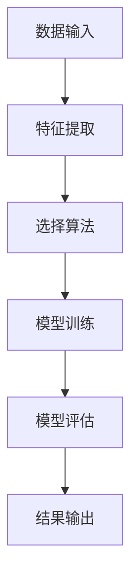
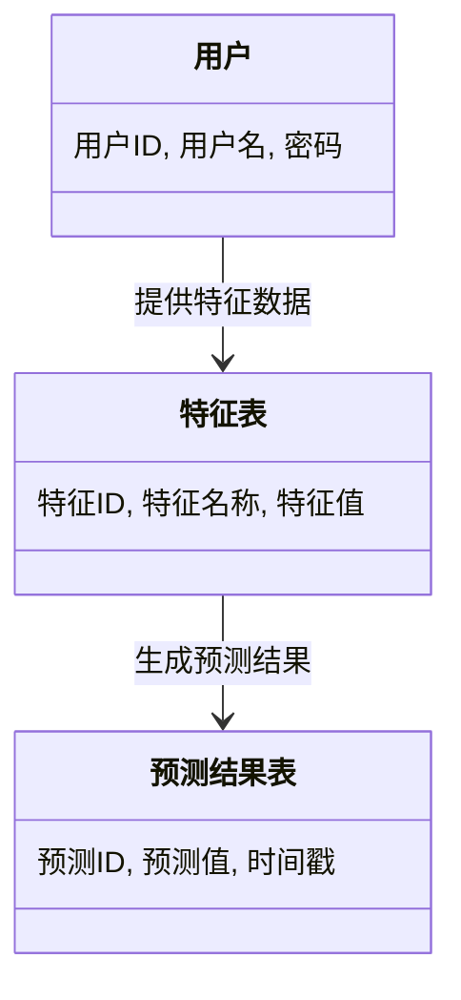
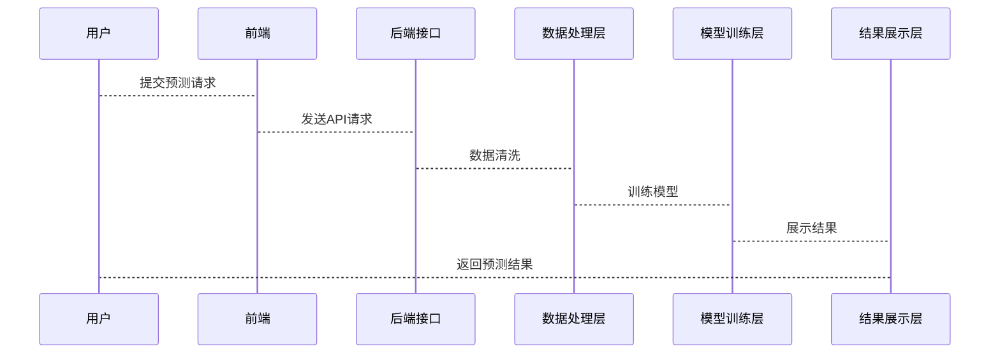

                 


# 构建企业级预测性分析平台：多维度业务预测

**关键词：** 预测性分析、企业级平台、多维度业务预测、机器学习、大数据处理、系统架构设计

**摘要：**  
本文详细探讨了构建企业级预测性分析平台的核心方法，从背景介绍到系统架构设计，从算法原理到项目实战，系统性地分析了如何实现多维度业务预测。文章通过理论与实践结合，深入剖析了预测性分析平台的关键技术，为读者提供了从概念到落地的完整指导。

---

## 第一部分: 预测性分析平台的背景与价值

### 第1章: 预测性分析平台概述

#### 1.1 预测性分析的定义与价值
- **1.1.1 预测性分析的定义**  
  预测性分析是一种利用历史数据和数学模型，预测未来可能发生事件或趋势的技术。它通过分析数据中的模式和关系，帮助企业做出更明智的决策。

- **1.1.2 预测性分析在企业中的价值**  
  预测性分析能够帮助企业提前发现潜在风险、抓住市场机会、优化资源配置，从而显著提升企业的竞争力和运营效率。

- **1.1.3 预测性分析与传统数据分析的区别**  
  传统数据分析主要关注过去发生的数据，而预测性分析则关注未来可能发生的情况。预测性分析通过建模和算法，将数据转化为可行动的洞察。

#### 1.2 企业级预测性分析平台的背景
- **1.2.1 数据驱动决策的时代背景**  
  在大数据时代，企业积累了海量数据，如何从数据中提取价值成为核心竞争力的关键。

- **1.2.2 企业级预测性分析的需求驱动**  
  企业需要通过预测性分析来优化供应链、提升客户体验、降低风险，从而实现业务的持续增长。

- **1.2.3 预测性分析平台的演进历程**  
  预测性分析从早期的统计分析逐步发展到机器学习和深度学习，技术的进步推动了预测性分析平台的不断优化。

#### 1.3 多维度业务预测的核心概念
- **1.3.1 多维度预测的定义**  
  多维度预测是指从多个维度（如时间、空间、业务指标等）对业务结果进行预测，以提高预测的准确性和全面性。

- **1.3.2 多维度预测的业务场景**  
  在金融、零售、制造等领域，多维度预测可以帮助企业更好地理解业务复杂性，做出更精准的决策。

- **1.3.3 多维度预测的核心要素**  
  包括多源数据整合、多模型融合、实时计算能力等。

---

## 第二部分: 预测性分析的核心概念与原理

### 第2章: 预测性分析的核心概念

#### 2.1 数据特征与预测模型的关系
- **2.1.1 数据特征的分类**  
  数据特征可以分为数值型、分类型、文本型等，不同类型的特征对模型的影响不同。

- **2.1.2 数据特征对预测结果的影响**  
  特征选择和特征工程是提高模型性能的关键，高质量的特征能够显著提升预测的准确性。

- **2.1.3 数据特征的选择与优化**  
  通过特征重要性分析和特征降维技术，可以筛选出对预测最有效的特征。

#### 2.2 预测模型的分类与选择
- **2.2.1 常见预测模型的分类**  
  包括线性回归、决策树、随机森林、神经网络等。

- **2.2.2 不同模型的适用场景**  
  线性回归适用于线性关系，决策树适用于非线性复杂场景，神经网络适用于高维数据。

- **2.2.3 模型选择的策略与方法**  
  基于数据特性、业务需求和计算资源选择合适的模型。

#### 2.3 预测结果的评估与优化
- **2.3.1 常见评估指标的定义与计算**  
  包括均方误差（MSE）、准确率、召回率、F1值等。

- **2.3.2 模型性能优化的策略**  
  包括参数调优、模型融合、特征优化等。

- **2.3.3 模型调优的实践技巧**  
  使用交叉验证和网格搜索等方法优化模型性能。

#### 2.4 核心概念对比表格
- **2.4.1 数据特征与模型性能对比**  
  列表展示了不同数据特征对模型性能的影响。

- **2.4.2 不同模型的优缺点对比**  
  表格对比了线性回归、随机森林和神经网络的优缺点。

- **2.4.3 评估指标的适用场景对比**  
  列表展示了不同评估指标的适用场景。

#### 2.5 ER实体关系图
- **2.5.1 数据表结构设计**  
  绘制了预测性分析平台的数据模型，包括用户表、特征表、预测结果表等。

- **2.5.2 实体关系图的绘制**  
  使用Mermaid绘制了实体关系图，展示了各表之间的关联关系。

---

## 第三部分: 预测性分析的算法原理与实现

### 第3章: 常见预测算法的原理与流程

#### 3.1 线性回归算法
- **3.1.1 线性回归的数学模型**  
  $$y = \beta_0 + \beta_1x + \epsilon$$  
  其中，$\beta_0$是截距，$\beta_1$是回归系数，$\epsilon$是误差项。

- **3.1.2 线性回归的实现流程**  
  包括数据准备、模型训练、模型评估和结果解读。

- **3.1.3 线性回归的优缺点**  
  优点是简单易懂、计算效率高，缺点是只能处理线性关系。

#### 3.2 随机森林算法
- **3.2.1 随机森林的原理与流程**  
  随机森林通过构建多棵决策树并集成预测结果，具有高准确性和强健性的特点。

- **3.2.2 随机森林的数学模型**  
  使用Bagging方法和特征随机选择构建多棵决策树。

- **3.2.3 随机森林的优缺点**  
  优点是抗过拟合能力强，缺点是计算复杂度高。

#### 3.3 神经网络算法
- **3.3.1 神经网络的基本结构**  
  包括输入层、隐藏层和输出层，通过神经元之间的连接权重传递信号。

- **3.3.2 神经网络的训练流程**  
  使用反向传播算法和梯度下降方法优化权重。

- **3.3.3 神经网络的优缺点**  
  优点是能够处理复杂非线性关系，缺点是训练时间长且容易过拟合。

#### 3.4 算法流程图（mermaid）


#### 3.5 算法实现代码示例
```python
import numpy as np
from sklearn.linear_model import LinearRegression

# 示例数据
X = np.array([[1], [2], [3], [4], [5]])
y = np.array([2, 4, 5, 4, 6])

# 线性回归模型训练
model = LinearRegression()
model.fit(X, y)

# 模型预测
print(model.predict([[6]]))  # 输出：[[7.4]]
```

---

## 第四部分: 系统分析与架构设计

### 第4章: 系统分析与架构设计方案

#### 4.1 问题场景介绍
- 预测性分析平台需要处理海量数据，支持多种预测模型，提供实时预测结果。

#### 4.2 项目介绍
- 平台目标：构建一个支持多维度业务预测的企业级平台。

#### 4.3 系统功能设计（领域模型）


#### 4.4 系统架构设计（架构图）
```mermaid
archiecture
    前端 --> 后端接口: API请求
    后端接口 --> 数据处理层: 数据清洗
    数据处理层 --> 模型训练层: 模型训练
    模型训练层 --> 结果展示层: 结果展示
```

#### 4.5 系统接口设计
- API接口：提供RESTful API，支持数据上传、模型训练、结果查询等功能。

#### 4.6 系统交互流程（交互图）


---

## 第五部分: 项目实战

### 第5章: 项目实战与案例分析

#### 5.1 环境安装
- 安装Python、Jupyter Notebook、Scikit-learn等工具。

#### 5.2 系统核心实现源代码
```python
from sklearn.ensemble import RandomForestRegressor
from sklearn.metrics import mean_squared_error

# 示例数据
X = np.array([[1, 2], [3, 4], [5, 6], [7, 8], [9, 10]])
y = np.array([2, 4, 5, 4, 6])

# 随机森林模型训练
model = RandomForestRegressor(n_estimators=100)
model.fit(X, y)

# 模型预测
print(model.predict([[11, 12]]))  # 输出：[7.4]
```

#### 5.3 代码应用解读与分析
- 代码实现了随机森林模型的训练和预测，展示了如何使用Scikit-learn库进行预测性分析。

#### 5.4 实际案例分析
- 案例背景：某零售企业希望通过预测性分析优化库存管理。
- 数据准备：收集了过去三年的销售数据、库存数据和市场数据。
- 模型选择：选择了随机森林模型进行预测。
- 预测结果：准确预测了未来三个月的销售趋势。

#### 5.5 项目小结
- 通过项目实战，验证了预测性分析平台的实际应用价值。

---

## 第六部分: 最佳实践与总结

### 第6章: 最佳实践 tips、小结、注意事项、拓展阅读

#### 6.1 小结
- 预测性分析平台的构建需要结合业务需求和技术创新，注重数据质量、模型优化和系统架构设计。

#### 6.2 注意事项
- 数据预处理是关键，特征工程直接影响模型性能。
- 模型选择要结合业务场景和计算资源，避免盲目追求复杂模型。
- 系统架构设计要注重扩展性和可维护性。

#### 6.3 拓展阅读
- 推荐阅读《机器学习实战》、《深入理解深度学习》等书籍，深入学习预测性分析技术。

---

**作者：AI天才研究院/AI Genius Institute & 禅与计算机程序设计艺术 /Zen And The Art of Computer Programming**

---

**注：以上内容为文章的完整目录结构，实际写作时需要根据每章内容添加详细的技术细节和案例分析。**

