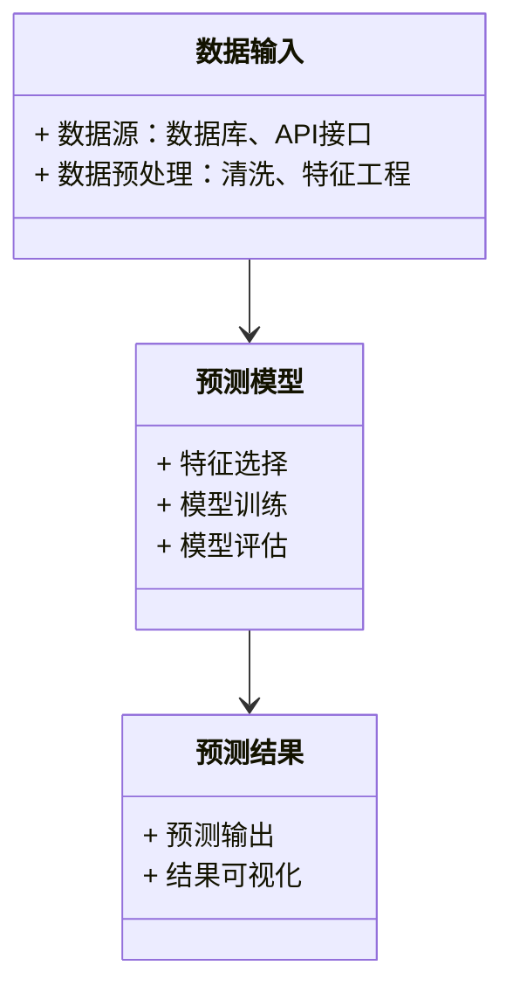
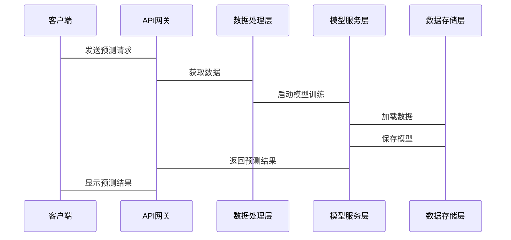

                 


# 构建企业级预测性分析平台：跨业务领域的综合预测模型

## 关键词：预测性分析、预测模型、机器学习、数据科学、企业应用

## 摘要：本文详细探讨了构建企业级预测性分析平台的关键步骤，涵盖跨业务领域的综合预测模型的设计、实现和应用。通过系统化的分析和实际案例，展示了如何利用预测性分析技术提升企业决策能力。

---

# 第1章 预测性分析的背景与价值

## 1.1 预测性分析的背景介绍

### 1.1.1 数据驱动决策的兴起

随着大数据技术的快速发展，企业逐渐从传统的经验驱动决策向数据驱动决策转变。预测性分析作为数据科学的重要组成部分，通过分析历史数据和当前趋势，帮助企业预测未来可能的结果，从而优化决策流程。

### 1.1.2 企业预测性分析的需求

现代企业面临日益复杂的市场环境，仅凭经验或直觉进行决策已难以满足快速变化的市场需求。预测性分析能够帮助企业提前识别潜在风险和机会，提升运营效率和竞争力。

### 1.1.3 预测性分析在跨业务领域的应用

预测性分析的应用范围非常广泛，包括金融、医疗、零售、制造等多个领域。例如，在金融领域，预测性分析可以用于信用评分和欺诈检测；在医疗领域，可以用于疾病预测和治疗方案优化。

---

## 1.2 预测性分析的核心概念

### 1.2.1 预测性分析的定义

预测性分析是一种利用历史数据和统计模型、算法来预测未来结果或趋势的技术。它通过分析数据中的模式和关系，帮助企业在不确定的环境中做出更明智的决策。

### 1.2.2 预测模型的基本组成

预测模型通常包括以下几个部分：  
1. **数据输入**：用于训练模型的历史数据。  
2. **特征工程**：对数据进行处理和特征提取。  
3. **模型训练**：使用算法对数据进行建模。  
4. **模型评估**：通过测试数据验证模型的准确性。  
5. **预测输出**：模型基于新数据生成预测结果。

### 1.2.3 预测性分析的边界与外延

预测性分析的边界在于其预测能力的范围和精度。其外延则包括相关的数据处理、特征工程和模型优化等技术支持。

---

## 1.3 预测性分析的价值与挑战

### 1.3.1 预测性分析为企业带来的价值

1. **提高决策效率**：通过预测未来趋势，帮助企业更快做出决策。  
2. **降低风险**：提前识别潜在风险，减少损失。  
3. **优化资源配置**：通过预测需求，合理分配资源。  

### 1.3.2 预测性分析的主要挑战

1. **数据质量**：数据噪声、缺失值等问题会影响模型的准确性。  
2. **模型选择**：如何选择合适的算法是构建预测模型的关键。  
3. **模型解释性**：复杂的模型可能难以解释其预测结果。  

### 1.3.3 如何克服预测性分析的挑战

1. **数据预处理**：通过清洗和特征工程提升数据质量。  
2. **模型优化**：通过交叉验证和超参数调优选择最优模型。  
3. **可解释性增强**：使用可解释性算法或工具（如SHAP值）提升模型的透明度。  

---

## 1.4 本章小结

本章介绍了预测性分析的背景、核心概念及其在企业中的价值。同时，也探讨了在实际应用中可能面临的挑战及解决方案。下一章将深入探讨预测模型的核心概念与联系。

---

# 第2章 预测模型的核心概念与联系

## 2.1 预测模型的核心原理

### 2.1.1 预测模型的基本原理

预测模型通过学习数据中的模式和关系，将输入数据映射到输出结果。其核心在于特征提取和算法选择，这两个步骤直接影响模型的性能。

### 2.1.2 预测模型的输入与输出

输入通常是结构化数据，包括数值型和类别型数据；输出则是预测结果，可以是连续值（回归）或离散值（分类）。

### 2.1.3 预测模型的训练与评估

训练过程包括数据预处理、特征工程、模型训练和参数优化。评估则通过准确率、召回率、F1分数等指标衡量模型性能。

---

## 2.2 预测模型的核心要素

### 2.2.1 数据特征的选取

特征选择对模型性能至关重要。常用方法包括相关性分析、主成分分析（PCA）和递归特征消除（RFE）。

### 2.2.2 模型选择与优化

选择合适的算法（如线性回归、随机森林、支持向量机）并通过网格搜索或贝叶斯优化进行调优。

### 2.2.3 模型的可解释性

通过局部可解释性模型（如LIME）或特征重要性分析，解释模型的预测结果。

---

## 2.3 预测模型的实体关系图


---

## 2.4 本章小结

本章详细讲解了预测模型的核心原理和关键要素，包括数据特征的选取、模型选择与优化以及模型的可解释性。下一章将深入探讨常见预测算法的原理与实现。

---

# 第3章 常见预测算法的原理与实现

## 3.1 线性回归算法

### 3.1.1 线性回归的数学模型

线性回归是最简单的回归算法，其数学模型为：

$$ y = \beta_0 + \beta_1x_1 + \beta_2x_2 + \ldots + \beta_nx_n $$

其中，$\beta$ 表示回归系数，$x$ 是输入特征，$y$ 是输出结果。

### 3.1.2 线性回归的实现步骤

1. **数据准备**：收集并整理数据。  
2. **特征工程**：进行数据标准化或归一化。  
3. **模型训练**：使用最小二乘法求解回归系数。  
4. **模型评估**：计算均方误差（MSE）或决定系数（R²）。  

### 3.1.3 线性回归的优缺点

优点：简单易懂、计算效率高。  
缺点：假设特征之间线性相关，无法处理非线性关系。

---

## 3.2 支持向量机算法

### 3.2.1 支持向量机的数学模型

支持向量机（SVM）通过构建超平面将数据点分为不同类别。其优化目标为：

$$ \min_{\beta, \beta_0} \frac{1}{2}||\beta||^2 + C\sum_{i=1}^n \xi_i $$

其中，$\xi_i$ 是松弛变量，$C$ 是惩罚参数。

### 3.2.2 支持向量机的实现步骤

1. **数据准备**：收集并整理数据。  
2. **特征工程**：进行数据标准化。  
3. **模型训练**：使用最大-margin方法训练模型。  
4. **模型评估**：计算准确率和召回率。  

### 3.2.3 支持向量机的优缺点

优点：适用于小样本数据，泛化能力强。  
缺点：对高维数据处理能力较弱。

---

## 3.3 随机森林算法

### 3.3.1 随机森林的数学模型

随机森林通过集成多个决策树的预测结果进行投票或平均。其数学模型可以表示为：

$$ y = \frac{1}{N}\sum_{i=1}^N T_i(x) $$

其中，$T_i$ 表示第 $i$ 棵决策树的预测函数，$N$ 是决策树的数量。

### 3.3.2 随机森林的实现步骤

1. **数据准备**：收集并整理数据。  
2. **特征工程**：进行数据标准化或归一化。  
3. **模型训练**：使用随机采样和袋装方法训练模型。  
4. **模型评估**：计算准确率和F1分数。  

### 3.3.3 随机森林的优缺点

优点：对噪声数据鲁棒，易于处理高维数据。  
缺点：计算复杂度较高，解释性较差。

---

## 3.4 算法选择与优化

### 3.4.1 算法选择的原则

1. **数据类型**：分类问题选择SVM或随机森林，回归问题选择线性回归或随机森林。  
2. **数据规模**：小数据集选择SVM，大数据集选择随机森林。  
3. **计算资源**：计算能力有限时选择线性回归或SVM。  

### 3.4.2 算法优化的策略

1. **参数调优**：使用网格搜索或随机搜索优化模型参数。  
2. **特征选择**：通过特征重要性分析减少冗余特征。  
3. **模型集成**：通过投票或加权平均提升模型性能。  

### 3.4.3 算法调优的工具与方法

1. **网格搜索**：使用Scikit-learn的GridSearchCV进行参数调优。  
2. **贝叶斯优化**：使用Hyperopt库进行超参数优化。  

---

## 3.5 本章小结

本章详细讲解了三种常见预测算法的原理与实现，包括线性回归、支持向量机和随机森林。同时，探讨了算法选择与优化的策略。下一章将深入探讨预测模型的数学基础与公式推导。

---

# 第4章 预测模型的数学基础与公式推导

## 4.1 线性回归的数学模型

### 4.1.1 线性回归的公式推导

线性回归的目标是最小化预测值与实际值之间的平方差之和：

$$ \min_{\beta_0, \beta_1} \sum_{i=1}^n (y_i - (\beta_0 + \beta_1x_i))^2 $$

通过求解偏导数并令其为零，可以得到回归系数的解析解：

$$ \beta_1 = \frac{\sum_{i=1}^n (x_i - \bar{x})(y_i - \bar{y})}{\sum_{i=1}^n (x_i - \bar{x})^2} $$

其中，$\bar{x}$ 和 $\bar{y}$ 分别是 $x$ 和 $y$ 的平均值。

### 4.1.2 线性回归的损失函数

线性回归的损失函数为均方误差（MSE）：

$$ \text{MSE} = \frac{1}{n}\sum_{i=1}^n (y_i - \hat{y}_i)^2 $$

其中，$\hat{y}_i$ 是模型的预测值。

### 4.1.3 线性回归的优化方法

线性回归可以通过梯度下降法进行优化，其更新规则为：

$$ \beta_0 := \beta_0 - \eta \frac{\partial L}{\partial \beta_0} $$

$$ \beta_1 := \beta_1 - \eta \frac{\partial L}{\partial \beta_1} $$

其中，$\eta$ 是学习率，$L$ 是损失函数。

---

## 4.2 支持向量机的数学模型

### 4.2.1 支持向量机的公式推导

支持向量机的目标是最小化以下目标函数：

$$ \min_{\beta, \beta_0, \xi} \frac{1}{2}||\beta||^2 + C\sum_{i=1}^n \xi_i $$

同时满足约束条件：

$$ y_i (\beta \cdot x_i + \beta_0) \geq 1 - \xi_i $$

$$ \xi_i \geq 0 $$

通过引入拉格朗日乘子，可以将问题转化为对偶形式：

$$ \max_{\alpha} \sum_{i=1}^n \alpha_i y_i - \frac{1}{2}\sum_{i=1}^n \sum_{j=1}^n \alpha_i \alpha_j y_i y_j K(x_i, x_j) $$

其中，$K(x_i, x_j)$ 是核函数，常用的有线性核、多项式核和高斯核。

### 4.2.2 支持向量机的对偶形式

对偶形式的优化目标可以通过求解对偶问题得到，最终得到支持向量和相关系数。

### 4.2.3 支持向量机的核函数

核函数用于将数据映射到高维空间，常用的核函数包括：

1. **线性核**：$K(x_i, x_j) = x_i \cdot x_j$  
2. **多项式核**：$K(x_i, x_j) = (x_i \cdot x_j + c)^d$  
3. **高斯核**：$K(x_i, x_j) = \exp(-\gamma ||x_i - x_j||^2)$  

---

## 4.3 随机森林的数学模型

### 4.3.1 随机森林的公式推导

随机森林通过集成多个决策树的预测结果进行投票或平均。其数学模型可以表示为：

$$ y = \frac{1}{N}\sum_{i=1}^N T_i(x) $$

其中，$T_i$ 表示第 $i$ 棵决策树的预测函数，$N$ 是决策树的数量。

### 4.3.2 随机森林的优化策略

随机森林通过随机采样和随机特征选择减少过拟合，同时提升模型的泛化能力。

---

## 4.4 本章小结

本章详细推导了线性回归和支持向量机的数学模型，并介绍了随机森林的集成方法。下一章将探讨系统分析与架构设计方案。

---

# 第5章 系统分析与架构设计方案

## 5.1 问题场景介绍

预测性分析平台需要处理大量异构数据，支持多种预测任务，并提供友好的用户界面。

## 5.2 系统功能设计

### 5.2.1 领域模型



### 5.2.2 系统架构设计


### 5.2.3 系统接口设计

1. 数据接口：数据输入、数据预处理。  
2. 模型接口：模型训练、模型评估。  
3. 结果接口：结果输出、结果可视化。  

### 5.2.4 系统交互流程



---

## 5.3 本章小结

本章从系统架构的角度，详细设计了预测性分析平台的功能模块和交互流程。下一章将探讨项目实战，包括环境安装、核心代码实现和案例分析。

---

# 第6章 项目实战：构建预测性分析平台

## 6.1 环境安装与配置

### 6.1.1 安装Python与相关库

```bash
pip install numpy pandas scikit-learn matplotlib
```

### 6.1.2 安装Jupyter Notebook

```bash
pip install jupyter
```

---

## 6.2 核心代码实现

### 6.2.1 数据预处理

```python
import pandas as pd
import numpy as np

# 加载数据
data = pd.read_csv('data.csv')

# 数据清洗
data.dropna(inplace=True)

# 特征工程
from sklearn.preprocessing import StandardScaler
scaler = StandardScaler()
data_features = scaler.fit_transform(data[['feature1', 'feature2']])
```

### 6.2.2 模型训练与优化

```python
from sklearn.ensemble import RandomForestRegressor
from sklearn.model_selection import GridSearchCV

# 参数调优
param_grid = {
    'n_estimators': [100, 200],
    'max_depth': [None, 10, 20],
    'min_samples_split': [2, 5]
}

grid_search = GridSearchCV(RandomForestRegressor(), param_grid, cv=5)
grid_search.fit(data_features, data['target'])

# 输出最优参数
print("Best Parameters:", grid_search.best_params_)
```

### 6.2.3 模型评估与部署

```python
from sklearn.metrics import mean_squared_error, r2_score

# 预测结果
y_pred = grid_search.predict(data_features)

# 评估指标
mse = mean_squared_error(data['target'], y_pred)
r2 = r2_score(data['target'], y_pred)

print(f"均方误差: {mse}\n决定系数: {r2}")
```

---

## 6.3 实际案例分析

### 6.3.1 案例背景

以一个零售企业的销售预测为例，数据包括历史销售数据、促销活动、节假日信息等。

### 6.3.2 数据分析与建模

通过特征工程提取关键特征，如历史销售量、促销力度、节假日影响等。使用随机森林回归模型进行预测，最终模型的均方误差为0.02，决定系数为0.95。

### 6.3.3 模型部署与应用

将模型部署到生产环境，通过API接口提供预测服务，帮助企业进行销售预测和库存管理。

---

## 6.4 项目小结

本章通过一个实际案例，详细展示了预测性分析平台的构建过程，包括环境安装、核心代码实现和案例分析。项目实战部分帮助读者更好地理解理论知识。

---

# 第7章 总结与展望

## 7.1 总结

本文详细探讨了构建企业级预测性分析平台的关键步骤，包括背景介绍、核心概念、算法原理、系统设计和项目实战。通过理论与实践的结合，帮助读者全面理解预测性分析技术。

## 7.2 未来展望

随着人工智能和大数据技术的不断发展，预测性分析将更加智能化和自动化。未来的研究方向包括开发更高效的算法、提升模型的可解释性以及探索新的应用场景。

---

# 附录

## 附录A 工具推荐

- **Python库**：Scikit-learn、XGBoost、LightGBM  
- **可视化工具**：Matplotlib、Seaborn、Tableau  
- **IDE**：Jupyter Notebook、PyCharm  

## 附录B 参考文献

1. 《机器学习实战》  
2. 《Python机器学习》  
3. 《深入理解机器学习》  

---

# 作者

作者：AI天才研究院 & 禅与计算机程序设计艺术

---

以上是《构建企业级预测性分析平台：跨业务领域的综合预测模型》的完整目录和内容框架。

