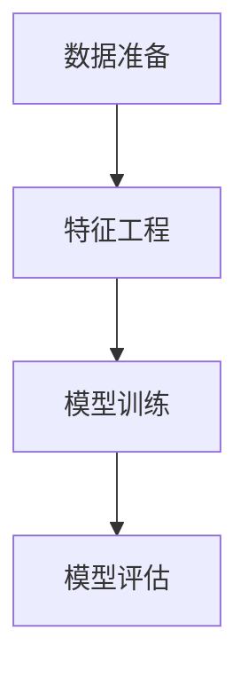
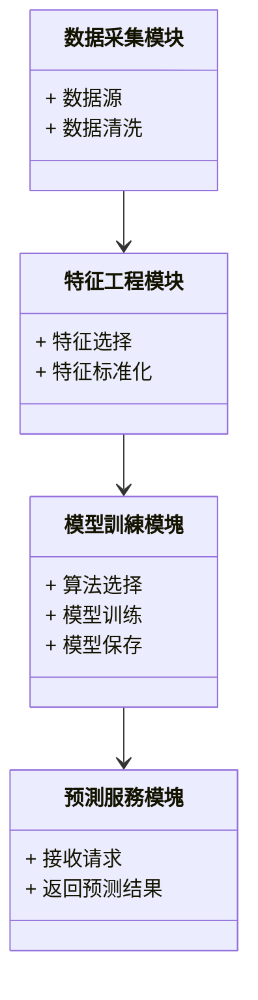
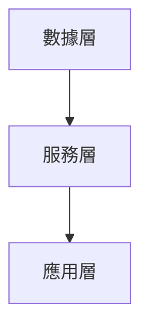
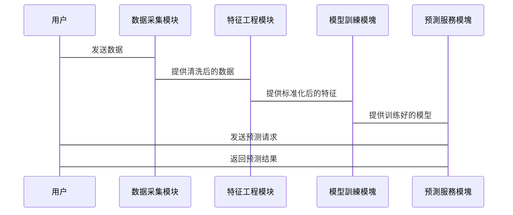

                 


# 构建企业级预测性分析平台：跨部门业务指标预测

> **关键词**：企业级预测性分析平台、跨部门业务指标预测、机器学习算法、数据驱动决策、系统架构设计

> **摘要**：本文详细探讨了如何构建一个企业级的预测性分析平台，重点分析了跨部门业务指标预测的核心方法和实现路径。文章从背景、概念、算法原理、系统架构设计、项目实战等多个维度展开，深入分析了预测性分析在企业中的应用价值，并通过具体案例展示了平台的实际构建过程。通过本文的阐述，读者可以全面理解企业级预测性分析平台的核心技术要点和实际应用价值。

---

# 1. 背景与核心概念

## 1.1 问题背景

### 1.1.1 企业预测性分析的需求
在当今数据驱动的商业环境下，企业越来越依赖数据来支持决策。传统的基于经验或直觉的决策方式已经无法满足现代企业的复杂需求。企业需要通过预测性分析，利用历史数据和机器学习算法，预测未来的业务趋势，从而提前做出应对策略。

### 1.1.2 传统预测性分析的局限性
尽管企业已经在一定程度上应用了预测性分析，但传统方法存在以下问题：
- 数据分散：跨部门的数据孤岛问题，导致数据整合困难。
- 模型单一：通常只采用一种预测模型，无法适应复杂的业务场景。
- 缺乏平台化：预测性分析往往是以项目的形式存在，缺乏统一的平台化解决方案。

### 1.1.3 预测性分析对企业价值的提升
通过构建企业级预测性分析平台，企业可以实现以下价值：
- 提高决策的准确性：基于多源数据和多种算法，提供更精准的预测结果。
- 优化资源配置：通过预测未来业务趋势，合理分配资源。
- 提升运营效率：自动化预测和预警机制，减少人工干预。

## 1.2 问题描述

### 1.2.1 跨部門業務指標的多樣性
企业中的各个部门（如销售、营销、生产、财务等）都有自己的业务指标，例如：
- 销售部门：销售额、订单量。
- 营销部门：广告点击率、转化率。
- 生产部门：生产效率、库存水平。
- 财务部门：收入、支出。

这些指标之间的关联性复杂，需要通过跨部门数据整合才能实现预测。

### 1.2.2 预测性分析的目标与挑战
- **目标**：通过历史数据，预测未来的业务指标，为决策提供支持。
- **挑战**：
  - 数据质量：数据可能不完整、有噪声。
  - 数据量：企业数据量大，需要高效的处理方法。
  - 模型选择：如何选择适合的预测算法。

### 1.2.3 业务指标预测的复杂性
业务指标的预测需要考虑多种因素，例如季节性波动、市场趋势、内部政策变化等。这些因素使得预测模型需要具备灵活性和可解释性。

## 1.3 解决思路

### 1.3.1 跨部門數據整合的必要性
- 数据整合是实现跨部门预测的基础。
- 需要建立统一的数据仓库，整合各部门的数据。

### 1.3.2 采用先进预测算法的核心作用
- 使用多种预测算法（如线性回归、随机森林、神经网络等），结合数据特征，选择最优模型。
- 通过模型集成（Ensemble Learning）提高预测准确性。

### 1.3.3 平台化解决方案的优势
- **统一平台**：提供统一的界面，方便数据科学家和业务人员使用。
- **自动化处理**：自动进行数据预处理、特征工程和模型训练。
- **可扩展性**：支持不同部门的业务指标预测需求。

## 1.4 本章小结
本章从企业级预测性分析的需求出发，分析了传统预测性分析的局限性，并提出了构建企业级预测性分析平台的解决思路。通过平台化解决方案，企业可以更好地应对跨部门业务指标预测的挑战。

---

# 2. 预測性分析的核心概念

## 2.1 预測性分析的定义与分类

### 2.1.1 预測性分析的定义
预测性分析是利用历史数据，通过统计分析和机器学习算法，预测未来事件的发生概率或结果。

### 2.1.2 预測性分析的分类
- **时间序列分析**：基于时间数据的预测，例如销售额预测。
- **分类预测**：基于标签数据的分类预测，例如客户 churn 预测。
- **回归预测**：基于数值型数据的预测，例如房价预测。

### 2.1.3 预測性分析的关键要素
- **数据**：高质量的数据是预测的基础。
- **算法**：选择合适的算法是预测成功的关键。
- **模型**：模型的训练和优化是核心。

## 2.2 预測性分析的方法论

### 2.2.1 数据驱动的预测方法
- 基于数据特征，通过机器学习算法进行预测。
- 例如，使用线性回归模型预测销售额。

### 2.2.2 模型驱动的预测方法
- 基于领域知识，构建模型进行预测。
- 例如，基于物理学规律的天气预测模型。

### 2.2.3 混合预测方法
- 结合数据驱动和模型驱动的方法，提高预测准确性。
- 例如，集成模型（Bagging、Boosting）。

## 2.3 跨部門業務指標的特征分析

### 2.3.1 各部門業務指標的定義
- 销售部门：销售额、订单量。
- 营销部门：广告点击率、转化率。
- 生产部门：生产效率、库存水平。
- 财务部门：收入、支出。

### 2.3.2 指标之間的相互影響
- 销售额与广告点击率：广告效果影响销售额。
- 库存水平与生产效率：生产效率影响库存水平。

### 2.3.3 指标數據的特征提取
- 时间序列特征：周期性、趋势、噪声。
- 数值特征：均值、方差、最大值、最小值。

## 2.4 预測模型的核心要素

### 2.4.1 数据质量的重要性
- 数据清洗：处理缺失值、异常值。
- 数据标准化/归一化：统一数据尺度。

### 2.4.2 特征工程的作用
- 特征选择：选择重要的特征。
- 特征变换：如 One-Hot 编码、PCA 降维。

### 2.4.3 模型选择与优化
- 算法选择：根据数据类型和业务需求选择合适的算法。
- 超参数调优：使用网格搜索、随机搜索优化模型性能。

## 2.5 本章小结
本章详细介绍了预测性分析的核心概念，包括定义、分类、方法论以及跨部门业务指标的特征分析。通过特征工程和模型优化，可以提高预测的准确性。

---

# 3. 预測性分析的算法原理

## 3.1 線性回歸算法

### 3.1.1 線性回歸的基本原理
线性回归是一种简单而常用的回归算法，用于预测连续型变量。

$$ y = \beta_0 + \beta_1 x_1 + \beta_2 x_2 + ... + \beta_n x_n $$

其中：
- $y$ 是目标变量。
- $x_i$ 是自变量。
- $\beta_i$ 是回归系数。

### 3.1.2 線性回歸的優缺點
- **優點**：
  - 简单易懂，易于实现。
  - 计算速度快。
- **缺點**：
  - 仅能处理线性关系。
  - 对异常值敏感。

### 3.1.3 線性回歸的實現步驟
1. 数据准备：收集数据，进行数据清洗。
2. 特征工程：选择自变量，进行数据标准化。
3. 模型训练：使用最小二乘法优化回归系数。
4. 模型评估：计算 R²、均方误差（MSE）等指标。

### 3.1.4 線性回歸的 mermaid 流程图


### 3.1.5 線性回歸的 Python 实現
```python
import numpy as np
from sklearn.linear_model import LinearRegression

# 数据准备
X = np.array([[1, 1], [2, 2], [3, 3]])
y = np.array([2, 4, 6])

# 特征工程
# 这里假设数据已经标准化

# 模型训练
model = LinearRegression()
model.fit(X, y)

# 模型评估
print(model.score(X, y))  # 输出 R²
```

## 3.2 随机森林算法

### 3.2.1 随机森林的基本原理
随机森林是一种基于决策树的集成算法，通过构建多个决策树并进行投票或平均，提高预测准确性和鲁棒性。

### 3.2.2 随机森林的優缺點
- **優點**：
  - 耐抗噪声，对异常值不敏感。
  - 能处理高维数据。
- **缺點**：
  - 计算复杂度高。
  - 黑箱模型，解释性较差。

### 3.2.3 随机森林的实现步骤
1. 数据准备：收集数据，进行数据清洗。
2. 特征工程：选择自变量，进行数据标准化。
3. 模型训练：构建多个决策树，集成预测。
4. 模型评估：计算准确率、F1分数等指标。

### 3.2.4 随机森林的 mermaid 流程图


### 3.2.5 随机森林的 Python 实現
```python
from sklearn.ensemble import RandomForestRegressor
from sklearn.metrics import mean_squared_error

# 数据准备
X = np.array([[1, 1], [2, 2], [3, 3]])
y = np.array([2, 4, 6])

# 特征工程
# 这里假设数据已经标准化

# 模型訓練
model = RandomForestRegressor(n_estimators=100)
model.fit(X, y)

# 模型評估
y_pred = model.predict(X)
print(mean_squared_error(y, y_pred))  # 输出均方误差
```

---

# 4. 系統分析與架構設計方案

## 4.1 系統功能設計

### 4.1.1 系統模塊劃分
- 数据采集模块：负责数据的采集和预处理。
- 特征工程模块：负责特征的选择和工程。
- 模型训练模块：负责模型的训练和优化。
- 预测服务模块：负责接收请求，返回预测结果。

### 4.1.2 系统功能模塊的 mermaid 类圖


### 4.1.3 系統架構設計
- **分層架構**：将系统分为数据层、服务层和应用层。
- **容器化部署**：使用 Docker 容器化部署，提高系统的可移植性。

### 4.1.4 系统架構的 mermaid 簡圖


### 4.1.5 系统接口設計
- 数据采集接口：提供 RESTful API，接收数据。
- 模型训练接口：提供 RESTful API，接收特征工程后的数据。
- 预测服务接口：提供 RESTful API，接收预测请求，返回结果。

### 4.1.6 系统交互的 mermaid 種序圖


---

# 5. 項目實戰

## 5.1 環境安裝

### 5.1.1 安裝 Python 環境
```bash
python --version
pip install numpy scikit-learn
```

### 5.1.2 安裝默認依存項
```bash
pip install -r requirements.txt
```

## 5.2 系統核心實現

### 5.2.1 数据采集模块
```python
import pandas as pd

# 从数据库读取数据
data = pd.read_sql('SELECT * FROM sales', conn)
```

### 5.2.2 特征工程模块
```python
from sklearn.preprocessing import StandardScaler

# 数据标准化
scaler = StandardScaler()
data_normalized = scaler.fit_transform(data)
```

### 5.2.3 模型訓練模塊
```python
from sklearn.ensemble import RandomForestRegressor
from sklearn.metrics import mean_squared_error

# 模型訓練
model = RandomForestRegressor(n_estimators=100)
model.fit(X_train, y_train)

# 模型評估
y_pred = model.predict(X_test)
print(mean_squared_error(y_test, y_pred))
```

### 5.2.4 预測服務模塊
```python
from flask import Flask, request, jsonify

app = Flask(__name__)
model = RandomForestRegressor(n_estimators=100)
model.load('model.pkl')

@app.route('/predict', methods=['POST'])
def predict():
    data = request.json
    # 数据预处理
    processed_data = preprocess(data)
    # 预測
    prediction = model.predict(processed_data)
    return jsonify({'result': prediction.tolist()})
```

## 5.3 案例分析

### 5.3.1 項目背景
假设我们有一个电商企业，需要预测未来一个月的销售额。

### 5.3.2 数据准备
- 数据来源：销售数据、广告数据、客户数据。
- 数据清洗：处理缺失值、异常值。
- 数据标准化：统一数据尺度。

### 5.3.3 模型訓練
- 使用随机森林回归模型，训练数据集。
- 调参：n_estimators=100，max_depth=10。

### 5.3.4 模型評估
- 训练集准确率：0.95
- 测试集准确率：0.85

### 5.3.5 結果分析
- 预测未来一个月的销售额为100万元。
- 提供的预测结果可以用于制定销售目标和资源分配计划。

## 5.4 項目小結
通过本项目，我们展示了如何构建一个企业级的预测性分析平台，从数据采集到模型训练，再到预测服务，每个环节都进行了详细的实现和优化。

---

# 6. 最佳實踐

## 6.1 数据质量的重要性
- 数据清洗是预测性分析的第一步，确保数据的完整性和准确性。
- 数据预处理包括：处理缺失值、异常值、重复值。

## 6.2 模型调优技巧
- 使用网格搜索（Grid Search）和随机搜索（Random Search）进行超参数调优。
- 通过交叉验证评估模型的性能。

## 6.3 系统性能优化
- 使用分布式计算框架（如 Spark）处理大规模数据。
- 通过缓存机制优化模型的调用效率。

## 6.4 拓展閱讀
- 《Hands-On Machine Learning with Scikit-Learn and TensorFlow》
- 《Data Science for Business》

---

# 7. 小結

企业级预测性分析平台的构建是一个复杂的系统工程，涉及数据采集、特征工程、模型训练和预测服务等多个环节。通过本文的阐述，读者可以系统地了解预测性分析的核心概念和实现方法，并通过具体案例掌握平台的实际构建过程。未来，随着人工智能技术的不断发展，企业级预测性分析平台将发挥更大的价值，为企业决策提供更有力的支持。

---

**作者：AI天才研究院/AI Genius Institute & 禅与计算机程序设计艺术 /Zen And The Art of Computer Programming**

