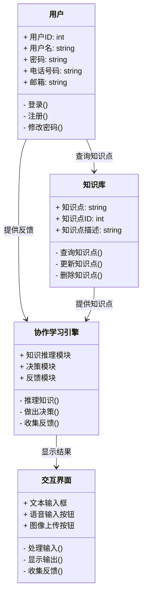
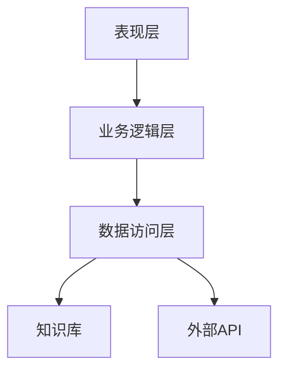
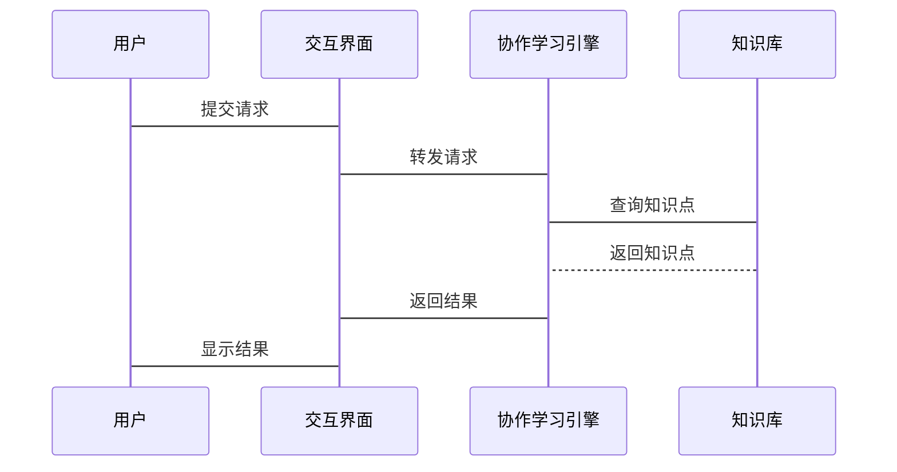

                 


# 构建具有人机协作学习能力的AI Agent

> 关键词：人机协作学习，AI Agent，知识表示，强化学习，系统架构

> 摘要：本文详细探讨了如何构建具有人机协作学习能力的AI Agent。从背景介绍、核心概念到算法原理，再到系统设计与项目实战，系统性地分析了AI Agent的构建过程。通过具体案例和代码实现，深入浅出地展示了人机协作学习的能力及其应用场景。

---

# 第一部分: 人机协作学习与AI Agent概述

# 第1章: 人机协作学习与AI Agent背景介绍

## 1.1 问题背景与描述

### 1.1.1 当前AI Agent的发展现状

随着人工智能技术的快速发展，AI Agent（智能体）已经在多个领域得到了广泛应用。AI Agent是一种能够感知环境、自主决策并执行任务的智能系统。然而，现有的AI Agent大多基于单点任务处理，缺乏与人类用户的协作学习能力。

### 1.1.2 人机协作学习的必要性

人机协作学习是指人类与AI Agent通过互动交流，共同完成知识学习、任务处理和问题解决的过程。在实际应用中，人机协作学习能够显著提高任务的效率和准确性，尤其是在复杂场景下，人类与AI Agent的协作能够发挥各自的优势。

### 1.1.3 问题解决的路径与方法

为了实现人机协作学习能力，AI Agent需要具备以下能力：
1. **知识表示与推理**：能够理解和处理人类提供的知识，并通过推理解决复杂问题。
2. **多模态交互**：支持文本、语音、图像等多种交互方式，提升用户体验。
3. **协作学习机制**：能够通过与人类的互动，不断优化自身的知识库和决策能力。

## 1.2 问题背景与概念解析

### 1.2.1 人机协作学习的核心问题

人机协作学习的核心问题在于如何实现人与AI Agent之间的高效互动与知识共享。这需要AI Agent具备以下能力：
- **理解人类意图**：通过自然语言处理技术，准确理解用户的输入。
- **知识更新与扩展**：根据人类的反馈，动态更新自身的知识库。
- **任务协作与优化**：在协作过程中，不断优化任务处理的效率和质量。

### 1.2.2 AI Agent的基本概念与定义

AI Agent是一种能够感知环境、自主决策并执行任务的智能系统。AI Agent可以通过传感器或用户输入感知环境，并通过内部逻辑推理做出决策，最后通过执行器完成任务。

### 1.2.3 问题的边界与外延

人机协作学习的边界主要体现在以下几个方面：
- **知识范围**：AI Agent的知识库范围决定了其协作能力。
- **交互方式**：支持的交互方式（如文本、语音、图像）影响协作效率。
- **任务复杂度**：AI Agent的能力决定了其能够处理的任务复杂度。

## 1.3 概念结构与核心要素

### 1.3.1 人机协作学习的系统架构

人机协作学习的系统架构通常包括以下几个部分：
- **知识库**：存储人类提供的知识和经验。
- **协作学习引擎**：负责知识的推理、更新和优化。
- **交互界面**：支持多种交互方式，如文本、语音、图像等。
- **决策模块**：根据当前任务需求，做出最优决策。

### 1.3.2 AI Agent的核心要素组成

AI Agent的核心要素包括：
- **感知模块**：用于感知环境和用户输入。
- **知识库**：存储AI Agent的知识和经验。
- **推理引擎**：负责知识的推理和逻辑判断。
- **决策模块**：根据推理结果做出决策。
- **执行模块**：执行决策结果并完成任务。

### 1.3.3 相关概念对比分析

通过对比分析人机协作学习与其他协作方式（如人机协同工作），可以更好地理解其特点和优势。表1对比了人机协作学习与传统协作方式的关键区别：

表1：人机协作学习与传统协作方式对比

| 特性               | 人机协作学习                 | 传统协作方式             |
|--------------------|------------------------------|--------------------------|
| 参与者             | AI Agent与人类               | 人类与人类               |
| 知识共享           | AI Agent主动学习与人类知识共享| 人类之间的知识共享       |
| 任务分工           | AI Agent负责数据处理与推理，人类提供指导与反馈| 任务分工明确，各司其职    |
| 互动方式           | 支持多模态交互               | 主要依赖语言或书面交流     |
| 学习与优化         | AI Agent能够动态学习与优化   | 人类通过经验总结优化任务 |

---

## 1.4 本章小结

本章主要介绍了人机协作学习与AI Agent的背景、概念和核心要素。通过分析人机协作学习的必要性与核心问题，读者可以理解AI Agent在协作学习中的重要作用。同时，通过对比分析，进一步明确了人机协作学习的独特优势与实现路径。

---

# 第二部分: 人机协作学习的核心概念与联系

# 第2章: 协作学习机制与知识表示

## 2.1 协作学习机制

### 2.1.1 协作学习的基本原理

协作学习是指多个参与者（人类与AI Agent）共同完成任务的过程。在人机协作学习中，AI Agent通过与人类的互动，逐步优化自身的知识库和决策能力。协作学习的基本原理包括以下几点：
1. **知识共享**：人类与AI Agent共同分享知识和经验。
2. **任务分工**：根据任务特点和各方优势，合理分配任务。
3. **互动反馈**：人类对AI Agent的决策提供反馈，帮助其优化性能。

### 2.1.2 基于知识图谱的协作学习

知识图谱是一种结构化的知识表示方式，能够有效地支持协作学习。通过知识图谱，AI Agent可以快速理解人类提供的知识，并通过推理解决复杂问题。

### 2.1.3 知识表示与推理机制

知识表示是协作学习的核心，常用的表示方法包括：
1. **符号表示**：使用符号逻辑表示知识。
2. **语义网络**：通过语义关系表示知识。
3. **知识图谱**：通过节点和边表示实体及其关系。

推理机制是基于知识表示的逻辑推理，常用的推理方法包括：
1. **逻辑推理**：基于逻辑规则进行推理。
2. **概率推理**：基于概率论进行推理。
3. **深度学习推理**：利用深度学习模型进行推理。

---

### 2.2 知识表示与推理

#### 2.2.1 知识图谱的构建方法

知识图谱的构建方法包括：
1. **数据抽取**：从结构化数据中抽取实体和关系。
2. **实体链接**：将实体与知识图谱中的节点进行映射。
3. **关系抽取**：从文本中抽取实体之间的关系。
4. **知识融合**：将多个来源的知识进行整合。

#### 2.2.2 知识表示的数学模型

知识表示的数学模型通常采用图论中的图结构。例如，知识图谱可以用图G表示，其中G = (V, E)，V表示实体，E表示实体之间的关系。

#### 2.2.3 基于图的推理算法

基于图的推理算法包括：
1. **广度优先搜索（BFS）**：用于查找最短路径。
2. **深度优先搜索（DFS）**：用于查找最长路径。
3. **图神经网络（GNN）**：利用深度学习方法进行图结构推理。

---

### 2.3 多模态交互与协作学习

#### 2.3.1 多模态数据的融合方法

多模态数据的融合方法包括：
1. **特征级融合**：在特征提取阶段融合不同模态的数据。
2. **决策级融合**：在决策阶段融合不同模态的结果。
3. **混合融合**：结合特征级和决策级融合的方法。

#### 2.3.2 基于语言模型的协作学习

语言模型在协作学习中具有重要作用。例如，通过自然语言处理技术，AI Agent可以理解用户的输入，并通过语言生成技术与用户进行互动。

#### 2.3.3 多模态交互的优化策略

多模态交互的优化策略包括：
1. **模态权重优化**：根据任务需求调整不同模态的权重。
2. **模态间协同优化**：通过模态间的协同作用优化整体性能。
3. **动态适应策略**：根据实时反馈动态调整交互方式。

---

### 2.4 实体关系图与协作学习

#### 2.4.1 实体关系图的构建

实体关系图的构建方法包括：
1. **数据抽取**：从文本中抽取实体和关系。
2. **关系推理**：通过推理算法推断隐含的关系。
3. **图结构优化**：通过优化算法提升图的连通性和合理性。

#### 2.4.2 实体关系图与协作学习的关系

实体关系图在协作学习中起着桥梁作用。通过实体关系图，AI Agent可以理解任务中的实体关系，并根据这些关系进行推理和决策。

#### 2.4.3 实体关系图的优化与应用

实体关系图的优化方法包括：
1. **节点优化**：优化实体的表示方式。
2. **边优化**：优化实体间关系的表示方式。
3. **图结构优化**：优化整个图的结构，提升推理效率。

---

## 2.5 本章小结

本章详细探讨了协作学习机制与知识表示的核心概念。通过分析基于知识图谱的协作学习、知识表示与推理机制，以及多模态交互与协作学习的关系，读者可以更好地理解人机协作学习的实现原理。

---

# 第三部分: 人机协作学习的算法原理

# 第3章: 协作学习的算法原理

## 3.1 算法原理概述

### 3.1.1 协作学习的基本算法

协作学习的基本算法包括：
1. **基于规则的协作学习**：通过预定义规则进行协作。
2. **基于机器学习的协作学习**：通过机器学习模型进行协作。
3. **基于强化学习的协作学习**：通过强化学习算法进行协作。

### 3.1.2 基于强化学习的协作学习

强化学习是一种通过试错机制优化决策的算法。在协作学习中，强化学习可以通过以下步骤实现：
1. **状态表示**：将任务状态表示为环境的状态。
2. **动作选择**：根据当前状态选择最优动作。
3. **奖励机制**：根据动作的结果给予奖励或惩罚。
4. **策略优化**：根据奖励优化策略。

### 3.1.3 基于监督学习的协作学习

监督学习是一种通过标签数据进行学习的算法。在协作学习中，监督学习可以通过以下步骤实现：
1. **数据标注**：对数据进行标注。
2. **模型训练**：基于标注数据训练模型。
3. **模型应用**：将训练好的模型应用于实际任务。

---

### 3.2 强化学习算法

#### 3.2.1 强化学习的基本原理

强化学习的基本原理是通过试错机制优化决策。强化学习的核心要素包括：
1. **状态（State）**：表示环境的状态。
2. **动作（Action）**：表示智能体可以采取的动作。
3. **奖励（Reward）**：表示智能体采取动作后获得的奖励或惩罚。
4. **策略（Policy）**：表示智能体采取动作的概率分布。

#### 3.2.2 协作学习的强化学习框架

协作学习的强化学习框架包括以下几个部分：
1. **状态表示**：将任务状态表示为环境的状态。
2. **动作选择**：根据当前状态选择最优动作。
3. **奖励机制**：根据动作的结果给予奖励或惩罚。
4. **策略优化**：根据奖励优化策略。

#### 3.2.3 基于多智能体的强化学习

基于多智能体的强化学习是协作学习的重要实现方式。通过多个智能体的协作，可以实现复杂任务的高效完成。

---

### 3.3 算法流程图

#### 3.3.1 协作学习的算法流程

协作学习的算法流程包括：
1. **初始化**：初始化智能体的知识库和参数。
2. **感知环境**：感知环境并获取输入。
3. **知识表示与推理**：将输入转化为知识表示，并进行推理。
4. **决策与执行**：根据推理结果做出决策并执行任务。
5. **反馈与优化**：根据反馈优化知识库和决策策略。

#### 3.3.2 基于强化学习的协作学习流程

基于强化学习的协作学习流程包括：
1. **状态表示**：将任务状态表示为环境的状态。
2. **动作选择**：根据当前状态选择最优动作。
3. **奖励机制**：根据动作的结果给予奖励或惩罚。
4. **策略优化**：根据奖励优化策略。

#### 3.3.3 基于监督学习的协作学习流程

基于监督学习的协作学习流程包括：
1. **数据标注**：对数据进行标注。
2. **模型训练**：基于标注数据训练模型。
3. **模型应用**：将训练好的模型应用于实际任务。

---

## 3.4 本章小结

本章详细探讨了协作学习的算法原理。通过分析基于强化学习和监督学习的协作学习算法，以及算法流程图，读者可以更好地理解人机协作学习的实现过程。

---

# 第四部分: 系统分析与架构设计

# 第4章: 系统分析与架构设计

## 4.1 问题场景介绍

### 4.1.1 人机协作学习的应用场景

人机协作学习的应用场景包括：
1. **智能助手**：帮助用户完成日常任务，如信息查询、任务提醒等。
2. **智能教育**：辅助教师进行教学，提供个性化的学习建议。
3. **智能客服**：提供高效的客户支持服务。

### 4.1.2 AI Agent的典型应用案例

AI Agent的典型应用案例包括：
1. **智能音箱**：通过语音交互为用户提供服务。
2. **智能助手**：帮助用户完成各种任务。
3. **智能客服**：提供高效的客户支持服务。

### 4.1.3 系统需求分析

系统需求分析包括：
1. **功能需求**：实现人机协作学习的核心功能。
2. **性能需求**：确保系统的高效性和稳定性。
3. **交互需求**：支持多种交互方式，提升用户体验。

---

## 4.2 系统功能设计

### 4.2.1 领域模型设计

领域模型设计包括：
1. **知识库设计**：设计知识库的结构和存储方式。
2. **协作学习引擎设计**：设计协作学习引擎的功能和实现方式。
3. **交互界面设计**：设计交互界面的布局和功能。

#### 4.2.1.1 领域模型Mermaid类图



### 4.2.2 功能模块划分

功能模块划分包括：
1. **知识库模块**：负责知识的存储与管理。
2. **协作学习引擎模块**：负责协作学习的核心逻辑。
3. **交互界面模块**：负责与用户的交互。

### 4.2.3 系统功能流程设计

系统功能流程设计包括：
1. **用户输入**：用户通过交互界面输入需求。
2. **知识推理**：协作学习引擎根据用户输入进行知识推理。
3. **决策与执行**：协作学习引擎根据推理结果做出决策并执行任务。
4. **反馈与优化**：用户对结果进行反馈，系统根据反馈优化知识库和决策策略。

---

## 4.3 系统架构设计

### 4.3.1 系统架构设计

系统架构设计包括：
1. **分层架构**：将系统划分为表现层、业务逻辑层和数据访问层。
2. **微服务架构**：将系统功能拆分为多个微服务，提升系统的扩展性和维护性。

#### 4.3.1.1 系统架构Mermaid架构图



### 4.3.2 接口与交互设计

接口与交互设计包括：
1. **API设计**：设计系统的API接口，规范接口的输入输出。
2. **交互流程设计**：设计用户与系统之间的交互流程。

#### 4.3.2.1 交互流程Mermaid序列图



---

## 4.4 本章小结

本章详细探讨了系统分析与架构设计的核心内容。通过分析问题场景、功能设计和系统架构，读者可以更好地理解人机协作学习系统的实现过程。

---

# 第五部分: 项目实战

# 第5章: 项目实战

## 5.1 环境安装

### 5.1.1 安装Python

```bash
python --version
pip install --upgrade pip
```

### 5.1.2 安装必要的Python库

```bash
pip install numpy
pip install matplotlib
pip install scikit-learn
pip install spacy
pip install transformers
pip install pymermaid
```

## 5.2 核心代码实现

### 5.2.1 知识库模块实现

```python
class KnowledgeBase:
    def __init__(self):
        self.knowledge = {}

    def add_knowledge(self, key, value):
        self.knowledge[key] = value

    def get_knowledge(self, key):
        return self.knowledge.get(key, None)

    def update_knowledge(self, key, value):
        if key in self.knowledge:
            self.knowledge[key] = value
```

### 5.2.2 协作学习引擎实现

```python
class CollaborativeLearningEngine:
    def __init__(self, knowledge_base):
        self.knowledge_base = knowledge_base

    def infer(self, input):
        # 简单的推理逻辑，可根据需求扩展
        return self.knowledge_base.get_knowledge(input)

    def decide(self, input):
        # 简单的决策逻辑，可根据需求扩展
        return input

    def feedback(self, input, result):
        # 简单的反馈逻辑，可根据需求扩展
        pass
```

### 5.2.3 交互界面实现

```python
class Interface:
    def __init__(self):
        self.knowledge_base = KnowledgeBase()
        self.collaborative_learning_engine = CollaborativeLearningEngine(self.knowledge_base)

    def process_input(self, input):
        result = self.collaborative_learning_engine.decide(input)
        return result

    def display_output(self, output):
        print(output)
```

## 5.3 案例分析与代码解读

### 5.3.1 知识库模块案例

```python
kb = KnowledgeBase()
kb.add_knowledge("weather", "晴天")
kb.add_knowledge("temperature", "25度")
print(kb.get_knowledge("weather"))  # 输出：晴天
print(kb.get_knowledge("humidity"))  # 输出：None
kb.update_knowledge("temperature", "26度")
print(kb.get_knowledge("temperature"))  # 输出：26度
```

### 5.3.2 协作学习引擎案例

```python
interface = Interface()
interface.display_output("请输入查询内容：")
input = input()
result = interface.process_input(input)
interface.display_output(f"查询结果：{result}")
```

## 5.4 项目小结

通过以上代码实现，我们可以看到人机协作学习系统的实现过程。从知识库的管理到协作学习引擎的推理与决策，再到交互界面的处理，每个部分都起到了重要作用。通过实际案例的分析，读者可以更好地理解系统的实现细节。

---

# 第六部分: 总结与展望

## 6.1 总结

通过本文的详细探讨，我们了解了人机协作学习与AI Agent的核心概念、算法原理和系统架构。通过实际项目的实战，我们进一步掌握了系统的实现方法。人机协作学习的能力是AI Agent的重要组成部分，未来随着技术的发展，AI Agent将在更多领域发挥重要作用。

## 6.2 展望

未来，随着人工智能技术的不断进步，人机协作学习的能力将更加智能化和多样化。AI Agent将具备更强的自主学习能力和协作能力，能够更好地服务于人类社会。

---

# 作者

作者：AI天才研究院/AI Genius Institute & 禅与计算机程序设计艺术 /Zen And The Art of Computer Programming

