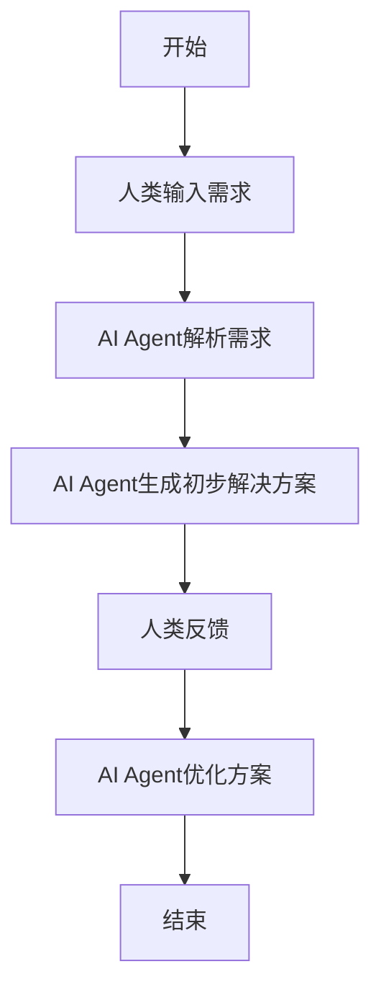
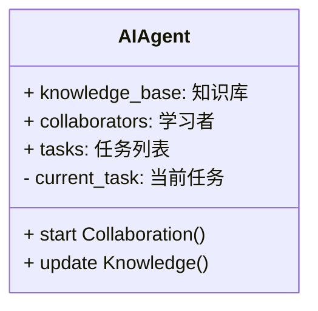
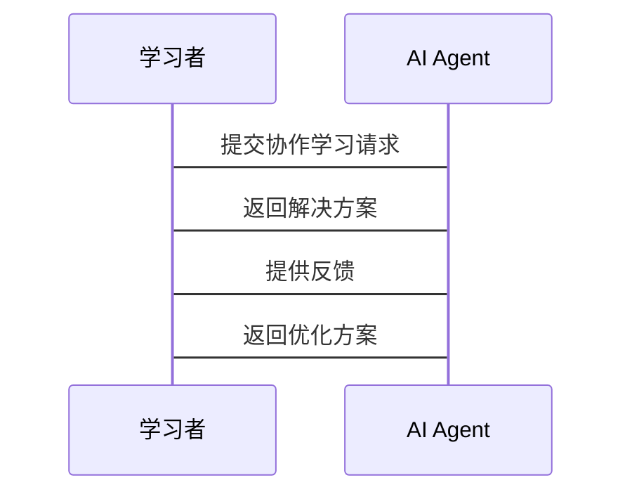

                 


# 构建具有人机协作学习能力的AI Agent系统

## 关键词：
AI Agent，人机协作学习，机器学习，自然语言处理，系统架构，算法实现

## 摘要：
本文系统地介绍如何构建一个具备人机协作学习能力的AI Agent系统。从概念解析到系统架构设计，再到算法实现，深入探讨实现人机协作学习的关键技术。通过具体案例分析，展示系统的实际应用价值，为读者提供从理论到实践的全面指导。

---

## 第一部分：背景介绍

### 第1章：AI Agent的基本概念

#### 1.1 AI Agent的定义与特点
AI Agent（智能体）是能够感知环境并采取行动以实现目标的实体。其特点包括自主性、反应性、目标导向和社会能力。

- **自主性**：AI Agent无需外部干预，自主决策。
- **反应性**：能实时感知环境变化并调整行为。
- **目标导向**：所有行动均以实现特定目标为导向。
- **社会能力**：能与其他实体（人类或其他智能体）有效协作。

#### 1.2 人机协作学习的定义
人机协作学习是指人类与机器共同参与学习过程，结合人类的直觉和经验与机器的数据处理和计算能力，共同完成学习任务。

- **定义**：人类与AI Agent共同参与，结合各自优势。
- **特点**：
  - 互动性：实时互动，信息交换。
  - 协作性：共同完成任务，优势互补。
  - 环境适应性：适应动态变化的环境。

#### 1.3 AI Agent与人机协作学习的必要性
AI Agent依赖数据和算法，但在动态和复杂环境中表现受限。人机协作学习弥补了这些不足，提升系统的适应性和灵活性。

- **当前趋势**：AI Agent在各领域的广泛应用。
- **必要性**：提升环境适应性和知识更新能力。

---

### 第2章：人机协作学习的背景与问题描述

#### 2.1 当前AI Agent的挑战
AI Agent面临数据依赖、环境适应性和知识更新性等挑战。

- **数据依赖性**：需要大量数据支持，影响实时性和泛化能力。
- **环境适应性**：动态环境中的适应性不足。
- **知识更新性**：知识更新困难，难以应对快速变化。

#### 2.2 人机协作学习的背景
随着知识图谱和大模型的发展，协作学习成为提升AI Agent能力的关键。

- **知识图谱**：结构化知识表示，增强语义理解。
- **大模型**：强大的语义理解能力，提供协作基础。
- **协作学习**：结合人类经验与机器学习，提升灵活性和泛化能力。

#### 2.3 问题解决与边界
人机协作学习解决AI Agent在动态环境中的适应性和知识更新问题，边界在于特定领域和任务。

- **问题解决**：动态环境中的实时决策和知识更新。
- **边界**：局限于特定领域和任务。

---

## 第二部分：核心概念与联系

### 第3章：AI Agent与人机协作学习的原理

#### 3.1 AI Agent的协作学习机制
AI Agent通过与人类协作，实时更新知识库，提升任务完成能力。

- **知识共享**：实时交换信息，更新知识库。
- **任务分配**：动态分配任务，发挥各自优势。
- **反馈机制**：人类反馈用于优化模型。

#### 3.2 人机协作学习的实现方式
通过自然语言处理和强化学习，实现人类与AI Agent的有效协作。

- **自然语言处理**：支持自然语言交互，理解意图。
- **强化学习**：通过奖励机制优化协作策略。

---

### 第4章：核心概念的关系

#### 4.1 实体关系分析
绘制ER图，展示AI Agent、学习者、任务和知识库的关系。

- **AI Agent**：系统核心，执行任务。
- **学习者**：人类参与协作学习。
- **任务**：具体的学习任务。
- **知识库**：存储和更新知识。

```mermaid
er
    %% AI Agent与人机协作学习实体关系图
    actor 学习者
    class AI Agent
    class 任务
    class 知识库

    学习者 --> AI Agent: 发起协作学习
    AI Agent --> 任务: 执行任务
    AI Agent --> 知识库: 查询和更新知识
```

#### 4.2 算法流程分析
展示人机协作学习的算法流程。



---

## 第三部分：算法原理

### 第5章：人机协作学习的核心算法

#### 5.1 基础算法
- **强化学习**：通过奖励机制优化策略。
- **监督学习**：基于标注数据进行训练。

#### 5.2 数学模型
展示协作学习的数学模型。

- **损失函数**：$$ L = \sum (y_i - \hat{y_i})^2 $$
- **优化目标**：$$ \min_{\theta} L $$

#### 5.3 算法实现
使用Python代码实现基础算法。

```python
import numpy as np

# 示例：监督学习实现
def loss(y_true, y_pred):
    return np.mean((y_true - y_pred)**2)

def optimize(theta, learning_rate=0.01):
    return theta - learning_rate * (theta * 2)
```

---

### 第6章：算法流程与优化

#### 6.1 算法流程
详细步骤：

1. 初始化参数。
2. 输入需求。
3. 解析需求。
4. 生成解决方案。
5. 反馈优化。
6. 输出结果。

#### 6.2 优化策略
结合强化学习，通过反馈优化模型参数。

- **参数更新**：$$ \theta_{new} = \theta_{old} - \alpha \nabla L $$
- **奖励机制**：根据反馈调整奖励，优化策略。

---

## 第四部分：系统分析与架构设计

### 第7章：系统功能设计

#### 7.1 领域模型
展示系统功能模块的类图。



#### 7.2 系统架构
展示系统架构图。

```mermaid
graph TD
    AI Agent --> 知识库
    AI Agent --> 学习者
    AI Agent --> 任务管理器
```

#### 7.3 接口设计
定义系统接口，如开始协作、更新知识和反馈优化。

- **开始协作**：```start Collaboration()```
- **更新知识**：```update Knowledge()```
- **反馈优化**：```optimize Strategy()```

---

### 第8章：交互流程

#### 8.1 交互流程图
展示协作学习的交互流程。



---

## 第五部分：项目实战

### 第9章：环境安装与代码实现

#### 9.1 环境安装
安装必要的库，如numpy、tensorflow。

```bash
pip install numpy tensorflow
```

#### 9.2 核心代码实现
实现协作学习的Python代码。

```python
import numpy as np
import tensorflow as tf

# 示例代码：神经网络模型
model = tf.keras.Sequential([
    tf.keras.layers.Dense(64, activation='relu'),
    tf.keras.layers.Dense(10, activation='softmax')
])
model.compile(optimizer='adam', loss='sparse_categorical_crossentropy', metrics=['accuracy'])
```

---

### 第10章：案例分析与总结

#### 10.1 案例分析
展示一个协作学习的案例，如自然语言处理任务。

#### 10.2 总结
总结经验，优化建议，未来展望。

---

## 第六部分：最佳实践

### 第11章：小结与注意事项

#### 11.1 小结
回顾内容，强调系统设计和实现的关键点。

#### 11.2 注意事项
- 数据质量：确保数据准确性和多样性。
- 模型选择：根据任务选择合适模型。
- 交互设计：优化人机交互体验。

### 第12章：未来展望

探讨人机协作学习的发展趋势，如多模态协作、边缘计算等。

---

## 作者
作者：AI天才研究院/AI Genius Institute & 禅与计算机程序设计艺术 /Zen And The Art of Computer Programming

---

本文系统地阐述了构建具有人机协作学习能力的AI Agent系统的各个方面，从基础概念到算法实现，再到系统设计和项目实战，为读者提供了全面的指导。

