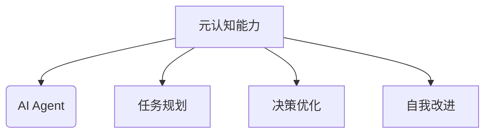
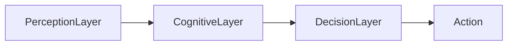

                 


# 构建具有元认知能力的AI Agent

> 关键词：元认知能力，AI Agent，元学习，强化学习，系统架构设计

> 摘要：本文详细探讨了构建具有元认知能力的AI Agent的各个方面，包括核心概念、算法原理、系统架构设计、项目实战以及最佳实践。通过深入分析元认知能力在AI Agent中的作用，结合实际案例和详细的技术实现，为读者提供了从理论到实践的全面指导。

---

## 第一部分：元认知与AI Agent概述

### 第1章：元认知与AI Agent的基本概念

#### 1.1 元认知的定义与特点

元认知（Metacognition）是指对自身认知过程的认知和调控能力。它包括对思维过程的监控、评估和调整。元认知的核心特点包括：

1. **自我监控**：能够实时监控自身的认知过程。
2. **自我评估**：能够评估当前的认知状态和任务需求。
3. **自我调控**：能够根据评估结果调整认知策略。

元认知与认知的关系是元认知是认知过程的监控者和调节者，通过元认知，个体能够更有效地完成复杂任务。

#### 1.2 AI Agent的定义与特点

AI Agent（人工智能代理）是一种能够感知环境并采取行动以实现目标的智能实体。其特点包括：

1. **自主性**：能够在没有外部干预的情况下独立运作。
2. **反应性**：能够实时感知环境并做出反应。
3. **目标导向性**：所有行为都以实现特定目标为导向。

AI Agent与传统程序的区别在于，AI Agent具有自主性和目标导向性，能够动态调整行为以适应环境变化。

#### 1.3 元认知能力在AI Agent中的作用

元认知能力在AI Agent中的作用主要体现在以下几个方面：

1. **任务规划**：通过元认知能力，AI Agent能够更好地规划任务，优化行动步骤。
2. **决策优化**：元认知能力帮助AI Agent在决策过程中考虑更全面的因素，提高决策质量。
3. **自我改进**：通过元认知能力，AI Agent能够自我监控和评估，从而不断改进自身的性能。

---

### 第2章：元认知与AI Agent的结合

#### 2.1 元认知能力在AI Agent中的实现

元认知能力的实现需要构建一个元认知模型，该模型能够监控、评估和调整AI Agent的认知过程。具体实现方法包括：

1. **元认知模型的构建**：通过定义元认知的各个组成部分，如监控模块、评估模块和调控模块，构建一个完整的元认知模型。
2. **元认知能力的实现方法**：通过算法实现元认知的监控、评估和调整功能。
3. **元认知与AI Agent的交互机制**：定义元认知与AI Agent之间的交互接口和通信机制。

#### 2.2 元认知能力在AI Agent中的应用

元认知能力在AI Agent中的应用主要体现在以下几个方面：

1. **任务规划**：通过元认知能力，AI Agent能够更有效地规划任务，优化行动步骤。
2. **决策优化**：元认知能力帮助AI Agent在决策过程中考虑更全面的因素，提高决策质量。
3. **自我改进**：通过元认知能力，AI Agent能够自我监控和评估，从而不断改进自身的性能。

#### 2.3 元认知能力对AI Agent性能的提升

元认知能力对AI Agent性能的提升主要体现在以下几个方面：

1. **提高效率**：通过元认知能力的监控和调整，AI Agent能够更高效地完成任务。
2. **增强适应性**：元认知能力帮助AI Agent更好地适应环境变化，提高其适应性。
3. **提升可解释性**：通过元认知能力的监控和调整，AI Agent的行为更加透明，提高其可解释性。

---

### 第3章：元认知能力的核心概念与联系

#### 3.1 元认知能力的核心概念

元认知能力的核心概念包括：

1. **元认知的定义**：元认知是对自身认知过程的认知和调控能力。
2. **元认知的属性特征**：包括自我监控、自我评估和自我调控。
3. **元认知的核心要素**：包括元认知知识、元认知体验和元认知调节。

#### 3.2 元认知能力与AI Agent的关系

元认知能力与AI Agent的关系主要体现在以下几个方面：

1. **元认知能力在AI Agent中的作用**：元认知能力是AI Agent实现自我监控、评估和调整的重要手段。
2. **元认知与AI Agent的交互机制**：通过定义元认知与AI Agent之间的交互接口和通信机制，实现元认知能力的有效应用。
3. **元认知能力对AI Agent智能性的提升**：通过元认知能力，AI Agent能够更智能地完成任务，提高其整体性能。

#### 3.3 元认知能力的实体关系图



---

### 第4章：元认知能力的算法原理

#### 4.1 元学习算法

元学习（Meta-Learning）是一种通过学习如何学习来提升模型性能的算法。其基本原理是通过在多个任务上进行学习，模型能够提取出适用于新任务的通用特征。

##### 4.1.1 元学习的算法流程

1. **初始化**：初始化模型参数和元学习器参数。
2. **任务采样**：从任务分布中采样多个任务。
3. **任务学习**：在每个任务上进行学习，更新模型参数。
4. **元学习**：通过元学习器优化模型的更新规则，提升模型在新任务上的表现。

##### 4.1.2 元学习的数学模型

元学习的数学模型通常包括两个层次：任务水平和元水平。任务水平的模型用于具体任务的学习，元水平的模型用于优化任务水平模型的参数更新规则。

##### 4.1.3 元学习的代码实现

以下是一个简单的元学习算法（如Meta-SGD）的Python实现示例：

```python
import torch

def meta_sgd(inner_model, meta_model, inner_optimizer, meta_optimizer, tasks, num_steps, meta_step_size):
    for task in tasks:
        # 克隆模型参数
        cloned_model = meta_model.clone()
        # 在任务上进行几步梯度下降
        for step in range(num_steps):
            loss = cloned_model.loss(task)
            inner_optimizer.zero_grad()
            loss.backward()
            inner_optimizer.step()
        # 计算梯度，并将梯度应用到元模型
        meta_optimizer.zero_grad()
        meta gradients = compute_meta_gradients(meta_model, cloned_model, tasks)
        meta_optimizer.step()

    return meta_model
```

---

#### 4.2 强化学习算法

强化学习（Reinforcement Learning）是一种通过与环境交互来学习最优策略的算法。其基本原理是通过试错的方式，使智能体在与环境的交互中学习到最优策略。

##### 4.2.1 强化学习的算法流程

1. **初始化**：初始化智能体的策略参数和环境。
2. **与环境交互**：智能体根据当前策略选择动作，与环境进行交互。
3. **更新策略**：根据获得的奖励，更新策略参数，以最大化未来奖励。

##### 4.2.2 强化学习的数学模型

强化学习的数学模型通常包括状态（State）、动作（Action）、奖励（Reward）和策略（Policy）四个核心概念。策略函数通常表示为：

$$ \pi(a|s) = P(\text{采取动作 } a \text{ 在状态 } s) $$

##### 4.2.3 强化学习的代码实现

以下是一个简单的强化学习算法（如Q-Learning）的Python实现示例：

```python
import numpy as np

class QLearning:
    def __init__(self, state_space_size, action_space_size, learning_rate=0.1, gamma=0.9):
        self.q_table = np.zeros((state_space_size, action_space_size))
        self.learning_rate = learning_rate
        self.gamma = gamma

    def choose_action(self, state):
        return np.argmax(self.q_table[state])

    def update_q_table(self, state, action, reward, next_state):
        current_q = self.q_table[state][action]
        next_max_q = np.max(self.q_table[next_state])
        self.q_table[state][action] = current_q + self.learning_rate * (reward + self.gamma * next_max_q - current_q)

    def get_q_value(self, state, action):
        return self.q_table[state][action]
```

---

## 第5章：系统分析与架构设计

### 5.1 项目背景与目标

本项目旨在构建一个具有元认知能力的AI Agent，使其能够通过元认知能力实现自我监控、评估和调整，从而提高其在复杂任务中的性能。

### 5.2 系统功能设计

系统功能设计包括以下几个方面：

1. **任务规划模块**：负责生成和优化任务执行的步骤。
2. **决策优化模块**：负责优化AI Agent的决策过程。
3. **自我改进模块**：负责根据元认知能力的评估结果，调整和优化AI Agent的性能。

### 5.3 系统架构设计

系统架构设计采用分层架构，包括感知层、认知层和决策层。感知层负责环境感知，认知层负责任务规划和决策优化，决策层负责执行决策。



---

## 第6章：项目实战

### 6.1 项目环境配置

项目环境配置包括安装必要的依赖库，如TensorFlow、PyTorch等。

### 6.2 核心代码实现

以下是一个简单的具有元认知能力的AI Agent的Python实现示例：

```python
class MetaCognitiveAgent:
    def __init__(self, model, meta_model, optimizer, meta_optimizer):
        self.model = model
        self.meta_model = meta_model
        self.optimizer = optimizer
        self.meta_optimizer = meta_optimizer

    def clone_model(self):
        # 克隆模型参数
        cloned_model = self.meta_model.clone()
        return cloned_model

    def update_model(self, cloned_model, tasks, num_steps, meta_step_size):
        for task in tasks:
            for step in range(num_steps):
                loss = cloned_model.loss(task)
                self.optimizer.zero_grad()
                loss.backward()
                self.optimizer.step()
            meta_gradients = compute_meta_gradients(self.meta_model, cloned_model, tasks)
            self.meta_optimizer.zero_grad()
            for param, grad in meta_gradients.items():
                param.grad = grad
            self.meta_optimizer.step()
```

---

## 第7章：最佳实践与总结

### 7.1 最佳实践

在实际应用中，建议从简单的任务开始，逐步增加任务的复杂性。同时，需要定期监控和评估AI Agent的性能，并根据评估结果进行调整和优化。

### 7.2 小结

通过本文的详细讲解，读者可以了解到构建具有元认知能力的AI Agent的核心概念、算法原理、系统架构设计以及项目实战的全过程。

### 7.3 注意事项

在实际应用中，需要注意以下几点：

1. **数据质量**：数据的质量直接影响AI Agent的性能，需要确保数据的准确性和完整性。
2. **模型选择**：选择合适的模型和算法，根据任务需求进行调整和优化。
3. **性能监控**：定期监控和评估AI Agent的性能，及时发现问题并进行调整。

### 7.4 拓展阅读

推荐读者进一步阅读以下资料：

1. **《Deep Learning》**：作者：Ian Goodfellow, Yoshua Bengio, Aaron Courville。
2. **《Reinforcement Learning: Theory and Algorithms》**：作者：Richard S. Sutton, Andrew G. Barto。
3. **《Meta-Learning: A Survey》**：作者：Filip Ferko, Bernardo Magnini。

---

## 作者信息

作者：AI天才研究院/AI Genius Institute & 禅与计算机程序设计艺术 /Zen And The Art of Computer Programming

---

以上是《构建具有元认知能力的AI Agent》的完整目录大纲和部分内容，希望对您有所帮助！

