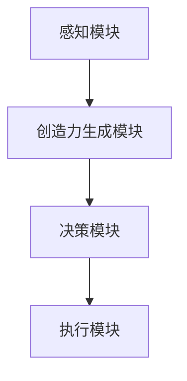
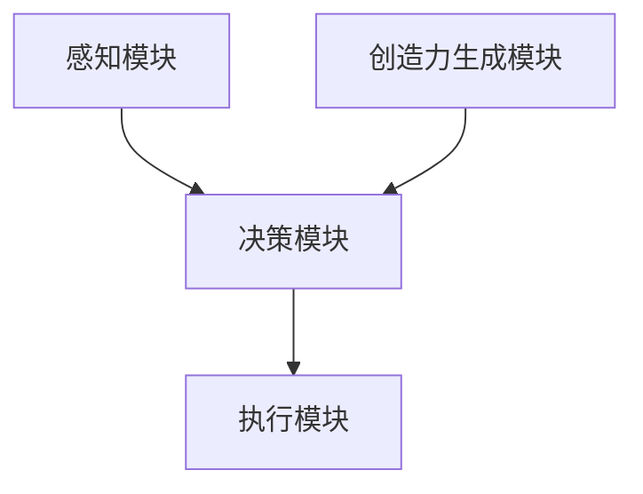
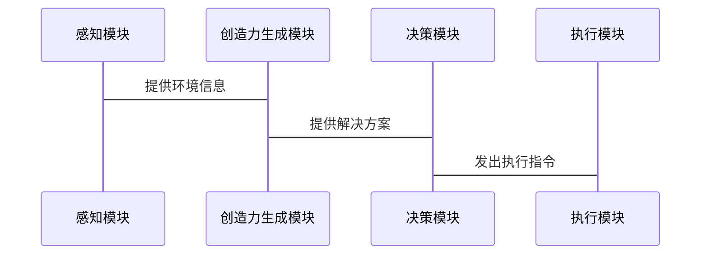

                 


# 构建具有创造力的AI Agent

> 关键词：AI Agent, 创造力, 生成模型, 强化学习, 系统设计, 创意生成

> 摘要：本文探讨了如何构建一个具有创造力的AI Agent，从创造力的理论基础到AI Agent的技术实现，再到系统的整体设计与实战案例，详细分析了创造力在AI Agent中的应用与实现。通过本文，读者可以了解如何将创造力这一复杂的人类特性融入AI系统，并通过具体的技术手段实现创造力驱动的智能体。

---

# 第1章 创造力与AI Agent概述

## 1.1 创造力的定义与特征

创造力是人类独有的认知能力之一，它是指个体在解决问题或完成任务时，能够提出新颖、独特且具有价值的解决方案的能力。创造力的核心特征包括：

1. **新颖性**：解决方案的独特性和独特性。
2. **有用性**：解决方案的实际价值和可行性。
3. **灵活性**：能够适应不同场景和需求。
4. **复杂性**：创造力的实现通常需要处理多维度的问题。

创造力的评估标准包括：

1. 创新性：解决方案的原创性。
2. 实用性：解决方案的实际价值。
3. 复杂性：解决方案的复杂程度。

## 1.2 AI Agent的基本概念

AI Agent（人工智能代理）是指能够感知环境、自主决策并执行任务的智能体。AI Agent的核心属性包括：

1. **自主性**：能够在没有外部干预的情况下自主决策。
2. **反应性**：能够实时感知环境并做出反应。
3. **目标导向性**：具有明确的目标，并能够为实现目标采取行动。

AI Agent的分类包括：

1. **简单反射型AI Agent**：基于当前输入做出反应，不涉及复杂推理。
2. **基于模型的AI Agent**：利用内部模型进行推理和决策。
3. **目标导向型AI Agent**：具有明确的目标，并采取行动以实现目标。

## 1.3 创造力在AI Agent中的重要性

创造力是AI Agent在复杂场景中实现目标的关键能力。通过创造力，AI Agent可以：

1. **解决复杂问题**：在面对非结构化问题时，创造力能够帮助AI Agent提出创新的解决方案。
2. **适应动态环境**：创造力使AI Agent能够灵活应对环境的变化，提出新的策略。
3. **提升用户体验**：创造力可以使得AI Agent提供的服务更加个性化和多样化，提升用户体验。

创造力对AI Agent性能的影响包括：

1. **提高决策质量**：创造力能够帮助AI Agent在决策过程中提出更优的解决方案。
2. **增强适应性**：创造力使AI Agent能够更好地适应不同场景和需求。
3. **提升创新性**：创造力是AI Agent实现创新应用的核心驱动力。

---

# 第2章 创造力的理论基础

## 2.1 创造力的层次模型

创造力的层次模型包括以下几个层次：

1. **知识基础**：创造力的实现依赖于广泛的知识储备。
2. **认知过程**：包括记忆、推理、联想等认知过程。
3. **情感因素**：情感状态对创造力具有重要影响。
4. **个性特征**：包括开放性、好奇心等个性特质。

## 2.2 创造力的心理学基础

创造力的心理学基础包括以下几个方面：

1. **认知过程**：创造力的实现依赖于记忆、联想、推理等认知过程。
2. **情感因素**：积极的情感状态有助于创造力的发挥。
3. **个性特征**：开放性、好奇心等个性特征与创造力密切相关。

## 2.3 创造力的评估方法

创造力的评估方法包括：

1. **定性评估**：通过专家评审等方式对创造力进行评估。
2. **定量评估**：通过数学模型对创造力进行量化评估。
3. **综合评估**：结合定性与定量评估方法，对创造力进行全面评估。

---

# 第3章 创造力的生成模型

## 3.1 基于生成对抗网络的创造力模型

### 3.1.1 GAN的基本原理

生成对抗网络（GAN）由生成器和判别器两部分组成。生成器的目标是生成与真实数据难以区分的假数据，而判别器的目标是区分真实数据和生成数据。通过交替训练生成器和判别器，GAN可以生成高质量的假数据。

### 3.1.2 GAN在创造力生成中的应用

GAN可以应用于图像生成、文本生成等领域。例如，使用GAN生成独特的图像或文本，从而实现创造力。

### 3.1.3 GAN的优缺点分析

优点：GAN能够生成高质量的数据，具有较高的创新性。  
缺点：GAN的训练过程较为复杂，容易出现模式崩溃等问题。

### 3.2 基于Transformer的创造力模型

### 3.2.1 Transformer的基本原理

Transformer是一种基于自注意力机制的深度学习模型，广泛应用于自然语言处理领域。其核心思想是通过计算输入序列中每个位置与其他位置的相关性，生成长距离依赖关系。

### 3.2.2 Transformer在创造力生成中的应用

Transformer可以应用于文本生成、代码生成等领域。例如，使用Transformer生成具有创新性的文本或代码。

### 3.2.3 Transformer的优化与改进

通过对Transformer的结构进行优化，例如引入位置编码、调整注意力机制等，可以进一步提升其创造力生成能力。

### 3.3 基于强化学习的创造力模型

### 3.3.1 强化学习的基本原理

强化学习是一种通过试错机制，学习策略以最大化累积奖励的算法。在创造力生成中，强化学习可以通过不断尝试生成不同的创意，学习如何选择最优的创意。

### 3.3.2 强化学习在创造力生成中的应用

强化学习可以应用于游戏设计、音乐创作等领域。例如，使用强化学习生成具有创新性的游戏关卡或音乐作品。

### 3.3.3 强化学习的挑战与解决方案

挑战：强化学习的训练过程较长，且需要设计合理的奖励机制。  
解决方案：通过引入经验回放、策略网络等技术，可以提高强化学习的训练效率。

### 3.4 创造力生成模型的对比分析

#### 3.4.1 不同模型的性能对比

通过对比GAN、Transformer和强化学习等模型的性能，可以发现不同的模型在不同任务上具有不同的优势。

#### 3.4.2 模型的适用场景分析

例如，GAN适用于图像生成，Transformer适用于文本生成，强化学习适用于需要策略优化的任务。

#### 3.4.3 模型的未来发展方向

未来，可以通过将不同模型的优势进行结合，进一步提升创造力生成的能力。

---

# 第4章 创造力驱动的AI Agent系统设计

## 4.1 系统架构设计

### 4.1.1 系统模块划分

创造力驱动的AI Agent系统通常包括以下几个模块：

1. **感知模块**：负责感知环境信息。
2. **创造力生成模块**：负责生成具有创造性的解决方案。
3. **决策模块**：基于生成的解决方案做出决策。
4. **执行模块**：负责执行决策的结果。

### 4.1.2 模块之间的关系

模块之间的关系可以通过Mermaid图表示：



### 4.1.3 系统的输入输出设计

系统的输入包括环境信息、目标等，输出包括生成的解决方案和执行的结果。

## 4.2 创造力生成模块的设计

### 4.2.1 模块的功能描述

创造力生成模块负责根据输入的信息，生成具有创造性的解决方案。

### 4.2.2 模块的实现方式

创造力生成模块可以采用多种技术实现，例如基于生成对抗网络、Transformer或强化学习等。

### 4.2.3 模块的优化策略

通过对生成模型的优化，例如调整超参数、引入新的算法等，可以提升创造力生成模块的性能。

## 4.3 创造力评估模块的设计

### 4.3.1 评估指标的选择

创造力评估模块需要选择合适的评估指标，例如创新性、有用性等。

### 4.3.2 评估指标的实现方式

可以通过专家评审、用户反馈等方式对创造力进行评估。

### 4.3.3 评估结果的反馈

评估结果可以用于优化创造力生成模块的性能。

## 4.4 创造力驱动的系统架构

### 4.4.1 系统架构的总体设计

创造力驱动的AI Agent系统架构可以通过Mermaid图表示：



### 4.4.2 系统架构的实现细节

系统架构的具体实现细节包括模块之间的接口设计、数据流的设计等。

## 4.5 创造力驱动的系统接口设计

### 4.5.1 系统接口的设计原则

系统接口设计需要遵循标准化、模块化等原则。

### 4.5.2 系统接口的具体实现

系统接口的具体实现可以通过API等方式完成。

## 4.6 创造力驱动的系统交互设计

### 4.6.1 系统交互的总体设计

系统交互可以通过Mermaid序列图表示：



### 4.6.2 系统交互的具体实现

系统交互的具体实现需要考虑模块之间的通信方式和数据格式。

---

# 第5章 创造力驱动的AI Agent项目实战

## 5.1 项目背景与目标

### 5.1.1 项目背景

以一个具体的项目为例，例如开发一个具有创造力的文本生成AI Agent。

### 5.1.2 项目目标

项目的目的是通过实际案例，展示如何构建一个具有创造力的AI Agent。

## 5.2 项目环境与工具安装

### 5.2.1 环境要求

需要安装Python、TensorFlow等工具。

### 5.2.2 工具安装

通过pip安装所需的库：

```bash
pip install tensorflow matplotlib numpy
```

## 5.3 项目核心实现

### 5.3.1 创造力生成模块的实现

使用生成对抗网络实现创造力生成模块：

```python
import tensorflow as tf
from tensorflow.keras import layers

def create_generator(input_dim, output_dim):
    model = tf.keras.Sequential()
    model.add(layers.Dense(256, activation='relu', input_dim=input_dim))
    model.add(layers.Dense(output_dim, activation='sigmoid'))
    return model

def create_discriminator(input_dim):
    model = tf.keras.Sequential()
    model.add(layers.Dense(256, activation='relu', input_dim=input_dim))
    model.add(layers.Dense(1, activation='sigmoid'))
    return model

generator = create_generator(100, 784)
discriminator = create_discriminator(784)
```

### 5.3.2 创造力评估模块的实现

使用专家评审的方式对创造力进行评估。

### 5.3.3 系统整体实现

将各个模块整合在一起，实现完整的AI Agent系统。

## 5.4 项目实现与测试

### 5.4.1 项目实现

通过编写代码实现各个模块的功能。

### 5.4.2 项目测试

通过测试用例验证系统的性能。

## 5.5 项目总结与优化

### 5.5.1 项目总结

总结项目实现的过程和成果。

### 5.5.2 系统优化

通过优化算法、调整超参数等方式进一步提升系统的性能。

---

# 第6章 总结与展望

## 6.1 总结

本文详细探讨了如何构建一个具有创造力的AI Agent，从创造力的理论基础到AI Agent的技术实现，再到系统的整体设计与实战案例，全面分析了创造力在AI Agent中的应用与实现。

## 6.2 展望

未来，随着AI技术的不断发展，创造力在AI Agent中的应用将更加广泛和深入。可以通过引入更多创新性的算法和技术，进一步提升创造力生成的能力。

---

# 作者

作者：AI天才研究院/AI Genius Institute & 禅与计算机程序设计艺术 /Zen And The Art of Computer Programming

---

通过本文的详细分析，读者可以全面了解如何构建一个具有创造力的AI Agent，并通过实际案例掌握具体的实现方法。希望本文能够为相关领域的研究和应用提供有价值的参考。

