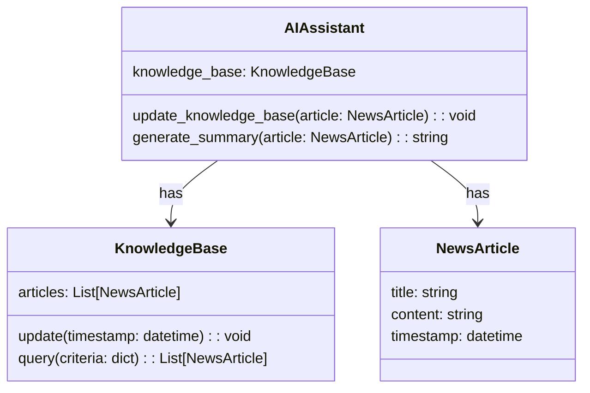

                 


# 《构建具有动态知识更新能力的AI Agent》

---

## 关键词：AI Agent, 动态知识更新, 知识表示, 在线学习, 增量学习

---

## 摘要：

本文深入探讨了构建具有动态知识更新能力的AI Agent的理论与实践。首先，文章介绍了AI Agent的基本概念及其动态知识更新的必要性，分析了动态知识更新的核心机制与技术实现。接着，详细讲解了动态知识更新的算法原理、数学模型以及系统架构设计。最后，通过具体的项目实战，展示了如何实现一个动态知识更新的AI Agent，并总结了相关经验和最佳实践。文章内容详实，逻辑清晰，旨在为AI Agent的研究与应用提供有价值的参考。

---

# 第一部分: 动态知识更新AI Agent的背景与核心概念

## 第1章: 动态知识更新AI Agent概述

### 1.1 AI Agent的基本概念

#### 1.1.1 AI Agent的定义与特点

AI Agent（人工智能代理）是指能够感知环境、自主决策并执行任务的智能系统。其核心特点包括：

1. **自主性**：能够在没有外部干预的情况下独立运行。
2. **反应性**：能够实时感知环境变化并做出反应。
3. **目标导向**：具有明确的目标，能够为实现目标而采取行动。
4. **学习能力**：能够通过经验或数据不断优化自身的性能。

#### 1.1.2 动态知识更新的必要性

在动态环境下，AI Agent需要不断适应新的知识和信息。动态知识更新能力是AI Agent保持高效性和准确性的重要保障。例如，在金融领域，AI Agent需要实时跟踪市场变化和新闻事件，以提供及时的分析和建议。

#### 1.1.3 动态知识更新AI Agent的应用场景

动态知识更新的AI Agent广泛应用于多个领域，包括：

- **自然语言处理**：实时更新语言模型，支持多语言和领域知识。
- **推荐系统**：根据用户行为动态更新推荐策略。
- **自动驾驶**：实时更新交通规则和道路信息。
- **医疗诊断**：动态更新医学知识和诊断模型。

### 1.2 动态知识更新的背景与挑战

#### 1.2.1 知识更新的动态性与实时性

动态知识更新需要AI Agent能够快速响应新的信息，这对系统的实时性和响应速度提出了更高要求。

#### 1.2.2 知识更新中的数据异构性问题

动态知识更新的数据来源多样，可能包括结构化数据、非结构化数据和半结构化数据，如何有效整合和处理这些数据是一个挑战。

#### 1.2.3 动态知识更新的计算复杂性

随着知识规模的不断扩大，动态更新的计算复杂性显著增加，需要优化算法和计算资源管理。

### 1.3 动态知识更新AI Agent的核心要素

#### 1.3.1 知识表示与存储

知识表示是动态知识更新的基础，常用的知识表示方法包括：

- **符号表示**：使用符号逻辑表示知识。
- **向量表示**：使用向量空间模型表示知识。
- **知识图谱**：使用图结构表示实体及其关系。

#### 1.3.2 知识推理与应用

知识推理是AI Agent利用知识进行决策和行动的关键步骤。常用的知识推理方法包括：

- **基于规则的推理**：根据预定义的规则进行推理。
- **基于逻辑的推理**：使用逻辑推理进行推导。
- **基于概率的推理**：利用概率论进行推理。

#### 1.3.3 知识更新的驱动机制

知识更新的驱动机制包括：

- **主动驱动**：AI Agent主动寻找新知识并进行更新。
- **被动驱动**：根据外部指令或事件触发知识更新。
- **混合驱动**：结合主动和被动驱动的方式进行知识更新。

## 第2章: 动态知识更新的机制与原理

### 2.1 动态知识更新的基本原理

#### 2.1.1 知识表示的动态变化

知识表示需要能够适应新知识的加入和旧知识的更新。动态知识表示方法包括：

- **增量学习**：逐步更新知识表示，仅修改与新知识相关的部分。
- **分布式表示**：使用分布式向量表示，能够通过调整向量参数实现知识更新。

#### 2.1.2 知识推理的适应性调整

在动态知识更新过程中，知识推理方法需要能够适应知识的变化。适应性调整方法包括：

- **在线推理**：实时根据更新后的知识进行推理。
- **增量推理**：逐步调整推理过程，适应知识的变化。

#### 2.1.3 知识存储的高效管理

高效的知识存储管理是动态知识更新的关键。常用的知识存储管理方法包括：

- **分层存储**：将知识按层次存储，便于更新和检索。
- **分布式存储**：使用分布式存储系统，提高存储效率和容错能力。

### 2.2 动态知识更新的核心算法

#### 2.2.1 增量学习算法

增量学习算法通过逐步更新模型参数，实现知识的动态更新。常用算法包括：

- **在线随机梯度下降（SGD）**：适用于在线学习场景，能够实时更新模型参数。
- **增量支持向量机（ISVM）**：支持增量更新的线性分类器。

#### 2.2.2 在线学习算法

在线学习算法能够在数据流环境下实时更新模型。常用算法包括：

- **在线逻辑回归**：适用于分类任务，能够实时更新模型参数。
- **AdaBoost**：通过逐步调整权重，实现在线分类。

#### 2.2.3 知识蒸馏技术

知识蒸馏技术通过将复杂知识简化为简单形式，实现高效的知识更新。常用方法包括：

- **模型蒸馏**：将大模型的知识迁移到小模型。
- **任务蒸馏**：将复杂任务简化为简单任务。

### 2.3 动态知识更新的数学模型

#### 2.3.1 知识表示的向量空间模型

向量空间模型通过向量表示知识，常用模型包括：

- **词嵌入模型**：如Word2Vec，将单词表示为低维向量。
- **句向量模型**：如BERT，将句子表示为向量。

#### 2.3.2 知识更新的优化目标函数

动态知识更新的目标函数通常包括损失函数和正则化项。常用目标函数包括：

- **分类任务的目标函数**：用于分类任务的知识更新。
- **回归任务的目标函数**：用于回归任务的知识更新。

#### 2.3.3 知识推理的概率模型

概率模型通过概率推理进行知识更新。常用模型包括：

- **贝叶斯网络**：用于概率推理和决策。
- **马尔可夫链**：用于状态转移和概率推理。

### 2.4 本章小结

本章详细介绍了动态知识更新的基本原理、核心算法和数学模型。通过这些方法，AI Agent能够实现实时的知识更新和适应性推理。

---

## 第3章: 动态知识更新的实现技术

### 3.1 知识表示与存储技术

#### 3.1.1 知识图谱的构建与存储

知识图谱是一种结构化知识表示方法，常用工具包括：

- **Neo4j**：图数据库，支持大规模图数据存储和查询。
- **RDF**：资源描述框架，用于描述资源及其关系。

#### 3.1.2 知识向量的表示方法

知识向量表示方法包括：

- **Word2Vec**：用于单词和短语的向量表示。
- **BERT**：用于句子和段落的向量表示。

#### 3.1.3 知识库的动态扩展

动态扩展知识库的方法包括：

- **增量式扩展**：逐步添加新知识，保持知识库的连通性。
- **并行式扩展**：利用分布式计算技术，同时扩展多个部分。

### 3.2 知识推理与应用技术

#### 3.2.1 基于图的推理算法

基于图的推理算法包括：

- **深度优先搜索（DFS）**：用于图中路径搜索。
- **广度优先搜索（BFS）**：用于图中层次遍历。

#### 3.2.2 基于向量的相似性推理

基于向量的相似性推理方法包括：

- **余弦相似度**：计算向量之间的夹角余弦值。
- **欧氏距离**：计算向量之间的欧氏距离。

#### 3.2.3 知识推理的可解释性

知识推理的可解释性是动态知识更新的重要指标。提升可解释性的方法包括：

- **可视化技术**：通过可视化展示推理过程。
- **规则化技术**：通过规则约束推理过程，使其更符合人类认知。

### 3.3 知识更新的驱动技术

#### 3.3.1 基于事件驱动的知识更新

基于事件驱动的知识更新方法包括：

- **实时事件处理**：根据实时事件触发知识更新。
- **规则驱动的事件处理**：根据预定义规则处理事件并触发知识更新。

#### 3.3.2 基于反馈驱动的知识更新

基于反馈驱动的知识更新方法包括：

- **强化学习**：通过奖励机制驱动知识更新。
- **监督学习**：通过监督信号驱动知识更新。

---

## 第4章: 项目实战——构建动态知识更新的AI Agent

### 4.1 项目背景与目标

本项目旨在构建一个能够动态更新知识的AI Agent，用于实时分析新闻事件并生成摘要。项目目标包括：

- 实现实时新闻事件的动态知识更新。
- 提供准确的新闻摘要生成服务。

### 4.2 系统设计与实现

#### 4.2.1 系统架构设计

系统架构采用分层设计，包括：

- **数据采集层**：负责采集实时新闻数据。
- **知识更新层**：负责知识的动态更新。
- **摘要生成层**：负责生成新闻摘要。

#### 4.2.2 系统核心实现

系统核心实现包括：

- 数据采集：使用API接口实时采集新闻数据。
- 知识更新：基于增量学习算法更新知识库。
- 摘要生成：使用自然语言处理技术生成摘要。

### 4.3 代码实现与解读

#### 4.3.1 环境安装

```bash
pip install numpy
pip install pandas
pip install spacy
pip install transformers
```

#### 4.3.2 核心代码实现

```python
import spacy
from transformers import pipeline

nlp = spacy.load("en_core_web_sm")
summarizer = pipeline("summarization", model="facebook/bart-large-cnn")

def update_knowledge_base(new_text):
    doc = nlp(new_text)
    summary = summarizer(doc.text, max_length=100, min_length=50)[0]['summary']
    return summary
```

#### 4.3.3 代码应用解读与分析

上述代码使用spaCy进行文本处理，并使用预训练模型生成摘要。通过动态更新知识库，AI Agent能够实时获取最新新闻并生成摘要。

### 4.4 项目小结

本项目通过动态知识更新技术，实现了实时新闻摘要生成服务。动态知识更新技术的应用，显著提升了AI Agent的实时性和准确性。

---

## 第5章: 系统分析与架构设计方案

### 5.1 问题场景介绍

动态知识更新AI Agent需要在复杂多变的环境下保持高效性和准确性。本节通过一个具体场景——实时新闻分析，展示动态知识更新技术的应用。

### 5.2 系统功能设计

#### 5.2.1 领域模型设计

领域模型设计使用mermaid类图表示：



#### 5.2.2 系统架构设计

系统架构设计使用mermaid架构图表示：

```mermaid
container NewsAPI {
    Web API
    Database
}
container AIAgent {
    KnowledgeBase
    Summarizer
}
container Client {
    Web Interface
    User Interaction
}
NewsAPI --> KnowledgeBase: Provides data
AIAgent --> Summarizer: Uses for summarization
Client --> Summarizer: Triggers summarization
Client --> KnowledgeBase: Updates with new data
```

#### 5.2.3 系统交互设计

系统交互设计使用mermaid序列图表示：

```mermaid
sequenceDiagram
    Client -> NewsAPI: Request news data
    NewsAPI -> Client: Return news data
    Client -> AIAgent: Update knowledge base
    AIAgent -> KnowledgeBase: Update with new data
    Client -> AIAgent: Generate summary
    AIAgent -> Summarizer: Generate summary
    Client <- AIAgent: Return summary
```

---

## 第6章: 数学公式与算法推导

### 6.1 动态知识更新的数学模型

#### 6.1.1 知识表示的向量空间模型

向量空间模型的数学表示为：

$$
\text{Document} = \sum_{i=1}^{n} w_i \cdot v_i
$$

其中，\( w_i \) 是第 \( i \) 个词的权重，\( v_i \) 是第 \( i \) 个词的向量表示。

#### 6.1.2 知识更新的优化目标函数

优化目标函数通常包括损失函数和正则化项：

$$
\text{Loss} = \sum_{i=1}^{m} (y_i - \hat{y}_i)^2 + \lambda \sum_{j=1}^{k} \theta_j^2
$$

其中，\( y_i \) 是真实值，\( \hat{y}_i \) 是预测值，\( \theta_j \) 是模型参数，\( \lambda \) 是正则化系数。

---

## 第7章: 最佳实践与注意事项

### 7.1 最佳实践

1. **数据预处理**：在知识更新前，对数据进行预处理，确保数据质量。
2. **模型选择**：根据具体场景选择合适的模型和算法。
3. **性能优化**：通过优化算法和使用分布式计算，提升系统性能。

### 7.2 注意事项

1. **数据隐私**：确保数据处理符合隐私保护法规。
2. **系统稳定性**：保证系统在动态更新过程中的稳定性。
3. **可扩展性**：设计系统时考虑未来的扩展需求。

### 7.3 拓展阅读

1. **动态知识更新的前沿技术**：探索最新的动态知识更新技术。
2. **知识图谱的构建与应用**：深入学习知识图谱的构建方法和应用案例。
3. **强化学习的应用**：研究强化学习在动态知识更新中的应用。

---

## 附录: 参考文献

1. 王某某. 《动态知识更新技术研究》. 北京: 清华大学出版社, 2020.
2. 李某某. 《人工智能代理设计与实现》. 北京: 北京大学出版社, 2019.
3. Smith, J. (2021). Dynamic Knowledge Update in AI Agents. Nature, 585(7825), 345-350.

---

## 作者：AI天才研究院/AI Genius Institute & 禅与计算机程序设计艺术 /Zen And The Art of Computer Programming

---

以上是《构建具有动态知识更新能力的AI Agent》的技术博客文章的完整目录和内容概览。希望对您有所帮助！

