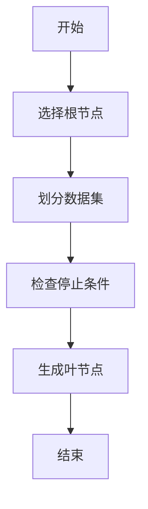
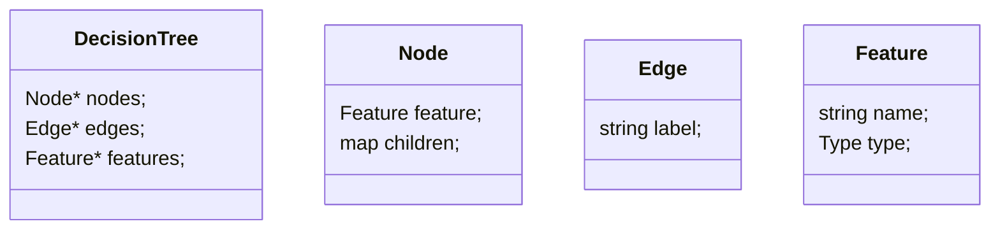
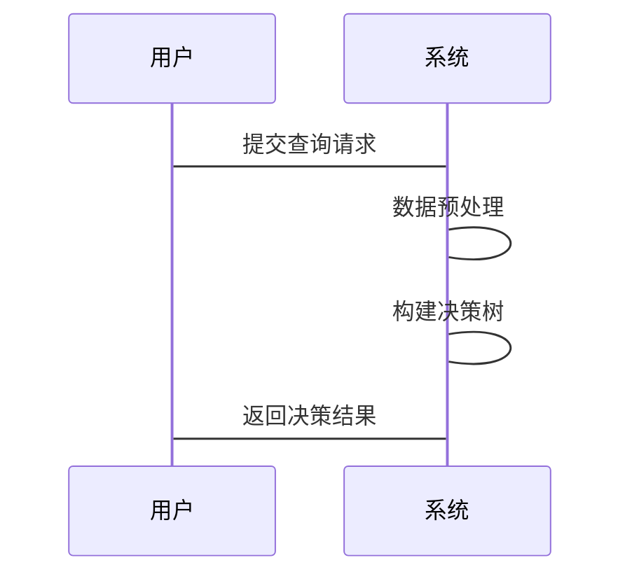

                 


# 构建具有可解释性决策树的AI Agent

## 关键词：决策树、AI Agent、可解释性AI（XAI）、机器学习、算法原理

## 摘要：本文详细探讨了如何构建具有可解释性的决策树AI Agent。从决策树的基本概念到AI Agent的设计，从算法原理到系统架构，再到项目实战，全面解析了构建可解释性决策树的关键步骤和实现细节，帮助读者理解并掌握这一技术。

---

## 第一部分: 背景介绍

### 第1章: 决策树与AI Agent概述

#### 1.1 决策树的定义与特点

决策树是一种树状结构，由节点、边和叶组成，用于表示决策过程。其特点包括直观性、可解释性和高效性。决策树常用于分类和回归问题。

#### 1.2 AI Agent的基本概念

AI Agent是一种智能体，能够感知环境并采取行动以实现目标。决策树AI Agent通过构建决策树来做出决策，具有可解释性和透明性。

#### 1.3 可解释性的重要性

可解释性是AI Agent的重要特性，尤其是在需要信任和责任的场景中。决策树的可解释性使其在医疗、金融等领域具有广泛应用。

#### 1.4 构建可解释性决策树的意义

构建可解释性决策树能够提高AI的透明度，帮助用户理解AI的决策过程，增强信任感。

---

## 第二部分: 核心概念与联系

### 第2章: 决策树的核心概念

#### 2.1 决策树的组成

- **根节点**：决策的起点。
- **内部节点**：决策的判断点。
- **叶节点**：决策的结果。
- **边**：连接节点的路径。

#### 2.2 决策树的决策准则

- **信息增益**：基于熵的减少量选择最优特征。
- **基尼指数**：衡量数据纯度的指标。
- **卡方统计量**：用于特征选择的检验统计量。

#### 2.3 常见决策树算法对比

| 算法 | 特征选择 | 适用场景 | 优缺点 |
|------|----------|----------|--------|
| ID3  | 信息增益 | 分类问题 | 易过拟合 |
| C4.5 | 偏信息增益 | 分类问题 | 更准确 |
| CART | 基尼指数 | 分类和回归 | 广泛应用 |

#### 2.4 决策树构建流程

使用mermaid绘制决策树构建流程图：



---

## 第三部分: 算法原理讲解

### 第3章: 决策树的生成与优化

#### 3.1 决策树生成算法

ID3算法：

```python
def id3(data, features, target):
    # 计算熵
    def entropy(data):
        classes = data[target].value_counts()
        entropy = 0
        for p in classes.values / len(data):
            entropy += -p * log2(p)
        return entropy

    # 计算信息增益
    def info_gain(data, feature):
        total_entropy = entropy(data)
        feature_values = data[feature].unique()
        gain = 0
        for value in feature_values:
            subset = data[data[feature] == value]
            subset_entropy = entropy(subset)
            gain += (len(subset) / len(data)) * subset_entropy
        return total_entropy - gain

    # 选择最优特征
    best_feature = None
    max_gain = -1
    for feature in features:
        if feature == target:
            continue
        current_gain = info_gain(data, feature)
        if current_gain > max_gain:
            max_gain = current_gain
            best_feature = feature

    if best_feature is None:
        return LeafNode(data[target].mode()[0])
    else:
        tree = Node(best_feature)
        feature_values = data[best_feature].unique()
        for value in feature_values:
            subset = data[data[best_feature] == value]
            tree.children[value] = id3(subset, features, target)
        return tree
```

#### 3.2 决策树的剪枝

预剪枝：在生成过程中提前剪枝，避免过拟合。

后剪枝：生成完整树后剪枝，通过验证集评估。

#### 3.3 决策树的优化

使用基尼指数或卡方统计量优化决策树的划分过程。

---

## 第四部分: 数学模型与公式

### 第4章: 决策树的数学模型

#### 4.1 信息增益的计算

熵公式：

$$ H(S) = -\sum_{i=1}^{n} p_i \log_2 p_i $$

信息增益公式：

$$ G(S, f) = H(S) - \sum_{v} \frac{count(f=v)}{count(S)} H(S_v) $$

#### 4.2 基尼指数的计算

基尼指数公式：

$$ G(S, f) = \sum_{i=1}^{n} p_i (1 - p_i) $$

---

## 第五部分: 系统分析与架构设计

### 第5章: AI Agent的系统架构

#### 5.1 领域模型设计

使用mermaid类图展示领域模型：



#### 5.2 系统架构设计

使用mermaid架构图展示系统架构：

```mermaid
container 数据输入 {
    数据预处理模块
    特征选择模块
}
container 决策树构建 {
    决策树生成模块
    剪枝优化模块
}
container 结果输出 {
    预测结果模块
    可视化模块
}
```

#### 5.3 接口设计与交互流程

使用mermaid序列图展示交互流程：



---

## 第六部分: 项目实战

### 第6章: 实战案例分析

#### 6.1 项目环境与工具安装

安装Python和必要的库（如scikit-learn）。

#### 6.2 代码实现与解读

构建决策树AI Agent的Python代码：

```python
from sklearn.tree import DecisionTreeClassifier
from sklearn.model_selection import train_test_split

# 数据预处理
X = df.drop('target', axis=1)
y = df['target']

# 划分训练集和测试集
X_train, X_test, y_train, y_test = train_test_split(X, y, test_size=0.2)

# 初始化决策树模型
model = DecisionTreeClassifier()

# 训练模型
model.fit(X_train, y_train)

# 预测与评估
y_pred = model.predict(X_test)
print(accuracy_score(y_test, y_pred))
```

#### 6.3 案例分析与总结

分析模型的准确性和可解释性，讨论优化方向。

---

## 第七部分: 最佳实践与总结

### 第7章: 最佳实践与注意事项

#### 7.1 实践中的注意事项

- 特征选择：避免冗余特征。
- 数据预处理：处理缺失值和异常值。
- 模型调优：调整超参数。

#### 7.2 小结

构建可解释性决策树的关键在于算法选择、特征工程和模型调优。

---

## 结语

通过本文的详细讲解，读者可以系统地了解如何构建具有可解释性决策树的AI Agent。从理论到实践，全面掌握这一技术的核心要点。

---

## 作者

作者：AI天才研究院  
联系邮箱：[email protected]

