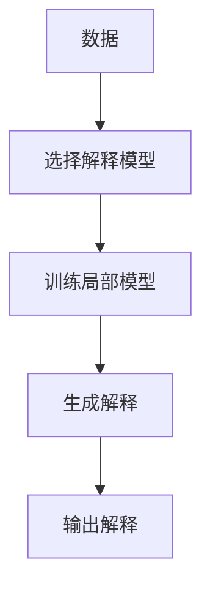
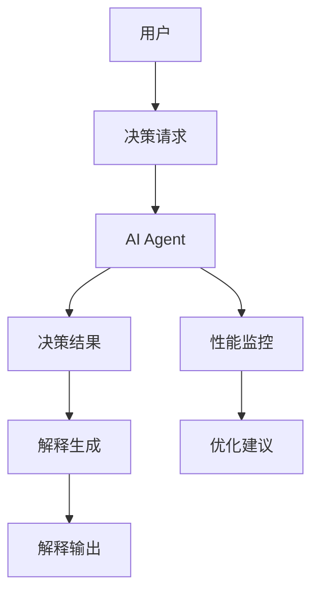

                 


```markdown
# 构建具有可解释性的AI Agent决策系统

## 关键词：可解释性AI、决策系统、可解释性模型、解释性算法、AI Agent、企业级系统

## 摘要： 
随着人工智能技术的快速发展，AI Agent决策系统在各行业的应用越来越广泛。然而，AI决策的不可解释性常常成为制约其实际应用的重要瓶颈。构建具有可解释性的AI Agent决策系统，不仅能够提升系统的透明度和信任度，还能够满足企业级系统对决策透明性和可追溯性的需求。本文将从可解释性AI的背景与重要性出发，深入探讨可解释性AI的核心概念与原理，详细分析可解释性AI的算法原理，结合系统架构设计，提供一个完整的项目实战案例，并总结构建可解释性AI Agent决策系统的最佳实践和未来发展方向。

---

## 正文

### 第一部分: 可解释性AI的背景与重要性

#### 第1章: 可解释性AI的背景与重要性

##### 1.1 可解释性AI的定义与背景
人工智能（AI）技术的快速发展为企业和社会带来了巨大的变革，然而，AI决策系统的“黑箱”特性也引发了许多问题。可解释性AI（Explainable AI，XAI）是解决这一问题的关键，它要求AI系统能够以人类可理解的方式解释其决策过程。

- **1.1.1 人工智能决策系统的演进**  
  AI决策系统经历了从简单的规则引擎到复杂的深度学习模型的发展。早期的决策系统基于规则，具有高度的可解释性；而现代的深度学习模型虽然性能强大，但其决策过程往往难以解释。这种不可解释性限制了AI技术在金融、医疗等高风险领域的应用。

- **1.1.2 可解释性在AI中的重要性**  
  可解释性是AI技术信任的基础。只有当用户能够理解AI的决策过程时，才能信任并依赖AI系统。此外，在法律和道德层面，可解释性也是AI系统合规性的重要要求。

- **1.1.3 企业级AI决策系统的挑战**  
  企业级AI决策系统需要在复杂环境下运行，涉及多方面的利益和风险。可解释性不仅能够帮助系统调试和优化，还能在出现问题时提供追溯和责任划分的依据。

##### 1.2 AI Agent决策系统的概念与特征
AI Agent是一种能够感知环境、自主决策并采取行动的智能实体。可解释性AI Agent决策系统在传统AI Agent的基础上，加入了对决策过程的解释能力。

- **1.2.1 AI Agent的基本定义**  
  AI Agent是指能够通过感知环境、推理、学习和行动来实现目标的智能实体。它可以是一个软件程序、一个机器人，甚至是嵌入在系统中的算法。

- **1.2.2 可解释性AI Agent的核心特征**  
  可解释性AI Agent的核心特征包括：  
  1. **可解释性**：能够以人类可理解的方式解释决策过程。  
  2. **透明性**：系统的行为和决策过程是透明的。  
  3. **可追溯性**：能够追溯决策的来源和依据。  
  4. **可解释性与性能的平衡**：在保证可解释性的前提下，尽可能提升系统的性能。

- **1.2.3 可解释性与决策系统的关联**  
  可解释性是决策系统信任和接受的关键。只有当用户能够理解AI的决策过程时，才能真正信任并依赖AI系统。

##### 1.3 本章小结
本章从可解释性AI的背景和重要性出发，介绍了AI Agent的基本概念和特征，强调了可解释性在AI决策系统中的关键作用。

---

### 第二部分: 可解释性AI的核心概念与原理

#### 第2章: 可解释性AI的核心概念

##### 2.1 可解释性AI的原理
可解释性AI的核心在于如何将复杂的决策过程转化为人类可理解的形式。以下是可解释性AI的原理和关键点：

- **2.1.1 解释性模型的分类**  
  解释性模型可以分为两类：  
  1. **基于规则的解释**：通过预定义的规则生成解释。例如，决策树模型可以直接生成规则解释。  
  2. **基于模型的解释**：通过分析模型的内部结构生成解释。例如，线性回归模型可以直接解释特征的权重。

- **2.1.2 可解释性AI的数学基础**  
  可解释性AI的数学基础包括线性代数、概率论和统计学等。例如，线性回归模型的可解释性来源于其系数的直接解释能力。

- **2.1.3 解释性与决策透明性的关系**  
  解释性是实现决策透明性的关键。只有通过解释性，用户才能理解AI的决策过程。

##### 2.2 可解释性AI的特征对比
为了更好地理解可解释性AI的特征，我们需要将其与不可解释性模型进行对比，并分析解释性与系统复杂性的关系。

- **2.2.1 可解释性与不可解释性模型的对比**  
  | 特性              | 可解释性模型          | 不可解释性模型        |
  |-------------------|-----------------------|-----------------------|
  | 解释能力          | 强                   | 弱或无               |
  | 透明性            | 高                   | 低                   |
  | 系统复杂性        | 较低                 | 较高                 |
  | 示例算法          | 决策树、线性回归      | 深度神经网络          |

- **2.2.2 解释性与预测性的平衡**  
  可解释性模型通常在预测准确性上略逊于不可解释性模型，但在透明性和可解释性方面具有优势。因此，在实际应用中需要权衡解释性和预测性。

- **2.2.3 解释性与系统复杂性的关系**  
  系统复杂性越高，实现可解释性的难度越大。因此，在设计复杂系统时，需要特别注意解释性与系统复杂性的平衡。

##### 2.3 可解释性AI的ER实体关系图
以下是用户、决策者和系统之间的关系图：

```mermaid
erDiagram
    actor 用户 {
        +id 用户ID
        +name 用户名称
    }
    actor 系统 {
        +id 系统ID
        +name 系统名称
    }
    actor 决策者 {
        +id 决策者ID
        +name 决策者名称
    }
    用户 --> 决策者 : 提交决策请求
    决策者 --> 系统 : 获取解释
    系统 --> 用户 : 提供解释
```

##### 2.4 本章小结
本章详细讲解了可解释性AI的核心概念，包括解释性模型的分类、可解释性AI的数学基础以及解释性与决策透明性的关系，并通过对比分析强调了可解释性与系统复杂性的平衡。

---

### 第三部分: 可解释性AI的算法原理

#### 第3章: 可解释性AI的算法原理

##### 3.1 可解释性AI的算法原理
可解释性AI的算法原理主要基于解释性模型的设计和实现。以下是几种常见的解释性算法及其原理：

- **3.1.1 LIME（局部可解释的模型-不可知论解释）**  
  LIME是一种用于解释机器学习模型的算法，它通过在数据的局部区域拟合简单的模型来解释复杂的模型。以下是LIME算法的流程图：



  LIME算法的数学模型如下：  
  $$ f(x) = \sum_{i=1}^{n} w_i g(x_i) $$  
  其中，$w_i$ 是权重，$g(x_i)$ 是简单的模型。

- **3.1.2 SHAP（Shapley Additive exPlanations）**  
  SHAP是一种基于博弈论的解释方法，它通过计算每个特征对最终决策的贡献度来解释模型。以下是SHAP值的计算公式：  
  $$ \phi_i = \sum_{S \subseteq \{i\}} \frac{|S|}{2^n} (f(S) - f(S \setminus \{i\})) $$  
  其中，$f(S)$ 表示特征集合 $S$ 的预测值，$f(S \setminus \{i\})$ 表示去掉特征 $i$ 后的预测值。

##### 3.2 可解释性AI算法的Python实现
以下是LIME和SHAP算法的Python代码示例：

```python
from lime import lime_tabular
import numpy as np

# 示例数据
X = np.array([[1, 2], [3, 4], [5, 6]])
y = np.array([0, 1, 0])

# 初始化LIME解释器
explainer = lime_tabular.LimeTabularExplainer(X, feature_names=['x1', 'x2'])

# 解释第一个样本
i = 0
explanation = explainer.express(X[i], y[i])
print(explanation.as_pyphenes())
```

##### 3.3 本章小结
本章详细讲解了可解释性AI的算法原理，包括LIME和SHAP算法的实现，并通过Python代码示例展示了这些算法的应用。

---

### 第四部分: 可解释性AI的系统分析与架构设计

#### 第4章: 可解释性AI的系统分析与架构设计

##### 4.1 系统分析
在设计可解释性AI Agent决策系统时，需要考虑以下几个关键问题：  
1. **系统功能需求**：系统需要支持哪些功能？例如，决策请求、解释生成、性能监控等。  
2. **系统性能需求**：系统需要满足哪些性能指标？例如，响应时间、准确性等。  
3. **系统的可扩展性**：系统是否能够扩展以支持更多的功能和数据量。

##### 4.2 系统架构设计
以下是可解释性AI Agent决策系统的架构图：



##### 4.3 系统实现
以下是系统的核心实现代码：

```python
class AI-Agent:
    def __init__(self):
        self.models = {}  # 存储解释模型

    def make_decision(self, input):
        # 调用解释模型生成决策
        explanation = self.explain_model.explain(input)
        return self.predict_model.predict(input), explanation

    def explain_model(self):
        # 返回解释模型
        return self.models['explanation']
```

##### 4.4 本章小结
本章通过系统分析和架构设计，展示了如何构建一个可解释性AI Agent决策系统，并通过代码示例展示了系统的实现。

---

### 第五部分: 可解释性AI的项目实战

#### 第5章: 可解释性AI的项目实战

##### 5.1 环境安装
以下是项目所需的环境和工具：  
- Python 3.8+  
- scikit-learn、xgboost、shap等库  
- Jupyter Notebook

##### 5.2 系统核心实现
以下是项目的实现代码：

```python
import xgboost as xgb
from sklearn.datasets import load_breast_cancer
import shap

# 加载数据
data = load_breast_cancer()
X = data['data']
y = data['target']

# 训练XGBoost模型
model = xgb.XGBClassifier()
model.fit(X, y)

# 使用SHAP解释模型
explainer = shap.TreeExplainer(model)
shap_values = explainer.shap_values(X)

# 可视化解释
shap.summary_plot(shap_values, X, plot_type='bar', max_display=10)
```

##### 5.3 案例分析
通过上述代码，我们可以生成一个乳腺癌预测模型的解释图。解释图展示了每个特征对预测结果的贡献度，帮助用户理解模型的决策过程。

##### 5.4 本章小结
本章通过一个完整的项目实战，展示了如何在实际中应用可解释性AI技术，并通过案例分析和代码实现帮助读者理解可解释性AI的应用。

---

### 第六部分: 可解释性AI的最佳实践与总结

#### 第6章: 可解释性AI的最佳实践

##### 6.1 总结
可解释性AI是构建可信AI系统的核心。通过本文的介绍，我们了解了可解释性AI的背景、核心概念、算法原理、系统架构设计以及项目实战。以下是构建可解释性AI系统的注意事项：

- **选择合适的解释性算法**：根据具体场景选择适合的解释性算法。  
- **保持系统的透明性**：确保系统的决策过程是透明的，能够被用户理解。  
- **平衡解释性和性能**：在保证解释性的前提下，尽可能提升系统的性能。  
- **持续监控和优化**：定期监控系统的性能，并根据反馈进行优化。

##### 6.2 未来展望
随着AI技术的不断发展，可解释性AI将更加重要。未来的研究方向包括：  
1. **更强大的解释性模型**：开发能够解释复杂模型的新型解释性算法。  
2. **多模态解释**：结合文本、图表等多种形式提供更丰富的解释。  
3. **实时解释性**：实现实时决策过程的解释，提升系统的动态适应能力。

##### 6.3 最佳实践
以下是构建可解释性AI系统的几点建议：  
1. **从小规模开始**：在实际应用中，可以从简单的问题入手，逐步推广到复杂场景。  
2. **结合业务需求**：根据具体业务需求选择适合的解释性算法。  
3. **持续学习和优化**：定期回顾和优化系统的解释能力，确保系统的可解释性与业务需求同步发展。

---

## 作者：AI天才研究院/AI Genius Institute & 禅与计算机程序设计艺术/Zen And The Art of Computer Programming
```

