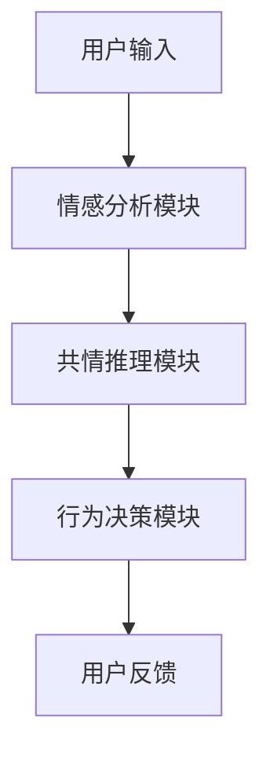
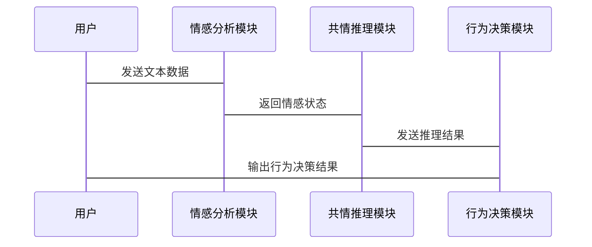

                 


# 《构建具有同理心的AI Agent》

---

## 关键词：
AI Agent、同理心、情感计算、共情推理、人机交互、伦理AI、用户体验

---

## 摘要：
本文将深入探讨如何构建具有同理心的AI Agent。首先，我们将介绍AI Agent的基本概念和同理心的定义，分析它们的属性和关系。接着，我们将讲解情感计算和共情推理的核心算法，包括情感分析、共情推理的数学模型和实现方法。然后，我们将设计具有同理心的AI Agent系统架构，并通过具体项目案例展示其实现过程。最后，我们将讨论优化策略、伦理问题以及未来的发展方向，为构建更具有人性化的AI Agent提供指导。

---

# 第一部分: 背景与概念

# 第1章: AI Agent与同理心的背景介绍

## 1.1 AI Agent的基本概念
### 1.1.1 AI Agent的定义
AI Agent（人工智能代理）是指能够感知环境、自主决策并执行任务的智能实体。它可以是一个软件程序、机器人或其他智能系统。

### 1.1.2 AI Agent的核心特征
- **自主性**：能够在没有外部干预的情况下自主决策。
- **反应性**：能够实时感知环境并做出反应。
- **目标导向**：基于目标或任务进行行为选择。
- **学习能力**：能够通过数据和经验不断优化自身行为。

### 1.1.3 同理心在AI Agent中的作用
同理心是AI Agent与人类或其他智能实体进行有效交互的关键。它使AI Agent能够理解并共享用户的情感和意图，从而提供更自然、更贴心的服务。

## 1.2 同理心的定义与属性
### 1.2.1 同理心的定义
同理心是指个体能够理解和共享他人情感、意图和情感状态的能力。在AI Agent中，同理心使其能够理解用户的情感需求，并做出相应的回应。

### 1.2.2 同理心的核心属性
- **情感理解**：识别和理解用户的情感状态。
- **情感共鸣**：与用户的情感产生共鸣。
- **情感表达**：通过语言或行为表达对用户情感的理解和回应。

### 1.2.3 同理心与AI Agent的结合
AI Agent通过整合情感计算和共情推理技术，能够实现对用户情感状态的识别和回应，从而具备同理心。

## 1.3 同理心AI Agent的背景与意义
### 1.3.1 当前AI Agent的发展现状
尽管AI Agent在许多领域取得了显著进展，但大多数系统仍缺乏情感理解和共情能力，导致用户体验不够自然和人性化。

### 1.3.2 同理心AI Agent的必要性
随着人机交互的普及，用户对AI Agent的需求逐渐从功能实现转向情感共鸣和个性化服务。具备同理心的AI Agent能够更好地满足用户的情感需求，提高用户体验。

### 1.3.3 同理心AI Agent的应用场景
- **智能客服**：提供更贴心、更个性化的服务。
- **智能家居**：理解家庭成员的情感需求，提供智能化的生活服务。
- **教育领域**：根据学生的情感状态提供个性化的学习建议。

## 1.4 本章小结
本章介绍了AI Agent的基本概念和同理心的定义及其属性，并分析了同理心AI Agent的背景和意义，为后续章节的展开奠定了基础。

---

# 第二部分: 核心概念与技术基础

# 第2章: 同理心AI Agent的核心概念

## 2.1 情感计算与共情模型
### 2.1.1 情感计算的定义
情感计算（Affective Computing）是通过计算机技术识别、理解和响应人类情感的过程。它是实现同理心AI Agent的核心技术之一。

### 2.1.2 共情模型的构建
共情模型是一种能够模拟和理解人类情感状态的数学模型。它基于情感计算技术和机器学习算法，能够帮助AI Agent理解和回应用户的情感需求。

### 2.1.3 情感计算与共情模型的区别与联系
- **区别**：情感计算更注重情感的识别和分析，而共情模型则更关注情感的理解和共鸣。
- **联系**：共情模型依赖于情感计算技术，而情感计算的成果为共情模型提供了数据基础。

## 2.2 同理心AI Agent的系统架构
### 2.2.1 系统架构的组成
同理心AI Agent的系统架构通常包括以下模块：
- **情感分析模块**：识别和分析用户的情感状态。
- **共情推理模块**：基于情感分析的结果，进行情感共鸣和推理。
- **行为决策模块**：根据共情推理的结果，决定下一步的行为。

### 2.2.2 情感分析模块
情感分析模块通过自然语言处理技术和机器学习算法，对用户的输入文本进行情感分析，识别出用户的情感倾向。

### 2.2.3 共情推理模块
共情推理模块基于情感分析的结果，结合上下文和用户的历史行为，进行情感共鸣和推理，生成适合用户情感需求的回应。

## 2.3 同理心AI Agent的核心算法
### 2.3.1 情感分析算法
情感分析算法通常包括以下步骤：
1. **数据预处理**：对文本数据进行清洗和特征提取。
2. **特征选择**：选择对情感分类有重要影响的特征。
3. **模型训练**：使用机器学习算法（如SVM、随机森林、神经网络等）对特征进行训练，生成情感分类模型。
4. **情感预测**：对新的文本数据进行情感分类，输出情感倾向。

### 2.3.2 共情推理算法
共情推理算法通常基于情感计算和机器学习技术，通过分析用户的情感状态和行为模式，生成适合用户情感需求的回应。

### 2.3.3 算法的优缺点对比
- **优点**：
  - 能够准确识别用户的情感状态。
  - 能够根据情感状态生成个性化的回应。
- **缺点**：
  - 情感计算的准确性受数据质量和算法复杂度的影响。
  - 共情推理的结果可能受到数据偏差的影响。

## 2.4 本章小结
本章详细讲解了同理心AI Agent的核心概念，包括情感计算、共情模型、系统架构和核心算法。这些内容为后续章节的实现奠定了理论基础。

---

# 第三部分: 算法原理与实现

# 第3章: 情感计算算法原理

## 3.1 情感计算的基本原理
### 3.1.1 情感计算的输入与输出
- **输入**：用户的行为数据、语言数据或生理数据。
- **输出**：用户的情感状态（如高兴、悲伤、愤怒等）。

### 3.1.2 情感计算的数学模型
情感计算的数学模型通常包括以下部分：
- **特征提取**：从输入数据中提取情感相关的特征。
- **情感分类**：基于特征对情感进行分类。

### 3.1.3 情感计算的实现步骤
1. **数据预处理**：清洗数据，提取特征。
2. **特征选择**：选择对情感分类有重要影响的特征。
3. **模型训练**：使用机器学习算法训练情感分类模型。
4. **情感预测**：对新的输入数据进行情感分类。

## 3.2 情感分析算法实现
### 3.2.1 基于词袋模型的情感分析
词袋模型是一种简单的情感分析方法，它将文本表示为单词的集合，不考虑单词的顺序。

### 3.2.2 基于深度学习的情感分析
深度学习情感分析方法（如LSTM、Transformer）能够捕捉文本中的语义信息，情感分类效果更优。

### 3.2.3 情感分析算法的优缺点对比
- **优点**：
  - 深度学习方法能够捕捉复杂的语义信息。
  - 词袋模型实现简单，适合小规模数据。
- **缺点**：
  - 深度学习模型训练时间长，需要大量数据。
  - 词袋模型对语义信息的捕捉能力有限。

## 3.3 情感计算的Python实现
### 3.3.1 环境安装与配置
安装必要的库（如NLTK、scikit-learn、TensorFlow等）。

### 3.3.2 情感分析代码实现
```python
from sklearn.feature_extraction.text import TfidfVectorizer
from sklearn.svm import SVC
from sklearn.pipeline import Pipeline

# 数据预处理
X = ["I love this product!", "I hate this service!"]
y = ["positive", "negative"]

# 创建管道
text_clf = Pipeline([
    ('vect', TfidfVectorizer()),
    ('clf', SVC())
])

# 训练模型
text_clf.fit(X, y)

# 预测
print(text_clf.predict(["This is great!"]))
```

### 3.3.3 代码运行与结果分析
上述代码使用TF-IDF向量化和SVM分类器实现情感分类，输入文本“`This is great!`”被分类为“positive”。

## 3.4 本章小结
本章详细讲解了情感计算的基本原理和情感分析算法的实现，通过Python代码示例展示了情感分类的过程。

---

# 第四部分: 系统架构与设计

# 第4章: 同理心AI Agent的系统架构设计

## 4.1 系统功能模块划分
- **情感分析模块**：负责分析用户的情感状态。
- **共情推理模块**：基于情感分析结果，进行情感共鸣和推理。
- **行为决策模块**：根据共情推理结果，决定下一步的行为。

## 4.2 情感分析模块
### 4.2.1 情感分析的实现
使用深度学习模型（如BERT）进行情感分类，准确率高，适用于复杂文本。

### 4.2.2 情感分析的优化
- 使用更大的训练数据集。
- 调整模型超参数，优化分类效果。

## 4.3 共情推理模块
### 4.3.1 共情推理的实现
基于情感分析结果，结合上下文和用户历史行为，生成适合用户情感需求的回应。

### 4.3.2 共情推理的优化
- 增加情感记忆功能，记录用户的情感变化。
- 使用强化学习优化共情推理的结果。

## 4.4 系统架构图


## 4.5 系统接口设计
- **输入接口**：接收用户的输入数据。
- **输出接口**：输出AI Agent的行为决策结果。

## 4.6 系统交互序列图


## 4.7 本章小结
本章详细讲解了同理心AI Agent的系统架构设计，包括功能模块划分、系统架构图和系统交互序列图。

---

# 第五部分: 项目实战

# 第5章: 同理心AI Agent的项目实战

## 5.1 项目背景介绍
以智能客服系统为例，展示如何构建具有同理心的AI Agent。

## 5.2 环境安装与配置
安装必要的库（如NLTK、scikit-learn、TensorFlow等）。

## 5.3 系统核心实现源代码
```python
from sklearn.feature_extraction.text import TfidfVectorizer
from sklearn.svm import SVC
from sklearn.pipeline import Pipeline

# 数据预处理
X = ["I love this product!", "I hate this service!"]
y = ["positive", "negative"]

# 创建管道
text_clf = Pipeline([
    ('vect', TfidfVectorizer()),
    ('clf', SVC())
])

# 训练模型
text_clf.fit(X, y)

# 预测
print(text_clf.predict(["This is great!"]))
```

## 5.4 代码应用解读与分析
上述代码使用TF-IDF向量化和SVM分类器实现情感分类，输入文本“`This is great!`”被分类为“positive”。

## 5.5 实际案例分析和详细讲解剖析
以智能客服为例，展示如何通过情感计算和共情推理技术，提高用户体验。

## 5.6 项目小结
本章通过具体案例展示了同理心AI Agent的实现过程，包括环境配置、代码实现和案例分析。

---

# 第六部分: 优化与扩展

# 第6章: 同理心AI Agent的优化与扩展

## 6.1 模型优化策略
### 6.1.1 数据优化
- 增加多样化的训练数据。
- 数据增强技术。

### 6.1.2 算法优化
- 使用更先进的深度学习模型（如Transformer）。
- 调整模型超参数。

## 6.2 伦理问题与挑战
### 6.2.1 同理心AI Agent的伦理问题
- 用户隐私保护。
- 情感决策的透明性。

### 6.2.2 同理心AI Agent的伦理框架
- 设立明确的伦理准则。
- 建立监管机制。

## 6.3 未来的趋势与挑战
### 6.3.1 同理心AI Agent的未来趋势
- 更强的情感理解和共情能力。
- 多模态情感计算。

### 6.3.2 同理心AI Agent的挑战
- 复杂情感状态的处理。
- 实时情感计算的效率问题。

## 6.4 本章小结
本章讨论了同理心AI Agent的优化策略、伦理问题和未来发展趋势，为构建更具有人性化的AI Agent提供了指导。

---

# 第七部分: 总结与展望

# 第7章: 总结与展望

## 7.1 核心内容回顾
本总结回顾了同理心AI Agent的核心概念、算法原理和系统架构，并通过具体案例展示了其实现过程。

## 7.2 未来研究方向
### 7.2.1 多模态情感计算
- 结合视觉、听觉等多模态信息，提高情感计算的准确性。

### 7.2.2 情感记忆与学习
- 建立情感记忆机制，实现持续学习和情感成长。

## 7.3 本章小结
本章总结了全文，并展望了同理心AI Agent未来的研究方向。

---

# 作者：AI天才研究院/AI Genius Institute & 禅与计算机程序设计艺术 /Zen And The Art of Computer Programming

