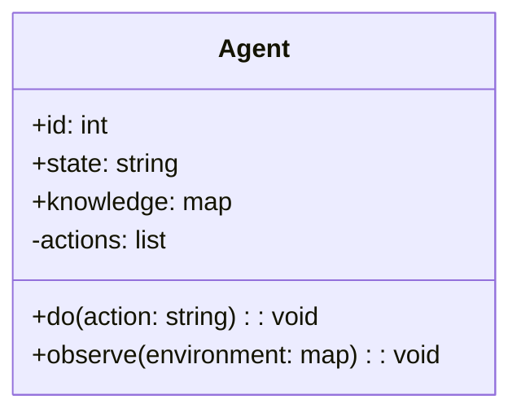
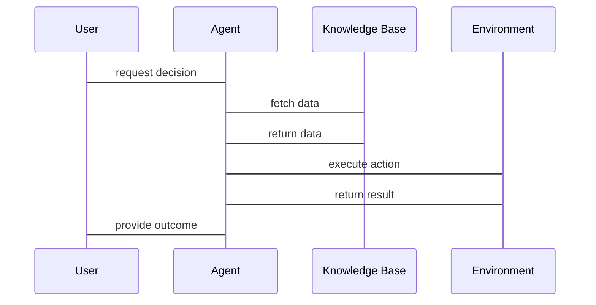

                 

<think>
好的，现在我要思考如何撰写《构建具有因果推断与决策能力的AI Agent》这篇文章。首先，我需要明确文章的核心主题：因果推断和决策能力在AI Agent中的构建。接下来，我会按照用户提供的大纲结构，逐步分析和推理每个部分的内容，确保逻辑清晰、内容详实。

首先，我会从文章的标题和摘要开始。标题需要吸引读者，明确主题。摘要部分要简明扼要，概括文章的核心内容和主题思想。

接下来，我会根据用户提供的大纲结构，逐步展开每个章节的内容。首先是背景介绍，这部分需要涵盖AI Agent的基本概念、因果推断的核心概念以及因果推断的数学基础。我需要详细解释每个概念，并确保内容易于理解。

然后，我会讨论因果推断在AI Agent中的应用，特别是在决策能力方面。这部分需要介绍基于因果推断的决策模型、反事实推理以及其在决策中的作用。我需要通过具体的算法和实例来说明这些概念。

接下来，我会详细讲解因果推断的核心算法，如贝叶斯网络和结构方程模型，并使用mermaid流程图和Python代码来展示这些算法的实现过程。同时，我还需要解释这些算法的数学模型和公式，确保读者能够深入理解。

在系统架构设计部分，我需要描绘AI Agent的系统架构图，并解释各个组件之间的交互关系。这部分可能需要使用mermaid的类图和序列图来展示系统的设计。

最后，我会通过实际的项目实战，展示如何构建一个具备因果推断和决策能力的AI Agent。这包括环境的安装、核心代码的实现以及案例分析，帮助读者将理论应用于实践。

在写作过程中，我需要确保每个部分都符合用户的格式要求，使用markdown格式，包含mermaid图表和latex公式。同时，我还需要注意文章的字数控制在10000到12000字之间，每个章节内容丰富具体，详细讲解每个概念和算法。

总结一下，我的思考过程是：明确主题，按照大纲结构逐步展开，确保每个部分都详细具体，逻辑清晰，内容充实。同时，注重格式要求和读者的理解体验，最终完成一篇高质量的技术博客文章。

# 构建具有因果推断与决策能力的AI Agent

## 关键词：AI Agent, 因果推断, 决策能力, 反事实推理, 强化学习, 系统架构设计

## 摘要：  
本文详细探讨了构建具有因果推断与决策能力的AI Agent的核心理论、算法实现和系统架构设计。通过分析因果推断的数学基础、决策模型的设计方法以及反事实推理的应用，本文为AI Agent的构建提供了全面的解决方案。从理论到实践，文章层层深入，结合具体案例和代码实现，帮助读者掌握构建具备因果推断与决策能力AI Agent的关键技术。

---

# 1. AI Agent与因果推断概述

## 1.1 AI Agent的基本概念

### 1.1.1 AI Agent的定义与分类
AI Agent（人工智能代理）是指能够感知环境、自主决策并执行任务的智能实体。根据智能水平，AI Agent可以分为反应式代理、基于模型的代理和混合代理。反应式代理仅依赖当前感知信息进行决策，而基于模型的代理则依赖内部状态和环境模型。混合代理结合了两者的优点，具有更强的决策能力。

### 1.1.2 因果推断在AI Agent中的作用
因果推断是理解变量之间因果关系的核心技术，能够帮助AI Agent在复杂的环境中进行因果推理，从而做出更合理的决策。例如，在医疗领域，因果推断可以帮助AI Agent分析不同治疗方案对患者病情的影响，从而推荐最优治疗方案。

### 1.1.3 问题背景与研究意义
随着AI技术的快速发展，AI Agent在各个领域的应用日益广泛。然而，传统的基于相关关系的推理方法难以应对复杂的因果关系问题。因果推断的研究能够提升AI Agent的决策能力，使其在复杂环境中更具智能性和适应性。

---

## 1.2 因果推断的核心概念

### 1.2.1 因果关系与相关关系的区别
因果关系描述的是变量之间的“原因与结果”关系，而相关关系描述的是变量之间的统计关联。例如，相关关系可能显示吸烟与肺癌发病率相关，但因果关系进一步表明吸烟是肺癌的病因。

### 1.2.2 因果图模型的基本原理
因果图（Causal Graph）是一种用于表示因果关系的有向图，节点表示变量，边表示因果关系。通过因果图，可以分析变量之间的因果关系，并进行因果推断。

### 1.2.3 因果推断在AI Agent中的应用前景
因果推断在AI Agent中的应用前景广阔。例如，在金融领域，因果推断可以帮助AI Agent分析市场波动的原因，从而做出更精准的投资决策。

---

# 2. 因果推断的数学基础

## 2.1 概率论基础

### 2.1.1 条件概率与贝叶斯定理
条件概率公式为：
$$P(A|B) = \frac{P(B|A)P(A)}{P(B)}$$
贝叶斯定理用于根据先验概率和观测数据更新后验概率。

### 2.1.2 马尔可夫链与马尔可夫过程
马尔可夫链是一种状态转移模型，其下一步状态仅依赖于当前状态，与过去的状态无关。马尔可夫过程是描述随机系统状态随时间演变的数学框架。

### 2.1.3 因果关系的数学表达
因果关系可以用结构方程模型（SEM）表示，例如：
$$Y = \beta X + \epsilon$$
其中，$\epsilon$是误差项，表示未观察到的影响因素。

## 2.2 图论与因果图模型

### 2.2.1 因果图的基本结构
因果图由节点和边组成，边表示因果关系。例如，节点$X$指向节点$Y$表示$X$是$Y$的直接原因。

### 2.2.2 调节变量与干扰变量
调节变量影响因果关系的方向和强度，而干扰变量是因果关系的外部影响因素。

### 2.2.3 因果图的可识别性与可计算性
因果图的可识别性是指是否可以通过观测数据识别因果关系。可计算性是指是否可以通过计算得到因果效应。

---

# 3. 因果推断的核心算法

## 3.1 因果推断的基本算法

### 3.1.1 贝叶斯网络学习算法
贝叶斯网络是一种基于概率的图模型，可以通过结构学习和参数学习进行因果推断。例如，使用最大似然估计方法估计网络参数。

### 3.1.2 结构方程模型
结构方程模型是一种用于估计因果关系的统计方法，通过方程组描述变量之间的因果关系。

### 3.1.3 隐变量模型
隐变量模型通过引入未观察到的变量，帮助解释变量之间的因果关系。例如，潜在类别模型（Latent Class Model）。

## 3.2 基于因果图的推断算法

### 3.2.1 邻接调整法
邻接调整法是一种基于因果图的推断方法，通过调整直接原因进行因果效应估计。

### 3.2.2 后调整法
后调整法通过调整间接原因进行因果效应估计，适用于因果链式结构。

### 3.2.3 路径调整法
路径调整法通过调整路径上的变量进行因果效应估计，适用于存在多重因果路径的情况。

---

# 4. 基于因果推断的决策模型

## 4.1 决策树与因果推断

### 4.1.1 决策树的基本原理
决策树是一种树状结构，用于表示可能的决策路径。通过因果推断，决策树可以更好地反映变量之间的因果关系。

### 4.1.2 因果推断在决策树中的应用
因果推断可以帮助决策树选择最优的分裂变量，提高决策的准确性。

### 4.1.3 决策树的因果可解释性
因果可解释性是指决策树的决策过程可以通过因果关系进行解释，从而提高决策的透明性和可信度。

## 4.2 强化学习与因果推断

### 4.2.1 强化学习的基本概念
强化学习是一种通过试错方式学习策略的方法，适用于动态环境中的决策问题。

### 4.2.2 因果推断在强化学习中的应用
因果推断可以帮助强化学习算法理解动作与状态之间的因果关系，从而提高决策的效率和准确性。

### 4.2.3 基于因果的强化学习算法
基于因果的强化学习算法通过因果推断估计因果效应，优化策略的选择。

---

# 5. 反事实推理与决策

## 5.1 反事实推理的基本概念

### 5.1.1 反事实推理的定义与特点
反事实推理是通过假设相反事实来推断因果关系，适用于分析“如果怎样，结果会如何”的问题。

### 5.1.2 反事实推理在决策中的作用
反事实推理可以帮助决策者理解不同决策可能带来的后果，从而做出更合理的决策。

### 5.1.3 反事实推理的数学模型
反事实推理可以通过结构方程模型或潜在结果框架进行数学表达。

## 5.2 基于反事实推理的决策算法

### 5.2.1 反事实推理的实现方法
反事实推理可以通过因果图进行实现，通过调整变量的值来模拟反事实场景。

### 5.2.2 反事实推理在AI Agent中的应用
反事实推理可以帮助AI Agent分析不同决策可能带来的后果，从而优化决策策略。

### 5.2.3 反事实推理的优缺点分析
反事实推理的优点是能够提供因果关系的深度分析，缺点是计算复杂度较高，且需要依赖于准确的因果模型。

---

# 6. 基于因果推断的系统架构设计

## 6.1 系统架构设计概述
系统架构设计是构建AI Agent的重要环节，需要考虑系统的模块划分、功能设计和接口定义。

## 6.2 系统功能设计

### 6.2.1 领域模型设计
领域模型是系统功能的核心，需要通过mermaid类图进行设计。例如：



### 6.2.2 系统架构设计
系统架构设计需要通过mermaid架构图进行展示。例如：


### 6.2.3 系统交互设计
系统交互设计需要通过mermaid序列图进行展示。例如：



---

# 7. 项目实战

## 7.1 环境安装
需要安装Python、numpy、pandas、scipy等库，以及安装因果推断相关的库，如do Why。

## 7.2 核心代码实现

### 7.2.1 因果推断代码
以下是因果推断的基本代码示例：

```python
import numpy as np
import pandas as pd
from causalnex.structure import identify_backdoor_set
from causalnex import do

# 数据生成
np.random.seed(42)
X = np.random.randn(1000)
Y = 2 * X + np.random.randn(1000)

# 因果推断
backdoor_set = identify_backdoor_set({'X', 'Y'})
do_exp = do.do_instrumental(X, Y, backdoor_set)
print(do_exp.estimate)
```

### 7.2.2 决策算法代码
以下是基于反事实推理的决策算法代码示例：

```python
import numpy as np
import pandas as pd
from causalnex.plts import plot_causal_graph

# 数据生成
np.random.seed(42)
data = pd.DataFrame({
    'X': np.random.randn(1000),
    'Z': np.random.binomial(1, 0.5, 1000),
    'Y': 2 * data['X'] + np.random.randn(1000)
})

# 反事实推理
from causalnex import do
do_exp = do.do_backdoor(data, 'X', 'Y', ['Z'])
print(do_exp.estimate)
```

## 7.3 案例分析
以医疗领域的治疗方案选择为例，展示如何通过因果推断和反事实推理进行决策优化。

## 7.4 项目小结
通过项目实战，读者可以掌握因果推断和决策算法的实现方法，并将其应用于实际问题中。

---

# 8. 总结与展望

## 8.1 最佳实践 tips
- 在实际应用中，结合领域知识设计合理的因果模型。
- 确保数据质量和完整性，以提高因果推断的准确性。
- 定期验证和优化AI Agent的决策模型。

## 8.2 小结
本文从理论到实践，详细探讨了构建具有因果推断与决策能力的AI Agent的核心技术。通过因果图模型、反事实推理和强化学习等方法，为AI Agent的构建提供了全面的解决方案。

## 8.3 注意事项
在实际应用中，需要注意因果模型的准确性和数据的代表性，避免误用因果关系。

## 8.4 拓展阅读
建议读者进一步阅读相关领域的经典文献，如《Causal Inference: What If》和《The Book of Why》。

---

# 作者：AI天才研究院/AI Genius Institute & 禅与计算机程序设计艺术 /Zen And The Art of Computer Programming

