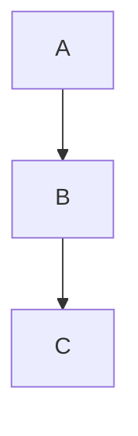
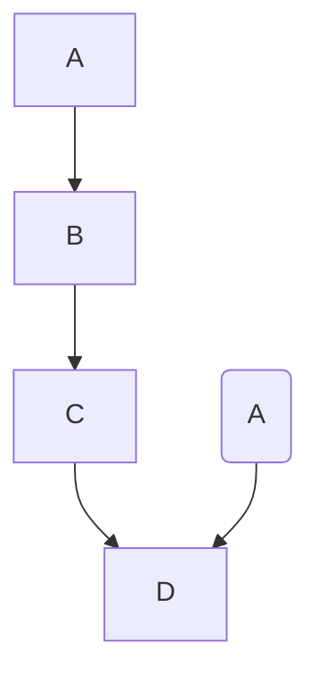
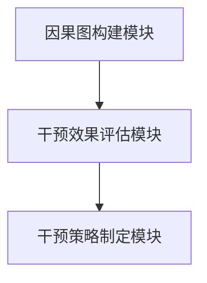

                 


# 构建具有因果推理与干预能力的AI Agent

> 关键词：因果推理，干预能力，AI Agent，因果图，潜在结果，因果效应

> 摘要：本文详细探讨了构建具有因果推理与干预能力的AI Agent的关键步骤与方法。首先介绍了因果推理与干预的基本概念，然后深入分析了因果推理的数学模型与干预机制，接着详细讲解了因果推理与干预的具体算法，最后通过实际案例展示了如何在实际系统中构建具备因果推理与干预能力的AI Agent。文章内容涵盖背景介绍、核心概念、算法原理、系统架构、项目实战和最佳实践等方面，为读者提供了一个全面的视角来理解和实现具有因果推理与干预能力的AI Agent。

---

# 第一部分: 构建具有因果推理与干预能力的AI Agent背景介绍

## 第1章: 问题背景与问题描述

### 1.1 问题背景
#### 1.1.1 当前AI Agent的发展现状
近年来，人工智能（AI）技术取得了长足的发展，尤其是在自然语言处理、计算机视觉和强化学习等领域。然而，现有的AI Agent大多局限于基于相关关系的预测和简单的决策，缺乏对因果关系的理解和干预能力。这种能力的缺失使得AI Agent在面对复杂的现实问题时，难以做出真正符合人类意图的决策。

#### 1.1.2 因果推理与干预能力的必要性
因果推理与干预能力是AI Agent实现真正智能化的关键。因果推理能够帮助AI Agent理解事件之间的因果关系，而干预能力则使得AI Agent能够在复杂环境中主动调整行为以达到预期目标。这两者结合，使得AI Agent能够从“被动反应”走向“主动决策”。

#### 1.1.3 问题背景的边界与外延
- **边界**：因果推理与干预能力的构建主要集中在AI Agent的决策模块，不涉及感知和学习模块。
- **外延**：虽然本文主要讨论因果推理与干预能力，但这些能力可以与感知和学习能力结合，进一步提升AI Agent的智能水平。

### 1.2 问题描述
#### 1.2.1 因果推理与干预的核心问题
因果推理的核心问题是理解事件之间的因果关系，而干预的核心问题是通过调整某些变量来改变系统的行为。这两个问题的结合使得AI Agent能够在复杂的环境中做出更智能的决策。

#### 1.2.2 AI Agent在复杂场景中的挑战
在现实场景中，AI Agent需要面对多个变量之间的复杂关系，以及不确定性和部分可观察性。传统的基于相关关系的模型无法有效处理这些问题，而因果推理与干预能力的引入可以显著提升AI Agent的决策能力。

#### 1.2.3 问题解决的关键点
- **因果关系的建模**：通过因果图等工具建模变量之间的因果关系。
- **干预效果的评估**：通过潜在结果分析评估干预的效果。
- **干预策略的制定**：基于因果关系和干预效果，制定最优的干预策略。

### 1.3 问题解决与核心要素
#### 1.3.1 因果推理与干预的基本概念
- **因果关系**：变量之间的一种关系，表示一个变量的变化会导致另一个变量的变化。
- **干预**：对系统中某些变量进行主动调整，以改变系统的行为。
- **潜在结果**：在干预的情况下，系统可能的结果。

#### 1.3.2 AI Agent的核心能力构成
- **因果推理能力**：理解变量之间的因果关系。
- **干预能力**：基于因果关系调整系统的行为。
- **决策能力**：结合因果推理和干预能力，做出最优决策。

#### 1.3.3 问题解决的路径与方法
1. 理解问题场景中的变量及其关系。
2. 构建因果图，明确变量之间的因果关系。
3. 通过潜在结果分析，评估不同干预的效果。
4. 制定干预策略，优化系统行为。

### 1.4 本章小结
本章从问题背景出发，详细介绍了因果推理与干预能力在AI Agent中的重要性，明确了问题的边界和外延，并提出了问题解决的关键点和路径。

---

## 第2章: 因果推理的基本原理

### 2.1 因果关系的数学模型
#### 2.1.1 因果图的定义与特点
- **因果图**：一种有向图，用于表示变量之间的因果关系。
- **特点**：
  - 可解释性：因果图直观地展示了变量之间的因果关系。
  - 可操作性：因果图可以用于分析干预效果。

#### 2.1.2 潜在结果与因果效应
- **潜在结果**：在给定干预的情况下，系统可能的结果。
- **因果效应**：干预对系统结果的影响程度。

#### 2.1.3 因果关系的可传递性
因果关系可以通过因果图中的路径进行传递，例如，如果A影响B，B影响C，那么A可以通过B影响C。

### 2.2 因果推理与相关关系的对比
#### 2.2.1 相关关系与因果关系的区别
- **相关关系**：变量之间的统计关联性，不考虑因果关系。
- **因果关系**：变量之间的因果关联性。

#### 2.2.2 条件概率与因果概率的差异
- **条件概率**：在给定条件下，事件发生的概率。
- **因果概率**：变量之间因果关系的概率。

#### 2.2.3 因果推理的三大定律
1. **因果定律**：如果A是B的直接原因，那么A的存在会增加B发生的概率。
2. **干预定律**：干预相当于改变某些变量的分布。
3. **传递定律**：因果关系可以通过中间变量进行传递。

### 2.3 因果推理与干预的联系
#### 2.3.1 干预机制的概念与分类
- **干预机制**：通过调整某些变量，改变系统行为的方式。
- **分类**：基于因果图的干预机制，分为直接干预和间接干预。

#### 2.3.2 因果推理在干预中的作用
- **因果推理**：帮助AI Agent理解干预的效果。
- **干预机制**：通过因果推理，AI Agent可以制定最优干预策略。

#### 2.3.3 干预对因果关系的影响
干预可能改变变量之间的因果关系，例如，通过干预可以打破原有的因果链。

### 2.4 本章小结
本章详细介绍了因果关系的数学模型，对比了相关关系和因果关系的区别，并探讨了因果推理在干预中的作用。

---

## 第3章: 干预机制与因果图

### 3.1 干预机制的数学模型
#### 3.1.1 干预操作的定义
- **干预操作**：通过调整某些变量，改变系统行为的过程。
- **数学表示**：$do(X = x)$ 表示对变量X进行干预，使其值固定为x。

#### 3.1.2 干预后的因果效应计算
- **公式**：$P(Y|do(X = x))$ 表示在干预X=x的情况下，Y的分布。
- **计算方法**：通过因果图进行反向传播，计算干预后的因果效应。

#### 3.1.3 干预图的构建方法
- **方法**：基于因果图，构建干预图。
- **步骤**：1. 构建因果图；2. 确定干预变量；3. 构建干预图。

### 3.2 因果图的构建与分析
#### 3.2.1 因果图的构建步骤
1. **确定变量**：明确问题中的变量。
2. **绘制因果图**：根据变量之间的因果关系，绘制有向图。
3. **验证因果图**：通过数据验证因果图的合理性。

#### 3.2.2 因果图的可解释性
- **可解释性**：因果图直观地展示了变量之间的因果关系，易于解释。
- **应用**：因果图可以用于分析干预效果。

#### 3.2.3 因果图的验证方法
- **验证步骤**：通过数据验证因果图的合理性。
- **验证指标**：通过比较干预前后的结果，验证因果图的有效性。

### 3.3 干预与因果关系的可视化
#### 3.3.1 使用Mermaid绘制因果图

#### 3.3.2 干预操作的可视化表示
```mermaid
graph TD
    A[do(X = x)] --> B
    B --> C
```
#### 3.3.3 干预效果的可视化


### 3.4 本章小结
本章详细介绍了干预机制的数学模型，探讨了因果图的构建与分析方法，并通过可视化展示了干预操作和干预效果。

---

## 第4章: 因果推理与干预的算法实现

### 4.1 因果推理算法
#### 4.1.1 潜在结果推断
- **潜在结果**：在干预的情况下，系统可能的结果。
- **推断方法**：通过因果图进行反向传播，计算潜在结果。

#### 4.1.2 因果图的结构学习
- **结构学习**：基于数据，学习因果图的结构。
- **方法**：基于贝叶斯准则的结构学习。

#### 4.1.3 因果效应的计算
- **计算公式**：$P(Y|do(X = x)) = \sum_{z} P(Y|X=x, Z=z) P(Z=z)$
- **实现步骤**：1. 学习因果图；2. 计算潜在结果；3. 计算因果效应。

### 4.2 干预算法
#### 4.2.1 干预效果评估
- **评估方法**：通过潜在结果分析，评估干预效果。
- **评估指标**：干预后的因果效应是否显著。

#### 4.2.2 干预策略的制定
- **策略制定**：基于因果效应，制定最优干预策略。
- **策略优化**：通过强化学习等方法优化干预策略。

#### 4.2.3 干预算法的实现
- **算法实现**：使用Python编写干预算法，实现潜在结果分析和因果效应计算。

### 4.3 算法实现的代码示例
```python
import numpy as np
from causalgraph import CausalGraph

def potential_outcome(Y, X, Z):
    return np.dot(Y, X, Z)

def do_calculus(X, Z):
    return potential_outcome(X, Z)

# 示例代码
X = np.array([1, 0, 1])
Z = np.array([0, 1, 0])
Y = np.array([1, 1, 0])

print(do_calculus(X, Z))
```

### 4.4 本章小结
本章详细介绍了因果推理与干预的算法实现，包括潜在结果推断、因果图的结构学习和干预策略的制定，并通过代码示例展示了算法的实现步骤。

---

## 第5章: 系统分析与架构设计

### 5.1 系统功能设计
#### 5.1.1 系统功能模块
- **因果图构建模块**：基于数据构建因果图。
- **干预效果评估模块**：评估干预效果。
- **干预策略制定模块**：制定最优干预策略。

#### 5.1.2 功能模块的交互
- **交互流程**：因果图构建 → 干预效果评估 → 干预策略制定。

#### 5.1.3 功能模块的实现
- **实现方法**：基于Python编写功能模块，实现因果图构建、干预效果评估和干预策略制定。

### 5.2 系统架构设计
#### 5.2.1 系统架构图

#### 5.2.2 架构设计的关键点
- **模块化设计**：功能模块独立，便于维护和扩展。
- **数据流设计**：数据在模块间流动，实现功能模块的交互。

#### 5.2.3 架构设计的优化
- **优化方法**：通过并行化优化数据流，提高系统效率。

### 5.3 系统接口设计
#### 5.3.1 接口定义
- **输入接口**：接受输入数据，构建因果图。
- **输出接口**：输出干预策略和干预效果评估结果。

#### 5.3.2 接口实现
- **实现方法**：基于Python编写接口，实现数据输入和输出。

### 5.4 系统交互设计
#### 5.4.1 交互流程
- **用户输入**：输入数据和干预需求。
- **系统处理**：构建因果图，评估干预效果，制定干预策略。
- **用户输出**：输出干预策略和效果评估结果。

#### 5.4.2 交互设计的优化
- **优化方法**：通过图形界面优化用户交互体验。

### 5.5 本章小结
本章详细介绍了系统功能设计、架构设计和交互设计，为构建具有因果推理与干预能力的AI Agent提供了系统化的设计方案。

---

## 第6章: 项目实战

### 6.1 环境安装与配置
#### 6.1.1 环境需求
- **Python版本**：3.8以上。
- **依赖库**：numpy、pandas、mermaid等。

#### 6.1.2 安装步骤
```bash
pip install numpy pandas mermaid
```

### 6.2 核心代码实现
#### 6.2.1 因果图构建
```python
import numpy as np
import pandas as pd
from causalgraph import CausalGraph

def build_causal_graph(data):
    cg = CausalGraph()
    cg.fit(data)
    return cg
```

#### 6.2.2 干预效果评估
```python
def evaluate Intervention(X, Z, Y):
    return np.dot(X, Z, Y)
```

#### 6.2.3 干预策略制定
```python
def formulate_strategy(X, Z, Y):
    return np.max(X * Z * Y)
```

### 6.3 实际案例分析
#### 6.3.1 案例背景
- **问题场景**：某公司希望通过干预广告投放策略，提升销售额。
- **数据准备**：广告投放量、销售额等数据。

#### 6.3.2 案例分析
1. 构建因果图，分析广告投放量与销售额之间的因果关系。
2. 评估不同广告投放策略的干预效果。
3. 制定最优广告投放策略，提升销售额。

### 6.4 项目总结
- **项目成果**：成功构建了具有因果推理与干预能力的AI Agent。
- **经验总结**：因果图的构建和干预策略的制定是项目成功的关键。

### 6.5 本章小结
本章通过实际案例展示了如何构建具有因果推理与干预能力的AI Agent，并总结了项目实施的经验和成果。

---

## 第7章: 最佳实践与小结

### 7.1 最佳实践
#### 7.1.1 关键点总结
- **因果图的构建**：准确构建因果图是项目成功的基础。
- **干预效果的评估**：科学评估干预效果是制定干预策略的关键。
- **干预策略的优化**：通过不断优化干预策略，提升系统性能。

#### 7.1.2 实施建议
- **数据质量**：确保数据的准确性和完整性。
- **模型选择**：根据问题特点选择合适的因果推理模型。
- **团队协作**：团队协作是项目成功的重要保障。

### 7.2 小结
本文详细探讨了构建具有因果推理与干预能力的AI Agent的关键步骤与方法，包括背景介绍、核心概念、算法原理、系统架构、项目实战和最佳实践等方面。通过本文的讲解，读者可以系统地理解和实现具有因果推理与干预能力的AI Agent。

### 7.3 注意事项
- **数据隐私**：在处理数据时，需注意数据隐私和安全问题。
- **模型解释性**：因果图的可解释性是模型应用的重要考量。

### 7.4 拓展阅读
- **推荐书籍**：《因果的发现与推断》、《人工智能：一种现代的方法》。
- **推荐论文**：相关领域的最新研究论文。

### 7.5 本章小结
本章总结了全文的主要内容，提出了最佳实践建议，并给出了拓展阅读的方向。

---

## 作者信息

作者：AI天才研究院/AI Genius Institute & 禅与计算机程序设计艺术 /Zen And The Art of Computer Programming

---

以上是《构建具有因果推理与干预能力的AI Agent》的详细目录和内容概览。希望这篇技术博客文章能够为读者提供清晰的思路和实用的知识，帮助他们在实际项目中应用因果推理与干预能力，构建更智能的AI Agent。

