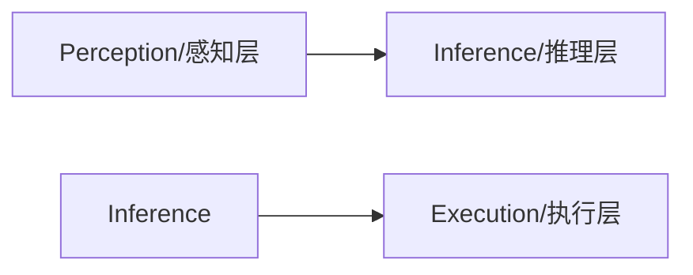
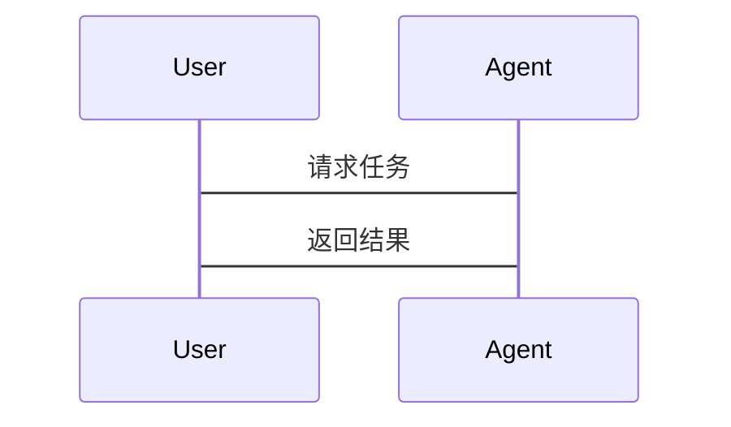
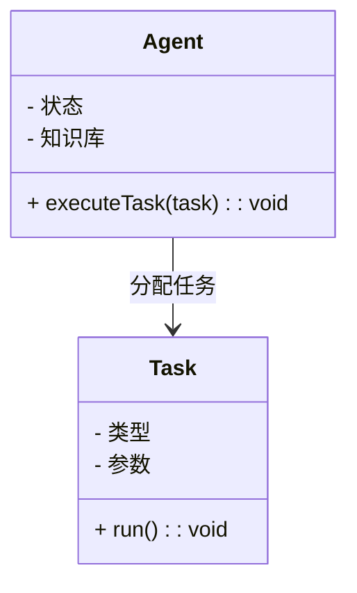
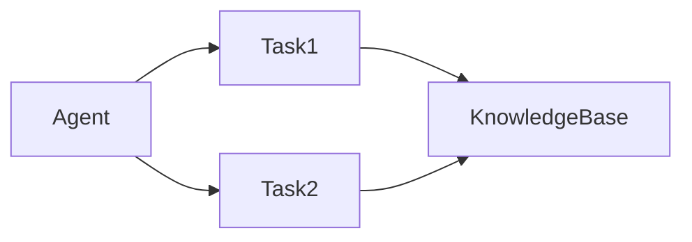

                 


# 构建具有多任务学习能力的AI Agent

> 关键词：AI Agent，多任务学习，神经网络，强化学习，系统架构

> 摘要：本文详细探讨了如何构建一个具有多任务学习能力的AI Agent。首先介绍了多任务学习和AI Agent的基本概念，然后分析了多任务学习的数学模型与算法原理，接着讲解了AI Agent的系统架构与设计，最后通过项目实战展示了如何实现一个简单的多任务学习AI Agent。本文还提供了代码示例和系统架构图，帮助读者更好地理解和应用相关技术。

---

# 第一部分: 多任务学习与AI Agent基础

## 第1章: 多任务学习与AI Agent概述

### 1.1 多任务学习的基本概念

#### 1.1.1 多任务学习的定义
多任务学习（Multi-Task Learning，MTL）是指让模型同时学习多个相关任务，以共享模型参数或特征，从而提高模型的泛化能力和性能。

#### 1.1.2 多任务学习的核心特征
- **任务相关性**：多个任务之间存在某种关联性，可以共享知识。
- **参数共享**：通过共享参数来减少模型复杂度，提高学习效率。
- **联合优化**：多个任务的损失函数共同优化，找到最优解。

#### 1.1.3 多任务学习与单任务学习的区别
| 特性 | 单任务学习 | 多任务学习 |
|------|------------|------------|
| 参数共享 | 无         | 有         |
| 任务数量 | 单个任务   | 多个任务   |
| 泛化能力 | 较低       | 较高       |

### 1.2 AI Agent的基本概念

#### 1.2.1 AI Agent的定义
AI Agent（人工智能代理）是一种能够感知环境、执行任务并做出决策的智能系统。它可以自主或受控地完成特定目标。

#### 1.2.2 AI Agent的核心功能
- **感知**：通过传感器或接口获取环境信息。
- **推理**：基于获取的信息进行分析和决策。
- **执行**：根据决策执行具体操作。

#### 1.2.3 AI Agent的分类
- **简单反射型**：基于规则的简单反应。
- **基于模型的反应型**：基于环境模型进行推理。
- **目标驱动型**：根据目标驱动行为。
- **实用驱动型**：基于效用函数进行优化。

### 1.3 多任务学习AI Agent的结合

#### 1.3.1 多任务学习在AI Agent中的作用
通过多任务学习，AI Agent可以在不同任务之间共享知识，提高整体性能。

#### 1.3.2 多任务学习AI Agent的优势
- **知识复用**：多个任务之间共享知识，减少数据需求。
- **任务协调**：通过多任务学习，任务之间可以协调执行。
- **灵活性**：能够适应多种任务需求。

#### 1.3.3 多任务学习AI Agent的应用场景
- **智能助手**：同时处理信息检索、日程管理等任务。
- **自动驾驶**：同时处理路径规划、障碍物识别等多个任务。
- **机器人控制**：同时处理运动控制、物体识别等任务。

### 1.4 本章小结
本章介绍了多任务学习和AI Agent的基本概念，分析了它们的结合方式及其优势和应用场景。

---

# 第二部分: 多任务学习的数学模型与算法原理

## 第2章: 多任务学习的数学模型

### 2.1 多任务学习的损失函数

#### 2.1.1 单任务损失函数
单任务学习的损失函数用于衡量模型在单个任务上的预测误差。

$$L_i = \frac{1}{n_i}\sum_{i=1}^{n_i} (y_i - \hat{y}_i)^2$$

其中，$n_i$为任务$i$的样本数，$y_i$为真实值，$\hat{y}_i$为预测值。

#### 2.1.2 多任务损失函数
多任务学习的损失函数将多个任务的损失函数加权求和。

$$L = \sum_{i=1}^{m} \lambda_i L_i$$

其中，$\lambda_i$为任务$i$的权重，$m$为任务总数。

#### 2.1.3 加权损失函数
通过调整权重，可以平衡不同任务的重要性。

### 2.2 多任务学习的优化算法

#### 2.2.1 基于梯度下降的优化
使用梯度下降优化多任务损失函数。

$$\theta_{t+1} = \theta_t - \eta \cdot \nabla_{\theta} L$$

其中，$\theta$为模型参数，$\eta$为学习率。

#### 2.2.2 基于Adam优化器的改进
Adam优化器结合动量和自适应学习率。

$$m_t = \beta_1 m_{t-1} + (1 - \beta_1) g_t$$$$v_t = \beta_2 v_{t-1} + (1 - \beta_2) g_t^2$$$$\theta_{t+1} = \theta_t - \eta \frac{m_t}{\sqrt{v_t + \epsilon}}$$

其中，$m_t$为动量，$v_t$为方差，$\epsilon$为防止除零。

#### 2.2.3 其他优化方法
包括RMSprop、AdaGrad等优化算法。

### 2.3 多任务学习的数学公式

#### 2.3.1 单任务学习的数学表达
$$L_i = \frac{1}{n_i}\sum_{i=1}^{n_i} (y_i - \hat{y}_i)^2$$

#### 2.3.2 多任务学习的数学表达
$$L = \sum_{i=1}^{m} \lambda_i L_i$$

### 2.4 本章小结
本章分析了多任务学习的损失函数和优化算法，重点介绍了基于梯度下降和Adam优化器的实现。

---

## 第3章: 多任务学习的算法原理

### 3.1 基于神经网络的多任务学习

#### 3.1.1 多任务神经网络的结构
多任务神经网络通过共享部分层来实现参数共享。

```mermaid
graph LR
    I1/Input -> L1/第一层
    L1 -> L2/第二层
    L2 -> Task1/任务1
    L2 -> Task2/任务2
```

#### 3.1.2 参数共享机制
通过共享参数降低模型复杂度。

#### 3.1.3 任务间关系的建模
分析任务间的依赖关系，优化模型结构。

### 3.2 基于强化学习的多任务优化

#### 3.2.1 强化学习的基本原理
通过与环境交互，学习最优策略。

#### 3.2.2 多任务强化学习的挑战
任务间的冲突和协调问题。

#### 3.2.3 实例分析
使用多任务强化学习优化AI Agent的任务执行策略。

### 3.3 基于图神经网络的多任务学习

#### 3.3.1 图神经网络的基本概念
图神经网络用于处理图结构数据。

#### 3.3.2 图神经网络在多任务学习中的应用
分析任务间的图结构关系。

#### 3.3.3 实例分析
使用图神经网络优化多任务学习模型。

### 3.4 本章小结
本章分析了多任务学习的算法原理，包括神经网络、强化学习和图神经网络的应用。

---

# 第三部分: AI Agent的系统架构与设计

## 第4章: AI Agent的系统架构

### 4.1 系统功能设计

#### 4.1.1 任务分解模块
将复杂任务分解为多个子任务。

#### 4.1.2 多任务协调模块
协调多个子任务的执行。

#### 4.1.3 知识表示模块
存储和处理相关知识。

### 4.2 系统架构设计

#### 4.2.1 分层架构
将系统分为感知层、推理层和执行层。



#### 4.2.2 微服务架构
通过微服务实现模块化设计。

#### 4.2.3 混合架构
结合分层和微服务的优点。

### 4.3 系统接口设计

#### 4.3.1 外部接口
与外部系统和用户的接口设计。

#### 4.3.2 内部接口
模块之间的接口设计。

#### 4.3.3 接口规范
定义接口的输入输出格式。

### 4.4 系统交互设计

#### 4.4.1 用户交互流程
用户输入请求，系统处理并返回结果。



#### 4.4.2 任务执行流程
系统分解任务，协调执行，返回结果。

#### 4.4.3 错误处理流程
处理执行过程中的异常情况。

### 4.5 本章小结
本章详细设计了AI Agent的系统架构，包括功能模块、架构设计和交互流程。

---

## 第5章: 项目实战

### 5.1 项目介绍
构建一个简单的多任务学习AI Agent，能够执行多个任务。

### 5.2 系统功能设计

#### 5.2.1 领域模型
定义系统的核心实体和关系。



#### 5.2.2 系统架构
整体系统架构设计。



#### 5.2.3 系统接口
定义系统接口和交互流程。

### 5.3 系统实现

#### 5.3.1 环境安装
安装所需的库和工具。

```bash
pip install numpy
pip install tensorflow
```

#### 5.3.2 核心实现

```python
class Agent:
    def __init__(self):
        self.knowledge = {}

    def learn(self, tasks):
        # 多任务学习算法
        pass

    def execute(self, task):
        # 执行任务
        pass
```

#### 5.3.3 代码应用解读
分析核心代码的功能和实现细节。

### 5.4 项目小结
总结项目实现的关键点和经验教训。

---

## 第6章: 小结与展望

### 6.1 本章小结
总结全文的主要内容和研究成果。

### 6.2 未来展望
探讨多任务学习AI Agent的未来发展方向。

---

# 作者：AI天才研究院/AI Genius Institute & 禅与计算机程序设计艺术 /Zen And The Art of Computer Programming

---

通过以上目录和内容，我们可以系统地构建一个具有多任务学习能力的AI Agent，涵盖从基础理论到系统实现的各个方面。希望本文能为相关领域的研究和实践提供有价值的参考。

