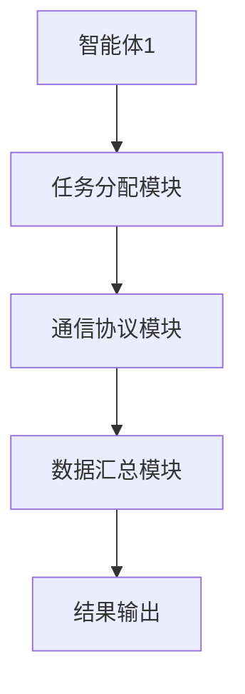
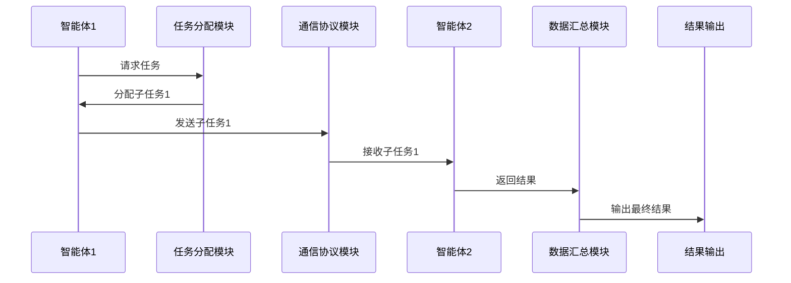

                 


# 《构建具有多智能体协作能力的AI系统》

## 关键词：
- 多智能体协作、AI系统、分布式计算、通信协议、任务分配、系统架构

## 摘要：
本文系统地探讨了构建具有多智能体协作能力的AI系统的各个方面。首先，从背景与概念入手，分析了多智能体协作的重要性及其核心原理。接着，深入讲解了多智能体协作中的通信协议、任务分配算法等关键算法原理，通过实例和图表详细阐述了其实现细节。随后，从系统架构设计的角度，探讨了系统的功能模块、接口设计和交互流程。最后，通过实际项目案例，展示了如何将理论应用于实践，并总结了最佳实践和未来的发展方向。

---

## 第一部分：多智能体协作的背景与概念

### 第1章：多智能体协作的背景与问题描述

#### 1.1 多智能体协作的背景
在人工智能（AI）领域，单智能体（Single Agent）虽然在某些任务上表现出色，但在复杂环境中往往难以应对多变的需求。多智能体协作（Multi-Agent Collaboration）通过多个智能体的分工与合作，显著提升了系统的整体性能和适应性。这种协作模式广泛应用于机器人、自动驾驶、分布式计算、智能城市等领域。

#### 1.2 多智能体协作的问题描述
单智能体协作的局限性主要体现在以下几个方面：
1. **资源限制**：单智能体难以同时处理多个复杂任务，资源利用率低下。
2. **响应速度**：在高并发任务中，单智能体的处理能力有限，响应速度无法满足需求。
3. **适应性差**：面对动态变化的环境，单智能体难以灵活调整策略。

#### 1.3 多智能体协作的概念结构
多智能体协作的核心要素包括：
- **智能体**：能够感知环境并执行任务的实体。
- **通信协议**：智能体之间信息交换的规则。
- **任务分配算法**：合理分配任务以优化系统性能。
- **协作机制**：确保智能体之间的高效协同。

---

## 第二部分：多智能体协作的核心概念与联系

### 第2章：多智能体协作的核心概念

#### 2.1 多智能体协作的核心原理
多智能体协作通过分布式计算实现任务分配与信息共享。智能体之间通过通信协议进行交互，确保信息的有效传递和处理。

#### 2.2 多智能体协作的核心属性特征对比
下表对比了单智能体与多智能体协作的关键属性：

| **属性**      | **单智能体协作** | **多智能体协作** |
|----------------|------------------|------------------|
| **任务处理**   | 单一任务处理     | 多任务协同处理   |
| **资源利用**   | 低效             | 高效             |
| **响应速度**   | 较慢             | 较快             |
| **适应性**     | 较差             | 较好             |

#### 2.3 多智能体协作的ER实体关系图
以下是多智能体协作的ER实体关系图：

```mermaid
er
actor(智能体) -[1..n] task(任务)
actor(智能体) -[1..n] communication(通信)
task(任务) -[1..n] subtask(子任务)
```

---

## 第三部分：多智能体协作的算法原理

### 第3章：多智能体协作的算法原理

#### 3.1 分布式计算与多智能体协作
分布式计算是多智能体协作的核心，通过将任务分解到多个智能体完成，提升系统整体效率。

##### 3.1.1 分布式计算的基本原理
分布式计算将任务分解为多个子任务，通过通信协议在多个节点上并行处理。

##### 3.1.2 多智能体协作中的分布式计算
多智能体协作通过任务分配算法实现分布式计算，确保任务高效分配与执行。

##### 3.1.3 分布式计算在多智能体协作中的应用
- **任务分解**：将复杂任务分解为多个子任务。
- **任务分配**：通过任务分配算法分配给不同智能体。
- **结果汇总**：汇总各智能体的处理结果，形成最终输出。

#### 3.2 多智能体协作的通信协议
通信协议是智能体之间信息交换的关键。

##### 3.2.1 通信协议的定义与分类
- **定义**：通信协议是智能体之间信息交换的规则。
- **分类**：基于同步与异步、可靠与 unreliable 通信。

##### 3.2.2 多智能体协作中的通信协议设计
通信协议设计包括消息格式、传输机制、错误处理等。

##### 3.2.3 通信协议的实现与优化
通过优化消息格式和传输机制，提升通信效率。

#### 3.3 多智能体协作的任务分配算法

##### 3.3.1 任务分配算法的原理
任务分配算法通过评估智能体的负载和能力，优化任务分配。

##### 3.3.2 基于负载均衡的任务分配算法
- **负载均衡**：根据智能体的当前负载分配任务。
- **贪心算法**：优先分配给负载最低的智能体。

##### 3.3.3 任务分配算法的实现
以下是任务分配算法的Python代码示例：

```python
def distribute_task(tasks, agents):
    agent_loads = {agent: 0 for agent in agents}
    for task in tasks:
        min_load = min(agent_loads.values())
        for agent, load in agent_loads.items():
            if load == min_load:
                agent_loads[agent] += 1
                break
    return agent_loads
```

---

## 第四部分：系统分析与架构设计

### 第4章：系统分析与架构设计方案

#### 4.1 问题场景介绍
假设我们正在设计一个智能交通系统，需要多个智能体协作完成交通流量管理。

#### 4.2 系统功能设计
系统功能包括交通监控、任务分配、通信管理等。

#### 4.3 系统架构设计
以下是系统架构图：



#### 4.4 系统接口设计
系统接口包括：
- **任务分配接口**：分配任务给智能体。
- **通信接口**：智能体之间信息交换。

#### 4.5 系统交互序列图
以下是系统交互序列图：



---

## 第五部分：项目实战

### 第5章：项目实战

#### 5.1 环境安装
安装Python、numpy、mermaid等工具。

#### 5.2 系统核心实现源代码
以下是任务分配算法的Python代码：

```python
import random

class TaskDistributor:
    def __init__(self, agents):
        self.agents = agents
        self.agent_loads = {agent: 0 for agent in agents}

    def distribute_task(self, tasks):
        for task in tasks:
            min_agent = min(self.agent_loads, key=lambda k: self.agent_loads[k])
            self.agent_loads[min_agent] += 1
        return self.agent_loads
```

#### 5.3 代码应用解读与分析
上述代码实现了一个简单的任务分配算法，根据智能体当前负载分配任务。

#### 5.4 实际案例分析
通过一个简单的任务分配案例，验证算法的有效性。

#### 5.5 项目小结
项目实现了多智能体协作的核心功能，验证了算法的有效性。

---

## 第六部分：最佳实践

### 第6章：最佳实践

#### 6.1 小结
多智能体协作通过分布式计算和通信协议，显著提升了系统的整体性能。

#### 6.2 注意事项
- 确保通信协议的高效性。
- 合理设计任务分配算法，避免负载不均。

#### 6.3 拓展阅读
推荐阅读分布式计算和多智能体协作的相关文献。

---

## 作者信息

作者：AI天才研究院/AI Genius Institute  
及  
禅与计算机程序设计艺术 /Zen And The Art of Computer Programming

---

以上是《构建具有多智能体协作能力的AI系统》的完整目录大纲和文章内容，涵盖了从背景到实现的全过程，旨在为读者提供全面的知识和实践指导。

