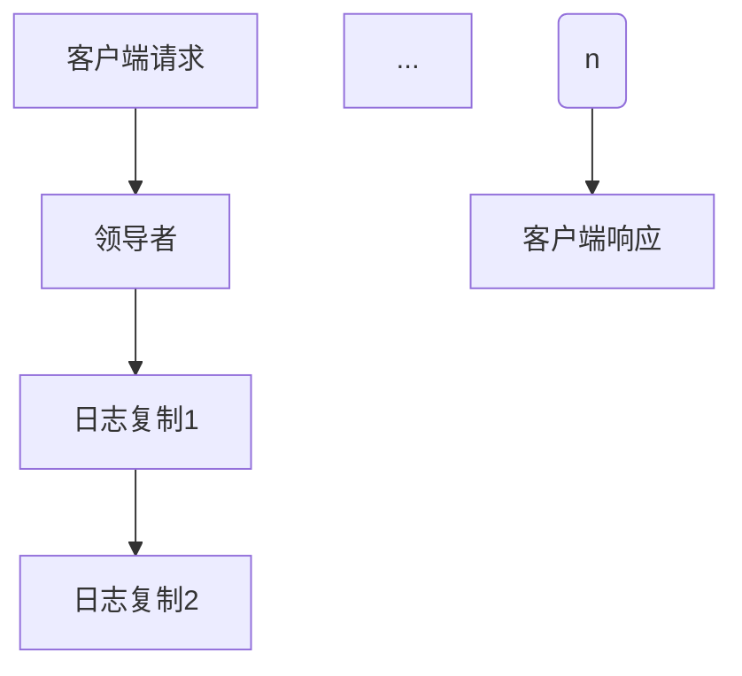
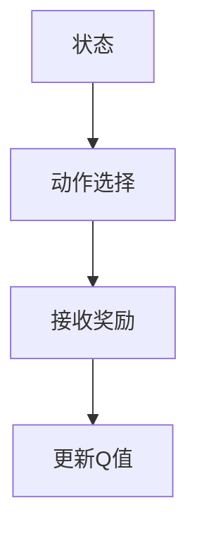
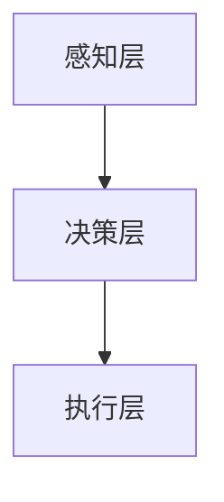
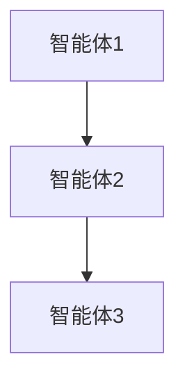
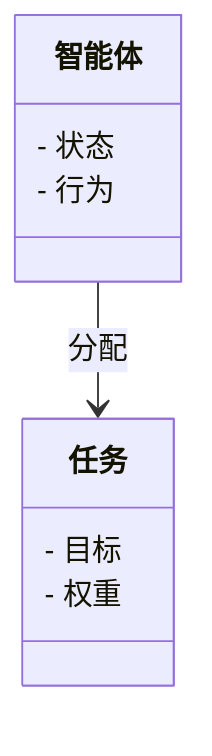

                 


# 构建具有多智能体协同决策能力的系统

> 关键词：多智能体系统，协同决策，分布式系统，强化学习，图神经网络，系统架构

> 摘要：本文详细探讨了构建具有多智能体协同决策能力的系统的关键技术与方法。从背景介绍到核心概念，从算法原理到系统架构设计，再到项目实战，系统地阐述了多智能体协同决策的实现过程。通过实际案例分析，总结了构建此类系统的最佳实践和注意事项。

---

## 第一部分: 多智能体协同决策系统背景介绍

### 第1章: 问题背景与问题描述

#### 1.1 多智能体协同决策的背景
在现代计算机科学和人工智能领域，单点决策逐渐暴露出其局限性。例如，在自动驾驶、智能交通管理、分布式机器人协作等领域，单个智能体的决策往往无法满足复杂场景的需求。多智能体协同决策通过多个智能体的协作，能够实现更高效、更灵活的决策能力。

#### 1.2 问题的提出与描述
多智能体协同决策的核心问题在于如何在多个智能体之间实现高效的信息共享、决策协调和任务分配。每个智能体可能具有不同的目标和利益，如何在这些目标之间找到平衡点，是多智能体系统设计的关键挑战。

#### 1.3 多智能体系统的核心问题
- **信息共享与隐私保护**：如何在保证隐私的前提下，实现智能体之间的信息共享。
- **任务分配与协同**：如何动态分配任务，确保每个智能体都能发挥其优势。
- **决策一致性与冲突解决**：如何在不同智能体的决策之间找到一致性，并解决冲突。

### 第2章: 多智能体系统的核心概念与联系

#### 2.1 多智能体系统的基本概念
- **多智能体系统（Multi-Agent System, MAS）**：由多个智能体组成的系统，这些智能体能够通过协作完成复杂的任务。
- **智能体（Agent）**：具有感知环境、自主决策和执行动作能力的实体。

#### 2.2 多智能体系统与相关概念的对比
| 概念 | 描述 | 区别 |
|------|------|------|
| 分布式系统 | 一组通过通信网络连接的计算节点 | 强调分布式计算和数据一致性，不涉及智能体的自主性 |
| 群智系统 | 由大量用户或智能体组成的系统，通过群体智慧完成任务 | 强调群体智慧的涌现性，不一定是多智能体系统 |
| 多智能体系统 | 由多个智能体组成的系统，通过协作完成任务 | 强调智能体的自主性、协作性和动态性 |

#### 2.3 多智能体系统的ER实体关系图
```mermaid
er
actor(多智能体系统) --> 智能体: 组成
actor(多智能体系统) --> 任务: 分配
智能体 --> 传感器: 感知
智能体 --> 执行器: 执行
```

---

## 第二部分: 多智能体协同决策的核心算法原理

### 第3章: 基于博弈论的多智能体决策

#### 3.1 纳什均衡的定义与应用
纳什均衡是博弈论中的一个核心概念，指在给定其他参与者策略的情况下，参与者无法通过单方面改变策略而获得更好的结果的状态。

**例子：囚徒困境**
两个囚徒分别面临两种选择：保持沉默或揭发对方。纳什均衡出现在两个囚徒都选择揭发对方的情况下。

### 第4章: 分布式一致性算法

#### 4.1 Raft一致性算法的实现
Raft算法通过领导者选举、日志复制等步骤，确保分布式系统中各个节点的数据一致性。

**Raft算法流程图**


### 第5章: 基于强化学习的多智能体协作算法

#### 5.1 Q-learning算法的实现
Q-learning是一种经典的强化学习算法，通过智能体与环境的交互，更新动作价值函数。

**Q-learning算法流程图**


#### 5.2 图注意力机制的实现
图注意力机制通过计算节点之间的注意力权重，实现图结构数据的高效处理。

**图注意力机制公式**
$$
\alpha_{ij} = \frac{e^{q_i^T k_j}}{\sum_{l} e^{q_i^T k_l}}
$$

---

## 第三部分: 多智能体系统架构设计

### 第6章: 系统总体架构设计

#### 6.1 分层架构设计
多智能体系统的分层架构包括感知层、决策层和执行层。

**分层架构图**


#### 6.2 微服务架构设计
多智能体系统可以通过微服务架构实现模块化设计，每个智能体作为一个独立的服务运行。

**微服务架构图**


### 第7章: 系统功能设计

#### 7.1 领域模型设计
领域模型描述了系统中的实体及其关系。

**领域模型图**


---

## 第四部分: 多智能体系统项目实战

### 第8章: 项目环境与工具安装

#### 8.1 开发环境配置
- 操作系统：Linux/Windows/MacOS
- 开发工具：PyCharm/VS Code
- 依赖库：Python 3.8+, numpy, scikit-learn, tensorflow

#### 8.2 依赖库安装
```bash
pip install numpy scikit-learn tensorflow
```

### 第9章: 系统核心实现

#### 9.1 智能体通信模块实现
```python
class Agent:
    def __init__(self, id):
        self.id = id
        self.state = None
    def send_message(self, message):
        # 实现消息发送逻辑
        pass
```

#### 9.2 决策算法实现
```python
def nash_equilibrium(game_matrix):
    # 实现纳什均衡计算逻辑
    pass
```

### 第10章: 实际案例分析

#### 10.1 案例分析
以自动驾驶场景为例，多个智能体协同完成路径规划和避障任务。

#### 10.2 代码应用解读与分析
```python
import numpy as np

def calculate_nash_equilibrium(game_matrix):
    # 简单实现纳什均衡计算
    pass

# 示例矩阵
game_matrix = np.array([[3, 1], [1, 3]])
```

---

## 第五部分: 最佳实践与总结

### 第11章: 最佳实践 tips

#### 11.1 系统设计
- 采用分层架构设计，确保系统的可扩展性和可维护性。
- 在智能体之间建立有效的通信机制，确保信息共享和隐私保护。

#### 11.2 算法选择
- 根据具体场景选择合适的算法，例如在动态环境中选择强化学习算法。
- 在静态环境中选择博弈论算法。

### 第12章: 小结

通过本文的详细讲解，我们了解了多智能体协同决策系统的构建过程，从理论到实践，从算法到架构，全面掌握了多智能体系统的实现方法。

### 第13章: 注意事项

- 确保智能体之间的通信延迟在可接受范围内。
- 定期更新智能体的决策模型，以应对环境的变化。
- 处理好智能体之间的冲突和协调问题。

### 第14章: 拓展阅读

推荐阅读以下书籍和论文：
- 《Multi-Agent Systems: Algorithmic, Complexity, and Inferential Principles》
- 《Distributed Systems: Concept and Design》

---

## 作者

作者：AI天才研究院/AI Genius Institute & 禅与计算机程序设计艺术 /Zen And The Art of Computer Programming

