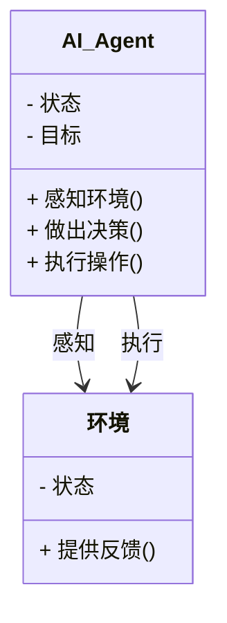
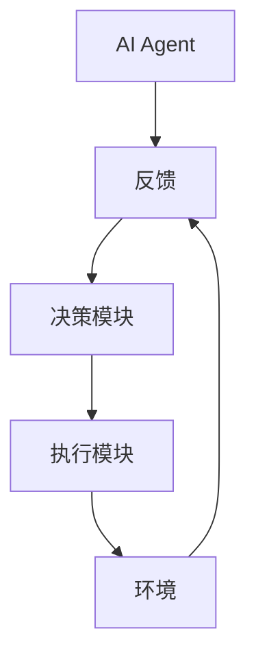
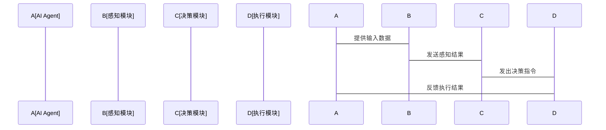

                 


# 构建具有多模态学习能力的AI Agent

> 关键词：多模态学习，AI Agent，深度学习，多模态数据融合，智能系统设计

> 摘要：本文旨在探讨如何构建具有多模态学习能力的AI Agent。通过详细分析多模态数据的处理、融合方法以及AI Agent的核心功能，本文将提供从理论到实践的全面指导，帮助读者理解如何设计和实现一个高效、智能的多模态AI Agent。

---

# 第1章: 多模态学习与AI Agent概述

## 1.1 多模态学习的定义与特点

### 1.1.1 多模态数据的定义
多模态数据是指来自多种感官或数据源的信息，例如文本、图像、语音、视频、传感器数据等。这些数据类型相互补充，能够提供更全面的信息。

### 1.1.2 多模态学习的核心特点
- **互补性**：不同模态的数据可以互补，提高模型的鲁棒性和准确性。
- **复杂性**：处理多模态数据需要复杂的算法和架构。
- **实用性**：在现实场景中，多模态数据能够提供更丰富的上下文信息。

### 1.1.3 多模态学习与单模态学习的对比
单模态学习仅依赖于一种数据类型，而多模态学习通过结合多种数据类型，能够更好地理解和解决复杂问题。

## 1.2 AI Agent的基本概念

### 1.2.1 AI Agent的定义
AI Agent是一种智能实体，能够感知环境并采取行动以实现特定目标。它可以是一个软件程序、机器人或其他智能系统。

### 1.2.2 AI Agent的核心功能
- **感知**：通过传感器或数据输入获取环境信息。
- **决策**：基于感知的信息进行推理和决策。
- **行动**：根据决策执行操作，影响环境。

### 1.2.3 AI Agent的分类与应用场景
AI Agent可以分为简单反射型、基于模型的反应型、目标驱动型和实用驱动型。应用场景包括智能家居、自动驾驶、医疗辅助等。

## 1.3 多模态学习能力的必要性

### 1.3.1 多模态数据的优势
多模态数据能够提供更丰富的信息，帮助AI Agent更好地理解复杂场景。

### 1.3.2 多模态学习在AI Agent中的作用
通过多模态学习，AI Agent能够更准确地感知环境，做出更智能的决策。

### 1.3.3 多模态学习能力的未来发展趋势
随着技术的进步，多模态学习将更加广泛地应用于各个领域，AI Agent的能力也将进一步提升。

## 1.4 本章小结
本章介绍了多模态学习和AI Agent的基本概念，分析了多模态学习在AI Agent中的重要性，并展望了未来的发展趋势。

---

# 第2章: 多模态学习的核心概念与联系

## 2.1 多模态数据的处理流程

### 2.1.1 数据采集与预处理
- 数据采集：通过传感器、摄像头等设备获取多模态数据。
- 数据预处理：清洗、归一化、特征提取等步骤。

### 2.1.2 数据融合方法
- 晚融合：在特征层面进行融合。
- 早融合：在原始数据层面进行融合。

### 2.1.3 数据表示与特征提取
使用深度学习模型（如CNN、RNN）提取多模态数据的特征。

## 2.2 多模态学习的算法原理

### 2.2.1 多模态融合的基本原理
- 对比学习：通过对比不同模态的数据，提取共同特征。
- 联合学习：将多模态数据联合建模，共同优化目标函数。

### 2.2.2 多模态学习的数学模型
$$ P(y|x_1, x_2) = \frac{P(x_1, x_2|y)P(y)}{P(x_1, x_2)} $$

### 2.2.3 多模态学习的挑战与解决方案
- 数据异质性：不同模态的数据具有不同的特征和分布。
- 数据量不均衡：某些模态的数据量较少，影响模型性能。

## 2.3 多模态学习与AI Agent的结合

### 2.3.1 多模态学习在AI Agent中的应用
- 多模态感知：通过结合视觉、听觉等多种感官信息，提高感知能力。
- 多任务学习：同时处理多种任务，提升整体性能。

### 2.3.2 多模态学习与AI Agent的协同工作
通过多模态学习，AI Agent能够更全面地理解环境，做出更智能的决策。

### 2.3.3 多模态学习对AI Agent性能的提升
通过融合多模态数据，AI Agent的准确性和鲁棒性显著提高。

## 2.4 本章小结
本章详细探讨了多模态数据的处理流程和融合方法，分析了多模态学习在AI Agent中的应用和优势。

---

# 第3章: 多模态学习的算法原理

## 3.1 多模态融合算法

### 3.1.1 晚融合与早融合方法
- 晚融合：在特征层面进行融合，适用于数据量较小的场景。
- 早融合：在数据层面进行融合，适用于需要实时处理的场景。

### 3.1.2 对比学习与联合学习
- 对比学习：通过对比不同模态的数据，提取共同特征。
- 联合学习：将多模态数据联合建模，共同优化目标函数。

### 3.1.3 图神经网络在多模态数据中的应用
图神经网络可以有效处理多模态数据中的复杂关系，例如知识图谱中的节点关系。

## 3.2 多模态学习的数学模型

### 3.2.1 多模态数据的表示模型
$$ x_i = f(x_i^{(1)}, x_i^{(2)}, ..., x_i^{(n)}) $$

### 3.2.2 多模态融合的数学公式
$$ y = g(x_1, x_2, ..., x_n) $$

### 3.2.3 多模态学习的损失函数与优化方法
- 损失函数：交叉熵损失、均方误差等。
- 优化方法：随机梯度下降、Adam优化器等。

## 3.3 多模态学习的算法实现

### 3.3.1 基于深度学习的多模态融合
- 使用卷积神经网络（CNN）处理图像数据。
- 使用循环神经网络（RNN）处理序列数据。

### 3.3.2 多模态学习的开源框架
- TensorFlow：支持多模态数据的处理和模型构建。
- PyTorch：支持动态计算图，适合复杂的多模态模型。

### 3.3.3 多模态学习的代码实现与解读
```python
import torch
class MultiModalModel(torch.nn.Module):
    def __init__(self):
        super().__init__()
        self.image_model = CNN()
        self.text_model = RNN()
        self.classifier = LinearLayer()

    def forward(self, image_input, text_input):
        image_features = self.image_model(image_input)
        text_features = self.text_model(text_input)
        combined_features = torch.cat([image_features, text_features], dim=-1)
        output = self.classifier(combined_features)
        return output
```

## 3.4 本章小结
本章详细讲解了多模态学习的算法原理，包括融合方法、数学模型和代码实现，帮助读者理解如何构建多模态学习模型。

---

# 第4章: 多模态AI Agent的系统分析与架构设计

## 4.1 系统功能设计

### 4.1.1 领域模型设计
使用Mermaid绘制领域模型类图，展示系统的核心功能模块。



### 4.1.2 系统架构设计
使用Mermaid绘制系统架构图，展示系统的模块划分和交互流程。



## 4.2 系统接口设计

### 4.2.1 接口定义
- 感知模块：接收多模态数据输入。
- 决策模块：基于感知数据做出决策。
- 执行模块：根据决策执行操作。

### 4.2.2 接口交互流程
使用Mermaid绘制序列图，展示系统内部的交互流程。



## 4.3 本章小结
本章通过系统分析与架构设计，展示了如何构建一个多模态AI Agent的系统，并详细说明了各模块的功能和交互流程。

---

# 第5章: 项目实战

## 5.1 环境安装

### 5.1.1 安装Python
```bash
python --version
```

### 5.1.2 安装依赖库
```bash
pip install numpy torch torchvision
```

## 5.2 系统核心实现

### 5.2.1 多模态数据处理
```python
import torch
import numpy as np
import torchvision

def process_data(image, text):
    # 处理图像数据
    image_feature = image_model(image)
    # 处理文本数据
    text_feature = text_model(text)
    # 融合特征
    combined_feature = torch.cat([image_feature, text_feature], dim=-1)
    return combined_feature
```

### 5.2.2 模型训练
```python
def train_model(model, optimizer, criterion, epochs):
    for epoch in range(epochs):
        for inputs, labels in dataloader:
            outputs = model(inputs)
            loss = criterion(outputs, labels)
            loss.backward()
            optimizer.step()
            optimizer.zero_grad()
```

### 5.2.3 模型推理
```python
def inference_model(model, inputs):
    with torch.no_grad():
        outputs = model(inputs)
        return outputs
```

## 5.3 案例分析

### 5.3.1 应用场景
- 图像识别结合文本分类，提高分类准确率。

### 5.3.2 实际案例
```python
# 示例代码
model = MultiModalModel()
optimizer = torch.optim.Adam(model.parameters(), lr=0.001)
criterion = torch.nn.CrossEntropyLoss()
train_model(model, optimizer, criterion, 10)
```

## 5.4 项目总结
通过实际案例分析，展示了多模态AI Agent的实现过程和效果，帮助读者理解理论知识的实际应用。

---

# 第6章: 未来展望与最佳实践

## 6.1 多模态学习的未来发展趋势

### 6.1.1 元学习与自适应学习
元学习能够让AI Agent快速适应新任务，提高学习效率。

### 6.1.2 多模态学习与边缘计算的结合
通过边缘计算，多模态AI Agent可以在本地设备上实时处理数据，减少对云端的依赖。

## 6.2 最佳实践 tips

### 6.2.1 数据预处理
确保数据的高质量，减少噪声对模型的影响。

### 6.2.2 模型选择
根据具体任务选择合适的模型和算法，避免过度复杂化。

### 6.2.3 系统优化
优化系统的计算效率和资源利用率，确保实时性和稳定性。

## 6.3 本章小结
本章展望了多模态学习的未来发展趋势，并给出了实际应用中的最佳实践建议。

---

# 作者：AI天才研究院 & 禅与计算机程序设计艺术

本文由AI天才研究院团队撰写，旨在为读者提供关于构建具有多模态学习能力的AI Agent的深入指导。如需进一步了解或获取代码示例，请访问我们的官方网站或联系相关团队。

