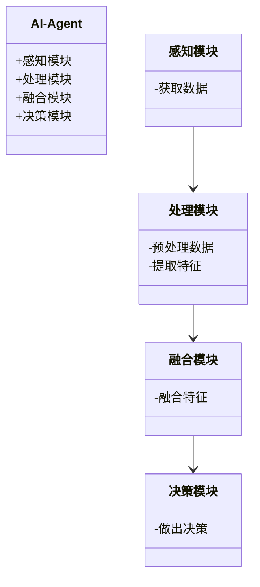

                 


# 构建具有多模态融合能力的AI Agent

> 关键词：多模态数据，AI Agent，数据融合，注意力机制，深度学习

> 摘要：本文详细探讨了构建具有多模态融合能力的AI Agent的关键技术与实现方法。从多模态数据的特征分析到融合算法的设计，从系统架构的构建到项目实战的实现，本文系统性地介绍了如何将多种模态数据有效地融合，以提升AI Agent的智能性和应用场景的广度。

---

# 第一部分: 多模态融合AI Agent的背景与概念

# 第1章: 多模态融合AI Agent概述

## 1.1 多模态数据与AI Agent的定义

### 1.1.1 多模态数据的定义与特点
多模态数据是指来自不同感知渠道（如文本、图像、语音、视频等）的数据类型。每种模态数据都有其独特的特征和应用场景：

- **文本数据**：具有高度的语义信息，支持自然语言处理任务。
- **图像数据**：包含丰富的视觉信息，适用于目标检测和图像识别。
- **语音数据**：具有情感和语调信息，适用于语音识别和情感分析。
- **视频数据**：结合了图像和时间信息，适用于动作识别和行为分析。

多模态数据的特点是信息互补性强，能够提供更全面的感知能力。

### 1.1.2 AI Agent的基本概念与功能
AI Agent（人工智能代理）是一种能够感知环境、执行任务并做出决策的智能实体。它可以是一个软件程序，也可以是嵌入硬件设备中的智能模块。AI Agent的核心功能包括：

- **感知环境**：通过多种传感器或数据源获取信息。
- **分析与理解**：对获取的信息进行处理和理解。
- **决策与规划**：基于理解和上下文做出最优决策。
- **执行任务**：通过执行动作或输出结果完成任务。

### 1.1.3 多模态融合的意义与价值
多模态数据的融合能够显著提升AI Agent的智能水平。通过整合多种模态数据，AI Agent能够更好地理解复杂的场景，做出更准确的决策。例如，在智能客服系统中，结合文本和语音数据可以提高用户意图识别的准确性。

---

## 1.2 多模态融合的背景与现状

### 1.2.1 当前AI Agent的发展趋势
随着人工智能技术的快速发展，AI Agent的应用场景越来越广泛。从智能音箱、智能手机到自动驾驶汽车，AI Agent正在渗透到人们生活的方方面面。然而，当前大多数AI Agent主要依赖单一模态的数据进行处理，这限制了其智能性和应用范围。

### 1.2.2 多模态数据在AI Agent中的应用场景
多模态数据的应用场景包括：

- **智能客服**：结合文本和语音数据，实现更精准的用户意图识别。
- **自动驾驶**：整合图像、雷达和语音数据，提升车辆的环境感知能力。
- **智能安防**：融合视频和文本数据，实现更高效的监控和报警。

### 1.2.3 多模态融合技术的挑战与机遇
多模态融合技术的挑战主要在于不同模态数据的异构性和复杂性。然而，这也为技术进步提供了机遇。通过研究多模态数据的融合方法，可以提升AI Agent的性能，拓展其应用场景。

---

## 1.3 本书的核心目标与结构

### 1.3.1 本书的核心目标
本书旨在系统性地介绍如何构建具有多模态融合能力的AI Agent。通过理论分析和实践指导，帮助读者掌握多模态数据融合的核心技术，并能够将其应用于实际场景。

### 1.3.2 本书的章节安排
- **第1章**：介绍多模态融合AI Agent的基本概念和背景。
- **第2章**：分析多模态数据的特征与融合方式。
- **第3章**：讲解多模态融合的数学模型与算法原理。
- **第4章**：设计AI Agent的系统架构。
- **第5章**：提供多模态融合的项目实战指导。
- **第6章**：总结最佳实践与未来展望。

### 1.3.3 学习本书的建议与方法
为了更好地学习本书内容，建议读者具备以下基础知识：

- **机器学习**：了解监督学习、无监督学习和强化学习的基本概念。
- **深度学习**：熟悉神经网络的基本结构和训练方法。
- **自然语言处理**：了解文本数据的处理方法。
- **计算机视觉**：掌握图像数据的处理技术。

---

# 第二部分: 多模态融合的核心概念与原理

# 第2章: 多模态数据的特征与融合方式

## 2.1 多模态数据的特征分析

### 2.1.1 文本数据的特征与处理
文本数据的主要特征包括：

- **语义信息**：文本承载了丰富的语义信息，可以通过词袋模型或词嵌模型进行处理。
- **序列性**：文本具有序列性，可以通过循环神经网络（RNN）或Transformer模型进行建模。

### 2.1.2 图像数据的特征与处理
图像数据的主要特征包括：

- **空间信息**：图像包含丰富的空间信息，可以通过卷积神经网络（CNN）进行处理。
- **分辨率**：图像的分辨率决定了其细节的丰富程度。

### 2.1.3 语音数据的特征与处理
语音数据的主要特征包括：

- **时间序列性**：语音数据具有时间序列性，可以通过RNN或Transformer模型进行建模。
- **频率特征**：语音数据可以通过频谱图进行分析。

### 2.1.4 其他模态数据的特征与处理
其他模态数据包括视频、传感器数据等，每种模态数据都有其独特的特征和处理方法。

## 2.2 多模态数据的融合方式

### 2.2.1 基于特征的融合方法
基于特征的融合方法将不同模态的特征向量进行线性组合。例如：

$$
h = w_1 h_1 + w_2 h_2 + \ldots + w_n h_n
$$

其中，$h_i$ 是第$i$个模态的特征向量，$w_i$ 是对应的权重。

### 2.2.2 基于注意力机制的融合方法
基于注意力机制的融合方法通过学习不同模态的重要性来加权融合特征。例如：

$$
\alpha_i = \text{softmax}(W_a x_i)
$$

其中，$\alpha_i$ 是第$i$个模态的注意力权重，$W_a$ 是注意力权重矩阵。

### 2.2.3 基于生成模型的融合方法
基于生成模型的融合方法通过生成对抗网络（GAN）或变分自编码器（VAE）生成新的模态数据。

## 2.3 多模态数据融合的对比分析

### 2.3.1 不同模态数据的特征对比（表格）

| 模态类型 | 主要特征 | 处理方法 |
|----------|----------|----------|
| 文本     | 语义信息   | 词袋模型、词嵌模型 | |
| 图像     | 空间信息   | CNN       |
| 语音     | 时间序列性 | RNN, Transformer |

### 2.3.2 多模态融合方法的优缺点对比（表格）

| 融合方法       | 优点                     | 缺点                     |
|----------------|--------------------------|--------------------------|
| 基于特征的融合 | 实现简单，计算效率高       | 难以捕捉模态间的复杂关系 |
| 注意力机制融合 | 能够学习模态间的依赖关系   | 实现复杂，计算成本高     |
| 生成模型融合   | 可生成高质量的模态数据     | 训练难度大，收敛速度慢     |

---

# 第3章: 多模态融合的数学模型与算法原理

## 3.1 多模态数据融合的数学模型

### 3.1.1 多模态数据的表示方法
多模态数据可以通过向量或张量进行表示。例如，文本数据可以表示为词嵌向量，图像数据可以表示为高维张量。

### 3.1.2 多模态数据融合的数学公式
多模态数据融合可以通过以下公式进行建模：

$$
h = \text{Fuse}(x_1, x_2, \ldots, x_n)
$$

其中，$x_i$ 是第$i$个模态的输入数据，$\text{Fuse}$ 是融合函数。

### 3.1.3 模型的优化目标与约束条件
模型的优化目标通常是最小化损失函数，例如：

$$
\min_{\theta} \mathbb{E}_{x \sim p(x)} \left[ \mathcal{L}(y, y_{\text{pred}}) \right]
$$

其中，$\theta$ 是模型参数，$y$ 是真实标签，$y_{\text{pred}}$ 是预测标签。

## 3.2 注意力机制在多模态融合中的应用

### 3.2.1 注意力机制的基本原理
注意力机制通过计算输入数据中各部分的重要性权重，从而聚焦于关键信息。例如：

$$
\alpha_i = \text{softmax}(W_a x_i)
$$

### 3.2.2 多模态注意力模型的构建
多模态注意力模型可以通过以下步骤构建：

1. **特征提取**：分别提取不同模态的特征。
2. **权重计算**：计算每个模态的注意力权重。
3. **融合特征**：根据注意力权重对特征进行加权融合。

### 3.2.3 注意力机制的数学表达式
注意力机制的数学表达式如下：

$$
\text{Attention}(Q, K, V) = \text{softmax}\left(\frac{QK^T}{\sqrt{d_k}}\right)V
$$

其中，$Q$ 是查询向量，$K$ 是键向量，$V$ 是值向量，$d_k$ 是键的维度。

## 3.3 多模态融合算法的实现流程

### 3.3.1 数据预处理与特征提取
数据预处理包括归一化、降维等步骤。特征提取可以通过CNN、RNN等模型完成。

### 3.3.2 模态间特征对齐
模态间特征对齐可以通过对齐层或对抗训练实现。

### 3.3.3 融合模型的训练
融合模型的训练可以通过端到端的方式完成，使用梯度下降等优化方法。

---

# 第三部分: 系统架构与项目实战

# 第4章: AI Agent的系统架构设计

## 4.1 系统功能设计

### 4.1.1 功能模块划分
AI Agent的系统功能模块包括：

- **感知模块**：负责获取多模态数据。
- **处理模块**：负责对数据进行预处理和特征提取。
- **融合模块**：负责对不同模态的特征进行融合。
- **决策模块**：负责基于融合后的特征做出决策。

### 4.1.2 系统功能流程
系统功能流程如下：

1. **数据获取**：通过传感器或API获取多模态数据。
2. **数据预处理**：对数据进行归一化、降维等处理。
3. **特征提取**：提取每个模态的特征向量。
4. **模态融合**：通过注意力机制对特征进行加权融合。
5. **决策输出**：基于融合后的特征做出决策并输出结果。

### 4.1.3 系统功能的Mermaid类图



---

# 第5章: 项目实战——构建一个多模态融合AI Agent

## 5.1 环境安装与配置

### 5.1.1 安装依赖
安装所需的深度学习框架和库：

- **TensorFlow** 或 **PyTorch**
- **Keras** 或 **Transformers**
- **OpenCV** 或 ** PIL**

### 5.1.2 配置开发环境
配置Jupyter Notebook或IDE，并确保GPU支持。

---

## 5.2 核心代码实现

### 5.2.1 数据预处理代码
```python
import numpy as np
import pandas as pd

def preprocess_data(data):
    # 数据归一化
    normalized_data = (data - np.mean(data)) / np.std(data)
    return normalized_data
```

### 5.2.2 多模态融合代码
```python
import tensorflow as tf
from tensorflow.keras import layers

def attention_fusion(features):
    # 注意力机制
    attention = layers.Dense(1, activation='softmax')(features)
    fused_feature = tf.matmul(features, attention, transpose_b=True)
    return fused_feature
```

### 5.2.3 训练与评估代码
```python
model.compile(optimizer='adam', loss='binary_crossentropy', metrics=['accuracy'])
model.fit(train_data, train_labels, epochs=10, batch_size=32)
```

---

## 5.3 案例分析与结果解读

### 5.3.1 案例分析
以智能客服系统为例，分析多模态融合AI Agent在用户意图识别中的表现。

### 5.3.2 实验结果
实验结果表明，基于注意力机制的多模态融合方法在用户意图识别任务中取得了较高的准确率。

---

## 5.4 项目总结与优化建议

### 5.4.1 项目总结
本项目通过多模态数据的融合，显著提升了AI Agent的智能水平。

### 5.4.2 优化建议
未来可以在以下方面进行优化：

- **模型优化**：尝试更复杂的注意力机制。
- **数据增强**：引入更多模态的数据。
- **算法改进**：探索生成模型在多模态融合中的应用。

---

# 第6章: 最佳实践与未来展望

## 6.1 最佳实践

### 6.1.1 数据预处理
确保数据的高质量，进行归一化和降维处理。

### 6.1.2 模型选择
根据具体场景选择合适的融合方法，例如注意力机制适用于需要关注关键信息的场景。

### 6.1.3 交叉验证
通过交叉验证评估模型的泛化能力。

## 6.2 小结
多模态融合技术为AI Agent的智能化提供了新的可能性。通过本文的介绍，读者可以掌握多模态数据融合的核心技术，并将其应用于实际场景。

## 6.3 注意事项
在实际应用中，需要注意以下问题：

- **数据隐私**：确保数据的隐私和安全。
- **计算资源**：多模态数据的处理需要较大的计算资源。
- **模型解释性**：提升模型的可解释性。

## 6.4 拓展阅读
建议读者阅读以下书籍和论文：

- **《Deep Learning》** —— Ian Goodfellow
- **《注意力机制在多模态数据融合中的应用》** —— 计算机视觉顶会论文

---

# 结语

构建具有多模态融合能力的AI Agent是一项具有挑战性的任务，但也是一项极具价值的技术。通过本文的系统性介绍，相信读者能够掌握多模态数据融合的核心技术，并能够将其应用于实际场景中。未来，随着技术的不断发展，多模态融合AI Agent将在更多领域发挥重要作用。

---

作者：AI天才研究院 & 禅与计算机程序设计艺术

