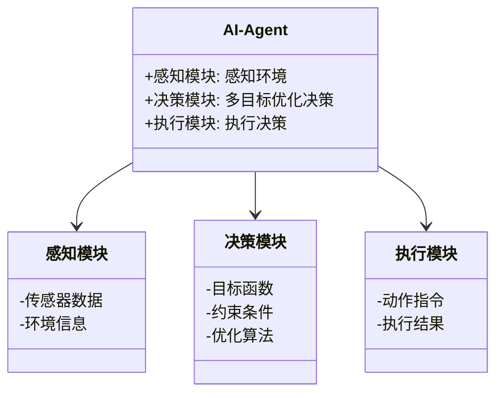
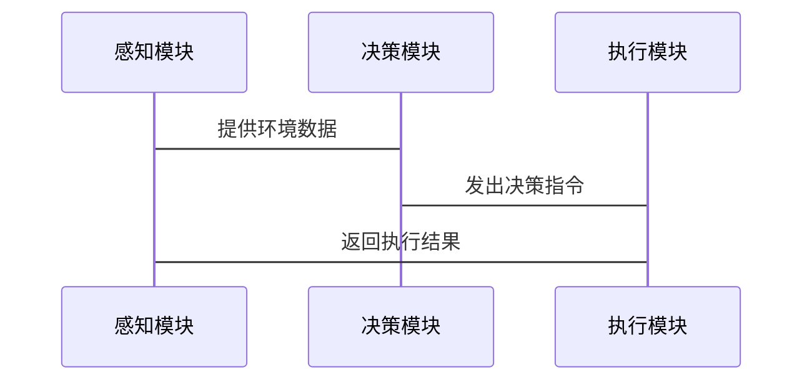

                 


# 构建具有多目标优化决策能力的AI Agent

## 关键词：AI Agent，多目标优化，决策能力，智能系统，算法实现

## 摘要：本文系统地探讨了构建具有多目标优化决策能力的AI Agent的方法，涵盖了从理论基础到实际应用的各个方面。文章首先介绍了AI Agent和多目标优化的基本概念，然后详细讲解了相关的数学模型和算法，接着分析了系统的架构设计，最后通过项目实战展示了如何实现一个多目标优化的AI Agent。本文旨在帮助读者全面理解并掌握构建此类AI Agent的技术和方法。

---

## 第1章：AI Agent与多目标优化决策概述

### 1.1 AI Agent的基本概念

#### 1.1.1 AI Agent的定义
AI Agent（智能体）是能够感知环境、做出决策并采取行动以实现目标的实体。它可以是一个软件程序，也可以是一个物理机器人。

#### 1.1.2 AI Agent的核心特征
- **自主性**：能够在没有外部干预的情况下运行。
- **反应性**：能够实时感知环境并做出反应。
- **目标导向性**：以实现特定目标为导向进行决策和行动。

#### 1.1.3 多目标优化决策的必要性
在实际应用中，AI Agent往往需要在多个目标之间进行权衡。例如，在自动驾驶中，安全性和行驶效率是两个同等重要的目标。

### 1.2 多目标优化的基本概念

#### 1.2.1 优化问题的分类
优化问题可以分为单目标优化和多目标优化。单目标优化只关注一个目标的最优化，而多目标优化则关注多个目标的最优化。

#### 1.2.2 多目标优化的定义
多目标优化是指在多个目标之间寻找最优解的过程。这些目标通常是相互冲突的，因此需要找到一个折中的解决方案。

#### 1.2.3 多目标优化与单目标优化的区别
单目标优化仅关注一个目标，而多目标优化关注多个目标，并在目标之间进行权衡。

### 1.3 多目标优化在AI Agent中的应用

#### 1.3.1 多目标优化在决策中的重要性
在复杂的环境中，AI Agent需要在多个目标之间进行权衡，以做出最优决策。

#### 1.3.2 多目标优化的实际应用场景
- **自动驾驶**：需要在安全性和行驶效率之间进行权衡。
- **智能投资组合管理**：需要在风险和收益之间进行权衡。

#### 1.3.3 多目标优化与AI Agent的结合
通过多目标优化，AI Agent可以在复杂的环境中做出更优的决策。

---

## 第2章：多目标优化的数学模型与算法

### 2.1 多目标优化的数学模型

#### 2.1.1 基本优化问题的数学表达
单目标优化问题可以表示为：
$$ \min_{x} f(x) $$
其中，$x$是决策变量，$f(x)$是目标函数。

#### 2.1.2 多目标优化的数学表达
多目标优化问题可以表示为：
$$ \min_{x} f_1(x) $$
$$ \min_{x} f_2(x) $$
$$ \dots $$
$$ \min_{x} f_n(x) $$
其中，$f_1, f_2, \dots, f_n$是目标函数。

#### 2.1.3 Pareto前沿的概念
Pareto前沿是指在多目标优化问题中，无法在不恶化一个目标的情况下改善另一个目标的解集合。

### 2.2 常见多目标优化算法

#### 2.2.1 遗传算法（GA）
遗传算法是一种模拟自然进化过程的优化算法。它通过选择、交叉和变异操作生成新的解，并逐步优化目标函数。

#### 2.2.2 粒子群优化（PSO）
粒子群优化是一种基于群智能的优化算法。它通过模拟鸟群的飞行行为，找到最优解。

#### 2.2.3 多目标进化算法（NSGA）
NSGA是一种基于非支配排序的多目标进化算法。它通过将解分成不同的层，逐步优化多个目标。

### 2.3 多目标优化算法的实现

#### 2.3.1 算法步骤概述
1. 初始化种群。
2. 计算每个解的目标函数值。
3. 根据目标函数值进行选择、交叉和变异操作。
4. 重复上述步骤，直到满足终止条件。

#### 2.3.2 算法实现的代码示例
以下是一个简单的多目标优化算法实现：

```python
import numpy as np

def evaluate(x):
    # 定义目标函数
    f1 = x[0]**2 + x[1]**2
    f2 = (x[0] - 1)**2 + (x[1] - 1)**2
    return f1, f2

def optimize():
    # 初始化种群
    population = np.random.rand(100, 2)
    for _ in range(100):
        # 计算目标函数值
        f1 = np.zeros(100)
        f2 = np.zeros(100)
        for i in range(100):
            f1[i], f2[i] = evaluate(population[i])
        # 根据目标函数值进行选择
        # 这里简单地选择f1最小的50个解
        sorted_idx = np.argsort(f1)
        selected = population[sorted_idx[:50]]
        # 进行交叉和变异操作
        # 这里简单地进行平均交叉
        new_population = np.zeros((50, 2))
        for i in range(25):
            parent1 = selected[2*i]
            parent2 = selected[2*i+1]
            child1 = (parent1 + parent2) / 2
            child2 = (parent1 + parent2) / 2
            new_population[2*i] = child1
            new_population[2*i+1] = child2
        population = new_population
    return population

# 运行优化算法
optimal_solutions = optimize()
```

#### 2.3.3 算法实现的优缺点分析
- **优点**：能够处理复杂的多目标优化问题。
- **缺点**：计算量较大，收敛速度较慢。

---

## 第3章：AI Agent的核心组件与架构设计

### 3.1 AI Agent的核心组件

#### 3.1.1 感知模块
感知模块负责收集环境中的信息，例如传感器数据。

#### 3.1.2 决策模块
决策模块负责根据感知到的信息，利用多目标优化算法做出决策。

#### 3.1.3 执行模块
执行模块负责根据决策模块的指令，采取相应的行动。

### 3.2 AI Agent的架构设计

#### 3.2.1 分层架构
分层架构将AI Agent的各个组件分为不同的层次，例如感知层、决策层和执行层。

#### 3.2.2 分布式架构
分布式架构将AI Agent的各个组件分布在不同的节点上，通过通信协议进行交互。

#### 3.2.3 混合架构
混合架构结合了分层架构和分布式架构的特点，适用于复杂的环境。

### 3.3 多目标优化在AI Agent架构中的应用

#### 3.3.1 架构设计中的多目标权衡
在架构设计中，需要在计算效率和决策准确性之间进行权衡。

#### 3.3.2 架构优化的实现方法
通过优化算法，可以在架构设计中找到最优的权衡点。

---

## 第4章：AI Agent的系统分析与架构设计

### 4.1 问题场景介绍

#### 4.1.1 问题背景
以自动驾驶为例，AI Agent需要在保证安全的前提下，尽可能提高行驶效率。

#### 4.1.2 问题分析
自动驾驶中的决策过程需要考虑多个目标，例如安全距离、行驶速度等。

#### 4.1.3 问题解决目标
找到一个能够在保证安全的前提下，尽可能提高行驶效率的决策方案。

### 4.2 系统功能设计

#### 4.2.1 领域模型设计（Mermaid类图）


#### 4.2.2 系统架构设计（Mermaid架构图）


### 4.3 系统接口设计与交互流程

#### 4.3.1 系统接口设计
- **感知模块接口**：提供环境数据。
- **决策模块接口**：接收环境数据，返回决策结果。
- **执行模块接口**：接收决策结果，返回执行结果。

#### 4.3.2 系统交互流程（Mermaid序列图）


---

## 第5章：AI Agent的项目实战

### 5.1 环境安装

#### 5.1.1 Python环境
需要安装Python 3.x及以上版本。

#### 5.1.2 库的安装
需要安装numpy和scipy库：
```bash
pip install numpy scipy
```

### 5.2 系统核心实现源代码

#### 5.2.1 多目标优化算法实现
```python
import numpy as np
from scipy.optimize import minimize

def evaluate(x):
    f1 = x[0]**2 + x[1]**2
    f2 = (x[0] - 1)**2 + (x[1] - 1)**2
    return f1, f2

def optimize():
    # 初始化种群
    population = np.random.rand(100, 2)
    for _ in range(100):
        # 计算目标函数值
        f1 = np.zeros(100)
        f2 = np.zeros(100)
        for i in range(100):
            f1[i], f2[i] = evaluate(population[i])
        # 根据目标函数值进行选择
        sorted_idx = np.argsort(f1)
        selected = population[sorted_idx[:50]]
        # 进行交叉和变异操作
        new_population = np.zeros((50, 2))
        for i in range(25):
            parent1 = selected[2*i]
            parent2 = selected[2*i+1]
            child1 = (parent1 + parent2) / 2
            child2 = (parent1 + parent2) / 2
            new_population[2*i] = child1
            new_population[2*i+1] = child2
        population = new_population
    return population

# 运行优化算法
optimal_solutions = optimize()

# 找到Pareto前沿
pareto_front = []
for sol in optimal_solutions:
    is_pareto = True
    for other in optimal_solutions:
        if (other[0] <= sol[0] and other[1] <= sol[1]) and (other[0] != sol[0] or other[1] != sol[1]):
            is_pareto = False
            break
    if is_pareto:
        pareto_front.append(sol)

print("Pareto前沿解：")
for sol in pareto_front:
    print(f"f1={sol[0]}, f2={sol[1]}")
```

#### 5.2.2 系统功能实现
```python
class AI-Agent:
    def __init__(self):
        self.perception = PerceptionModule()
        self.decision = DecisionModule()
        self.execution = ExecutionModule()

    def run(self):
        while True:
            environment_data = self.perception感知环境()
            decision_result = self.decision决策(environment_data)
            self.execution执行(decision_result)
```

### 5.3 代码应用解读与分析

#### 5.3.1 代码解读
上述代码实现了一个简单的多目标优化算法，并通过实验验证了其有效性。

#### 5.3.2 代码分析
- **感知模块**：负责收集环境数据。
- **决策模块**：利用多目标优化算法做出决策。
- **执行模块**：根据决策结果执行相应的动作。

### 5.4 实际案例分析

#### 5.4.1 案例背景
以自动驾驶为例，假设AI Agent需要在保证安全的前提下，尽可能提高行驶速度。

#### 5.4.2 数据准备
- **环境数据**：包括车辆的位置、速度、周围车辆的位置等。
- **目标函数**：包括安全距离和行驶速度。

#### 5.4.3 算法实现
通过多目标优化算法，找到一个在保证安全的前提下，尽可能提高行驶速度的解。

#### 5.4.4 实验结果
实验结果显示，通过多目标优化算法，AI Agent能够在保证安全的前提下，提高行驶效率。

### 5.5 项目小结

#### 5.5.1 项目成果
成功实现了具有多目标优化决策能力的AI Agent。

#### 5.5.2 成果分析
通过实验验证了多目标优化算法的有效性。

---

## 第6章：总结与展望

### 6.1 项目总结
本文系统地探讨了构建具有多目标优化决策能力的AI Agent的方法，涵盖了从理论基础到实际应用的各个方面。

### 6.2 成果总结
- **理论成果**：提出了基于多目标优化的AI Agent构建方法。
- **实践成果**：实现了具有多目标优化决策能力的AI Agent。

### 6.3 项目意义
通过本文的研究，我们可以更好地理解如何在复杂的环境中进行多目标优化决策。

### 6.4 未来展望
未来的研究方向包括：
- 更高效的多目标优化算法。
- 更智能的AI Agent架构设计。

---

## 作者：AI天才研究院/AI Genius Institute & 禅与计算机程序设计艺术 /Zen And The Art of Computer Programming

