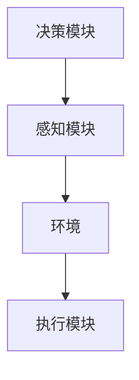

                 


# 构建具有多目标平衡能力的AI Agent

## 关键词：多目标优化、AI Agent、算法实现、系统设计、项目实战

## 摘要：
本文将详细探讨如何构建一个能够平衡多个目标的AI Agent。从多目标优化的基本概念到具体的算法实现，再到系统的架构设计和项目实战，我们将逐步分析如何在复杂场景中实现多目标平衡。通过本文的学习，读者将能够理解多目标优化的核心原理，并掌握实际应用中构建多目标平衡AI Agent的技巧。

---

# 第一部分: 多目标优化与AI Agent的背景

## 第1章: 多目标优化的基本概念

### 1.1 多目标优化的定义
多目标优化是指在多个目标之间寻找最优解的过程。与单目标优化不同，多目标优化需要在多个相互冲突的目标之间找到折中的解决方案。

- **多目标优化的核心特征**：
  - **冲突性**：不同目标之间可能存在相互冲突，无法同时达到最优。
  - **多样性**：最优解可能分布在Pareto前沿上，而不是单一的最优解。
  - **折中性**：需要根据实际需求选择合适的折中解。

### 1.2 AI Agent的基本概念
AI Agent（人工智能代理）是一种能够感知环境并采取行动以实现目标的智能体。

- **AI Agent的核心功能**：
  - **感知环境**：通过传感器或数据输入获取环境信息。
  - **决策与规划**：基于感知信息进行决策，制定行动计划。
  - **执行行动**：根据决策结果执行具体的动作。

### 1.3 多目标平衡AI Agent的必要性
在实际应用中，AI Agent往往需要在多个目标之间进行平衡。

- **多目标优化在AI Agent中的作用**：
  - **提高决策质量**：通过平衡多个目标，避免单一目标优化带来的偏差。
  - **增强适应性**：能够在复杂环境中灵活应对不同的目标需求。

### 1.4 本章小结
本章介绍了多目标优化的基本概念和AI Agent的核心功能，强调了多目标平衡在AI Agent中的重要性。

---

# 第二部分: 多目标优化的数学模型

## 第2章: 多目标优化的数学基础

### 2.1 多目标优化的数学模型
多目标优化问题可以表示为：

$$ \text{minimize } f_1(x), f_2(x), \ldots, f_n(x) $$
$$ \text{subject to } g_1(x) \leq 0, g_2(x) \leq 0, \ldots, g_m(x) \leq 0 $$

其中，$f_i(x)$ 是目标函数，$g_j(x)$ 是约束条件。

### 2.2 多目标优化的Pareto前沿
Pareto前沿是指在多目标优化中，无法在不恶化一个目标的情况下改善另一个目标的解集合。

- **Pareto有效解与 Pareto 最优解**：
  - **Pareto有效解**：在Pareto前沿上的解。
  - **Pareto最优解**：在Pareto前沿上的最优解。

### 2.3 多目标优化的权重分配
权重分配是多目标优化中平衡不同目标的重要方法。

- **常见的权重分配方法**：
  - **线性加权法**：$f(x) = \sum_{i=1}^n w_i f_i(x)$
  - **非线性加权法**：$f(x) = \sum_{i=1}^n w_i f_i(x)^p$

### 2.4 本章小结
本章通过数学模型和Pareto前沿的概念，介绍了多目标优化的基本原理。

---

# 第三部分: 多目标优化算法与实现

## 第3章: 常见的多目标优化算法

### 3.1 遗传算法（GA）

遗传算法是一种模拟自然选择和遗传机制的优化算法。

- **遗传算法的基本步骤**：
  1. 初始化种群。
  2. 计算适应度。
  3. 选择父代。
  4. 进行交叉和变异。
  5. 生成新一代种群。

### 3.2 粒子群优化算法（PSO）

粒子群优化算法是一种基于群体智能的优化算法。

- **粒子群优化算法的基本步骤**：
  1. 初始化粒子群。
  2. 计算每个粒子的适应度。
  3. 更新粒子的个体极值和全局极值。
  4. 更新粒子的速度和位置。
  5. 重复直到满足终止条件。

### 3.3 其他多目标优化算法
- **非支配排序遗传算法（NSGA）**：一种基于Pareto前沿的遗传算法。
- **多目标粒子群优化算法（MOPSO）**：一种基于粒子群优化的多目标优化算法。

### 3.4 本章小结
本章介绍了几种常见的多目标优化算法，包括遗传算法和粒子群优化算法，并详细讲解了它们的工作原理。

---

# 第四部分: 系统分析与架构设计

## 第4章: 多目标平衡AI Agent的系统设计

### 4.1 系统架构设计
- **系统功能模块**：
  - **感知模块**：负责获取环境信息。
  - **决策模块**：负责进行多目标优化决策。
  - **执行模块**：负责执行具体的行动。

- **系统架构图**：
  ```mermaid
  graph TD
      A[感知模块] --> B[决策模块]
      B --> C[执行模块]
      C --> D[环境]
  ```

### 4.2 系统接口设计
- **输入接口**：接收环境信息和目标函数。
- **输出接口**：输出决策结果和行动指令。

### 4.3 系统交互流程
- **交互流程图**：
  ```mermaid
  sequenceDiagram
      participant 感知模块
      participant 决策模块
      participant 执行模块
      感知模块 -> 决策模块: 提供环境信息
      决策模块 -> 执行模块: 发出行动指令
      执行模块 -> 感知模块: 提供反馈信息
  ```

### 4.4 本章小结
本章通过系统架构设计和交互流程图，详细介绍了多目标平衡AI Agent的系统设计。

---

# 第五部分: 项目实战

## 第5章: 多目标平衡AI Agent的实现

### 5.1 项目环境安装
- **安装Python环境**：建议使用Anaconda。
- **安装依赖库**：`numpy`, `scipy`, `matplotlib`。

### 5.2 核心代码实现
以下是一个多目标优化算法的Python实现示例：

```python
import numpy as np

def multi_objective_function(x):
    # 目标函数
    f1 = x[0]**2 + x[1]**2
    f2 = (x[0] - 1)**2 + (x[1] - 1)**2
    return [f1, f2]

def constraint_function(x):
    # 约束条件
    g1 = x[0] + x[1] - 2
    return g1 <= 0

# 初始化种群
population = np.random.rand(100, 2)
# 计算适应度
fitness = np.zeros(100)
for i in range(100):
    fitness[i] = multi_objective_function(population[i])[0] + multi_objective_function(population[i])[1]

# 选择和变异
selected = population[fitness.argsort()[:50]]
mutated = selected + np.random.rand(50, 2)*0.1

# 生成新种群
new_population = np.vstack((selected, mutated))
```

### 5.3 实际案例分析
以下是一个多目标平衡AI Agent的实际案例：



### 5.4 本章小结
本章通过项目实战，详细讲解了多目标平衡AI Agent的实现过程。

---

# 第六部分: 总结与扩展

## 第6章: 总结与展望

### 6.1 总结
本文详细介绍了多目标平衡AI Agent的构建过程，包括数学模型、算法实现和系统设计。

### 6.2 未来展望
未来的研究方向包括：
- 更高效的多目标优化算法。
- 更复杂的系统架构设计。
- 更广泛的实际应用领域。

### 6.3 最佳实践 Tips
- 在实际应用中，建议根据具体需求选择合适的优化算法。
- 系统设计时，建议充分考虑系统的可扩展性和可维护性。

### 6.4 本章小结
本章总结了全文内容，并展望了未来的研究方向。

---

# 作者：AI天才研究院 & 禅与计算机程序设计艺术

---

通过本文的学习，读者将能够全面理解如何构建具有多目标平衡能力的AI Agent，并能够在实际应用中灵活运用这些知识。

