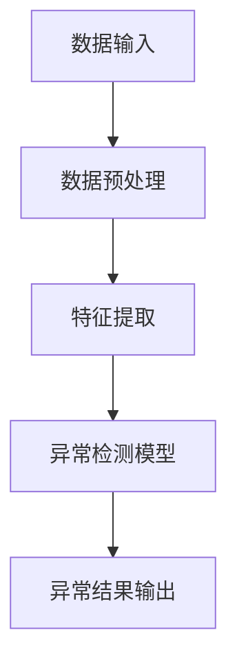
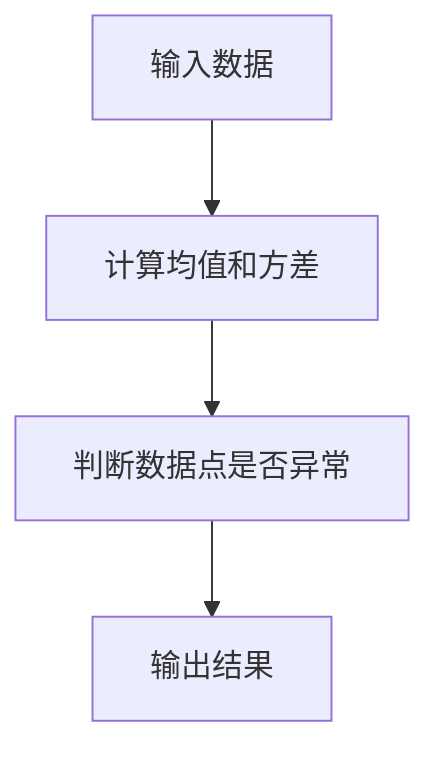
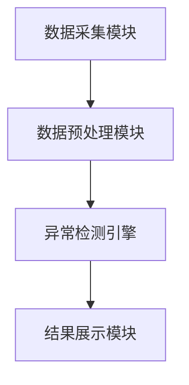

                 


# 构建具有异常检测能力的AI Agent

> 关键词：异常检测，AI Agent，机器学习，深度学习，系统架构

> 摘要：本文详细探讨了如何构建具有异常检测能力的AI Agent，从基本概念到系统架构设计，再到算法实现，结合实际案例分析，全面解析了构建此类AI Agent的关键技术和方法。

---

## 第1章: 异常检测的背景与重要性

### 1.1 异常检测的基本概念

#### 1.1.1 什么是异常检测
异常检测（Anomaly Detection）是指通过分析数据，识别出与预期模式或行为显著不同的数据点或事件。这些异常可能是潜在的威胁、错误或机会。

- 异常检测的核心目标是发现数据中的异常点，这些异常点可能表明系统出现故障、数据被篡改或潜在的商机。

#### 1.1.2 异常检测的分类
异常检测可以分为以下几类：
1. **离群点检测（Point Anomaly）**：识别单个异常点，例如某次交易金额异常。
2. **分布变化检测（Distribution Anomaly）**：识别数据分布的变化，例如用户行为模式突然改变。
3. **集体异常检测（Contextual Anomaly）**：识别在特定上下文中异常的事件。

#### 1.1.3 异常检测的核心目标
- 识别潜在的威胁或错误。
- 发现数据中的隐藏模式。
- 支持决策者做出更明智的判断。

---

### 1.2 AI Agent的基本概念

#### 1.2.1 什么是AI Agent
AI Agent（人工智能代理）是一种能够感知环境并采取行动以实现目标的智能实体。它可以是一个软件程序、机器人或其他智能系统。

- AI Agent的核心功能包括感知、推理、决策和行动。

#### 1.2.2 AI Agent的类型
1. **简单反射型Agent**：基于当前输入做出反应，不依赖历史信息。
2. **基于模型的反射型Agent**：利用内部模型和历史信息进行推理和决策。
3. **目标驱动型Agent**：根据目标选择最优行动。
4. **效用驱动型Agent**：通过最大化效用来优化决策。

#### 1.2.3 AI Agent的核心功能
- **感知**：通过传感器或数据输入获取信息。
- **推理**：分析信息并推导出可能的结果。
- **决策**：基于推理结果做出决策。
- **行动**：执行决策以影响环境。

---

### 1.3 异常检测在AI Agent中的应用

#### 1.3.1 异常检测的场景
1. **网络安全**：检测未经授权的访问或攻击。
2. **金融领域**：识别欺诈交易或异常的市场行为。
3. **医疗领域**：检测异常的病人体征或医疗数据。
4. **工业领域**：监测设备运行状态，预防故障。

#### 1.3.2 异常检测对AI Agent的意义
- 提高系统的安全性和可靠性。
- 帮助AI Agent更快地响应异常情况。
- 通过分析异常数据，优化AI Agent的性能。

#### 1.3.3 异常检测的挑战
1. **数据稀疏性**：异常数据点往往较少，难以训练模型。
2. **动态变化**：数据分布可能随时间变化，需要动态调整模型。
3. **计算效率**：实时检测需要高效的计算能力。

---

## 第2章: 异常检测的核心概念与联系

### 2.1 异常检测的核心原理

#### 2.1.1 统计学方法
统计学方法通过分析数据的分布特性来识别异常点。

- **均值和方差方法**：计算数据的均值和标准差，判断数据点是否偏离均值超过一定倍数的标准差。
- **Z-score方法**：通过标准化数据，判断数据点是否显著偏离均值。

#### 2.1.2 机器学习方法
机器学习方法通过训练模型来识别异常点。

- **聚类算法**：将数据分成簇，判断远离簇中心的数据点为异常。
- **孤立森林（Isolation Forest）**：一种基于树结构的无监督学习算法，用于识别异常点。

#### 2.1.3 深度学习方法
深度学习方法通过复杂的非线性模型来识别异常。

- **自编码器（Autoencoder）**：通过压缩数据并重建，计算重建误差来识别异常。
- **变分自编码器（VAE）**：通过概率建模，识别数据分布的变化。

---

### 2.2 异常检测的关键属性对比

#### 2.2.1 基于统计的方法 vs 基于机器学习的方法
| 属性         | 统计方法       | 机器学习方法    |
|--------------|----------------|----------------|
| 模型复杂度     | 较低           | 较高           |
| 适用场景       | 稳定的数据分布   | 复杂或动态数据   |

#### 2.2.2 监督学习 vs 非监督学习
- **监督学习**：需要标记的异常数据，适用于已知异常类型的情况。
- **非监督学习**：无需标记数据，适用于未知异常类型的情况。

#### 2.2.3 离群点检测 vs 分布变化检测
- **离群点检测**：检测单个异常点。
- **分布变化检测**：检测数据整体分布的变化。

---

### 2.3 实体关系图与流程图

#### 系统架构图


---

## 第3章: 异常检测算法原理

### 3.1 统计学方法

#### 3.1.1 基于均值和方差的异常检测
- **算法流程图**


- **代码实现**
```python
import numpy as np

def is_outlier(x, mean, std, threshold=3):
    return abs(x - mean) > threshold * std
```

---

### 3.2 机器学习方法

#### 3.2.1 基于聚类的异常检测
- **算法实现**
```python
from sklearn.cluster import KMeans

def detect_anomalies(X, n_clusters=2):
    model = KMeans(n_clusters=n_clusters)
    model.fit(X)
    distances = model.transform(X)
    return np.where(distances.mean(axis=1) < 0.5)[0]
```

---

### 3.3 深度学习方法

#### 3.3.1 基于AE（自编码器）的异常检测
- **数学公式**
$$ \text{重建误差} = ||x - \hat{x}|| $$

- **代码实现**
```python
import tensorflow as tf
from tensorflow import keras

def build_autoencoder(input_dim):
    input_layer = keras.Input(shape=(input_dim,))
    encoder = keras.layers.Dense(32, activation='relu')(input_layer)
    decoder = keras.layers.Dense(input_dim, activation='sigmoid')(encoder)
    autoencoder = keras.Model(inputs=input_layer, outputs=decoder)
    autoencoder.compile(optimizer='adam', loss='binary_crossentropy')
    return autoencoder
```

---

## 第4章: 系统分析与架构设计

### 4.1 异常检测AI Agent的系统架构

#### 4.1.1 系统模块划分
1. **数据采集模块**：负责收集原始数据。
2. **数据预处理模块**：清洗和转换数据。
3. **异常检测引擎**：包括特征提取和异常检测模型。
4. **结果展示模块**：可视化异常结果。

#### 4.1.2 系统架构图


---

## 第5章: 项目实战

### 5.1 环境搭建

#### 5.1.1 安装依赖
```bash
pip install numpy pandas scikit-learn tensorflow matplotlib
```

---

## 第6章: 总结与展望

### 6.1 总结
本文详细探讨了如何构建具有异常检测能力的AI Agent，从基本概念到系统架构设计，再到算法实现，结合实际案例分析，全面解析了构建此类AI Agent的关键技术和方法。

### 6.2 展望
未来，随着AI技术的不断发展，异常检测在AI Agent中的应用将更加广泛和深入。我们可以期待更多高效、智能的异常检测算法和系统架构的出现。

---

## 附录

### 附录A: 参考文献
1. [1] 刘军, 等. 《机器学习实战》. 人民邮电出版社.
2. [2] Goodfellow, I., Bengio, Y., & Courville, A. (2016). *Deep Learning*.

### 附录B: 工具与库
1. Python
2. TensorFlow/Keras
3. Scikit-learn
4. Matplotlib

---

作者：AI天才研究院/AI Genius Institute & 禅与计算机程序设计艺术 /Zen And The Art of Computer Programming

