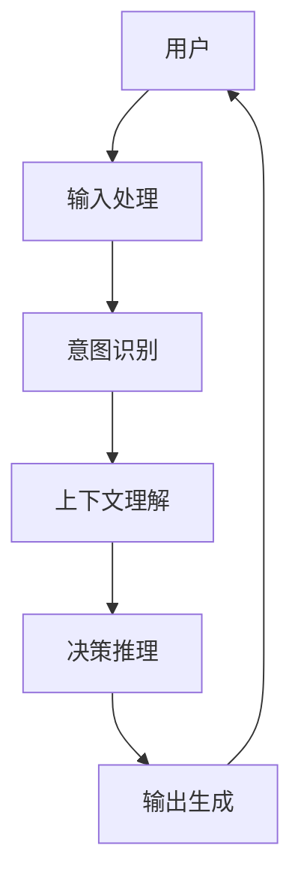

                 

# 《构建具有情境感知能力的AI Agent》

> 关键词：AI Agent，情境感知，自然语言处理，知识图谱，决策推理

> 摘要：本文将详细探讨如何构建一个具有情境感知能力的AI Agent。通过分析其核心概念、算法原理、系统架构和项目实战，我们将一步步揭示情境感知AI Agent的构建过程，从理论到实践，帮助读者掌握相关技术。

---

## 第一部分: 情境感知AI Agent的背景与概念

### 第1章: 情境感知AI Agent概述

#### 1.1 情境感知AI Agent的定义与背景
情境感知AI Agent是一种能够理解和适应动态环境的智能体，它通过感知上下文信息，做出适应性决策。随着AI技术的发展，情境感知AI Agent在多个领域展现出巨大潜力。

#### 1.1.1 什么是情境感知
情境感知是指AI Agent能够理解当前环境、用户意图和上下文信息，从而提供更精准的服务。它不仅依赖于输入的数据，还依赖于对这些数据的深度理解和推理。

#### 1.1.2 情境感知AI Agent的背景与现状
随着技术的进步，AI Agent已从简单的规则驱动发展到复杂的自主决策。情境感知AI Agent通过结合多模态数据和深度学习，能够更好地适应动态环境。

#### 1.1.3 情境感知AI Agent的核心目标
- 理解用户意图
- 适应动态环境
- 提供个性化服务

#### 1.2 情境感知与传统AI的区别
- **传统AI**：基于规则或简单模式识别，缺乏上下文理解。
- **情境感知AI**：能够理解上下文，适应动态变化，提供更智能的服务。

#### 1.3 情境感知AI Agent的核心要素
- **感知能力**：通过多模态数据感知环境。
- **理解能力**：理解上下文和用户意图。
- **决策能力**：基于理解和感知做出决策。

---

## 第二部分: 情境感知AI Agent的核心概念与技术

### 第2章: 情境感知AI Agent的核心概念

#### 2.1 情境感知的关键技术
- **自然语言处理**：理解文本信息，提取意图和情感。
- **知识图谱**：构建知识库，帮助AI理解复杂关系。
- **实时数据处理**：处理动态数据流，保持信息更新。

#### 2.2 情境感知的核心模型
- **意图识别模型**：识别用户意图，例如槽位填充。
- **上下文理解模型**：理解对话历史和上下文信息。
- **决策推理模型**：基于上下文做出决策。

#### 2.3 情境感知与多模态数据
- **多模态数据的定义**：整合文本、语音、图像等多种数据类型。
- **多模态数据的融合方法**：使用融合模型处理多源数据。
- **多模态数据在情境感知中的应用**：提升感知能力，提供更精准的服务。

#### 2.4 本章小结
本章介绍了情境感知AI Agent的核心技术和模型，强调了多模态数据的重要性。

---

## 第三部分: 情境感知AI Agent的算法原理

### 第3章: 情境感知算法的核心原理

#### 3.1 意图识别算法
- **意图识别的定义**：识别用户输入的意图。
- **基于深度学习的意图识别**：使用神经网络模型，如LSTM和BERT。
- **意图识别的数学模型**：定义损失函数和优化目标。

#### 3.2 上下文理解算法
- **上下文理解的定义**：理解对话历史和环境信息。
- **基于序列模型的上下文理解**：使用Transformer模型处理序列数据。
- **上下文理解的数学模型**：定义注意力机制和序列建模方法。

#### 3.3 决策推理算法
- **决策推理的定义**：基于理解做出决策。
- **基于强化学习的决策推理**：使用策略梯度方法优化决策。
- **决策推理的数学模型**：定义状态、动作和奖励函数。

#### 3.4 算法实现的代码示例
- **意图识别代码示例**：使用Python和深度学习框架实现意图分类。
- **上下文理解代码示例**：基于Transformer模型实现对话理解。
- **决策推理代码示例**：使用强化学习框架实现决策优化。

---

## 第四部分: 情境感知AI Agent的系统架构设计

### 第4章: 情境感知AI Agent的系统架构

#### 4.1 系统功能设计
- **领域模型设计**：使用Mermaid类图展示系统模块。
- **系统架构设计**：使用Mermaid架构图展示整体架构。
- **系统接口设计**：定义API接口和交互流程。
- **系统交互设计**：使用Mermaid序列图展示交互流程。

#### 4.2 系统架构图

---

## 第五部分: 情境感知AI Agent的项目实战

### 第5章: 项目实战

#### 5.1 环境安装
- 安装Python、深度学习框架（如TensorFlow、PyTorch）。
- 安装NLP处理库（如spaCy、NLTK）。

#### 5.2 系统核心实现
- **意图识别实现**：编写代码实现意图分类。
- **上下文理解实现**：实现上下文感知模型。
- **决策推理实现**：编写决策推理逻辑。

#### 5.3 代码应用解读与分析
- **意图识别代码**：展示如何使用预训练模型进行意图分类。
- **上下文理解代码**：展示如何处理对话历史。
- **决策推理代码**：展示如何基于上下文做出决策。

#### 5.4 实际案例分析
- 分析一个具体案例，展示AI Agent如何处理情境感知任务。

#### 5.5 项目小结
总结项目实现的关键点和经验教训。

---

## 第六部分: 情境感知AI Agent的最佳实践

### 第6章: 最佳实践

#### 6.1 设计原则
- **模块化设计**：确保系统各部分独立。
- **数据隐私**：保护用户数据隐私。
- **可扩展性**：确保系统易于扩展。

#### 6.2 性能优化
- **数据预处理**：优化数据输入，提升处理效率。
- **模型优化**：使用更高效的模型结构和训练方法。

#### 6.3 安全考虑
- **数据安全**：防止数据泄露。
- **模型安全**：防止模型被攻击。

#### 6.4 拓展阅读
推荐相关书籍和论文，供读者深入学习。

---

## 作者信息

作者：AI天才研究院/AI Genius Institute & 禅与计算机程序设计艺术 /Zen And The Art of Computer Programming

