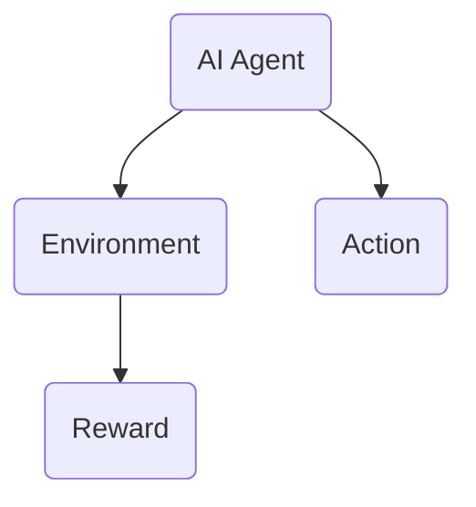
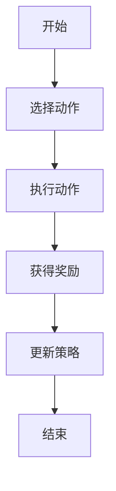
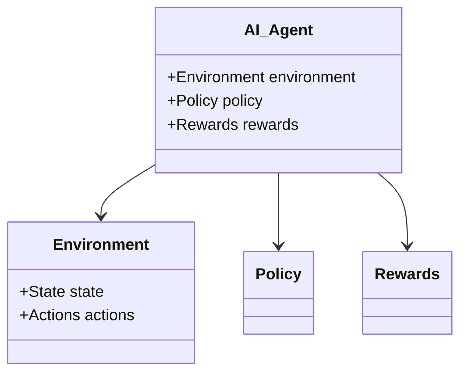
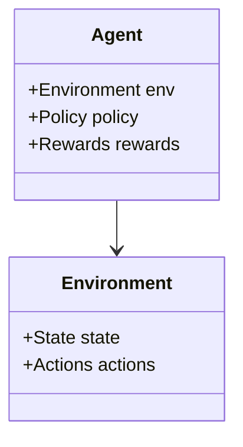
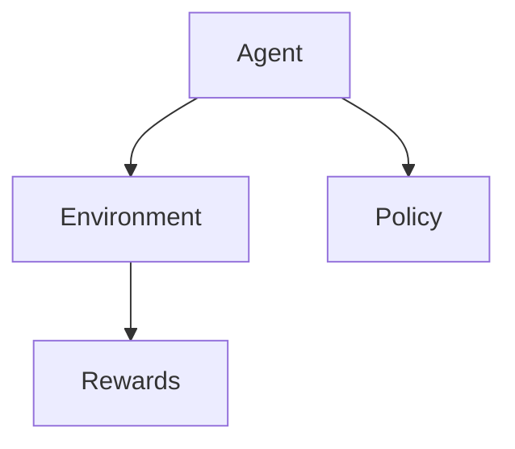

                 


# 构建具有持续优化能力的AI Agent

## 关键词：
- AI Agent, 持续优化, 优化算法, 系统架构, 强化学习, 遗传算法

## 摘要：
本文详细探讨了构建具有持续优化能力的AI Agent的各个方面，包括AI Agent的基本概念、优化算法的原理与实现、系统架构设计以及项目实战。通过强化学习和遗传算法的深入分析，结合系统的功能设计、架构设计和接口设计，为读者提供了构建AI Agent的完整指南。文章内容涵盖理论与实践，适合希望深入了解AI Agent构建技术的读者。

---

## 第一部分: AI Agent 的背景与核心概念

### 第1章: AI Agent 的定义与背景

#### 1.1 AI Agent 的基本概念

##### 1.1.1 什么是AI Agent
AI Agent（人工智能代理）是指能够感知环境、自主决策并执行任务的智能实体。它能够根据输入的信息做出决策，并通过执行动作与环境交互。AI Agent的核心目标是通过优化算法实现持续改进，以提高任务执行的效率和效果。

##### 1.1.2 AI Agent 的特点与优势
- **自主性**：AI Agent能够自主决策，无需外部干预。
- **反应性**：能够实时感知环境并做出反应。
- **学习能力**：通过机器学习算法不断优化自身的决策过程。
- **适应性**：能够在不同环境下灵活调整策略。

##### 1.1.3 AI Agent 的应用场景
- **自动化控制**：如工业机器人、自动驾驶等。
- **智能推荐**：如电商推荐系统、个性化内容推荐。
- **游戏AI**：如电子游戏中的智能NPC（非玩家角色）。

#### 1.2 持续优化能力的重要性

##### 1.2.1 AI Agent 的优化目标
- 提高任务执行的效率。
- 提升决策的准确性。
- 增强系统的适应性和鲁棒性。

##### 1.2.2 持续优化的必要性
在动态变化的环境中，AI Agent需要不断调整策略以应对新的挑战。持续优化能力使得AI Agent能够在复杂环境中保持高性能。

##### 1.2.3 优化能力的实现路径
- 强化学习：通过与环境交互，学习最优策略。
- 遗传算法：通过模拟生物进化，优化解决方案。
- 其他优化算法：如模拟退火、蚁群算法等。

---

### 第2章: AI Agent 的核心概念与联系

#### 2.1 优化算法原理

##### 2.1.1 强化学习的基本原理
强化学习是一种通过试错机制来学习最优策略的算法。AI Agent通过与环境交互，获得奖励信号，并基于这些信号调整自己的行为以最大化累计奖励。

##### 2.1.2 遗传算法的核心思想
遗传算法是一种基于生物进化原理的优化算法。通过选择、交叉和变异操作，生成新的解，并保留较优的解进行迭代，最终找到最优解。

##### 2.1.3 其他优化算法的对比分析
- **模拟退火**：通过逐步降温的方式，避免陷入局部最优。
- **蚁群算法**：模拟蚂蚁寻找最短路径的行为，适用于组合优化问题。

#### 2.2 优化算法的数学模型

##### 2.2.1 强化学习的数学公式
强化学习的目标是找到使累计奖励最大的策略 $\pi$，定义为：
$$
Q(s, a) = r + \gamma \max_{a'} Q(s', a')
$$
其中，$s$ 是状态，$a$ 是动作，$r$ 是奖励，$\gamma$ 是折扣因子。

##### 2.2.2 遗传算法的数学模型
遗传算法的核心是通过适应度函数对解进行评估，并基于适应度值进行选择、交叉和变异。适应度函数 $f(x)$ 定义了解的优劣。

##### 2.2.3 算法对比的特征表格
| 算法类型   | 优点                           | 缺点                             |
|------------|--------------------------------|-----------------------------------|
| 强化学习   | 能够处理复杂动态环境             | 需要大量交互，计算成本高         |
| 遗传算法   | 具有全局搜索能力，适合组合优化   | 收敛速度较慢                     |

#### 2.3 实体关系图

##### 2.3.1 AI Agent 的实体关系图


##### 2.3.2 优化算法的流程图


##### 2.3.3 系统架构的类图


---

## 第二部分: AI Agent 的算法原理

### 第3章: 强化学习算法

#### 3.1 强化学习的基本原理

##### 3.1.1 状态、动作、奖励的定义
- **状态**：环境当前的状况，如棋盘上的棋子位置。
- **动作**：AI Agent可以执行的操作，如移动棋子。
- **奖励**：执行动作后获得的反馈，如赢得比赛。

##### 3.1.2 Q-learning 算法的实现
Q-learning算法通过更新Q表来学习状态-动作值函数：
$$
Q(s, a) = Q(s, a) + \alpha (r + \gamma \max Q(s', a') - Q(s, a))
$$
其中，$\alpha$ 是学习率，$\gamma$ 是折扣因子。

##### 3.1.3 DQN 算法的改进
DQN（Deep Q-Network）通过深度神经网络近似Q值函数，解决了Q-learning的离线训练问题。

#### 3.2 强化学习的数学模型

##### 3.2.1 Q-learning 的数学公式
如前所述，Q-learning的核心公式为：
$$
Q(s, a) = Q(s, a) + \alpha (r + \gamma \max Q(s', a') - Q(s, a))
$$

##### 3.2.2 DQN 的网络结构
DQN使用两个神经网络，目标网络和动作选择网络，通过经验回放和目标网络更新来稳定训练。

##### 3.2.3 算法的收敛性分析
Q-learning和DQN在理论上可以收敛到最优策略，但实际效果依赖于参数设置和环境复杂性。

---

### 第4章: 遗传算法

#### 4.1 遗传算法的基本原理

##### 4.1.1 初始化种群
随机生成一定数量的初始解，作为种群的起点。

##### 4.1.2 适应度函数的计算
对每个解进行评估，计算其适应度值，表示解的优劣。

##### 4.1.3 选择、交叉和变异操作
- **选择**：根据适应度值选择较优的解进行繁殖。
- **交叉**：将两个解的基因进行交叉重组，生成新的解。
- **变异**：随机改变解的某些基因，增加种群的多样性。

#### 4.2 遗传算法的数学模型

##### 4.2.1 种群表示的数学形式
种群由多个个体组成，每个个体表示为一个向量：
$$
x_i = (x_{i1}, x_{i2}, ..., x_{in})
$$

##### 4.2.2 适应度函数的定义
适应度函数 $f(x)$ 定义了个体的优劣：
$$
f(x) = \text{评估个体的适应度}
$$

##### 4.2.3 算法的收敛性分析
遗传算法通过迭代优化，逐渐逼近全局最优解，但可能存在收敛速度慢的问题。

---

## 第三部分: AI Agent 的系统架构设计

### 第5章: 系统功能设计

#### 5.1 领域模型设计

##### 5.1.1 领域模型的类图


##### 5.1.2 领域模型的交互流程


##### 5.1.3 领域模型的实现细节
领域模型需要与环境进行实时交互，根据状态和动作更新奖励，指导策略的优化。

#### 5.2 系统架构设计

##### 5.2.1 分层架构的实现
系统分为感知层、决策层和执行层，各层之间通过接口进行交互。

##### 5.2.2 微服务架构的对比
微服务架构适合复杂的分布式系统，但可能增加通信开销。

##### 5.2.3 系统架构的优缺点分析
- 分层架构：结构清晰，但可能灵活性不足。
- 微服务架构：扩展性强，但复杂度高。

### 第6章: 系统接口设计

#### 6.1 系统接口的设计原则

##### 6.1.1 接口的设计规范
接口设计应遵循松耦合原则，确保模块之间的独立性。

##### 6.1.2 接口的实现方式
使用RESTful API或gRPC等协议进行接口定义。

##### 6.1.3 接口的测试方法
通过单元测试和集成测试确保接口的正确性。

#### 6.2 系统接口的实现

##### 6.2.1 接口的定义
定义API接口，如：
```http
POST /api/v1/action
```

##### 6.2.2 接口的实现代码
使用Python Flask框架实现接口：
```python
from flask import Flask
app = Flask(__name__)

@app.route('/api/v1/action', methods=['POST'])
def handle_action():
    # 处理动作逻辑
    return 'Action processed'
```

##### 6.2.3 接口的测试用例
编写测试用例，如：
```python
def test_handle_action():
    client = FlaskClient(app)
    response = client.post('/api/v1/action', json={'action': 'move'})
    assert response.status_code == 200
```

---

## 第四部分: AI Agent 的项目实战

### 第7章: 项目实战

#### 7.1 环境安装与配置

##### 7.1.1 开发环境的搭建
安装Python、Jupyter Notebook、Git等工具。

##### 7.1.2 依赖库的安装
安装必要的库，如：
```bash
pip install numpy matplotlib tensorflow
```

##### 7.1.3 开发工具的配置
配置IDE，如PyCharm或VS Code，确保环境变量正确设置。

#### 7.2 系统核心实现源代码

##### 7.2.1 强化学习实现
```python
import numpy as np

class AI_Agent:
    def __init__(self, state_space, action_space):
        self.state_space = state_space
        self.action_space = action_space
        # 初始化Q表
        self.Q = np.zeros((state_space, action_space))

    def choose_action(self, state):
        # epsilon-greedy策略
        epsilon = 0.1
        if np.random.random() < epsilon:
            return np.random.randint(self.action_space)
        else:
            return np.argmax(self.Q[state])

    def update_Q(self, state, action, reward, next_state):
        # Q-learning算法
        alpha = 0.1
        gamma = 0.9
        self.Q[state][action] += alpha * (reward + gamma * np.max(self.Q[next_state]) - self.Q[state][action])
```

##### 7.2.2 遗传算法实现
```python
class Genetic_Algorithm:
    def __init__(self, population_size, gene_length):
        self.population_size = population_size
        self.gene_length = gene_length
        self.population = np.random.randint(0, 2, (population_size, gene_length))

    def evaluate(self, fitness_function):
        # 计算适应度
        self.fitness = [fitness_function(individual) for individual in self.population]

    def selection(self):
        # 轮盘赌选择
        fitness_sum = sum(self.fitness)
        probabilities = [f/fitness_sum for f in self.fitness]
        # 选择两个亲本
        parent1 = np.random.choice(self.population_size, p=probabilities)
        parent2 = np.random.choice(self.population_size, p=probabilities)
        return self.population[parent1], self.population[parent2]

    def crossover(self, parent1, parent2):
        # 单点交叉
        crossover_point = np.random.randint(1, self.gene_length)
        child1 = np.concatenate([parent1[:crossover_point], parent2[crossover_point:]])
        child2 = np.concatenate([parent2[:crossover_point], parent1[crossover_point:]])
        return child1, child2

    def mutation(self, child):
        # 突变操作
        mutation_point = np.random.randint(self.gene_length)
        child[mutation_point] = 1 - child[mutation_point]
        return child
```

#### 7.3 代码应用解读与分析

##### 7.3.1 强化学习代码解读
上述强化学习代码实现了一个简单的Q-learning算法，通过epsilon-greedy策略选择动作，并更新Q表以优化策略。

##### 7.3.2 遗传算法代码解读
遗传算法代码实现了种群的初始化、适应度计算、选择、交叉和变异操作，模拟生物进化过程以优化解。

#### 7.4 实际案例分析和详细讲解剖析
通过一个简单的优化问题，如TSP（旅行商问题），展示强化学习和遗传算法的应用。比较两种算法的优劣，分析其在不同场景下的表现。

#### 7.5 项目小结
通过项目实战，读者可以深入了解AI Agent的实现过程，掌握强化学习和遗传算法的实际应用。

---

## 第五部分: 总结与扩展阅读

### 第8章: 总结

#### 8.1 核心知识点回顾
- AI Agent的基本概念
- 强化学习和遗传算法的原理与实现
- 系统架构设计的关键点

#### 8.2 实践中的注意事项
- 确保算法的收敛性
- 选择合适的优化算法
- 定期更新策略以适应环境变化

### 第9章: 扩展阅读

#### 9.1 相关领域书籍推荐
- 《强化学习：算法与应用》
- 《遗传算法：原理与实现》

#### 9.2 网站与资源链接
- [OpenAI官网](https://www.openai.com)
- [GitHub上的AI项目](https://github.com)

#### 9.3 未来发展趋势
- 多模态优化算法的发展
- 自适应优化策略的研究
- 更高效的优化算法的探索

---

## 作者：AI天才研究院/AI Genius Institute & 禅与计算机程序设计艺术 /Zen And The Art of Computer Programming

---

以上就是《构建具有持续优化能力的AI Agent》的完整目录和内容概述。通过以上结构，读者可以系统地学习AI Agent的构建过程，从理论到实践，逐步掌握相关技术和方法。

