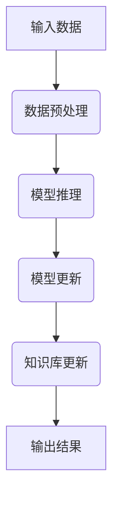

                 


# 构建具有持续学习与知识更新能力的AI Agent

> 关键词：AI Agent，持续学习，知识更新，机器学习，深度学习，强化学习

> 摘要：本文详细探讨了如何构建一个能够持续学习和更新知识的人工智能代理（AI Agent）。通过分析持续学习的核心机制、算法实现、系统架构设计以及实际应用案例，本文为读者提供了一个全面的技术指南。从基础概念到实际应用，从算法原理到系统架构，本文力求为读者构建一个清晰的知识体系，帮助他们在实际项目中实现具有持续学习能力的AI Agent。

---

## 第1章: AI Agent的基本概念与背景

### 1.1 AI Agent的定义与核心特征

#### 1.1.1 什么是AI Agent
AI Agent（人工智能代理）是一种能够感知环境、执行任务并做出决策的智能实体。它可以是一个软件程序，也可以是一个物理设备，其核心目标是通过与环境的交互来实现特定的目标。

**AI Agent的核心特征：**
1. **自主性**：能够在没有外部干预的情况下自主运行。
2. **反应性**：能够根据环境的变化实时调整行为。
3. **目标导向性**：始终围绕目标进行决策和行动。
4. **学习能力**：能够通过经验或数据优化自身的性能。

#### 1.1.2 AI Agent的核心特征
AI Agent的持续学习能力是其区别于传统AI系统的核心特征。传统AI系统依赖于预设的规则和数据，而具有持续学习能力的AI Agent能够通过与环境的交互不断优化自身的知识库和行为策略。

#### 1.1.3 持续学习能力的重要性
在动态变化的环境中，知识和任务需求也在不断更新。AI Agent需要具备持续学习的能力，才能在长周期运行中保持高性能和适应性。

---

### 1.2 持续学习与知识更新的背景

#### 1.2.1 传统AI的局限性
传统AI系统通常依赖于静态的知识库和固定的规则，无法应对环境中的动态变化和新兴任务。这种局限性在实际应用中逐渐显现，尤其是在需要长期运行和不断优化的场景中。

#### 1.2.2 知识更新的需求场景
1. **动态环境**：例如智能客服需要根据用户的反馈不断优化服务策略。
2. **新兴任务**：例如智能推荐系统需要根据用户的偏好变化不断调整推荐策略。
3. **复杂任务**：例如自动驾驶需要根据道路状况和交通规则的变化不断优化驾驶策略。

#### 1.2.3 持续学习的必要性
为了应对上述场景中的挑战，AI Agent必须具备持续学习的能力，才能在复杂多变的环境中保持高效和稳定。

---

## 第2章: 持续学习与知识更新的核心机制

### 2.1 持续学习的基本原理

#### 2.1.1 持续学习的定义与分类
持续学习（Continuous Learning）是一种机器学习范式，旨在使模型能够通过不断接收新的数据样本或任务，逐步优化自身的性能。根据学习方式，持续学习可以分为以下两类：
- **Episodic Learning**：模型通过经验重放机制，在有限的时序数据中学习。
- **Lifelong Learning**：模型在长期的时序数据中学习，并能够处理无限多个任务。

#### 2.1.2 持续学习的核心机制
- **经验重放（Experience Replay）**：通过存储历史经验，模型能够从过去的交互中学习，避免仅依赖当前经验的局限性。
- **动态网络（Dynamical Network）**：通过设计可微分的网络结构，模型能够在线更新参数，适应新的输入数据。
- **参数迁移（Parameter Transfer）**：通过参数共享机制，模型能够将已有的知识迁移到新的任务中。

#### 2.1.3 持续学习的核心特征
- **在线学习能力**：模型能够在实时数据流中学习。
- **知识保持能力**：模型能够保留已有的知识，避免新任务的学习干扰旧任务的表现。
- **任务自适应能力**：模型能够根据新的任务需求调整自身的学习策略。

---

### 2.2 持续学习与知识更新的对比

#### 2.2.1 持续学习与知识更新的区别
- **持续学习**：强调模型在时间序列上的学习能力，能够根据历史经验逐步优化性能。
- **知识更新**：强调模型在知识库或参数空间上的更新能力，能够快速适应新的数据或任务。

#### 2.2.2 持续学习与知识更新的联系
- 两者的目标都是使模型能够适应动态变化的环境。
- 两者都需要模型具备良好的表示能力和优化能力。

---

## 第3章: 持续学习的核心机制与算法实现

### 3.1 持续学习的核心机制

#### 3.1.1 经验重放机制
经验重放（Experience Replay）是一种通过存储和重放历史经验来增强学习效果的机制。模型通过重放历史经验，能够从过去的数据中学习，从而避免仅依赖当前经验的局限性。

**经验重放机制的实现步骤：**
1. **经验存储**：将每一步的输入、输出和奖励存储在经验回放池中。
2. **经验采样**：随机采样一部分经验进行重放，以增加学习的多样性。
3. **经验回放**：将采样的经验输入模型，更新模型的参数。

#### 3.1.2 动态网络机制
动态网络（Dynamical Network）是一种通过可微分的网络结构实现持续学习的机制。模型通过调整网络参数，能够在新的输入数据上快速适应新的任务。

**动态网络机制的实现步骤：**
1. **网络设计**：设计一个可微分的网络结构，通常采用LSTM或Transformer等时序模型。
2. **参数优化**：通过反向传播算法优化网络参数，使其能够适应新的输入数据。
3. **在线更新**：模型在实时数据流中不断更新参数，保持对新任务的适应能力。

#### 3.1.3 参数迁移机制
参数迁移（Parameter Transfer）是一种通过参数共享实现知识迁移的机制。模型通过共享已有的参数，能够在新的任务中快速启动并优化性能。

**参数迁移机制的实现步骤：**
1. **参数共享**：将已有任务的参数共享到新的任务中。
2. **参数微调**：根据新的任务需求，对共享的参数进行微调。
3. **任务切换**：模型能够根据任务切换的需求，动态调整参数的共享方式。

---

### 3.2 持续学习的核心算法实现

#### 3.2.1 基于经验重放的DQN算法
**DQN算法的核心流程：**
1. **经验存储**：将每一步的输入、输出和奖励存储在经验回放池中。
2. **经验采样**：随机采样一部分经验进行重放，以增加学习的多样性。
3. **经验回放**：将采样的经验输入模型，更新模型的参数。

**DQN算法的数学模型：**
- **损失函数**：$$ L = \mathbb{E}_{(s,a,r,s')}[r + \gamma \max_a Q(s',a) - Q(s,a)] $$
- **目标网络**：通过目标网络分离当前网络和目标网络，避免参数更新的不稳定。

#### 3.2.2 基于动态网络的LSTM模型
**LSTM模型的核心流程：**
1. **输入处理**：将输入序列输入LSTM网络，提取时序特征。
2. **参数优化**：通过反向传播算法优化网络参数，使其能够适应新的输入数据。
3. **在线更新**：模型在实时数据流中不断更新参数，保持对新任务的适应能力。

**LSTM模型的数学模型：**
- **遗忘门**：$$ f_t = \sigma(W_f x_t + U_f h_{t-1} + b_f) $$
- **输入门**：$$ i_t = \sigma(W_i x_t + U_i h_{t-1} + b_i) $$
- **输出门**：$$ o_t = \sigma(W_o x_t + U_o h_{t-1} + b_o) $$
- **细胞状态**：$$ c_t = f_t c_{t-1} + i_t tanh(W_c x_t + U_c h_{t-1} + b_c) $$
- **隐藏状态**：$$ h_t = o_t tanh(c_t) $$

#### 3.2.3 基于参数迁移的Transformer模型
**Transformer模型的核心流程：**
1. **参数共享**：将已有任务的参数共享到新的任务中。
2. **参数微调**：根据新的任务需求，对共享的参数进行微调。
3. **任务切换**：模型能够根据任务切换的需求，动态调整参数的共享方式。

**Transformer模型的数学模型：**
- **自注意力机制**：$$ \text{Attention}(Q, K, V) = \text{softmax}\left(\frac{QK^T}{\sqrt{d_k}}\right)V $$
- **前馈网络**：$$ FFN(x) = \text{ReLU}(W_1 x + b_1) W_2 + b_2 $$

---

## 第4章: 持续学习与知识更新的系统架构设计

### 4.1 系统分析与设计

#### 4.1.1 系统功能需求
- **持续学习能力**：模型能够在线更新参数，适应新的输入数据。
- **知识保持能力**：模型能够保留已有的知识，避免新任务的学习干扰旧任务的表现。
- **任务自适应能力**：模型能够根据新的任务需求调整自身的学习策略。

#### 4.1.2 系统设计原则
- **模块化设计**：将系统划分为独立的模块，便于管理和优化。
- **可扩展性**：系统设计应具备良好的扩展性，能够方便地添加新的任务和数据源。
- **实时性**：系统应具备良好的实时性，能够快速响应用户的需求。

---

### 4.2 系统架构设计

#### 4.2.1 系统架构概述
- **数据输入模块**：接收实时数据流，将其输入模型进行处理。
- **模型更新模块**：根据新的输入数据，更新模型的参数。
- **知识库模块**：存储模型的知识和经验，供后续任务使用。
- **任务管理模块**：管理模型的任务切换和参数共享。

#### 4.2.2 系统架构图


---

## 第5章: 持续学习与知识更新的项目实战

### 5.1 项目环境搭建

#### 5.1.1 环境配置
- **Python版本**：Python 3.8及以上
- **深度学习框架**：TensorFlow或PyTorch
- **依赖管理工具**：pip

#### 5.1.2 项目安装
```bash
pip install tensorflow numpy pandas scikit-learn
```

---

### 5.2 系统核心功能实现

#### 5.2.1 模型实现
```python
import tensorflow as tf
from tensorflow.keras import layers

class ContinuousLearningModel:
    def __init__(self):
        self.model = self.build_model()
        self.target_model = self.build_model()
        self.target_model.set_weights(self.model.get_weights())

    def build_model(self):
        model = tf.keras.Sequential([
            layers.Dense(64, activation='relu'),
            layers.Dense(1)
        ])
        return model

    def update_target_model(self):
        self.target_model.set_weights(self.model.get_weights())
```

---

### 5.3 项目小结与优化建议

#### 5.3.1 项目小结
- 本文详细讲解了如何构建一个能够持续学习和更新知识的AI Agent。
- 通过实际项目案例，展示了如何将理论知识转化为实际应用。

#### 5.3.2 优化建议
- **模型优化**：尝试不同的网络结构和优化算法，进一步提升模型的性能。
- **数据优化**：引入更多的数据预处理方法，提高模型的学习效率。
- **算法优化**：探索更高效的参数更新策略，进一步提升模型的适应能力。

---

## 第6章: 总结与展望

### 6.1 总结
- 本文从基础概念到实际应用，详细探讨了如何构建一个能够持续学习和更新知识的AI Agent。
- 通过分析持续学习的核心机制、算法实现、系统架构设计以及实际应用案例，本文为读者提供了一个全面的技术指南。

### 6.2 展望
- 随着人工智能技术的不断发展，持续学习与知识更新能力的AI Agent将在更多领域得到应用。
- 未来的研究方向可以包括更高效的参数更新策略、更智能的知识管理方法以及更强大的模型结构设计。

---

## 作者：AI天才研究院/AI Genius Institute & 禅与计算机程序设计艺术 /Zen And The Art of Computer Programming

---

### END

