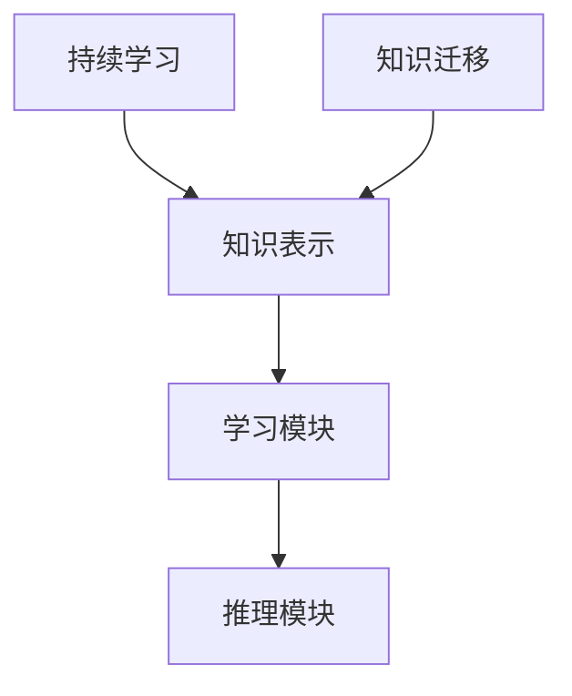
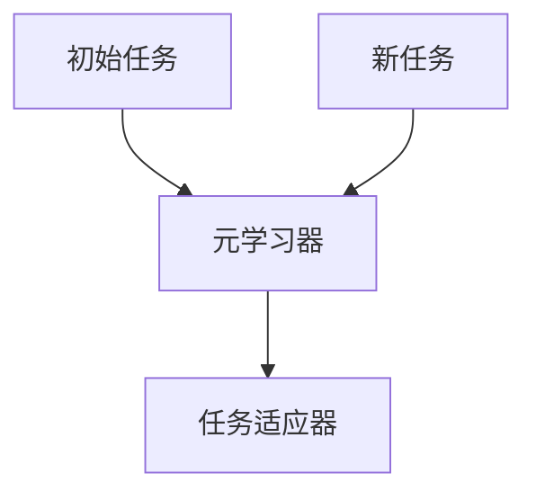
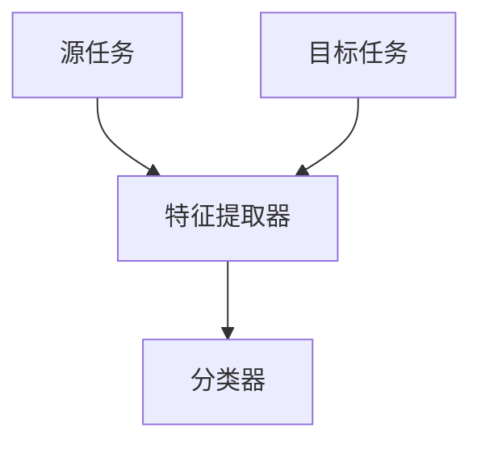
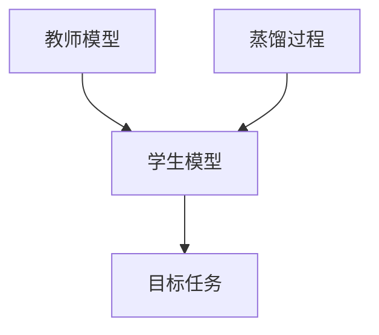
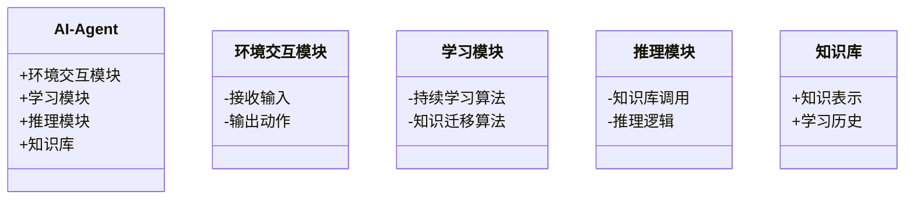
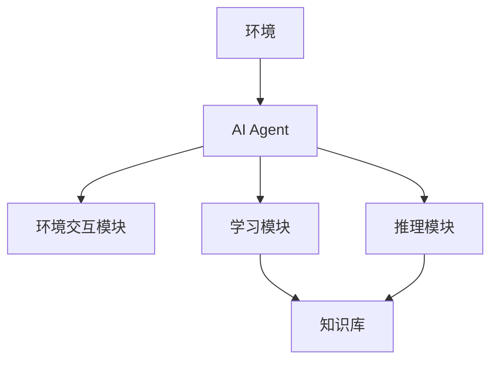

                 

# 构建具有持续学习与知识迁移能力的AI Agent

> 关键词：AI Agent，持续学习，知识迁移，元学习，迁移学习，自适应学习

> 摘要：本文将深入探讨如何构建一个具有持续学习与知识迁移能力的AI Agent。通过分析持续学习和知识迁移的核心概念、算法原理和系统架构，结合实际项目案例，为读者提供从理论到实践的全面指导。

---

## 第一部分：构建具有持续学习与知识迁移能力的AI Agent基础

### 第1章：持续学习与知识迁移的背景与核心概念

#### 1.1 问题背景

在人工智能领域，AI Agent（智能体）的目标是通过与环境交互来实现特定任务。然而，传统的AI Agent通常依赖于固定的训练数据和静态知识库，难以应对动态变化的环境和多样化任务的需求。例如，在自然语言处理领域，对话系统需要能够不断适应用户的反馈和新的查询模式；在机器人领域，AI Agent需要能够在未知环境中自主学习并调整行为策略。

**问题背景：**
- **动态环境**：AI Agent需要在不断变化的环境中执行任务。
- **多样化任务**：AI Agent需要能够处理不同类型的任务。
- **数据稀疏性**：在某些情况下，数据量有限，难以通过一次性训练完成任务。

#### 1.2 核心概念定义

为了应对上述挑战，持续学习和知识迁移成为构建AI Agent的关键技术。

**持续学习（Lifelong Learning）：**
- 定义：AI Agent能够在任务序列中逐步学习，每个任务的执行结果为后续任务提供经验。
- 特点：
  - **在线性**：实时学习和适应。
  - **累积性**：每次任务的经验可以累积。
  - **高效性**：通过已有知识快速适应新任务。

**知识迁移（Knowledge Transfer）：**
- 定义：将一个领域的知识和经验应用到另一个领域。
- 特点：
  - **领域独立性**：迁移学习不依赖于特定领域。
  - **灵活性**：能够在不同任务之间灵活切换。
  - **高效性**：通过迁移减少新任务的学习时间。

#### 1.3 概念结构与核心要素

持续学习和知识迁移的关系可以用以下实体关系图表示：

#### 1.4 本章小结

本章通过背景分析和核心概念定义，明确了构建具有持续学习与知识迁移能力的AI Agent的重要性和基本框架。

---

### 第2章：持续学习的核心算法与原理

#### 2.1 元学习（Meta-Learning）算法

**元学习的基本原理：**
- 元学习器（Meta-Learner）通过在多个任务上进行训练，生成一个能够快速适应新任务的模型。
- 例如，在自然语言处理任务中，元学习器可以快速适应新的语言模型微调任务。

**数学模型：**
$$ \text{Meta-Learning} = \argmin_{\theta} \sum_{i=1}^{N} \mathcal{L}_i(\theta) + \mathcal{L}_{\text{meta}}(\theta) $$

其中，$\mathcal{L}_i$是第$i$个任务的损失函数，$\mathcal{L}_{\text{meta}}$是元学习的损失函数。

**流程图：**

#### 2.2 迁移学习（Transfer Learning）算法

**迁移学习的基本原理：**
- 通过将源任务的知识迁移到目标任务，减少目标任务的训练数据需求。

**数学模型：**
$$ P_{\text{source}}(y|x) = P_{\text{target}}(y|x) $$

**流程图：**

#### 2.3 知识蒸馏（Knowledge Distillation）算法

**知识蒸馏的基本原理：**
- 将复杂模型（教师模型）的知识迁移到简单模型（学生模型）中。

**数学模型：**
$$ \mathcal{L}_{\text{student}} = \alpha \mathcal{L}_{\text{task}} + (1-\alpha) \mathcal{L}_{\text{distill}} $$

其中，$\mathcal{L}_{\text{task}}$是任务损失，$\mathcal{L}_{\text{distill}}$是蒸馏损失。

---

### 第3章：知识迁移的核心算法与原理

#### 3.1 知识蒸馏算法

**知识蒸馏的优势：**
- 减少计算资源消耗。
- 提高模型的泛化能力。

**流程图：**

#### 3.2 迁移学习算法

**迁移学习的挑战：**
- 源任务和目标任务之间的特征空间差异。

**解决方案：**
- 使用域适配（Domain Adaptation）技术减少特征空间差异。

---

## 第四部分：系统架构设计与实现

### 第4章：系统架构设计

#### 4.1 问题场景介绍

**目标：**
- 构建一个支持持续学习和知识迁移的AI Agent系统。

**核心功能：**
- 支持多任务学习。
- 实现知识的持续积累和迁移。

#### 4.2 系统功能设计

**领域模型（Domain Model）：**

#### 4.3 系统架构设计

**系统架构图：**

---

### 第5章：项目实战

#### 5.1 环境搭建与核心实现

**环境搭建：**
- 安装必要的库（如TensorFlow、PyTorch）。
- 配置开发环境。

**核心实现：**
- 实现元学习算法（Meta-Learning）。
- 实现知识蒸馏算法（Knowledge Distillation）。

#### 5.2 案例分析

**案例：自然语言处理任务中的持续学习**

- 数据准备：从多个来源获取文本数据。
- 模型训练：使用元学习算法训练模型。
- 知识迁移：将预训练模型迁移到特定任务。

---

## 第六部分：总结与展望

### 第6章：总结与展望

#### 6.1 最佳实践

- **持续学习**：逐步积累知识，避免一次性训练。
- **知识迁移**：利用已有知识快速适应新任务。

#### 6.2 小结

本文详细介绍了构建具有持续学习与知识迁移能力的AI Agent的理论基础、算法实现和系统设计。

#### 6.3 注意事项

- **数据质量**：持续学习和知识迁移依赖高质量的数据。
- **模型选择**：选择适合任务的模型架构。

#### 6.4 未来研究方向

- **更高效的算法**：研究更高效的元学习和迁移学习算法。
- **多模态学习**：结合视觉、听觉等多种模态信息。

---

## 作者信息

作者：AI天才研究院/AI Genius Institute & 禅与计算机程序设计艺术 /Zen And The Art of Computer Programming

---

通过以上结构，您可以根据需要逐步展开每个部分的内容，确保文章的逻辑清晰、结构紧凑，并涵盖所有关键点。

