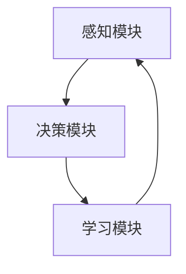
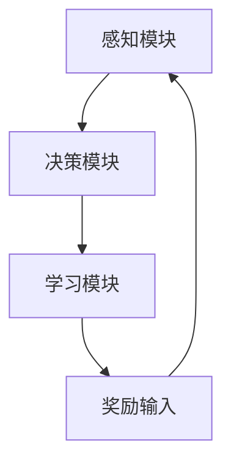

                 


# 构建具有持续学习与适应能力的AI Agent

> 关键词：AI Agent，持续学习，自适应机制，机器学习，深度学习

> 摘要：本文探讨了如何构建一个能够持续学习和适应复杂动态环境的AI Agent。通过分析持续学习与自适应机制的核心原理，结合具体算法实现与系统架构设计，本文提供了从理论到实践的全面指导，帮助读者理解并构建具有持续学习能力的AI Agent。

---

## 第一章：持续学习AI Agent的背景与概念

### 1.1 问题背景

AI Agent（智能代理）是一种能够感知环境、做出决策并执行任务的智能系统。在动态和不确定的环境中，AI Agent需要具备持续学习和自适应的能力，以应对新的挑战和变化。传统AI系统依赖于静态训练数据，难以适应新任务或环境变化，而持续学习AI Agent能够通过在线学习不断优化自身性能。

### 1.2 核心概念与问题描述

#### 1.2.1 持续学习的定义与特点
- 持续学习（Continuous Learning）是指AI系统在运行过程中，能够不断接收新数据并更新模型，以适应新任务或环境变化。
- 特点包括在线性、增量性和自适应性。

#### 1.2.2 自适应机制的必要性
- 动态环境中的任务需求变化。
- 多样化的数据输入与输出。
- 不断变化的用户偏好或目标。

#### 1.2.3 问题的边界与外延
- 边界：持续学习不涉及模型的完全重训练，而是在线更新。
- 外延：包括强化学习、自适应控制等领域。

---

## 第二章：持续学习与自适应机制的核心原理

### 2.1 持续学习的基本原理

#### 2.1.1 神经网络的在线更新机制
- 在线更新：实时接收输入数据并更新模型权重。
- 权重更新公式：$$\theta_{t+1} = \theta_t - \eta \nabla L(\theta_t)$$
- 优点：实时性强，适合动态环境。

#### 2.1.2 强化学习在自适应中的应用
- 强化学习（Reinforcement Learning）：通过与环境交互，学习最优策略。
- Q-learning算法：$$Q(s, a) = Q(s, a) + \alpha (r + \gamma \max Q(s', a') - Q(s, a))$$
- 应用场景：机器人控制、游戏AI。

#### 2.1.3 记忆机制的实现方式
- 短时记忆（Short-term Memory）：处理当前任务。
- 长时记忆（Long-term Memory）：存储历史信息，用于长期任务优化。

### 2.2 自适应机制的核心要素

#### 2.2.1 动态环境感知
- 多模态数据输入：视觉、听觉、文本等多种数据源。
- 环境状态表示：使用特征向量或符号表示当前环境状态。

#### 2.2.2 知识更新策略
- 任务优先级：根据任务重要性决定更新顺序。
- 知识遗忘机制：防止过时信息干扰新知识学习。

#### 2.2.3 行为调整机制
- 在线策略调整：实时优化行为策略。
- 多目标优化：平衡多个目标的权重，实现最优决策。

---

## 第三章：持续学习AI Agent的算法原理与数学模型

### 3.1 神经网络更新的数学模型

#### 3.1.1 损失函数的定义
- 均方误差损失：$$L = \frac{1}{2} (y - \hat{y})^2$$
- 交叉熵损失：$$L = -\sum y \log \hat{y} + (1-y) \log (1-\hat{y})$$

#### 3.1.2 梯度下降算法
- 随机梯度下降（SGD）：$$\theta = \theta - \eta \nabla L$$
- 动量优化（Momentum）：$$v = \beta v + \nabla L$$，$$\theta = \theta - \eta v$$

### 3.2 强化学习的数学模型

#### 3.2.1 Q-learning算法
- Q值更新：$$Q(s, a) = Q(s, a) + \alpha (r + \gamma \max Q(s', a') - Q(s, a))$$
- 探索与利用：平衡探索新动作和利用已知最佳动作。

---

## 第四章：持续学习AI Agent的系统架构设计

### 4.1 系统模块划分

#### 4.1.1 感知模块
- 功能：接收环境输入，提取特征。
- 输入：多模态数据。
- 输出：环境状态表示。

#### 4.1.2 决策模块
- 功能：根据当前状态生成动作。
- 输入：环境状态。
- 输出：动作选择。

#### 4.1.3 学习模块
- 功能：更新模型参数，优化策略。
- 输入：反馈信息。
- 输出：更新后的模型权重。

### 4.2 系统架构图


---

## 第五章：持续学习AI Agent的项目实战与案例分析

### 5.1 环境配置

#### 5.1.1 环境需求
- Python版本：3.8+
- 依赖库：TensorFlow 2.5+, Keras 2.5+, OpenAI Gym

#### 5.1.2 安装依赖
```bash
pip install tensorflow==2.5.0 keras==2.5.0 gym==0.17.0
```

### 5.2 核心代码实现

#### 5.2.1 感知模块实现
```python
class PerceptionModule:
    def __init__(self, input_shape):
        self.model = self.build_model(input_shape)
    
    def build_model(self, input_shape):
        model = keras.Sequential()
        model.add(keras.layers.Dense(64, activation='relu', input_shape=input_shape))
        model.add(keras.layers.Dense(32, activation='relu'))
        model.add(keras.layers.Dense(1))
        model.compile(optimizer='adam', loss='mse')
        return model
    
    def process(self, inputs):
        return self.model.predict(inputs)
```

#### 5.2.2 决策模块实现
```python
class DecisionModule:
    def __init__(self, input_dim, action_dim):
        self.model = self.build_model(input_dim, action_dim)
    
    def build_model(self, input_dim, action_dim):
        model = keras.Sequential()
        model.add(keras.layers.Dense(64, activation='relu', input_shape=(input_dim,)))
        model.add(keras.layers.Dense(action_dim))
        model.compile(optimizer='adam', loss='mse')
        return model
    
    def decide(self, state):
        return self.model.predict(state)[0]
```

#### 5.2.3 学习模块实现
```python
class LearningModule:
    def __init__(self, state_dim, action_dim):
        self.perception = PerceptionModule((state_dim,))
        self.decision = DecisionModule(state_dim, action_dim)
        self.reward_memory = []
    
    def update(self, reward):
        self.reward_memory.append(reward)
        # TODO: 实现基于奖励的记忆更新机制
```

### 5.3 系统交互流程图


---

## 第六章：总结与展望

### 6.1 最佳实践 tips
- 定期更新模型，保持适应性。
- 使用多模态数据，提高感知能力。
- 设计合理的奖励机制，引导模型学习。

### 6.2 小结
本文详细探讨了持续学习AI Agent的构建方法，从理论到实践，为读者提供了全面的指导。

### 6.3 注意事项
- 模型更新频率与计算资源的平衡。
- 数据质量和多样性的保证。

### 6.4 拓展阅读
- 《深度强化学习》
- 《自适应控制系统》

---

作者：AI天才研究院 & 禅与计算机程序设计艺术

