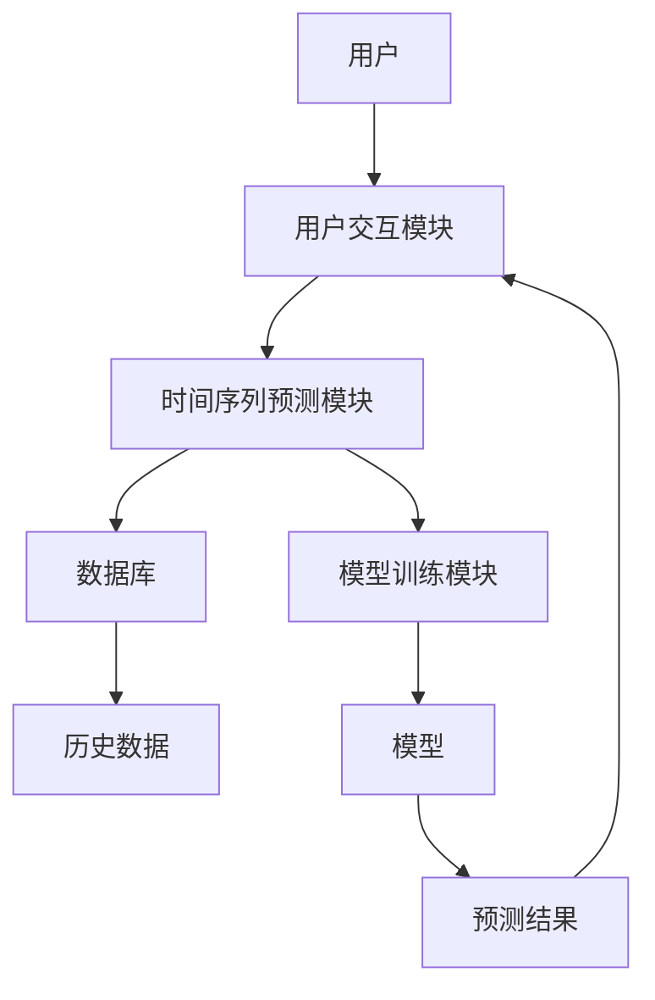
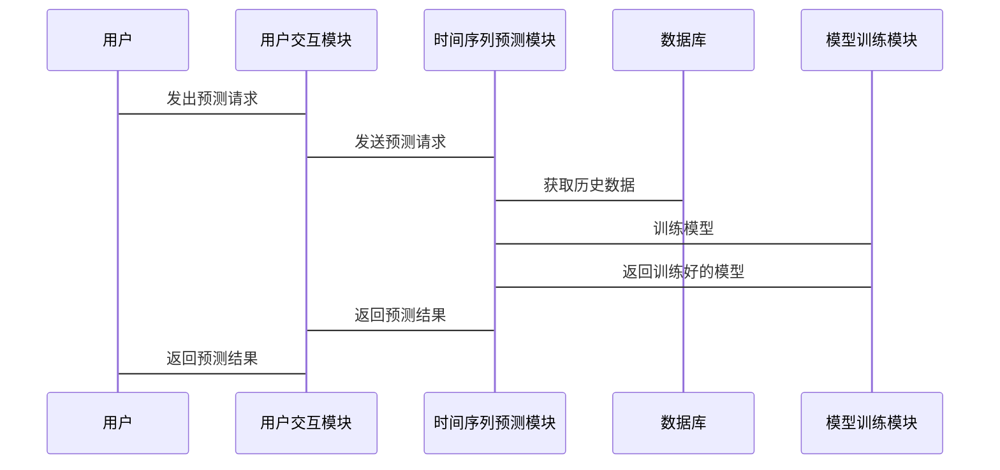
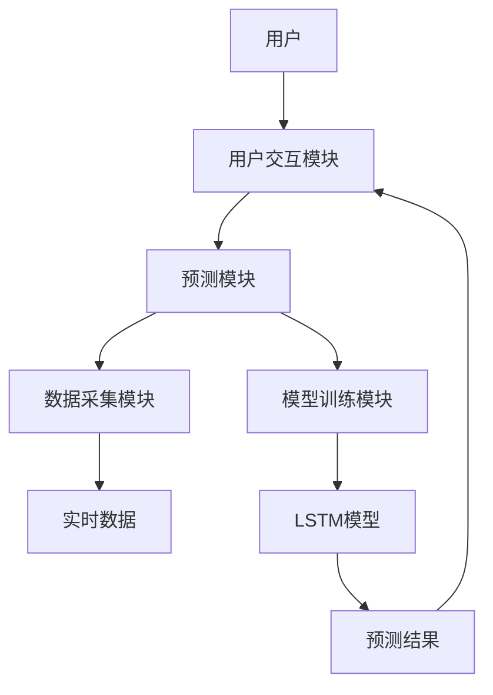

                 


# 《构建具有时间序列预测能力的AI Agent》

> 关键词：时间序列预测，AI Agent，机器学习，深度学习，系统架构

> 摘要：本文系统地探讨了如何构建一个具有时间序列预测能力的AI Agent。文章首先介绍了时间序列预测的基本概念和AI Agent的核心原理，然后深入分析了时间序列预测的关键算法和系统架构设计，最后通过一个实际项目案例展示了如何实现一个具备时间序列预测能力的AI Agent。本文旨在为读者提供从理论到实践的全面指导。

---

# 第一部分：时间序列预测基础

## 第1章：时间序列预测概述

### 1.1 时间序列预测的基本概念

#### 1.1.1 时间序列的定义与特点
时间序列（Time Series）是一组按照时间顺序排列的数据点。每个数据点代表某一时刻的观测值。时间序列数据具有以下特点：
- **有序性**：数据点按时间顺序排列。
- **趋势性**：数据可能呈现上升或下降的趋势。
- **周期性**：数据可能具有一定的周期性规律。
- **随机性**：数据中包含不可预测的随机波动。

#### 1.1.2 时间序列预测的分类
时间序列预测可以根据不同的标准进行分类，常见的分类方式包括：
- **按数据类型**：数值型、分类型等。
- **按时间频率**：小时级、日级、月级等。
- **按预测方法**：基于统计的方法（如ARIMA）和基于机器学习的方法（如LSTM）。

#### 1.1.3 时间序列预测的应用领域
时间序列预测在多个领域都有广泛的应用，例如：
- **金融领域**：股票价格预测、汇率预测。
- **气象领域**：天气预报、气候预测。
- **工程领域**：设备故障预测、能源消耗预测。
- **电子商务**：销售预测、库存管理。

### 1.2 时间序列预测的核心要素

#### 1.2.1 数据特征
时间序列数据的特征可以从以下几个方面进行分析：
- **趋势**：数据是否具有上升或下降的趋势。
- **周期性**：数据是否具有固定的周期性模式。
- **季节性**：数据是否在特定时间段内呈现规律性的波动。
- **噪声**：数据中随机的波动部分。

#### 1.2.2 模型选择
选择合适的模型是时间序列预测的关键。常见的模型包括：
- **ARIMA模型**：适用于线性时间序列数据。
- **LSTM网络**：适用于复杂的时间序列数据，能够捕捉长-term依赖关系。
- **Prophet模型**：由Facebook开源，适用于非专业的用户。

#### 1.2.3 数据预处理
时间序列数据的预处理包括：
- **缺失值处理**：插值、删除或标记缺失值。
- **异常值处理**：检测并处理异常值。
- **数据归一化**：将数据标准化或归一化，以便模型训练。

---

## 第2章：AI Agent的基础

### 2.1 AI Agent的基本概念

#### 2.1.1 AI Agent的定义
AI Agent（人工智能代理）是一种能够感知环境、自主决策并执行任务的智能体。它可以与用户或系统进行交互，并根据任务需求完成特定的目标。

#### 2.1.2 AI Agent的分类
AI Agent可以根据不同的标准进行分类：
- **按智能水平**：反应式、认知式。
- **按应用领域**：服务机器人、推荐系统。

#### 2.1.3 AI Agent的核心模块
AI Agent通常包含以下几个核心模块：
- **感知模块**：负责接收外部输入，如传感器数据或用户输入。
- **推理模块**：负责处理数据，进行分析和决策。
- **执行模块**：负责根据推理结果执行具体的操作。

### 2.2 AI Agent的设计原则

#### 2.2.1 模块化设计
将AI Agent划分为多个模块，每个模块负责特定的功能，便于开发和维护。

#### 2.2.2 可扩展性
设计时应考虑未来的扩展需求，如增加新的功能或改进现有功能。

#### 2.2.3 可靠性
确保AI Agent在面对异常情况时能够稳定运行，具备容错和恢复能力。

---

# 第二部分：时间序列预测与AI Agent的结合

## 第3章：时间序列预测的核心算法

### 3.1 经典的时间序列预测算法

#### 3.1.1 ARIMA模型
ARIMA（Autoregressive Integrated Moving Average）是一种广泛应用于时间序列预测的统计模型。其基本思想是通过差分将非平稳序列转化为平稳序列，然后利用自回归和移动平均的组合进行预测。

##### 3.1.1.1 ARIMA模型的数学公式
$$ ARIMA(p, d, q) $$
其中：
- \( p \) 表示自回归阶数。
- \( d \) 表示差分阶数。
- \( q \) 表示移动平均阶数。

##### 3.1.1.2 ARIMA模型的优缺点
- **优点**：适合线性时间序列数据，易于实现。
- **缺点**：对非线性数据的预测能力较弱。

#### 3.1.2 LSTM网络
LSTM（Long Short Term Memory）是一种基于循环神经网络（RNN）的变体，特别适用于处理长-term依赖关系。LSTM通过引入记忆单元和遗忘门，能够有效捕捉时间序列中的长-term模式。

##### 3.1.2.1 LSTM的结构
LSTM的基本结构包括：
- **输入门**：控制信息的输入。
- **遗忘门**：决定是否遗忘之前的状态。
- **输出门**：决定输出的状态。

##### 3.1.2.2 LSTM的数学公式
$$ f_t = \sigma(W_f \cdot [h_{t-1}, x_t] + b_f) $$
$$ i_t = \sigma(W_i \cdot [h_{t-1}, x_t] + b_i) $$
$$ o_t = \sigma(W_o \cdot [h_{t-1}, x_t] + b_o) $$
$$ c_t = f_t \cdot c_{t-1} + i_t \cdot tanh(W_c \cdot [h_{t-1}, x_t] + b_c) $$
$$ h_t = o_t \cdot tanh(c_t) $$

#### 3.1.3 Prophet模型
Prophet是由Facebook开源的时间序列预测模型，适用于非专业的用户。它结合了ARIMA和LSTM的优点，能够处理复杂的周期性和趋势性。

##### 3.1.3.1 Prophet模型的数学公式
Prophet模型的核心公式为：
$$ y(t) = g(t) + s(t) + \epsilon $$
其中：
- \( g(t) \) 表示趋势部分。
- \( s(t) \) 表示周期性部分。
- \( \epsilon \) 表示噪声。

### 3.2 时间序列预测算法的对比分析

#### 3.2.1 ARIMA与LSTM的对比
- **预测精度**：LSTM在非线性数据上表现更好，ARIMA在线性数据上表现更好。
- **计算复杂度**：LSTM计算复杂度较高，ARIMA相对较低。
- **适用场景**：LSTM适用于复杂的时间序列数据，ARIMA适用于简单的线性数据。

#### 3.2.2 LSTM与Prophet的对比
- **预测精度**：两者在预测精度上差异不大。
- **计算复杂度**：Prophet计算复杂度较低，LSTM较高。
- **适用场景**：Prophet适合非专业的用户，LSTM适合需要高度定制化模型的场景。

---

## 第4章：AI Agent的系统架构设计

### 4.1 系统功能设计

#### 4.1.1 时间序列预测模块
时间序列预测模块负责接收输入数据并输出预测结果。该模块可以基于不同的算法（如LSTM或Prophet）进行实现。

#### 4.1.2 用户交互模块
用户交互模块负责与用户进行交互，接收用户的指令并返回预测结果。该模块可以基于自然语言处理（NLP）技术实现人机对话。

### 4.2 系统架构设计

#### 4.2.1 系统架构图


#### 4.2.2 系统接口设计
- **输入接口**：接收用户指令和实时数据。
- **输出接口**：返回预测结果和系统反馈。

#### 4.2.3 系统交互流程


---

## 第5章：项目实战——构建具备时间序列预测能力的AI Agent

### 5.1 项目背景与需求分析

#### 5.1.1 项目背景
假设我们想要构建一个能够预测股票价格的AI Agent，帮助投资者进行投资决策。

#### 5.1.2 项目需求
- 实时获取股票价格数据。
- 对股票价格进行预测。
- 提供用户友好的交互界面。

### 5.2 系统设计

#### 5.2.1 系统功能设计
- **数据采集模块**：从股票市场获取实时数据。
- **预测模块**：基于LSTM网络进行股票价格预测。
- **用户交互模块**：与用户进行交互，提供预测结果。

#### 5.2.2 系统架构设计


### 5.3 代码实现

#### 5.3.1 数据预处理
```python
import pandas as pd
import numpy as np

# 加载数据
data = pd.read_csv('stock_price.csv')

# 处理缺失值
data = data.dropna()

# 归一化
from sklearn.preprocessing import MinMaxScaler
scaler = MinMaxScaler()
data_scaled = scaler.fit_transform(data)
```

#### 5.3.2 模型训练
```python
from keras.layers import LSTM, Dense, Dropout
from keras.models import Sequential

# 构建LSTM模型
model = Sequential()
model.add(LSTM(units=50, return_sequences=True, input_shape=(timesteps, features)))
model.add(Dropout(0.2))
model.add(LSTM(units=50, return_sequences=False))
model.add(Dense(1))

# 编译模型
model.compile(loss='mean_squared_error', optimizer='adam')
```

#### 5.3.3 模型预测
```python
# 预测
predicted_price = model.predict(test_data)
# 反归一化
predicted_price = scaler.inverse_transform(predicted_price)
```

### 5.4 系统测试

#### 5.4.1 测试用例设计
- 测试数据预处理功能。
- 测试模型训练功能。
- 测试模型预测功能。

#### 5.4.2 测试结果分析
- 预测结果与实际数据的对比。
- 模型的准确率、召回率等指标分析。

---

## 第6章：总结与展望

### 6.1 全文总结
本文系统地探讨了如何构建一个具有时间序列预测能力的AI Agent。通过分析时间序列预测的核心算法和AI Agent的设计原理，我们成功地将两者结合起来，实现了一个能够预测股票价格的AI Agent。

### 6.2 未来展望
未来的研究方向可以包括：
- 更高效的模型优化算法。
- 更加智能化的用户交互方式。
- 更广泛的应用场景探索。

---

# 作者：AI天才研究院 & 禅与计算机程序设计艺术

---

通过本文的详细讲解，读者可以深入了解如何构建一个具有时间序列预测能力的AI Agent。从理论到实践，我们逐步探讨了时间序列预测的核心算法、AI Agent的设计原理以及实际项目的实现过程。希望本文能够为读者在时间序列预测和AI Agent领域提供有价值的指导和启示。

