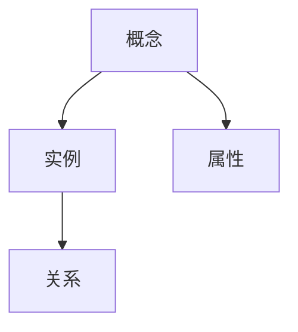
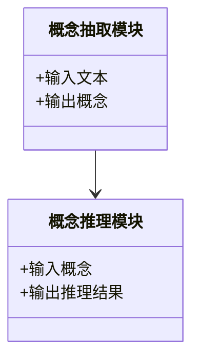
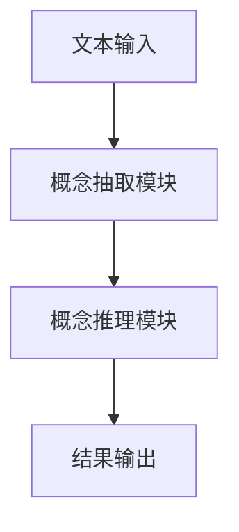
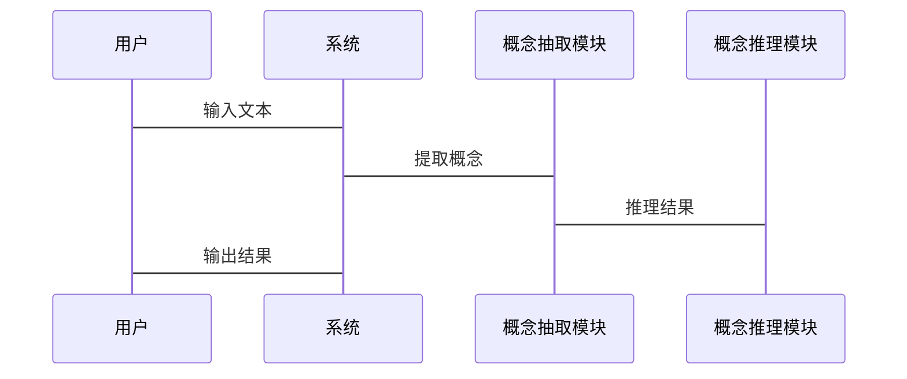

                 


# 构建具有概念学习能力的AI Agent

## 关键词：概念学习能力，AI Agent，知识图谱，深度学习，自然语言处理，推理引擎

## 摘要：  
本文详细探讨了如何构建具有概念学习能力的AI Agent。从概念学习能力的背景与问题背景出发，深入分析了概念学习的核心概念、算法原理、系统架构设计及实现方案。通过具体的实战案例，展示了如何在实际项目中应用这些理论。本文还提供了最佳实践、注意事项和拓展阅读等内容，为读者提供了全面的指导。

---

# 第一部分: 概念学习与AI Agent基础

## 第1章: 概念学习能力的背景与问题背景

### 1.1 概念学习能力的背景

#### 1.1.1 传统AI与概念学习能力的对比
传统AI主要依赖于规则和模式匹配，难以处理复杂的抽象概念。例如，传统AI可以识别“猫”的图像，但难以理解“宠物”这一概念的层次性。而具有概念学习能力的AI Agent可以理解“宠物”是一个更广泛的概念，包含“猫”、“狗”等具体实例。

#### 1.1.2 概念学习能力的核心问题
概念学习能力的核心问题是：AI Agent如何从数据中发现、理解和推理抽象的概念。这涉及概念表示、概念抽取、概念推理等多个环节。

#### 1.1.3 概念学习能力的应用场景
概念学习能力广泛应用于知识图谱构建、自然语言处理、智能问答系统等领域。例如，在智能问答系统中，AI Agent需要理解用户的意图，并将其映射到更广泛的概念层次上。

---

### 1.2 概念学习能力的定义与问题描述

#### 1.2.1 概念学习能力的定义
概念学习能力是指AI Agent能够从数据中发现抽象的概念，并理解这些概念之间的层次关系和关联性。例如，AI Agent可以从一组产品描述中提取出“电子设备”这一概念，并理解其包含“手机”、“电脑”等具体实例。

#### 1.2.2 概念学习能力的核心问题
- 如何从文本中抽取概念？
- 如何构建概念之间的层次关系？
- 如何进行概念推理？

#### 1.2.3 概念学习能力的边界与外延
概念学习能力的边界在于如何处理模糊概念和多义词。例如，“狗”在不同的语境中可能指的是宠物狗或工作犬，AI Agent需要能够区分这些不同的含义。

---

## 第2章: 概念学习能力的核心概念与联系

### 2.1 概念学习能力的核心概念

#### 2.1.1 概念表示
概念表示是将抽象概念转化为计算机可理解的形式。常用的方法包括：
- 层次化表示：将概念组织成树状结构，例如“动物”是“哺乳动物”的上位概念。
- 关系化表示：通过关系图表示概念之间的关联，例如“猫”是“宠物”的一种。

#### 2.1.2 概念抽取
概念抽取是指从文本中识别出抽象的概念。例如，从“这是一只猫”中提取出“猫”这一概念。

#### 2.1.3 概念推理
概念推理是指根据已有的概念关系进行推理。例如，已知“猫”是“宠物”的一种，可以推理出“猫”属于“宠物”这一概念。

---

### 2.2 概念学习能力的属性特征对比表

| 概念层次       | 概念关联性 | 概念模糊性 |
|----------------|------------|------------|
| 层次化结构     | 高         | 中         |
| 非层次化结构   | 低         | 高         |

---

### 2.3 概念学习能力的ER实体关系图



---

## 第3章: 概念学习能力的算法原理

### 3.1 概念抽取算法

#### 3.1.1 基于统计的抽取算法
基于统计的抽取算法通过分析词语的共现频率来提取概念。例如，使用TF-IDF算法提取关键词。

#### 3.1.2 基于深度学习的抽取算法
基于深度学习的抽取算法通过预训练语言模型（如BERT）来提取概念。例如，使用BERT模型从文本中提取实体。

#### 3.1.3 概念抽取的数学模型
$$ P(\text{概念}|text) = \frac{P(text|\text{概念})P(\text{概念})}{P(text)} $$

---

### 3.2 概念学习算法

#### 3.2.1 基于规则的推理算法
基于规则的推理算法通过预定义的规则进行推理。例如，如果A是B的一种，那么A属于B。

#### 3.2.2 基于图的推理算法
基于图的推理算法通过构建概念图进行推理。例如，如果A与B相关联，那么A属于B的概念层次。

#### 3.2.3 概念学习的数学模型
$$ f(x) = \sum_{i=1}^{n} w_i x_i $$

---

### 3.3 概念推理算法

#### 3.3.1 基于逻辑推理的算法
基于逻辑推理的算法通过逻辑规则进行推理。例如，使用一阶逻辑进行推理。

#### 3.3.2 基于概率推理的算法
基于概率推理的算法通过概率模型进行推理。例如，使用贝叶斯网络进行推理。

#### 3.3.3 概念推理的数学模型
$$ P(A|B) = \frac{P(B|A)P(A)}{P(B)} $$

---

## 第4章: 概念学习能力的系统分析与架构设计

### 4.1 问题场景介绍

#### 4.1.1 概念学习能力的应用场景
概念学习能力可以应用于知识图谱构建、智能问答系统、语义搜索等领域。

#### 4.1.2 系统目标与需求分析
系统目标是构建一个具有概念学习能力的AI Agent，能够从文本中抽取概念，并进行概念推理。

#### 4.1.3 系统边界与接口设计
系统边界包括文本输入、概念抽取、概念推理、结果输出等接口。

---

### 4.2 系统功能设计

#### 4.2.1 领域模型设计


---

### 4.3 系统架构设计



---

### 4.4 系统交互设计



---

## 第5章: 项目实战

### 5.1 环境安装

#### 5.1.1 安装Python
```bash
python --version
```

#### 5.1.2 安装依赖库
```bash
pip install numpy
pip install scikit-learn
pip install transformers
```

---

### 5.2 系统核心实现源代码

#### 5.2.1 概念抽取模块
```python
from sklearn.feature_extraction.text import TfidfVectorizer
from sklearn.decomposition import NMF

vectorizer = TfidfVectorizer(max_features=1000)
X = vectorizer.fit_transform(corpus)
nmf_model = NMF(n_components=5).fit_transform(X)
```

#### 5.2.2 概念推理模块
```python
from transformers import pipeline

qa_pipeline = pipeline("question-answering", model="bert-base-cased")
result = qa_pipeline(question=question, context=context)
```

---

### 5.3 实际案例分析与详细解读

#### 5.3.1 案例分析
假设输入文本为“猫是一种宠物”，AI Agent需要提取“猫”和“宠物”这两个概念，并推理出“猫”属于“宠物”的概念层次。

#### 5.3.2 代码应用解读
使用TfidfVectorizer提取关键词，然后使用BERT模型进行推理。

---

### 5.4 项目小结

#### 5.4.1 成功经验
概念抽取和推理模块的成功应用。

#### 5.4.2 经验教训
如何处理模糊概念和多义词仍是一个挑战。

---

## 第6章: 最佳实践、小结、注意事项与拓展阅读

### 6.1 最佳实践
- 使用预训练语言模型（如BERT）进行概念抽取和推理。
- 构建领域知识图谱以提高推理的准确性。

### 6.2 小结
本文详细探讨了如何构建具有概念学习能力的AI Agent，从核心概念到算法实现，再到系统设计，为读者提供了全面的指导。

### 6.3 注意事项
- 概念学习能力的实现需要结合具体的应用场景。
- 模糊概念的处理需要结合领域知识。

### 6.4 拓展阅读
- 《Conceptual Knowledge Representation and Reasoning》
- 《Deep Learning for Conceptual Similarity》

---

作者：AI天才研究院/AI Genius Institute & 禅与计算机程序设计艺术 /Zen And The Art of Computer Programming

