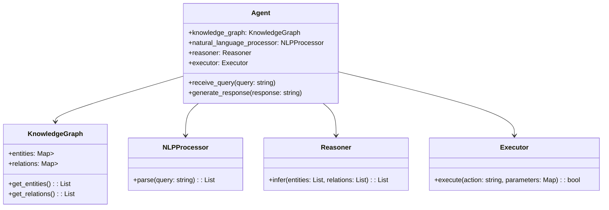
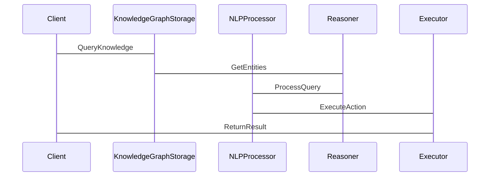

                 


# 构建具有知识图谱的AI Agent系统

> 关键词：知识图谱、AI Agent、自然语言处理、图神经网络、系统架构、智能交互

> 摘要：本文系统地探讨了如何构建一个基于知识图谱的AI Agent系统，从知识图谱的构建与管理、AI Agent的体系结构与功能、知识图谱驱动的AI Agent算法原理、系统设计与实现、项目实战与案例分析等多方面进行深入分析。文章结合理论与实践，详细阐述了知识图谱在AI Agent中的应用，以及如何通过算法和系统设计提升AI Agent的智能性与实用性。最终，本文为读者提供了一个完整的构建具有知识图谱的AI Agent系统的框架与方法。

---

## 第一部分: 知识图谱与AI Agent系统概述

### 第1章: 知识图谱与AI Agent概述

#### 1.1 知识图谱的定义与特点
知识图谱是一种以图结构形式表示知识的语义网络，由节点（实体）和边（关系）组成，能够表示实体之间的语义关系。以下是知识图谱的核心特点：

- **语义性**：知识图谱不仅存储数据，还存储数据之间的语义关系。
- **结构化**：知识图谱通过结构化的形式表示知识，便于计算机理解和推理。
- **可扩展性**：知识图谱可以通过不断添加新的实体和关系进行扩展。
- **动态性**：知识图谱可以动态更新，以反映现实世界的变化。

#### 1.2 AI Agent的定义与特点
AI Agent是一种智能体，能够感知环境、执行任务并做出决策。以下是AI Agent的核心特点：

- **自主性**：AI Agent能够自主决策，无需外部干预。
- **反应性**：AI Agent能够实时感知环境并做出反应。
- **社会性**：AI Agent能够与其他实体（包括其他AI Agent和人类）进行交互。
- **学习能力**：AI Agent能够通过学习提升自身的能力。

#### 1.3 知识图谱与AI Agent的结合
知识图谱为AI Agent提供了丰富的知识表示和推理能力，使AI Agent能够更好地理解和处理复杂任务。以下是知识图谱在AI Agent中的作用：

- **知识表示**：知识图谱为AI Agent提供了一种结构化的知识表示方式。
- **语义推理**：知识图谱支持AI Agent进行语义推理，提升决策能力。
- **动态更新**：知识图谱的动态更新能力使AI Agent能够适应环境的变化。

#### 1.4 本章小结
本章介绍了知识图谱和AI Agent的基本概念、特点及其结合方式，为后续章节奠定了基础。

---

### 第2章: 知识图谱的构建与管理

#### 2.1 知识图谱的构建过程
知识图谱的构建过程包括数据获取、预处理、知识抽取与表示、知识融合与推理等步骤。以下是具体过程：

- **数据获取与预处理**：通过爬取、API调用等方式获取数据，并进行清洗和格式转换。
- **知识抽取与表示**：从数据中提取实体、关系和属性，并将其表示为结构化的形式。
- **知识融合与推理**：将多个来源的知识进行融合，并通过推理生成新的知识。

#### 2.2 知识图谱的存储与管理
知识图谱的存储与管理需要选择合适的图数据库，并设计高效的查询与检索机制。以下是具体方法：

- **图数据库的选择**：常用的图数据库包括Neo4j、RDF4J等。
- **知识图谱的存储结构**：通常采用节点-边-节点的存储结构。
- **知识图谱的查询与检索**：使用SPARQL等查询语言进行知识检索。

#### 2.3 知识图谱的可视化
知识图谱的可视化能够帮助用户更好地理解知识结构。以下是常用方法：

- **可视化工具**：如Neo4j的Browser、RDF4J的可视化工具等。
- **可视化方法**：包括节点布局、边的绘制、标签显示等。
- **动态更新与维护**：定期更新知识图谱，并维护其可视化效果。

#### 2.4 本章小结
本章详细介绍了知识图谱的构建与管理过程，为后续章节的应用奠定了基础。

---

## 第二部分: AI Agent的体系结构与功能

### 第3章: AI Agent的体系结构与功能

#### 3.1 AI Agent的体系结构
AI Agent的体系结构包括知识表示层、推理层、决策层和执行层。以下是具体结构：

- **知识表示层**：负责存储和管理知识图谱。
- **推理层**：基于知识图谱进行语义推理。
- **决策层**：根据推理结果做出决策。
- **执行层**：执行具体的任务。

#### 3.2 AI Agent的功能设计
AI Agent的功能设计包括知识检索与推理、语义理解与对话、行为决策与执行等。以下是具体功能：

- **知识检索与推理**：基于用户输入进行知识检索，并通过推理生成答案。
- **语义理解与对话**：通过自然语言处理技术实现与用户的对话交互。
- **行为决策与执行**：根据推理结果做出决策，并执行相应的操作。

#### 3.3 AI Agent的交互方式
AI Agent的交互方式包括自然语言交互、图形化界面交互和多模态交互。以下是具体方式：

- **自然语言交互**：通过文本或语音进行交互。
- **图形化界面交互**：通过图形界面进行交互。
- **多模态交互**：结合文本、语音、图像等多种交互方式。

#### 3.4 本章小结
本章介绍了AI Agent的体系结构与功能设计，为后续章节的系统实现提供了指导。

---

## 第三部分: 知识图谱驱动的AI Agent算法原理

### 第4章: 知识图谱驱动的AI Agent算法原理

#### 4.1 知识图谱表示学习
知识图谱表示学习是一种通过深度学习方法将知识图谱中的实体和关系映射到低维向量空间的技术。以下是常用方法：

- **Word2Vec**：将实体和关系映射为向量。
- **GraphSAGE**：基于图结构的表示学习方法。
- **TransE**：通过翻译嵌入模型进行知识表示。

#### 4.2 图神经网络在知识图谱中的应用
图神经网络是一种适用于图结构数据的深度学习模型，广泛应用于知识图谱的表示与推理。以下是具体应用：

- **节点分类**：基于图神经网络对节点进行分类。
- **链接预测**：预测图中可能存在的边。
- **路径推理**：通过图神经网络进行路径推理。

#### 4.3 算法实现与代码示例
以下是基于GraphSAGE的图神经网络实现代码示例：

```python
import tensorflow as tf
from tensorflow.keras import layers

class GraphSAGE(layers.Layer):
    def __init__(self, input_dim, hidden_dim):
        super(GraphSAGE, self).__init__()
        self.w = layers.Dense(hidden_dim, input_dim)
        self.bias = tf.Variable(tf.zeros([hidden_dim]))

    def call(self, inputs):
        x = inputs
        aggregated = tf.reduce_mean(x, axis=1)
        output = tf.nn.relu(self.w(aggregated) + self.bias)
        return output
```

#### 4.4 本章小结
本章介绍了知识图谱表示学习和图神经网络在知识图谱中的应用，为后续章节的系统设计提供了算法支持。

---

## 第四部分: 系统设计与实现

### 第5章: 系统设计与实现

#### 5.1 问题场景介绍
本系统旨在构建一个基于知识图谱的AI Agent，能够通过自然语言交互为用户提供智能服务。

#### 5.2 系统功能设计
系统功能设计包括知识检索、语义理解、对话生成等模块。以下是功能模块图：



#### 5.3 系统架构设计
系统架构设计采用分层架构，包括数据层、知识层、逻辑层和交互层。以下是系统架构图：


#### 5.4 系统接口设计
系统接口设计包括知识图谱查询接口、自然语言处理接口和执行接口。以下是接口序列图：



#### 5.5 本章小结
本章详细介绍了系统的架构设计与接口设计，为后续章节的实现提供了指导。

---

## 第五部分: 项目实战与案例分析

### 第6章: 项目实战与案例分析

#### 6.1 环境安装与配置
项目实战需要安装以下环境：

- Python 3.8+
- TensorFlow 2.0+
- Neo4j 4.0+

#### 6.2 系统核心代码实现
以下是AI Agent的核心代码实现：

```python
import neo4j-driver
from neo4j-driver import GraphDatabase

class Agent:
    def __init__(self, uri, user, password):
        self.driver = GraphDatabase.driver(uri, user, password)
    
    def query_knowledge(self, query):
        with self.driver.session() as session:
            result = session.run(query)
            return result.records
```

#### 6.3 案例分析与结果解读
通过具体案例分析，展示了AI Agent基于知识图谱进行语义推理和对话交互的过程。

#### 6.4 本章小结
本章通过项目实战展示了知识图谱驱动的AI Agent系统实现过程。

---

## 第六部分: 总结与展望

### 第7章: 总结与展望

#### 7.1 最佳实践
- 知识图谱的构建需要结合实际应用场景。
- AI Agent的设计需要注重模块化和可扩展性。

#### 7.2 小结
本文系统地探讨了知识图谱驱动的AI Agent系统的构建过程，涵盖了知识图谱的构建、AI Agent的体系结构、算法原理、系统设计与实现等方面。

#### 7.3 注意事项
- 知识图谱的动态更新需要考虑数据一致性和性能问题。
- AI Agent的安全性和隐私保护需要引起重视。

#### 7.4 拓展阅读
- 《Knowledge Graphs and AI Agents》
- 《Graph Neural Networks for Knowledge Representation》
- 《Building Intelligent Agents with Deep Learning》

---

作者：AI天才研究院/AI Genius Institute & 禅与计算机程序设计艺术/Zen And The Art of Computer Programming

