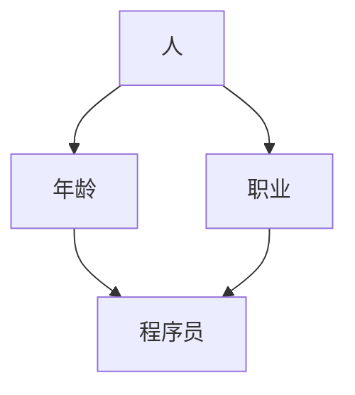
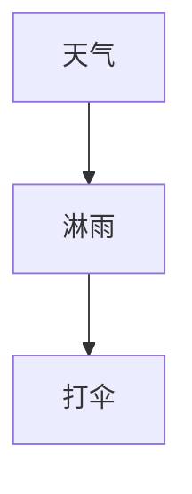
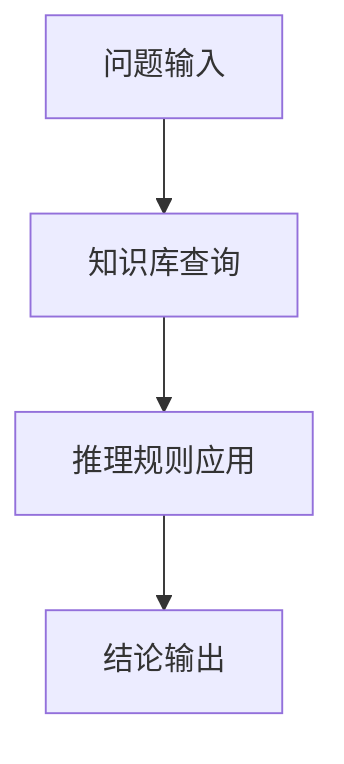
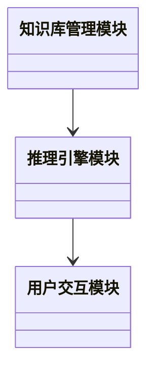
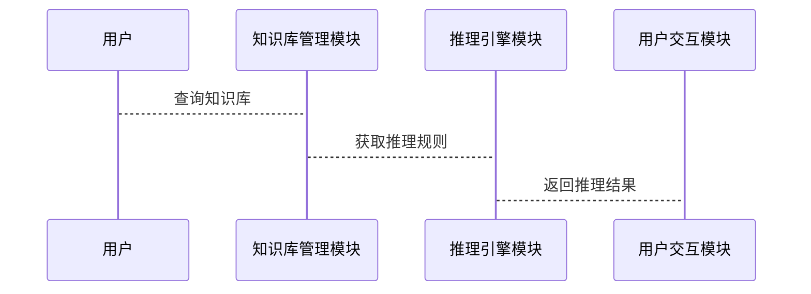

                 


# 构建具有知识推理能力的AI Agent

> **关键词**: AI Agent, 知识推理, 人工智能, 系统架构, 算法原理

> **摘要**: 本文将详细探讨如何构建一个具有知识推理能力的AI Agent。从基本概念到核心算法，从系统架构到项目实战，一步步引导读者掌握构建此类AI Agent的技能。文章内容包括背景介绍、核心概念、算法原理、系统设计、项目实战以及最佳实践。

---

## 第一部分: 背景与核心概念

### 第1章: AI Agent与知识推理概述

#### 1.1 AI Agent的基本概念
AI Agent，即人工智能代理，是一种能够感知环境并采取行动以实现目标的智能实体。它具备以下核心特征：
- **自主性**: 能够自主决策，无需外部干预。
- **反应性**: 能够实时感知环境并做出反应。
- **目标导向**: 具备明确的目标，并采取行动以实现目标。
- **社会能力**: 能够与其他Agent或人类进行交互与协作。

知识推理能力是AI Agent的重要组成部分，它使AI Agent能够理解、处理和应用知识来解决复杂问题。

#### 1.2 知识推理的定义与作用
知识推理是指AI Agent利用已有的知识库，通过逻辑推理、概率推理等方法，从已知事实中推导出新的结论或解决方案的过程。其作用包括：
- **提升决策能力**: 通过推理得出最优决策。
- **增强理解能力**: 能够理解上下文和隐含信息。
- **扩展应用范围**: 能够处理更复杂的问题。

#### 1.3 知识推理的应用场景
知识推理在多个领域有广泛应用，例如：
- **智能问答系统**: 能够回答复杂问题。
- **自动推理引擎**: 在自动驾驶中实时做出决策。
- **复杂问题求解**: 在金融、医疗等领域提供解决方案。

### 第2章: 知识推理的核心概念与联系

#### 2.1 知识表示与推理
知识表示是将知识以某种形式存储的过程。常见的表示方法包括：
- **谓词逻辑**: 通过谓词和逻辑连接词表示知识。
- **知识图谱**: 通过节点和边表示实体及其关系。
- **语义网络**: 通过节点和有向边表示概念及其关系。

**知识图谱示例**:


#### 2.2 推理机制与算法
推理机制是AI Agent从知识库中提取信息并推导结论的过程。常见的推理机制包括：
- **逻辑推理**: 基于逻辑规则进行推理。
- **概率推理**: 基于概率论进行推理。
- **符号推理**: 基于符号和规则进行推理。

**逻辑推理示例**:
$$ \text{如果 } A \text{ 并且 } B, \text{ 那么 } C $$
$$ A \text{ 和 } B \text{ 为真，所以 } C \text{ 为真} $$

---

## 第二部分: 知识推理的算法原理

### 第3章: 逻辑推理算法

#### 3.1 命题逻辑推理
命题逻辑是知识推理的基础，它通过逻辑连接词（如AND、OR、NOT）将命题组合起来，进行推理。

**命题逻辑示例**:
$$ P \land Q $$
$$ P \lor Q $$

#### 3.2 一阶谓词逻辑推理
一阶谓词逻辑是在命题逻辑的基础上引入谓词和量词（如∀和∃），能够表示更复杂的关系。

**一阶谓词逻辑示例**:
$$ \forall x, P(x) \rightarrow Q(x) $$
$$ \exists x, R(x) \land S(x) $$

#### 3.3 逻辑推理的数学模型
逻辑推理可以通过真值表和推理规则进行验证。

**真值表示例**:
| P | Q | P ∧ Q |
|---|---|-------|
| T | T |   T   |
| T | F |   F   |
| F | T |   F   |
| F | F |   F   |

### 第4章: 概率推理算法

#### 4.1 贝叶斯网络推理
贝叶斯网络是一种基于概率的推理方法，通过构建概率图模型进行推理。

**贝叶斯网络示例**:


#### 4.2 马尔可夫链推理
马尔可夫链是一种基于状态转移的概率推理方法。

**马尔可夫链示例**:
$$ P(X_t | X_{t-1}) $$

#### 4.3 概率推理的数学公式
概率推理可以通过贝叶斯定理进行计算。

**贝叶斯定理公式**:
$$ P(A|B) = \frac{P(B|A) \cdot P(A)}{P(B)} $$

### 第5章: 符号推理算法

#### 5.1 专家系统推理
专家系统是一种基于知识库和推理规则的符号推理方法。

**专家系统流程图**:


#### 5.2 状态空间搜索
状态空间搜索是一种通过搜索状态空间来寻找最优解的符号推理方法。

**状态空间搜索示例**:
- 初始状态: 起点
- 目标状态: 终点
- 动作: 移动

#### 5.3 符号推理的代码实现
以下是一个简单的符号推理实现示例：

```python
def infer事实：
    前提：所有鸟都会飞。
    推论：鸽子是鸟。
    结论：鸽子会飞。
```

---

## 第三部分: 系统架构与设计

### 第6章: 系统架构设计

#### 6.1 系统功能设计
构建一个具有知识推理能力的AI Agent系统，通常包括以下几个功能模块：
- **知识库管理模块**: 负责知识的存储和管理。
- **推理引擎模块**: 负责知识的推理和计算。
- **用户交互模块**: 负责与用户或其他系统的交互。

#### 6.2 系统架构图
以下是一个简单的系统架构图：



#### 6.3 系统接口设计
系统接口设计需要考虑模块之间的交互方式，例如：
- 知识库管理模块提供API供推理引擎模块调用。
- 用户交互模块通过API向推理引擎模块发送请求。

#### 6.4 系统交互流程
以下是一个系统交互流程的示例：



---

## 第四部分: 项目实战

### 第7章: 项目实战

#### 7.1 项目背景
我们选择一个智能问答系统作为实战项目，展示如何构建一个具有知识推理能力的AI Agent。

#### 7.2 环境配置
- **编程语言**: Python
- **框架**: 使用TensorFlow或PyTorch进行推理。
- **知识库**: 使用知识图谱进行存储。

#### 7.3 核心实现
以下是一个简单的智能问答系统的实现示例：

```python
def answer问题(问题):
    知识库 = 加载知识库()
    推理结果 = 知识库推理(问题)
    返回 推理结果
```

#### 7.4 案例分析
通过具体案例分析，展示如何利用知识推理能力解决实际问题。

---

## 第五部分: 总结与展望

### 第8章: 总结与展望

#### 8.1 总结
本文详细介绍了如何构建一个具有知识推理能力的AI Agent，从背景概念到算法原理，从系统架构到项目实战，为读者提供了全面的指导。

#### 8.2 注意事项
在实际应用中，需要注意以下几点：
- 知识库的质量直接影响推理结果。
- 推理算法的选择需要根据具体场景进行调整。
- 系统架构设计需要考虑可扩展性和可维护性。

#### 8.3 未来展望
随着人工智能技术的不断发展，知识推理能力将更加智能化和自动化。未来的研究方向包括：
- 更加高效的推理算法。
- 更加智能的知识表示方法。
- 更加人性化的用户交互界面。

---

## 作者

**作者：AI天才研究院/AI Genius Institute & 禅与计算机程序设计艺术 /Zen And The Art of Computer Programming**

---

以上是关于《构建具有知识推理能力的AI Agent》的技术博客文章的完整目录和内容大纲。希望对您有所帮助！

