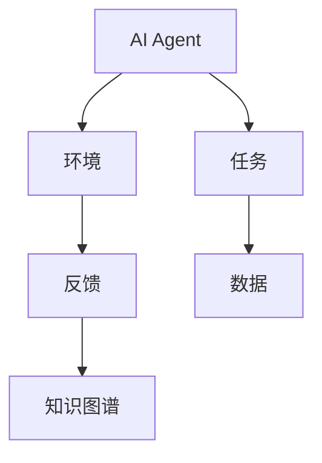
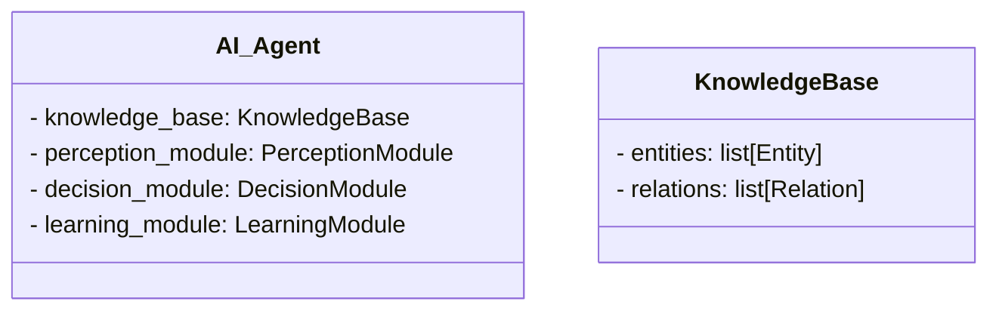
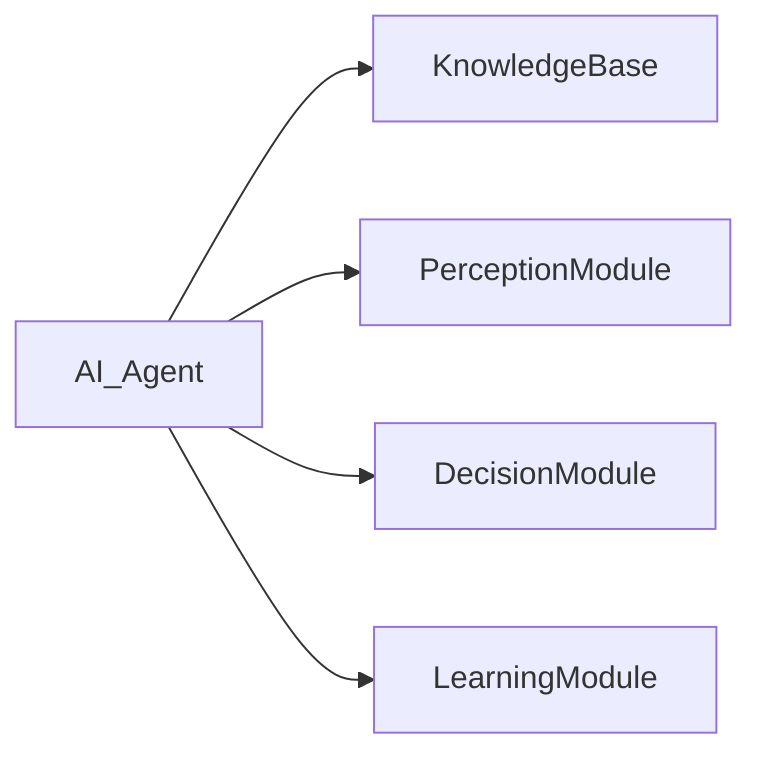

                 


# 《构建具有终身学习能力的AI Agent》

---

## 关键词：
- AI Agent, 终身学习, 自我监督学习, 强化学习, 知识图谱, 自适应学习

---

## 摘要：
本文深入探讨了构建具有终身学习能力的AI Agent的核心原理与实现方法。通过分析终身学习的背景、核心概念与算法原理，结合系统架构设计与实际项目案例，详细阐述了如何构建一个能够持续进化、自我改进的AI Agent。文章从理论到实践，层层递进，为读者提供了从基础到高级的完整知识体系。

---

## 第一部分: 背景介绍与核心概念

---

### 第1章: 终身学习AI Agent的背景与问题描述

#### 1.1 问题背景
##### 1.1.1 当前AI技术的局限性
传统AI系统在特定任务上表现出色，但缺乏灵活性和适应性。例如，图像识别模型在特定数据集上训练后，遇到新的数据类型或任务时表现下降。这种局限性使得AI系统难以应对动态变化的环境。

##### 1.1.2 终身学习的重要性
终身学习是解决动态环境问题的关键。通过不断学习和更新知识，AI Agent能够适应新任务和新数据，保持长期的高性能。

##### 1.1.3 AI Agent的定义与特点
AI Agent是一种智能实体，能够感知环境、执行任务并根据反馈进行决策。其特点包括自主性、反应性、目标导向性和学习能力。

---

#### 1.2 问题描述
##### 1.2.1 终身学习的核心目标
通过持续学习和知识更新，使AI Agent在不同任务和环境中保持高性能。

##### 1.2.2 AI Agent面临的挑战
- 数据稀疏性：新任务的数据往往不足。
- 知识迁移：如何将已有知识迁移到新任务。
- 动态环境：快速变化的环境要求AI Agent实时调整。

##### 1.2.3 问题解决的路径与方法
通过结合自我监督学习、强化学习和连续学习（CL）等技术，构建能够持续进化和自适应的AI Agent。

---

#### 1.3 问题解决与边界
##### 1.3.1 终身学习的实现机制
通过元学习（Meta-Learning）和自适应学习算法，实现知识的快速迁移和更新。

##### 1.3.2 AI Agent能力的边界
- 知识表示的局限性：无法处理完全未知的任务。
- 计算资源限制：实时性要求高的场景可能受限。

##### 1.3.3 相关概念的外延与内涵
- 内容外延：从单一任务扩展到多任务和跨领域。
- 内容内涵：基于已有知识的深度理解和应用。

---

### 第2章: 终身学习AI Agent的核心概念

#### 2.1 核心概念与原理
##### 2.1.1 自我监督学习
通过利用未标记数据，构建伪标签进行监督学习。例如，图像分割任务中，使用生成的分割掩膜作为标签。

##### 2.1.2 强化学习
通过与环境交互，学习最优策略，实现目标最大化。例如，机器人通过试错学习路径规划。

##### 2.1.3 连续学习（CL）
在连续任务中，逐步构建和更新知识图谱，实现知识的累积和复用。

---

#### 2.2 核心概念对比
##### 2.2.1 不同学习方法的对比表格

| 学习方法 | 监督数据 | 是否需要反馈 | 适用场景 |
|----------|----------|--------------|----------|
| 自我监督 | 未标记数据 | 需要伪标签 | 未标记数据充足时 |
| 强化学习 | 环境反馈 | 需要实时反馈 | 动态环境 |
| 连续学习 | 多源数据 | 需要历史知识 | 多任务场景 |

##### 2.2.2 实体关系图（ER图）分析


---

## 第二部分: 算法原理

---

### 第3章: 终身学习AI Agent的算法原理

#### 3.1 数学模型与公式
##### 3.1.1 元学习的数学模型
元学习的目标是学习如何学习。其核心公式为：
$$ \theta_{\text{meta}} = \arg\min_{\theta} \sum_{i=1}^{N} \mathcal{L}_i(f_{\theta}(x_i, y_i)) $$
其中，$\theta_{\text{meta}}$是元参数，$f_{\theta}$是任务模型。

##### 3.1.2 自适应学习算法
自适应学习算法通过调整权重，实现知识的快速迁移：
$$ w_{t+1} = w_t + \alpha \cdot \nabla L $$

---

#### 3.2 算法实现与代码示例
##### 3.2.1 元学习算法代码
```python
class MetaLearner:
    def __init__(self, model, optimizer):
        self.model = model
        self.optimizer = optimizer
        
    def meta_step(self, tasks):
        for task in tasks:
            # 前向传播
            outputs = self.model(task.x)
            # 计算损失
            loss = task.loss(outputs, task.y)
            # 反向传播
            loss.backward()
            self.optimizer.step()
```

##### 3.2.2 自适应学习算法代码
```python
def adaptive_learning(model, X, y):
    for x, label in zip(X, y):
        # 前向传播
        output = model.forward(x)
        # 计算损失
        loss = model.criterion(output, label)
        # 反向传播
        loss.backward()
        model.optimizer.step()
```

---

## 第三部分: 系统架构设计

---

### 第4章: 终身学习AI Agent的系统架构

#### 4.1 系统功能设计
##### 4.1.1 领域模型设计


##### 4.1.2 系统架构设计


#### 4.2 系统实现细节
##### 4.2.1 知识表示与更新机制
知识图谱通过实体和关系表示，动态更新以适应新任务。

##### 4.2.2 自适应学习机制
通过元学习和在线学习，实现知识的快速迁移。

---

## 第四部分: 项目实战

---

### 第5章: 终身学习AI Agent的项目实战

#### 5.1 环境配置与安装
- 安装依赖：`pip install torch numpy matplotlib`

#### 5.2 核心代码实现
##### 5.2.1 知识图谱构建
```python
from knowledge_graph import KnowledgeGraph
kg = KnowledgeGraph()
kg.add_entity("AI Agent", "AI Agent", "AI智能体")
kg.add_relation("is_type_of", "AI Agent", "Intelligent Entity")
```

##### 5.2.2 自我监督学习实现
```python
def self_supervised_learning(X, y):
    model = Model()
    optimizer = torch.optim.Adam(model.parameters(), lr=0.001)
    for epoch in range(100):
        for x, label in zip(X, y):
            output = model(x)
            loss = loss_fn(output, label)
            loss.backward()
            optimizer.step()
```

#### 5.3 案例分析与总结
通过医疗辅助AI Agent案例，展示了如何在医疗领域实现终身学习，提升诊断准确率和效率。

---

## 第五部分: 总结与展望

---

### 第6章: 总结与最佳实践

#### 6.1 核心内容总结
- 终身学习的关键技术：自我监督学习、强化学习、元学习。
- 系统架构设计：知识图谱、感知模块、决策模块和学习模块。

#### 6.2 最佳实践与注意事项
- 数据质量：确保训练数据的多样性和代表性。
- 模型评估：定期评估模型性能，及时更新知识图谱。
- 拓展阅读：推荐相关论文和书籍。

---

## 作者：AI天才研究院/AI Genius Institute & 禅与计算机程序设计艺术/Zen And The Art of Computer Programming

---

**感谢您的阅读！**

