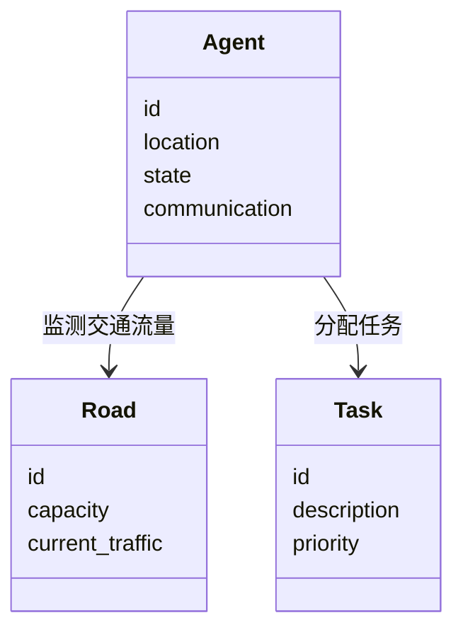
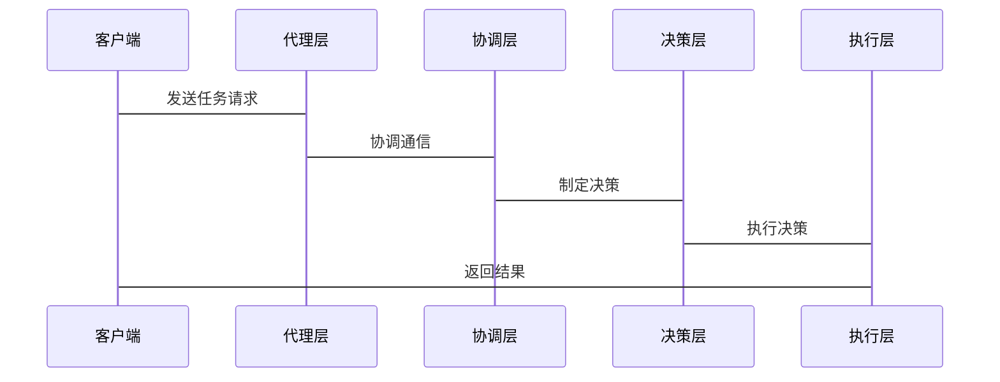

                 


# 构建具有群体智能决策能力的多Agent系统

## 关键词
多Agent系统, 群体智能, 分布式计算, 自组织网络, 协议算法, 一致性算法, 软件架构

## 摘要
本文详细探讨了构建具有群体智能决策能力的多Agent系统的各个方面，包括基本概念、核心算法、系统架构以及实际项目案例。通过背景介绍、核心概念分析、算法原理、系统设计、项目实战和总结，读者将全面了解如何设计和实现高效的多Agent系统，具备群体智能决策能力。

---

# 第一部分: 多Agent系统与群体智能决策概述

## 第1章: 多Agent系统与群体智能决策的背景介绍

### 1.1 多Agent系统的基本概念

#### 1.1.1 多Agent系统的定义
多Agent系统是由多个智能体组成的分布式系统，每个智能体能够自主感知环境并采取行动，通过通信和协作完成共同目标。

#### 1.1.2 多Agent系统的核心要素
- **自主性**: 每个Agent独立决策。
- **反应性**: 能感知环境变化并实时响应。
- **协作性**: Agent之间通过通信协作完成任务。
- **分布式性**: 系统由多个独立节点构成，无集中控制。

#### 1.1.3 多Agent系统的特点
- **去中心化**: 无单一控制中心。
- **动态性**: 环境和任务可能动态变化。
- **可扩展性**: 系统可扩展以适应更多Agent。

### 1.2 群体智能决策的定义与特点

#### 1.2.1 群体智能的定义
群体智能是多个简单个体通过协作表现出的集体智能，个体之间通过局部信息交换实现全局目标。

#### 1.2.2 群体智能与个体智能的区别
- **个体智能**: 单个智能体基于自身信息做出决策。
- **群体智能**: 多个智能体通过协作优化决策，整体智能超越个体。

#### 1.2.3 群体智能决策的核心特征
- **自组织性**: 群体内部无外部控制，自主组织。
- **涌现性**: 集体智能涌现，个体无法单独实现。
- **鲁棒性**: 群体能够适应环境变化，部分故障不影响整体。

### 1.3 多Agent系统与群体智能决策的联系

#### 1.3.1 多Agent系统与群体智能的结合
多Agent系统提供了一个去中心化的平台，群体智能则通过Agent间的协作实现智能决策。

#### 1.3.2 群体智能决策在多Agent系统中的应用
- **分布式计算**: 多Agent系统中的计算任务由多个Agent分担。
- **自组织网络**: Agent动态组网，适应环境变化。
- **群体决策**: Agent通过协商达成共识，做出最优决策。

#### 1.3.3 多Agent系统与群体智能决策的协同机制
- **通信机制**: Agent间通过消息传递进行信息共享。
- **协作机制**: 使用分布式算法达成一致。
- **决策机制**: 基于群体智能的决策模型做出最优选择。

### 1.4 多Agent系统与群体智能决策的应用领域

#### 1.4.1 智能交通系统
多Agent系统用于交通流量管理，群体智能用于路径优化和车辆调度。

#### 1.4.2 分布式计算与网络
多Agent系统用于分布式任务分配和负载均衡，群体智能用于网络流量控制。

#### 1.4.3 机器人协作与 swarm intelligence
多Agent系统用于机器人协作任务，群体智能用于 swarm intelligence 中的集体决策。

---

## 第2章: 多Agent系统与群体智能决策的核心概念与联系

### 2.1 多Agent系统的核心概念原理

#### 2.1.1 多Agent系统的通信机制
- **异步通信**: Agent间通过消息队列传递信息。
- **同步通信**: 实时通信，确保数据一致性。
- **发布订阅模式**: 通过主题发布信息，订阅者接收。

#### 2.1.2 多Agent系统的协作机制
- **分布式协作**: Agent在去中心化环境中协作。
- **任务分配**: 根据Agent的能力分配任务。
- **协商机制**: Agent通过协商达成共识。

#### 2.1.3 多Agent系统的决策机制
- **局部决策**: 基于局部信息做出决策。
- **全局决策**: 综合全局信息做出最优决策。
- **动态调整**: 根据环境变化实时调整决策。

### 2.2 群体智能决策的核心概念原理

#### 2.2.1 群体智能的决策模型
- **基于规则的模型**: 定义简单规则，通过涌现实现智能。
- **基于博弈论的模型**: 基于个体策略的最优解。
- **基于统计的模型**: 基于群体行为的统计模型。

#### 2.2.2 群体智能的共识机制
- **多数投票法**: 群体通过投票达成共识。
- **加权投票法**: 根据个体权重进行投票。
- **一致性算法**: 如Paxos、Raft，确保系统一致性。

#### 2.2.3 群体智能的自组织特性
- **自适应**: 群体能够根据环境变化自动调整结构。
- **冗余性**: 群体中存在冗余个体，确保系统的鲁棒性。
- **可扩展性**: 群体规模可动态调整，适应任务需求。

### 2.3 多Agent系统与群体智能决策的对比分析

#### 2.3.1 核心概念对比
| 概念          | 多Agent系统                 | 群体智能决策               |
|---------------|-----------------------------|---------------------------|
| 结构          | 去中心化网络                 | 分布式自组织网络           |
| 决策方式      | 基于通信和协作               | 基于群体行为和规则         |
| 应用场景      | 分布式计算、机器人协作       | 网络流量控制、任务分配     |

#### 2.3.2 属性特征对比
| 属性          | 多Agent系统                 | 群体智能决策               |
|---------------|-----------------------------|---------------------------|
| 自主性         | 高                          | 高                        |
| 反应性         | 高                          | 高                        |
| 协作性         | 高                          | 高                        |
| 去中心化       | 是                         | 是                       |
| 智能涌现       | 无                          | 有                       |

#### 2.3.3 ER实体关系图架构
```mermaid
er
actor(Agent) -[通信]-> entity(信息)
```

---

## 第3章: 多Agent系统与群体智能决策的算法原理

### 3.1 分布式计算与多Agent系统

#### 3.1.1 分布式系统的基本原理
- **分布式系统**: 多个独立节点通过网络通信协作完成任务。
- **一致性问题**: 确保系统中数据的一致性。
- **CAP定理**: 在一致性、可用性、分区容忍性之间权衡。

#### 3.1.2 多Agent系统中的分布式计算
- **任务分配**: 根据Agent的能力分配任务。
- **负载均衡**: 均衡分配计算任务，避免过载。
- **分布式算法**: 如一致性算法、共识算法。

#### 3.1.3 分布式计算在群体智能中的应用
- **分布式优化**: 多个Agent协同优化全局目标。
- **分布式学习**: 群体智能通过分布式学习提升整体智能。
- **分布式推理**: 多Agent系统中基于分布式推理做出决策。

### 3.2 群体智能

#### 3.2.1 群体智能的基本原理
- **涌现性**: 个体简单规则导致复杂行为。
- **自组织性**: 群体内部无外部控制，自主组织。
- **鲁棒性**: 群体能够适应环境变化，部分故障不影响整体。

#### 3.2.2 群体智能算法
- **粒子群优化(PSO)**:
  - 初始化粒子群。
  - 计算适应度。
  - 更新速度和位置。
  - 适应度评估，更新全局最优。
- **蚂蚁算法(ACO)**:
  - 初始化蚂蚁。
  - 计算路径成本。
  - 更新信息素。
  - 选择最优路径。

#### 3.2.3 群体智能的共识算法
- **多数投票法**: 群体通过投票达成共识。
- **加权投票法**: 根据个体权重进行投票。
- **一致性算法**: 如Paxos、Raft，确保系统一致性。

### 3.3 群体智能决策算法的数学模型

#### 3.3.1 群体决策模型
$$
\text{全局决策} = \argmax_{i} \sum_{j=1}^{n} w_j x_{ij}
$$

其中，$w_j$是第$j$个Agent的权重，$x_{ij}$是第$j$个Agent对选项$i$的评分。

#### 3.3.2 群体共识算法
$$
\text{共识值} = \sum_{i=1}^{n} \frac{v_i}{n}
$$

其中，$v_i$是第$i$个Agent的投票值，$n$是总Agent数。

---

## 第4章: 系统分析与架构设计

### 4.1 问题场景介绍

#### 4.1.1 问题描述
设计一个智能交通系统，利用多Agent系统和群体智能实现交通流量管理。

#### 4.1.2 项目介绍
项目目标：优化交通流量，减少拥堵，提高道路使用效率。

### 4.2 系统功能设计

#### 4.2.1 领域模型


#### 4.2.2 系统架构设计


### 4.3 系统接口设计

#### 4.3.1 接口定义
- **通信接口**: Agent间通过HTTP REST API通信。
- **任务分配接口**: 代理层接收任务请求。
- **决策接口**: 决策层输出决策结果。

### 4.4 系统交互设计

#### 4.4.1 交互流程


---

## 第5章: 项目实战

### 5.1 环境安装

#### 5.1.1 安装Python
```bash
python --version
pip install requests
pip install numpy
```

#### 5.1.2 安装Java
```bash
javac -version
```

### 5.2 系统核心实现源代码

#### 5.2.1 多Agent通信机制
```python
import requests

class Agent:
    def __init__(self, id):
        self.id = id
        self.location = None
        self.communication = None

    def send_message(self, message, recipient_id):
        # 模拟HTTP通信
        response = requests.post(f'http://localhost:5000/{recipient_id}', json=message)
        return response.json()
```

#### 5.2.2 群体智能决策算法
```python
def particle_swarm_optimization(n_particles, n_iterations):
    particles = [{'position': random.uniform(0, 1), 'velocity': 0} for _ in range(n_particles)]
    for _ in range(n_iterations):
        for particle in particles:
            # 更新速度和位置
            particle['velocity'] += 1
            particle['position'] += particle['velocity']
    return particles
```

### 5.3 代码应用解读与分析

#### 5.3.1 多Agent通信机制解读
- **Agent类**: 包含ID、位置和通信方式。
- **send_message方法**: 通过HTTP发送消息，模拟多Agent通信。

#### 5.3.2 群体智能决策算法解读
- **粒子群优化算法**: 初始化粒子，迭代优化，最终找到最优解。
- **应用**: 用于任务分配、路径优化等场景。

### 5.4 实际案例分析和详细讲解剖析

#### 5.4.1 智能交通系统案例
- **场景**: 多个城市道路监控Agent协同优化交通流量。
- **实现**: 使用粒子群优化算法分配任务，减少拥堵。

#### 5.4.2 分布式计算案例
- **场景**: 多个计算节点协作处理大数据任务。
- **实现**: 使用一致性算法确保数据一致性。

### 5.5 项目小结

#### 5.5.1 项目总结
- **多Agent通信机制**: 实现了高效的Agent间通信。
- **群体智能算法**: 提供了强大的决策能力。
- **系统架构**: 确保了系统的可扩展性和可维护性。

#### 5.5.2 经验分享
- **通信延迟**: 注意处理Agent间通信延迟。
- **算法复杂度**: 确保算法在大规模场景下的效率。
- **系统容错性**: 增强系统的容错能力，确保部分故障不影响整体。

---

## 第6章: 最佳实践、小结、注意事项和拓展阅读

### 6.1 最佳实践

#### 6.1.1 设计原则
- **去中心化设计**: 尽量避免单点故障。
- **模块化设计**: 保持系统的模块化和可扩展性。
- **容错设计**: 系统应具备容错能力，处理部分Agent故障。

#### 6.1.2 注意事项
- **通信延迟**: 处理Agent间通信延迟，避免影响决策。
- **算法复杂度**: 确保算法在大规模场景下的效率。
- **数据一致性**: 使用一致性算法确保数据一致性。

### 6.2 小结

#### 6.2.1 核心内容总结
- **多Agent系统**: 由多个智能体组成的分布式系统，具备自主性、协作性和去中心化特点。
- **群体智能决策**: 通过多个个体协作表现出的集体智能，具备自组织性和涌现性。
- **算法与架构**: 群体智能决策算法如粒子群优化，系统架构如分层架构确保系统高效运行。

#### 6.2.2 未来展望
- **算法优化**: 研究更高效的群体智能算法。
- **系统扩展**: 研究更大规模的多Agent系统。
- **应用拓展**: 将多Agent系统和群体智能应用于更多领域，如智慧城市、智能制造等。

### 6.3 注意事项

#### 6.3.1 开发注意事项
- **模块化开发**: 保持代码的模块化，方便维护和扩展。
- **单元测试**: 编写单元测试，确保每个模块的正确性。
- **性能优化**: 确保系统在高负载下的性能。

#### 6.3.2 部署注意事项
- **高可用性**: 确保系统具备高可用性，避免单点故障。
- **监控与日志**: 部署监控系统，及时发现和解决问题。
- **安全性**: 确保系统具备良好的安全性，防止数据泄露和攻击。

### 6.4 拓展阅读

#### 6.4.1 推荐书籍
- 《多Agent系统：原理与应用》
- 《群体智能：算法与应用》
- 《分布式系统：概念与设计》

#### 6.4.2 推荐论文
- 粒子群优化算法的研究与应用
- 分布式系统中一致性算法的实现
- 群体智能在智能交通系统中的应用

---

## 作者信息

作者：AI天才研究院/AI Genius Institute & 禅与计算机程序设计艺术 /Zen And The Art of Computer Programming

